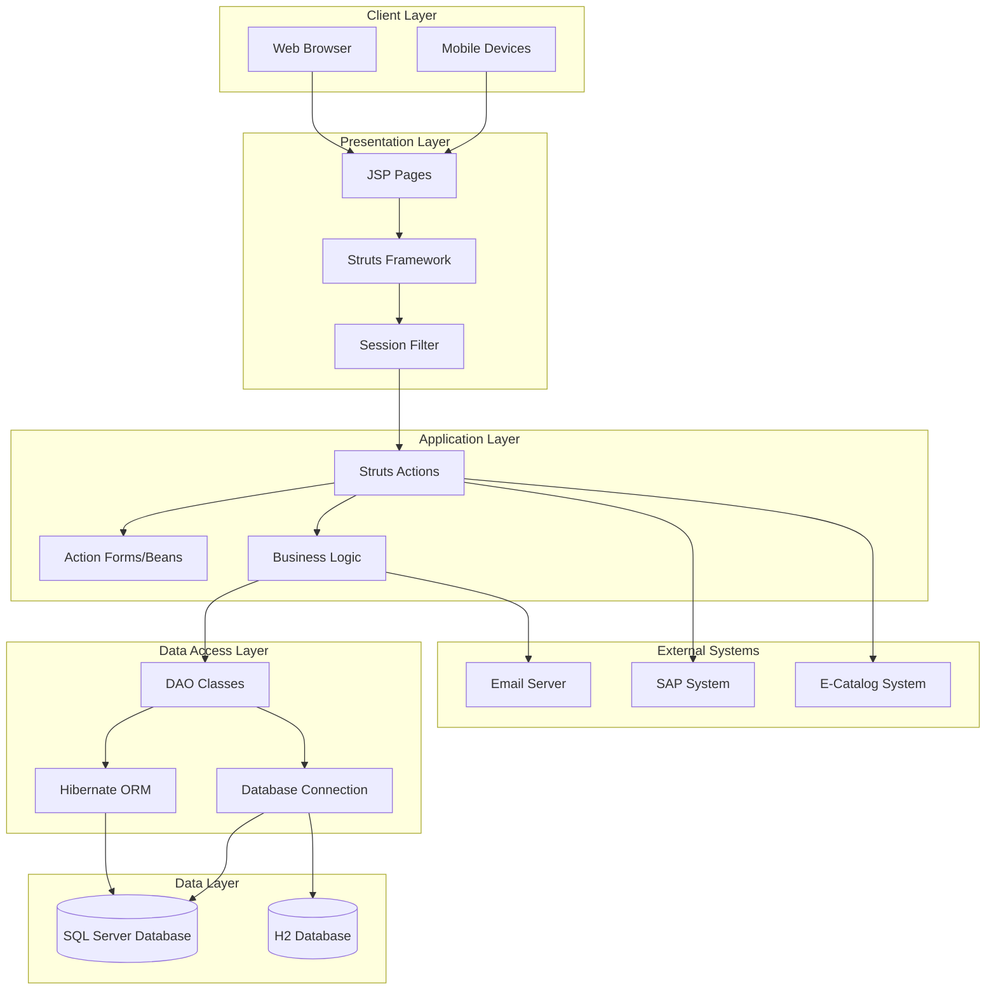
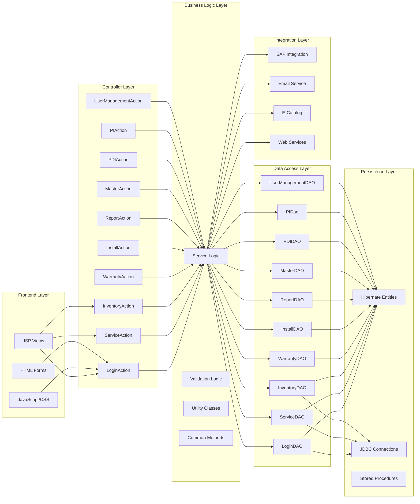
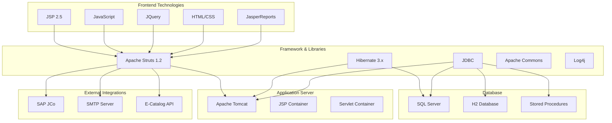
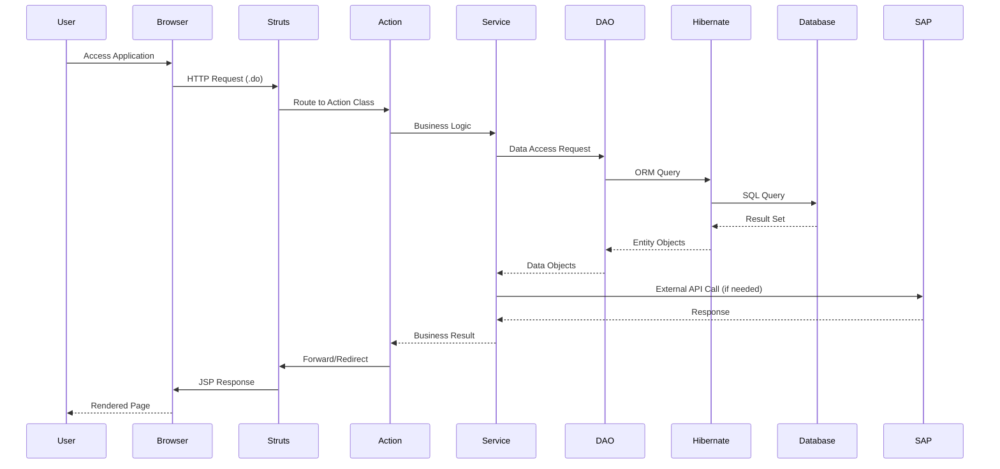
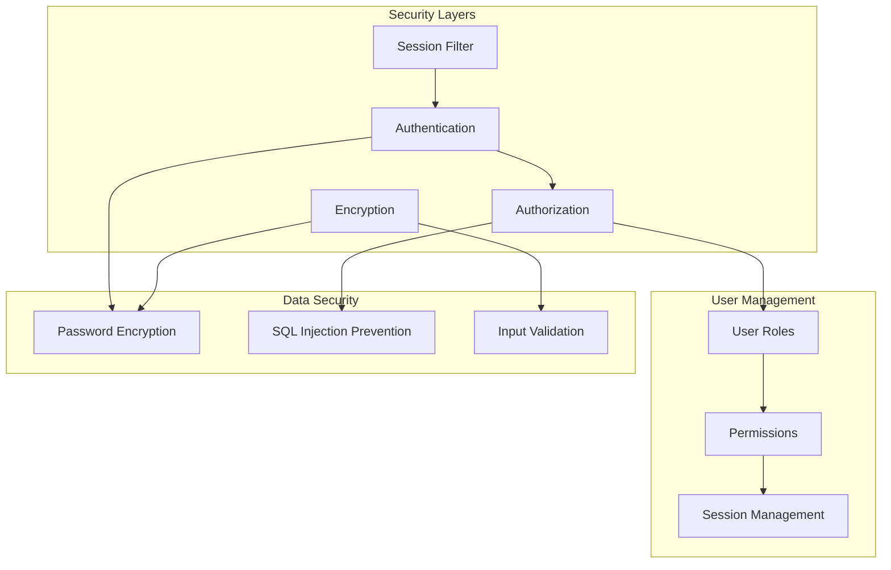

# ITLDIS System Architecture Diagram

## High-Level Architecture

## Detailed Architecture Layers

## Module Architecture

```mermaid
graph TB
    subgraph "ITLDIS Core Modules"
        Login[Login & Authentication]
        UserMgmt[User Management]
        Master[Master Data Management]
    end
    
    subgraph "Service Management"
        Service[Service Operations]
        JobCard[Job Card Creation]
        PDI[Pre-Delivery Inspection]
        Install[Installation Management]
    end
    
    subgraph "Inventory Management"
        Inventory[Inventory Operations]
        InventoryEXP[Export Inventory]
        Purchase[Purchase Orders]
        GRN[Goods Receipt Note]
    end
    
    subgraph "Warranty Management"
        Warranty[Warranty Claims]
        Approval[Approval Workflow]
        Dispatch[Dispatch Management]
    end
    
    subgraph "Reporting & Analytics"
        Reports[MIS Reports]
        GSTR[GST Reports]
        Invoice[Invoice Reports]
    end
    
    subgraph "Integration Modules"
        SAP[SAP Integration]
        ECAT[E-Catalog]
        WebService[Web Services]
    end
    
    subgraph "EAMG Module"
        EAMG_Group[Group Management]
        EAMG_Part[Part Management]
        EAMG_Kit[Kit Management]
        EAMG_Model[Model Management]
        EAMG_Tool[Tool Management]
    end
    
    Login --> UserMgmt
    Login --> Service
    Login --> Inventory
    Login --> Warranty
    Login --> Reports
    
    Service --> JobCard
    Service --> PDI
    Service --> Install
    
    Inventory --> InventoryEXP
    Inventory --> Purchase
    Inventory --> GRN
    
    Warranty --> Approval
    Warranty --> Dispatch
    
    Reports --> GSTR
    Reports --> Invoice
    
    Service --> SAP
    Inventory --> SAP
    Warranty --> SAP
    
    Master --> EAMG_Group
    Master --> EAMG_Part
    Master --> EAMG_Kit
    Master --> EAMG_Model
    Master --> EAMG_Tool
```

## Technology Stack

## Data Flow Architecture

## Security Architecture

