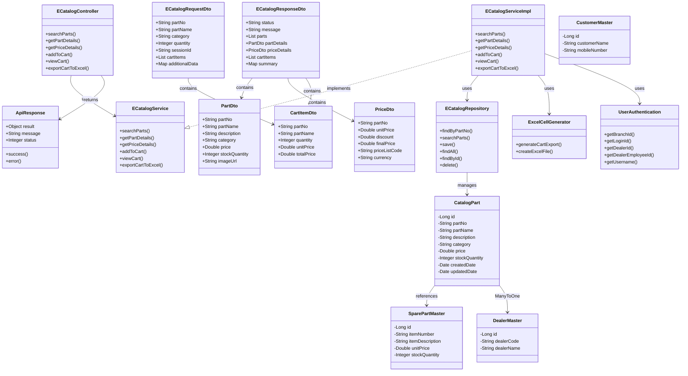

# ITLDIS Catalogue Module (E-Catalog) - UML Class Diagram

## Module Overview

The **Catalogue Module (E-Catalog)** is a module in the ITLDIS application that provides electronic catalog functionality for browsing, searching, and managing spare parts. It enables users to search for parts, view details, check prices, and manage shopping cart functionality.

### Core Functionalities:

#### 1. **Part Search**
   - Search parts by part number, part name, or category
   - Advanced search with multiple filters
   - Search results with part details

#### 2. **Part Details**
   - View detailed information about a specific part
   - Display part specifications, description, and images
   - Show availability and stock information

#### 3. **Price Management**
   - Get price details for parts
   - Support for multiple price lists
   - Discount calculation
   - Currency support

#### 4. **Shopping Cart Management**
   - Add parts to cart
   - View cart contents
   - Manage cart items (quantity, remove items)
   - Session-based cart management

#### 5. **Cart Export**
   - Export cart to Excel format
   - Generate cart reports
   - Download cart as spreadsheet

### Key Components:

- **1 Controller**: REST controller handling HTTP requests
- **1 Service Interface**: Business logic interface
- **1 Service Implementation**: Business logic implementation
- **1 Repository**: Data access layer using Spring Data JPA
- **1 Domain Entity**: JPA entity representing catalog parts
- **5 DTOs**: Data transfer objects for API communication

### Technology Stack:

- **Framework**: Spring Boot (REST API)
- **ORM**: JPA/Hibernate
- **Database**: SQL Server
- **Reporting**: Excel export using ExcelCellGenerator
- **Security**: UserAuthentication service

### Key Relationships:

1. **ECatalogController → ECatalogService**: Controller uses service for business logic
2. **ECatalogServiceImpl → ECatalogRepository**: Service uses repository for data access
3. **ECatalogRepository → CatalogPart**: Repository manages catalog part entities
4. **DTOs**: Request and Response DTOs contain nested DTOs (PartDto, CartItemDto, PriceDto)
5. **CatalogPart → SparePartMaster**: Catalog parts reference spare part master data
6. **CatalogPart → DealerMaster**: Catalog parts are associated with dealer branches

### Data Flow:

1. **Request Flow**: HTTP Request → Controller → Service → Repository → Database
2. **Response Flow**: Database → Repository → Service → DTO → Controller → JSON Response
3. **Cart Management**: Session-based cart stored in memory/cache
4. **Export Flow**: Cart Data → ExcelCellGenerator → Excel File → HTTP Response

### Key Features:

- **Part Search**: Advanced search capabilities with multiple filters
- **Price Management**: Support for multiple price lists and discounts
- **Shopping Cart**: Session-based cart management
- **Excel Export**: Export cart contents to Excel format
- **Integration**: Can integrate with Spares Module for part information
- **Session Management**: Cart items stored per session

### API Endpoints:

- `GET /api/ecatalog/parts/search` - Search parts
- `GET /api/ecatalog/parts/details` - Get part details
- `GET /api/ecatalog/parts/price` - Get price details
- `POST /api/ecatalog/cart/add` - Add item to cart
- `GET /api/ecatalog/cart/view` - View cart
- `GET /api/ecatalog/cart/export` - Export cart to Excel

### Future Enhancements (TODOs):

Based on the code comments, the following features are planned:
- Complete implementation of search logic (reference: viewEcat.comEcat.*)
- Complete implementation of cart management (reference: viewEcat.orderEcat.*)
- Integration with legacy HibernateMapping entities (CatPart, Partmaster, etc.)
- Additional fields in CatalogPart entity
- Custom query methods in repository based on legacy DAO methods

