# ITLDIS Extended Warranty Registration Module - UML Class Diagram

```mermaid
classDiagram
    %% ============================================
    %% ACTION LAYER (serviceAction - Extended Warranty Methods)
    %% ============================================
    
    class serviceAction {
        -String dbPATH
        +initAddExtWarranty()
        +addExtWarranty()
        +viewExtendedWarranty()
        +editExtWarranty()
        +updateExtWarranty()
        +getExtWarrPopupView()
        +getPremiumAmt()
        +isVehicleExist()
        +isChassisExist()
        +initAddItlExtWarranty()
        +addItlExtWarranty()
        +viewItlExtendedWarranty()
        +editItlExtWarranty()
        +updateItlExtWarranty()
        +getItlExtWarrPopupView()
        +isChassisExistInItlExtWty()
        +isVehicleExistForItlExtWty()
        +fetchDistricts()
        +fetchCities()
        +fetchTehsils()
    }
    
    %% ============================================
    %% DAO LAYER
    %% ============================================
    
    class serviceDAO {
        -Connection conn
        +saveExtWarranty()
        +updateExtWarranty()
        +getExtendedWarrantyDetails()
        +getViewExpWarrDetails()
        +getExpWarrDetailsExport()
        +getExtWarrPopupView()
        +getPremiumAmt()
        +isVehicleExist()
        +isChassisAlreadyExist()
        +getPolicyType()
        +getExtWarrStatus()
        +getMechanicCode()
        +getVehicleDetails()
        +getStates()
        +getDistricts()
        +getCities()
        +getTehsil()
        +saveItlExtWarranty()
        +updateItlExtWarranty()
        +getViewExpItlExtWarrDetails()
        +getItlExtWarrPopupView()
        +isChassisExistInItlExtWty()
        +isVehicleExistForItlExtWty()
        +daysBetween()
    }
    
    %% ============================================
    %% FORM BEAN LAYER
    %% ============================================
    
    class serviceForm {
        -String ewLoaderId
        -String chassisNo
        -String customerName
        -String title
        -String customerLocation
        -String customerDistrict
        -String customerState
        -String pinCode
        -String mobileNo
        -String contactno
        -String emailId
        -String extWarrantyBookletNo
        -String dateOfSaleOfCertificate
        -String typeName
        -String makeName
        -String modelCodeDesc
        -String fuelType
        -String engineNumber
        -String regNo
        -String saleDate
        -String deliveryDate
        -String imdCode
        -String floatType
        -Long ppId
        -String hmrNo
        -Integer policyTermId
        -Integer policyTypeId
        -String creditAmount
        -String sumInsured
        -String bajajPolicyNo
        -String bajajPolicyDate
        -String mechanicName
        -String dealerCode
        -String fromdate
        -String todate
        -String status
        -String range
        -String userId
        -String vinNo
        -String itlPolicyNo
        -String itlPolicyDate
        -String district
        -String city
        -String tehsil
        -String village
        -String payeeName
        -String payeeState
        -String payeeDistrict
        -String payeeCity
        -String payeeTehsil
        -String payeeVillage
        -String payeePincode
        -String payeeAddress
        -String payeeMobile
        -String ofLandHolding
        -String mainCrops
        -String occupation
        -List policyTypeList
        +getEwLoaderId()
        +setEwLoaderId()
        +getChassisNo()
        +setChassisNo()
        +getCustomerName()
        +setCustomerName()
        +getPolicyTypeList()
        +setPolicyTypeList()
    }
    
    %% ============================================
    %% DOMAIN ENTITIES
    %% ============================================
    
    class EWMLoaderDetail {
        -String ewLoaderId
        -String dealerCode
        -String chassisNo
        -String customerTitle
        -String customerName
        -String address
        -String state
        -String city
        -Long pincode
        -Long mobile
        -String telNo
        -String email
        -String extWarrantyBookletNo
        -Date dateOfSaleOfCertificate
        -String typeName
        -String makeName
        -String modelName
        -String fuelType
        -String engineNo
        -String vehicleRegNo
        -Date saleDate
        -Date deliveryDate
        -String imdCode
        -Long sumInsured
        -String floatType
        -long ppId
        -long hmr
        -Integer policyTermId
        -Integer policyTypeId
        -BigDecimal premiumAmount
        -BigDecimal amountToBajaj
        -String bajajPolicyNo
        -Date bajajPolicyDate
        -String createdBy
        -Date createdOn
        -String modifiedBy
        -Date modifiedOn
        -String status
    }
    
    class ITLEWMLoaderDetail {
        -String itlewRefNo
        -String dealerCode
        -String chassisNo
        -Date deliveryDate
        -String engineNo
        -Date itlExtRegDate
        -String itlExtRegStatus
        -String productCategory
        -String modelCode
        -String modelCodeDesc
        -String modelFamily
        -String modelFamilyDesc
        -String makeName
        -String fuelType
        -String tractorRegNo
        -long hmr
        -String ewType
        -BigDecimal ewRegistrationAmount
        -String customerName
        -String state
        -String district
        -String tehsil
        -String village
        -Long pincode
        -String address
        -Long mobile
        -String landline
        -String email
        -String ofLandHolding
        -String mainCrops
        -String occupation
        -String payeeName
        -String payeeState
        -String payeeDistrict
        -String payeeCity
        -String payeeTehsil
        -String payeeVillage
        -Long payeePincode
        -String payeeAddress
        -Long payeeMobile
        -String gstInvoiceDocName
        -String itlEwCertificateName
        -String itlEwDebitInvoice
        -Date dateOfSaleOfCertificate
        -String itlPolicyNo
        -Date itlPolicyDate
        -String invoiceNo
        -Date invoiceDate
        -String createdBy
        -Date createdOn
        -String modifiedBy
        -Date modifiedOn
        -String serviceRecordEngine
        -String gearOilChangeTransmission
        -String engine
        -String clutch
        -String transmission
        -String brakes
        -String hydraulic
        -String tpl
        -String checkExternalCrackDamage
        -String status
        -String itlEmployeeId
        -String firstName
    }
    
    %% ============================================
    %% EXTERNAL DEPENDENCIES
    %% ============================================
    
    class MSWDmechanicmaster {
        -String mechanicDealerKey
        -String mechanicName
        -String dealerCode
    }
    
    class PageTemplate {
        -String warrBookNo
        -String imdCode
        -String floatType
        -String ppId
        -String typeName
        -String deliveryDaysDiff
    }
    
    class MethodUtility {
        +getNumberEW()
        +getStateIdByDealer()
        +getDealersDetailsUnderUser()
    }
    
    class HibernateUtil {
        +getSessionFactory()
        +openSession()
    }
    
    class dbConnection {
        +getConnection()
        +getDbConnection()
    }
    
    class SWVehicleDetails {
        -String vinNo
        -String customerName
        -String tehsil
        -String district
        -String state
        -Long pincode
        -String mobilePh
        -String landlineNo
        -String emailId
        -String modelFamilyDesc
        -String modelCodeDesc
        -String engineNo
        -Date deliveryDate
    }
    
    class EWM_POLICY_TERM_MST {
        -Integer policyTermId
        -String policyTermDesc
        -String isActive
    }
    
    class EWM_POLICY_TYPE_MST {
        -Integer policyTypeId
        -String policyTypeDesc
        -String isActive
    }
    
    class LabelValueBean {
        -String label
        -String value
    }
    
    %% ============================================
    %% RELATIONSHIPS - Action to DAO
    %% ============================================
    
    serviceAction --> serviceDAO : uses
    serviceAction --> serviceForm : uses
    serviceAction --> PageTemplate : uses
    serviceAction --> MethodUtility : uses
    serviceAction --> HibernateUtil : uses
    serviceAction --> dbConnection : uses
    
    %% ============================================
    %% RELATIONSHIPS - DAO to Entities
    %% ============================================
    
    serviceDAO --> EWMLoaderDetail : manages
    serviceDAO --> ITLEWMLoaderDetail : manages
    serviceDAO --> MSWDmechanicmaster : uses
    serviceDAO --> SWVehicleDetails : uses
    serviceDAO --> EWM_POLICY_TERM_MST : uses
    serviceDAO --> EWM_POLICY_TYPE_MST : uses
    serviceDAO --> HibernateUtil : uses
    serviceDAO --> dbConnection : uses
    serviceDAO --> LabelValueBean : returns
    
    %% ============================================
    %% RELATIONSHIPS - Entity Relationships
    %% ============================================
    
    EWMLoaderDetail --> MSWDmechanicmaster : ManyToOne MechanicDealerKey
    
    %% ============================================
    %% RELATIONSHIPS - Form Bean
    %% ============================================
    
    serviceForm --> LabelValueBean : contains List
    
    %% ============================================
    %% FRAMEWORK DEPENDENCIES
    %% ============================================
    
    class DispatchAction {
        +execute()
        +findForward()
    }
    
    class ActionForm {
        +reset()
        +validate()
    }
    
    class ActionMapping {
        +findForward()
    }
    
    class HttpServletRequest {
        +getParameter()
        +getSession()
        +setAttribute()
        +getAttribute()
    }
    
    class HttpServletResponse {
        +getWriter()
        +setContentType()
        +getOutputStream()
    }
    
    class HttpSession {
        +getAttribute()
        +setAttribute()
        +getValue()
        +setValue()
    }
    
    class ActionMessages {
        +add()
        +save()
    }
    
    class ActionMessage {
        -String key
    }
    
    serviceAction --|> DispatchAction : extends
    serviceForm --|> ActionForm : extends
    serviceAction --> ActionMapping : uses
    serviceAction --> HttpServletRequest : uses
    serviceAction --> HttpServletResponse : uses
    serviceAction --> HttpSession : uses
    serviceAction --> ActionMessages : uses
    serviceAction --> ActionMessage : uses
    
    %% ============================================
    %% DATABASE CONNECTION
    %% ============================================
    
    class Connection {
        +createStatement()
        +prepareStatement()
        +close()
    }
    
    class Session {
        +beginTransaction()
        +get()
        +save()
        +update()
        +createQuery()
        +close()
    }
    
    dbConnection --> Connection : creates
    HibernateUtil --> Session : creates
    serviceDAO --> Session : uses
    serviceDAO --> Connection : uses
    
    %% ============================================
    %% JSP VIEWS
    %% ============================================
    
    class JSPViews {
        +addExtendedWarrenty
        +viewExtentedWarranty
        +viewExtWarrPopup
        +updateExtWarranty
        +viewItlExtendedWarranty
        +viewItlExtWarrPopup
        +exportExtWarranty
    }
    
    serviceAction --> JSPViews : forwardsTo
    
    %% ============================================
    %% REPORTING
    %% ============================================
    
    class JasperReports {
        +fillReport()
        +exportReport()
    }
    
    class JasperPrint {
        +getPages()
    }
    
    serviceAction --> JasperReports : uses
    JasperReports --> JasperPrint : generates
```

## Module Overview

The **Extended Warranty Registration Module** is a sub-module within the Service Module of the ITLDIS application that handles registration and management of Extended Warranty policies for vehicles. It supports two types of extended warranties: Regular Extended Warranty (EW) and ITL Extended Warranty (ITLEW).

### Core Functionalities:

#### 1. **Extended Warranty Registration (EW)**
   - Initialize add extended warranty form
   - Add new extended warranty registration
   - View extended warranty records with search filters
   - Edit existing extended warranty records
   - Update extended warranty information
   - Get premium amount calculation (AJAX)
   - Check vehicle existence validation (AJAX)
   - Check chassis existence validation (AJAX)
   - Get extended warranty popup view
   - Export extended warranty data to Excel

#### 2. **ITL Extended Warranty Registration (ITLEW)**
   - Initialize add ITL extended warranty form
   - Add new ITL extended warranty registration
   - View ITL extended warranty records
   - Edit ITL extended warranty records
   - Update ITL extended warranty information
   - Get ITL extended warranty popup view
   - Check chassis existence in ITL EW (AJAX)
   - Check vehicle existence for ITL EW (AJAX)
   - Fetch districts, cities, and tehsils (AJAX)

### Key Components:

- **serviceAction**: Action class with 15+ methods for extended warranty operations
- **serviceDAO**: Data access layer with 20+ methods for database operations
- **serviceForm**: Form bean with 50+ properties for data transfer
- **EWMLoaderDetail**: Hibernate entity for Extended Warranty (40+ attributes)
- **ITLEWMLoaderDetail**: Hibernate entity for ITL Extended Warranty (60+ attributes)

### Technology Stack:

- **Framework**: Apache Struts 1.x (DispatchAction pattern)
- **ORM**: Hibernate
- **Database**: SQL Server
- **View Layer**: JSP
- **Reporting**: JasperReports (Excel export)
- **AJAX**: For validation and dynamic data loading

### Data Flow:

1. **Request Flow**: HTTP Request → serviceAction → serviceDAO → Hibernate Session → Database
2. **Response Flow**: Database → Hibernate Entity → serviceDAO → serviceForm → serviceAction → JSP View
3. **AJAX Flow**: AJAX Request → serviceAction → serviceDAO → Database → JSON/Text Response
4. **Session Management**: Uses HttpSession for user context and dealer information
5. **Transaction Management**: Database transactions handled at DAO level using Hibernate

### Key Features:

- **Dual Warranty Types**: Supports both Regular EW and ITL EW registrations
- **Premium Calculation**: Dynamic premium calculation based on policy type and delivery date
- **Validation**: AJAX-based validation for vehicle/chassis existence and eligibility
- **Policy Management**: Integration with policy types and terms master data
- **Mechanic Assignment**: Association with mechanics for warranty registrations
- **Export Functionality**: Excel export with complete warranty details
- **Geographic Data**: Support for state, district, city, tehsil, village hierarchy
- **Payee Information**: Separate payee details for ITL Extended Warranty
- **Document Management**: Support for GST invoice, certificate, and debit invoice documents (ITLEW)
- **Service Record Tracking**: Component-wise service record tracking (ITLEW)

### Entity Relationships:

1. **EWMLoaderDetail → MSWDmechanicmaster**: Many-to-One relationship (mechanic assignment)
2. **Both entities support**: Created/Modified tracking, Status management
3. **Integration**: Links to vehicle details, policy masters, and dealer information

### Business Rules:

- Premium amount must be greater than zero for registration
- Delivery date validation (minimum days from delivery required)
- Chassis number uniqueness validation
- Vehicle existence validation before registration
- Policy type and term selection from master data
- Status tracking (Draft, Registered, etc.)

