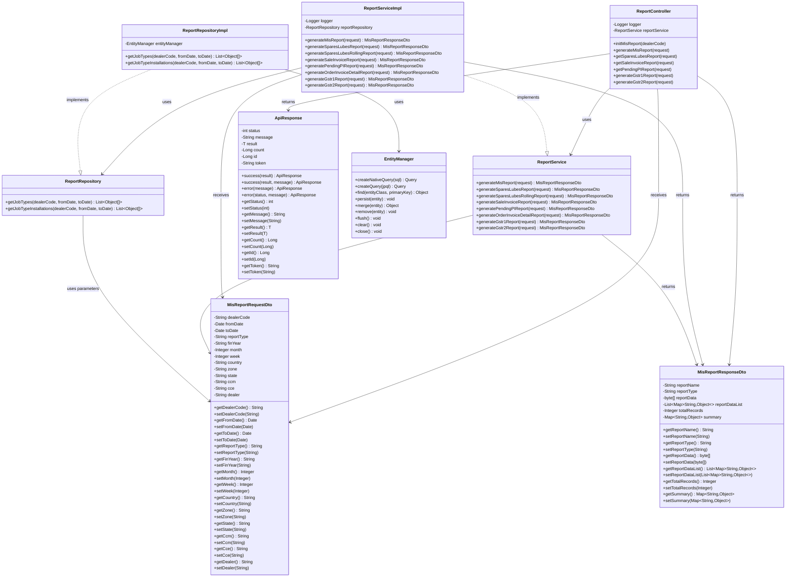

# ITLDIS Report Module - UML Class Diagram

## Report Module Overview

The **Report Module** is responsible for generating various business reports in the ITLDIS system. It provides a centralized reporting service that handles MIS reports, Spares & Lubes reports, Sale Invoice reports, GSTR reports, and other business intelligence reports.

### Module Structure

#### **Controller Layer**
- **ReportController**: REST controller that handles HTTP requests for report generation
  - Endpoints for initializing and generating various report types
  - Supports MIS reports, Spares & Lubes reports, Sale Invoice reports, GSTR-1, GSTR-2, and Pending PI reports

#### **Service Layer**
- **ReportService**: Interface defining all report generation methods
- **ReportServiceImpl**: Implementation of report generation logic
  - Handles business logic for report generation
  - Coordinates with repository layer for data retrieval
  - Formats and structures report data

#### **Repository Layer**
- **ReportRepository**: Interface for custom query methods
- **ReportRepositoryImpl**: Implementation using native SQL queries
  - Executes stored procedures for report data
  - Uses EntityManager for database operations
  - Returns raw data arrays for processing

#### **DTO Layer**
- **MisReportRequestDto**: Request DTO containing report parameters
  - Includes dealer code, date ranges, filters (country, zone, state, CCM, CCE)
  - Supports various report types and time periods (financial year, month, week)
  
- **MisReportResponseDto**: Response DTO containing report results
  - Includes report name, type (PDF/XLS), report data (byte array or list)
  - Contains summary information and total record counts

### Report Types Supported

1. **MIS Report**: Management Information System report with job types and installations
2. **Spares & Lubes Report**: Inventory and sales report for spare parts and lubricants
3. **Spares & Lubes Rolling Report**: Rolling period analysis report
4. **Sale Invoice Report**: Sales invoice details and summaries
5. **Pending PI Confirmation Report**: Pending Proforma Invoice confirmation status
6. **Order Invoice Detail Report**: Detailed order and invoice information
7. **GSTR-1 Report**: GST return report for outward supplies
8. **GSTR-2 Report**: GST return report for inward supplies

### External Dependencies

- **ApiResponse**: Utility class for standardized API responses
- **EntityManager**: JPA EntityManager for database operations
- **Logger**: SLF4J logger for logging operations

### Key Features

- Centralized report generation service
- Support for multiple report formats (PDF, XLS)
- Flexible filtering and date range selection
- Integration with stored procedures for complex queries
- Standardized request/response DTOs
- Error handling and logging

