# ITLDIS Detailed Sequence Diagrams

## 1. User Authentication & Login Sequence

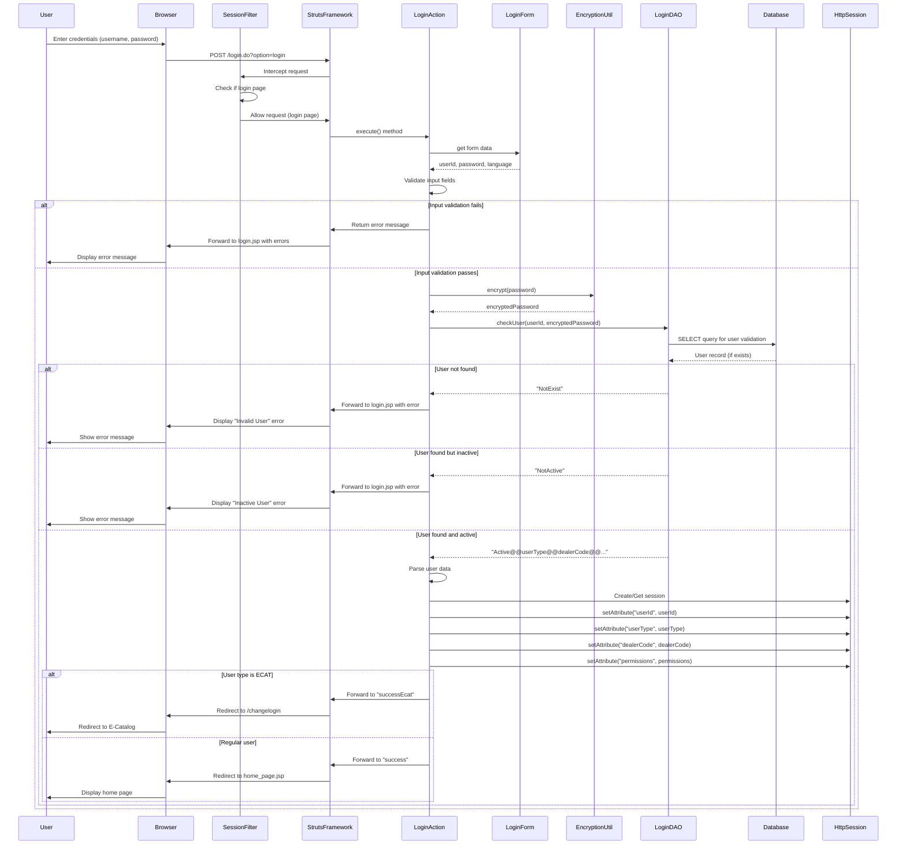
```mermaid
sequenceDiagram
    participant User
    participant Browser
    participant SessionFilter
    participant StrutsFramework
    participant LoginAction
    participant LoginForm
    participant EncryptionUtil
    participant LoginDAO
    participant Database
    participant HttpSession
    
    User->>Browser: Enter credentials (username, password)
    Browser->>StrutsFramework: POST /login.do?option=login
    StrutsFramework->>SessionFilter: Intercept request
    SessionFilter->>SessionFilter: Check if login page
    SessionFilter->>StrutsFramework: Allow request (login page)
    StrutsFramework->>LoginAction: execute() method
    LoginAction->>LoginForm: get form data
    LoginForm-->>LoginAction: userId, password, language
    
    LoginAction->>LoginAction: Validate input fields
    alt Input validation fails
        LoginAction->>StrutsFramework: Return error message
        StrutsFramework->>Browser: Forward to login.jsp with errors
        Browser->>User: Display error message
    else Input validation passes
        LoginAction->>EncryptionUtil: encrypt(password)
        EncryptionUtil-->>LoginAction: encryptedPassword
        
        LoginAction->>LoginDAO: checkUser(userId, encryptedPassword)
        LoginDAO->>Database: SELECT query for user validation
        Database-->>LoginDAO: User record (if exists)
        
        alt User not found
            LoginDAO-->>LoginAction: "NotExist"
            LoginAction->>StrutsFramework: Forward to login.jsp with error
            StrutsFramework->>Browser: Display "Invalid User" error
            Browser->>User: Show error message
        else User found but inactive
            LoginDAO-->>LoginAction: "NotActive"
            LoginAction->>StrutsFramework: Forward to login.jsp with error
            StrutsFramework->>Browser: Display "Inactive User" error
            Browser->>User: Show error message
        else User found and active
            LoginDAO-->>LoginAction: "Active@@userType@@dealerCode@@..."
            LoginAction->>LoginAction: Parse user data
            
            LoginAction->>HttpSession: Create/Get session
            LoginAction->>HttpSession: setAttribute("userId", userId)
            LoginAction->>HttpSession: setAttribute("userType", userType)
            LoginAction->>HttpSession: setAttribute("dealerCode", dealerCode)
            LoginAction->>HttpSession: setAttribute("permissions", permissions)
            
            alt User type is ECAT
                LoginAction->>StrutsFramework: Forward to "successEcat"
                StrutsFramework->>Browser: Redirect to /changelogin
                Browser->>User: Redirect to E-Catalog
            else Regular user
                LoginAction->>StrutsFramework: Forward to "success"
                StrutsFramework->>Browser: Redirect to home_page.jsp
                Browser->>User: Display home page
            end
        end
    end
```

## 2. Service Management - Job Card Creation Sequence

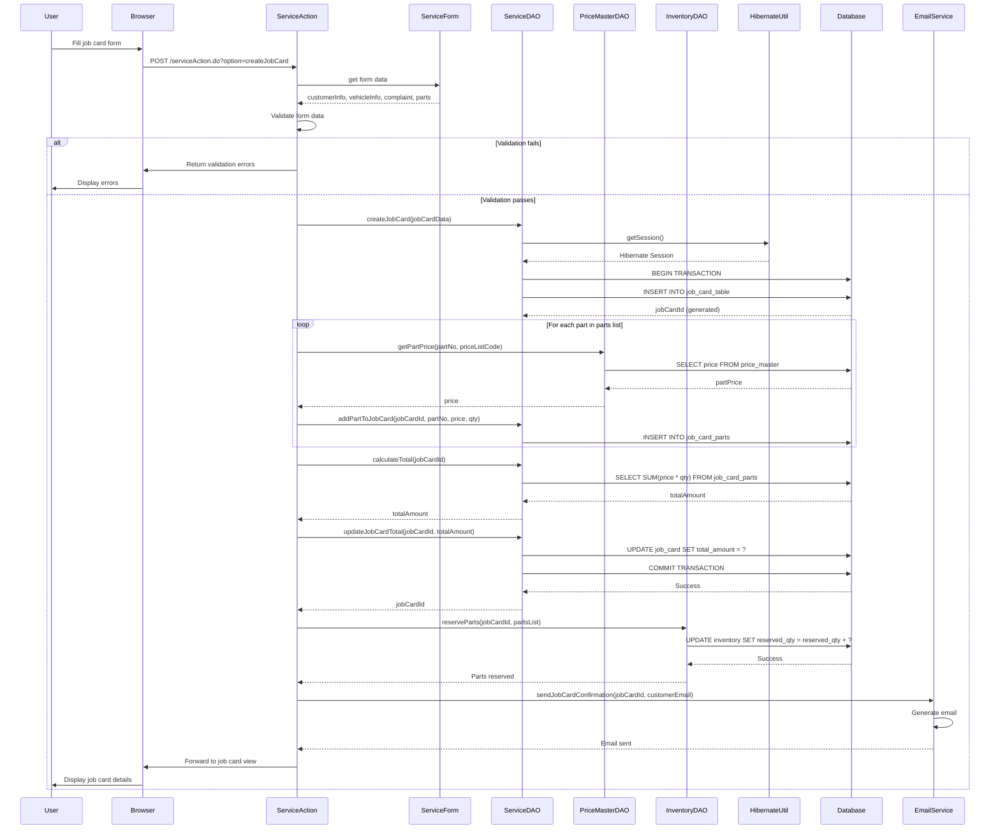
```mermaid
sequenceDiagram
    participant User
    participant Browser
    participant ServiceAction
    participant ServiceForm
    participant ServiceDAO
    participant PriceMasterDAO
    participant InventoryDAO
    participant HibernateUtil
    participant Database
    participant EmailService
    
    User->>Browser: Fill job card form
    Browser->>ServiceAction: POST /serviceAction.do?option=createJobCard
    ServiceAction->>ServiceForm: get form data
    ServiceForm-->>ServiceAction: customerInfo, vehicleInfo, complaint, parts
    
    ServiceAction->>ServiceAction: Validate form data
    
    alt Validation fails
        ServiceAction->>Browser: Return validation errors
        Browser->>User: Display errors
    else Validation passes
        ServiceAction->>ServiceDAO: createJobCard(jobCardData)
        ServiceDAO->>HibernateUtil: getSession()
        HibernateUtil-->>ServiceDAO: Hibernate Session
        
        ServiceDAO->>Database: BEGIN TRANSACTION
        ServiceDAO->>Database: INSERT INTO job_card_table
        Database-->>ServiceDAO: jobCardId (generated)
        
        loop For each part in parts list
            ServiceAction->>PriceMasterDAO: getPartPrice(partNo, priceListCode)
            PriceMasterDAO->>Database: SELECT price FROM price_master
            Database-->>PriceMasterDAO: partPrice
            PriceMasterDAO-->>ServiceAction: price
            
            ServiceAction->>ServiceDAO: addPartToJobCard(jobCardId, partNo, price, qty)
            ServiceDAO->>Database: INSERT INTO job_card_parts
        end
        
        ServiceAction->>ServiceDAO: calculateTotal(jobCardId)
        ServiceDAO->>Database: SELECT SUM(price * qty) FROM job_card_parts
        Database-->>ServiceDAO: totalAmount
        ServiceDAO-->>ServiceAction: totalAmount
        
        ServiceAction->>ServiceDAO: updateJobCardTotal(jobCardId, totalAmount)
        ServiceDAO->>Database: UPDATE job_card SET total_amount = ?
        
        ServiceDAO->>Database: COMMIT TRANSACTION
        Database-->>ServiceDAO: Success
        
        ServiceDAO-->>ServiceAction: jobCardId
        
        ServiceAction->>InventoryDAO: reserveParts(jobCardId, partsList)
        InventoryDAO->>Database: UPDATE inventory SET reserved_qty = reserved_qty + ?
        Database-->>InventoryDAO: Success
        InventoryDAO-->>ServiceAction: Parts reserved
        
        ServiceAction->>EmailService: sendJobCardConfirmation(jobCardId, customerEmail)
        EmailService->>EmailService: Generate email
        EmailService-->>ServiceAction: Email sent
        
        ServiceAction->>Browser: Forward to job card view
        Browser->>User: Display job card details
    end
```

## 3. Inventory Management - Stock Entry Sequence

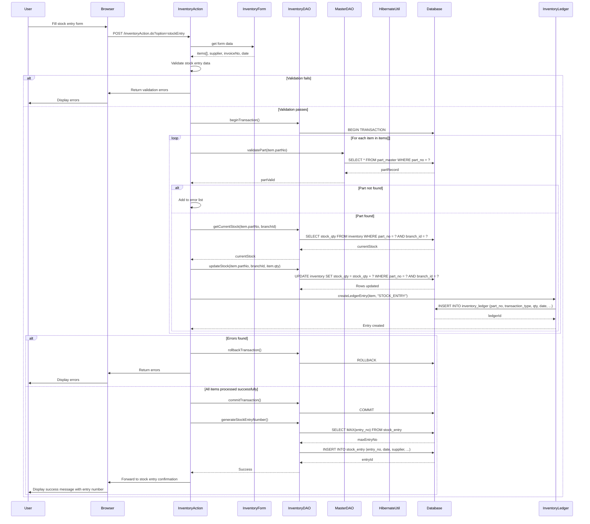
```mermaid
sequenceDiagram
    participant User
    participant Browser
    participant InventoryAction
    participant InventoryForm
    participant InventoryDAO
    participant MasterDAO
    participant HibernateUtil
    participant Database
    participant InventoryLedger
    
    User->>Browser: Fill stock entry form
    Browser->>InventoryAction: POST /inventoryAction.do?option=stockEntry
    InventoryAction->>InventoryForm: get form data
    InventoryForm-->>InventoryAction: items[], supplier, invoiceNo, date
    
    InventoryAction->>InventoryAction: Validate stock entry data
    
    alt Validation fails
        InventoryAction->>Browser: Return validation errors
        Browser->>User: Display errors
    else Validation passes
        InventoryAction->>InventoryDAO: beginTransaction()
        InventoryDAO->>Database: BEGIN TRANSACTION
        
        loop For each item in items[]
            InventoryAction->>MasterDAO: validatePart(item.partNo)
            MasterDAO->>Database: SELECT * FROM part_master WHERE part_no = ?
            Database-->>MasterDAO: partRecord
            MasterDAO-->>InventoryAction: partValid
            
            alt Part not found
                InventoryAction->>InventoryAction: Add to error list
            else Part found
                InventoryAction->>InventoryDAO: getCurrentStock(item.partNo, branchId)
                InventoryDAO->>Database: SELECT stock_qty FROM inventory WHERE part_no = ? AND branch_id = ?
                Database-->>InventoryDAO: currentStock
                InventoryDAO-->>InventoryAction: currentStock
                
                InventoryAction->>InventoryDAO: updateStock(item.partNo, branchId, item.qty)
                InventoryDAO->>Database: UPDATE inventory SET stock_qty = stock_qty + ? WHERE part_no = ? AND branch_id = ?
                Database-->>InventoryDAO: Rows updated
                
                InventoryAction->>InventoryLedger: createLedgerEntry(item, "STOCK_ENTRY")
                InventoryLedger->>Database: INSERT INTO inventory_ledger (part_no, transaction_type, qty, date, ...)
                Database-->>InventoryLedger: ledgerId
                InventoryLedger-->>InventoryAction: Entry created
            end
        end
        
        alt Errors found
            InventoryAction->>InventoryDAO: rollbackTransaction()
            InventoryDAO->>Database: ROLLBACK
            InventoryAction->>Browser: Return errors
            Browser->>User: Display errors
        else All items processed successfully
            InventoryAction->>InventoryDAO: commitTransaction()
            InventoryDAO->>Database: COMMIT
            
            InventoryAction->>InventoryDAO: generateStockEntryNumber()
            InventoryDAO->>Database: SELECT MAX(entry_no) FROM stock_entry
            Database-->>InventoryDAO: maxEntryNo
            InventoryDAO->>Database: INSERT INTO stock_entry (entry_no, date, supplier, ...)
            Database-->>InventoryDAO: entryId
            
            InventoryDAO-->>InventoryAction: Success
            
            InventoryAction->>Browser: Forward to stock entry confirmation
            Browser->>User: Display success message with entry number
        end
    end
```

## 4. Warranty Claim Processing Sequence

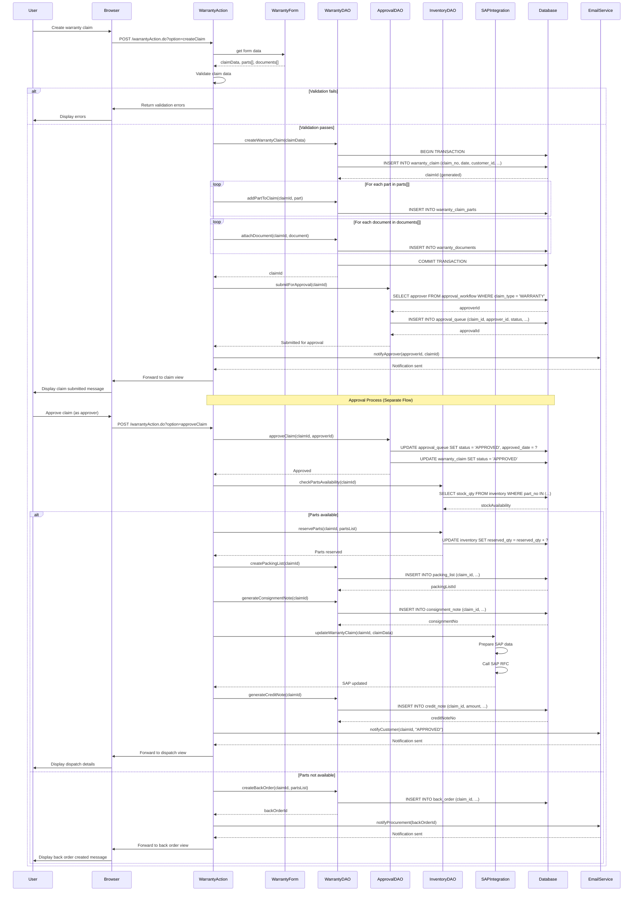
```mermaid
sequenceDiagram
    participant User
    participant Browser
    participant WarrantyAction
    participant WarrantyForm
    participant WarrantyDAO
    participant ApprovalDAO
    participant InventoryDAO
    participant SAPIntegration
    participant Database
    participant EmailService
    
    User->>Browser: Create warranty claim
    Browser->>WarrantyAction: POST /warrantyAction.do?option=createClaim
    WarrantyAction->>WarrantyForm: get form data
    WarrantyForm-->>WarrantyAction: claimData, parts[], documents[]
    
    WarrantyAction->>WarrantyAction: Validate claim data
    
    alt Validation fails
        WarrantyAction->>Browser: Return validation errors
        Browser->>User: Display errors
    else Validation passes
        WarrantyAction->>WarrantyDAO: createWarrantyClaim(claimData)
        WarrantyDAO->>Database: BEGIN TRANSACTION
        WarrantyDAO->>Database: INSERT INTO warranty_claim (claim_no, date, customer_id, ...)
        Database-->>WarrantyDAO: claimId (generated)
        
        loop For each part in parts[]
            WarrantyAction->>WarrantyDAO: addPartToClaim(claimId, part)
            WarrantyDAO->>Database: INSERT INTO warranty_claim_parts
        end
        
        loop For each document in documents[]
            WarrantyAction->>WarrantyDAO: attachDocument(claimId, document)
            WarrantyDAO->>Database: INSERT INTO warranty_documents
        end
        
        WarrantyDAO->>Database: COMMIT TRANSACTION
        WarrantyDAO-->>WarrantyAction: claimId
        
        WarrantyAction->>ApprovalDAO: submitForApproval(claimId)
        ApprovalDAO->>Database: SELECT approver FROM approval_workflow WHERE claim_type = 'WARRANTY'
        Database-->>ApprovalDAO: approverId
        ApprovalDAO->>Database: INSERT INTO approval_queue (claim_id, approver_id, status, ...)
        Database-->>ApprovalDAO: approvalId
        ApprovalDAO-->>WarrantyAction: Submitted for approval
        
        WarrantyAction->>EmailService: notifyApprover(approverId, claimId)
        EmailService-->>WarrantyAction: Notification sent
        
        WarrantyAction->>Browser: Forward to claim view
        Browser->>User: Display claim submitted message
        
        Note over WarrantyAction,Database: Approval Process (Separate Flow)
        
        User->>Browser: Approve claim (as approver)
        Browser->>WarrantyAction: POST /warrantyAction.do?option=approveClaim
        WarrantyAction->>ApprovalDAO: approveClaim(claimId, approverId)
        ApprovalDAO->>Database: UPDATE approval_queue SET status = 'APPROVED', approved_date = ?
        ApprovalDAO->>Database: UPDATE warranty_claim SET status = 'APPROVED'
        ApprovalDAO-->>WarrantyAction: Approved
        
        WarrantyAction->>InventoryDAO: checkPartsAvailability(claimId)
        InventoryDAO->>Database: SELECT stock_qty FROM inventory WHERE part_no IN (...)
        Database-->>InventoryDAO: stockAvailability
        
        alt Parts available
            WarrantyAction->>InventoryDAO: reserveParts(claimId, partsList)
            InventoryDAO->>Database: UPDATE inventory SET reserved_qty = reserved_qty + ?
            InventoryDAO-->>WarrantyAction: Parts reserved
            
            WarrantyAction->>WarrantyDAO: createPackingList(claimId)
            WarrantyDAO->>Database: INSERT INTO packing_list (claim_id, ...)
            Database-->>WarrantyDAO: packingListId
            
            WarrantyAction->>WarrantyDAO: generateConsignmentNote(claimId)
            WarrantyDAO->>Database: INSERT INTO consignment_note (claim_id, ...)
            Database-->>WarrantyDAO: consignmentNo
            
            WarrantyAction->>SAPIntegration: updateWarrantyClaim(claimId, claimData)
            SAPIntegration->>SAPIntegration: Prepare SAP data
            SAPIntegration->>SAPIntegration: Call SAP RFC
            SAPIntegration-->>WarrantyAction: SAP updated
            
            WarrantyAction->>WarrantyDAO: generateCreditNote(claimId)
            WarrantyDAO->>Database: INSERT INTO credit_note (claim_id, amount, ...)
            Database-->>WarrantyDAO: creditNoteNo
            
            WarrantyAction->>EmailService: notifyCustomer(claimId, "APPROVED")
            EmailService-->>WarrantyAction: Notification sent
            
            WarrantyAction->>Browser: Forward to dispatch view
            Browser->>User: Display dispatch details
        else Parts not available
            WarrantyAction->>WarrantyDAO: createBackOrder(claimId, partsList)
            WarrantyDAO->>Database: INSERT INTO back_order (claim_id, ...)
            WarrantyDAO-->>WarrantyAction: backOrderId
            
            WarrantyAction->>EmailService: notifyProcurement(backOrderId)
            EmailService-->>WarrantyAction: Notification sent
            
            WarrantyAction->>Browser: Forward to back order view
            Browser->>User: Display back order created message
        end
    end
```

## 5. Installation Management Sequence

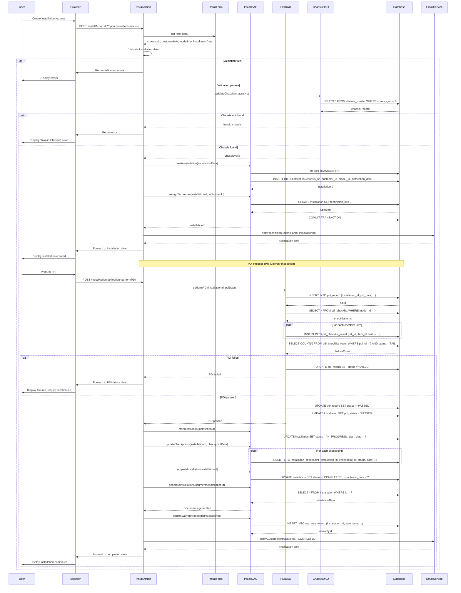
```mermaid
sequenceDiagram
    participant User
    participant Browser
    participant InstallAction
    participant InstallForm
    participant InstallDAO
    participant PDIDAO
    participant ChassisDAO
    participant Database
    participant EmailService
    
    User->>Browser: Create installation request
    Browser->>InstallAction: POST /installAction.do?option=createInstallation
    InstallAction->>InstallForm: get form data
    InstallForm-->>InstallAction: chassisNo, customerInfo, modelInfo, installationDate
    
    InstallAction->>InstallAction: Validate installation data
    
    alt Validation fails
        InstallAction->>Browser: Return validation errors
        Browser->>User: Display errors
    else Validation passes
        InstallAction->>ChassisDAO: validateChassis(chassisNo)
        ChassisDAO->>Database: SELECT * FROM chassis_master WHERE chassis_no = ?
        Database-->>ChassisDAO: chassisRecord
        
        alt Chassis not found
            ChassisDAO-->>InstallAction: Invalid chassis
            InstallAction->>Browser: Return error
            Browser->>User: Display "Invalid Chassis" error
        else Chassis found
            ChassisDAO-->>InstallAction: chassisValid
            
            InstallAction->>InstallDAO: createInstallation(installationData)
            InstallDAO->>Database: BEGIN TRANSACTION
            InstallDAO->>Database: INSERT INTO installation (chassis_no, customer_id, model_id, installation_date, ...)
            Database-->>InstallDAO: installationId
            
            InstallAction->>InstallDAO: assignTechnician(installationId, technicianId)
            InstallDAO->>Database: UPDATE installation SET technician_id = ?
            Database-->>InstallDAO: Updated
            
            InstallDAO->>Database: COMMIT TRANSACTION
            InstallDAO-->>InstallAction: installationId
            
            InstallAction->>EmailService: notifyTechnician(technicianId, installationId)
            EmailService-->>InstallAction: Notification sent
            
            InstallAction->>Browser: Forward to installation view
            Browser->>User: Display installation created
            
            Note over InstallAction,Database: PDI Process (Pre-Delivery Inspection)
            
            User->>Browser: Perform PDI
            Browser->>InstallAction: POST /installAction.do?option=performPDI
            InstallAction->>PDIDAO: performPDI(installationId, pdiData)
            PDIDAO->>Database: INSERT INTO pdi_record (installation_id, pdi_date, ...)
            Database-->>PDIDAO: pdiId
            
            PDIDAO->>Database: SELECT * FROM pdi_checklist WHERE model_id = ?
            Database-->>PDIDAO: checklistItems
            
            loop For each checklist item
                PDIDAO->>Database: INSERT INTO pdi_checklist_result (pdi_id, item_id, status, ...)
            end
            
            PDIDAO->>Database: SELECT COUNT(*) FROM pdi_checklist_result WHERE pdi_id = ? AND status = 'FAIL'
            Database-->>PDIDAO: failureCount
            
            alt PDI failed
                PDIDAO->>Database: UPDATE pdi_record SET status = 'FAILED'
                PDIDAO-->>InstallAction: PDI failed
                InstallAction->>Browser: Forward to PDI failure view
                Browser->>User: Display failures, require rectification
            else PDI passed
                PDIDAO->>Database: UPDATE pdi_record SET status = 'PASSED'
                PDIDAO->>Database: UPDATE installation SET pdi_status = 'PASSED'
                PDIDAO-->>InstallAction: PDI passed
                
                InstallAction->>InstallDAO: startInstallation(installationId)
                InstallDAO->>Database: UPDATE installation SET status = 'IN_PROGRESS', start_date = ?
                
                InstallAction->>InstallDAO: updateCheckpoints(installationId, checkpointData)
                loop For each checkpoint
                    InstallDAO->>Database: INSERT INTO installation_checkpoint (installation_id, checkpoint_id, status, date, ...)
                end
                
                InstallAction->>InstallDAO: completeInstallation(installationId)
                InstallDAO->>Database: UPDATE installation SET status = 'COMPLETED', completion_date = ?
                
                InstallAction->>InstallDAO: generateInstallationDocuments(installationId)
                InstallDAO->>Database: SELECT * FROM installation WHERE id = ?
                Database-->>InstallDAO: installationData
                InstallDAO-->>InstallAction: Documents generated
                
                InstallAction->>InstallDAO: updateWarrantyRecords(installationId)
                InstallDAO->>Database: INSERT INTO warranty_record (installation_id, start_date, ...)
                Database-->>InstallDAO: warrantyId
                
                InstallAction->>EmailService: notifyCustomer(installationId, "COMPLETED")
                EmailService-->>InstallAction: Notification sent
                
                InstallAction->>Browser: Forward to completion view
                Browser->>User: Display installation completed
            end
        end
    end
```

## 6. Purchase Order Processing Sequence

```mermaid
sequenceDiagram
    participant User
    participant Browser
    participant PIAction
    participant PIForm
    participant PIDAO
    participant PriceMasterDAO
    participant ApprovalDAO
    participant InventoryDAO
    participant VendorDAO
    participant Database
    participant EmailService
    
    User->>Browser: Create purchase order
    Browser->>PIAction: POST /piAction.do?option=createPO
    PIAction->>PIForm: get form data
    PIForm-->>PIAction: items[], vendorId, deliveryDate, terms
    
    PIAction->>PIAction: Validate PO data
    
    alt Validation fails
        PIAction->>Browser: Return validation errors
        Browser->>User: Display errors
    else Validation passes
        PIAction->>PIDAO: beginTransaction()
        PIDAO->>Database: BEGIN TRANSACTION
        
        PIAction->>PIDAO: generatePONumber()
        PIDAO->>Database: SELECT MAX(po_no) FROM purchase_order
        Database-->>PIDAO: maxPONo
        PIDAO->>Database: INSERT INTO purchase_order (po_no, date, vendor_id, status, ...)
        Database-->>PIDAO: poId
        
        loop For each item in items[]
            PIAction->>PriceMasterDAO: getItemPrice(item.partNo, vendorId)
            PriceMasterDAO->>Database: SELECT price FROM vendor_price_list WHERE part_no = ? AND vendor_id = ?
            Database-->>PriceMasterDAO: itemPrice
            PriceMasterDAO-->>PIAction: itemPrice
            
            PIAction->>PIDAO: addItemToPO(poId, item, itemPrice)
            PIDAO->>Database: INSERT INTO purchase_order_items (po_id, part_no, qty, price, ...)
        end
        
        PIAction->>PIDAO: calculatePOTotal(poId)
        PIDAO->>Database: SELECT SUM(qty * price) FROM purchase_order_items WHERE po_id = ?
        Database-->>PIDAO: subTotal
        
        PIAction->>PIDAO: calculateTaxes(poId, subTotal)
        PIDAO->>Database: SELECT tax_rate FROM tax_master WHERE tax_type = 'GST'
        Database-->>PIDAO: taxRate
        PIDAO->>PIDAO: Calculate GST, IGST, etc.
        PIDAO->>Database: UPDATE purchase_order SET sub_total = ?, tax_amount = ?, total_amount = ?
        
        PIDAO->>Database: COMMIT TRANSACTION
        PIDAO-->>PIAction: poId
        
        PIAction->>ApprovalDAO: submitForApproval(poId, "PURCHASE_ORDER")
        ApprovalDAO->>Database: SELECT approver FROM approval_workflow WHERE type = 'PURCHASE_ORDER' AND amount > ?
        Database-->>ApprovalDAO: approverId
        ApprovalDAO->>Database: INSERT INTO approval_queue (po_id, approver_id, status, ...)
        Database-->>ApprovalDAO: approvalId
        ApprovalDAO-->>PIAction: Submitted for approval
        
        PIAction->>EmailService: notifyApprover(approverId, poId)
        EmailService-->>PIAction: Notification sent
        
        PIAction->>Browser: Forward to PO view
        Browser->>User: Display PO created, pending approval
        
        Note over PIAction,Database: Approval Process
        
        User->>Browser: Approve PO (as approver)
        Browser->>PIAction: POST /piAction.do?option=approvePO
        PIAction->>ApprovalDAO: approvePO(poId, approverId)
        ApprovalDAO->>Database: UPDATE approval_queue SET status = 'APPROVED', approved_date = ?
        ApprovalDAO->>Database: UPDATE purchase_order SET status = 'APPROVED', approved_by = ?
        ApprovalDAO-->>PIAction: Approved
        
        PIAction->>VendorDAO: sendPOToVendor(poId)
        VendorDAO->>Database: SELECT vendor_email FROM vendor_master WHERE id = ?
        Database-->>VendorDAO: vendorEmail
        VendorDAO->>EmailService: sendPOEmail(vendorEmail, poId)
        EmailService-->>PIAction: PO sent to vendor
        EmailService-->>PIAction: Email sent
        
        PIAction->>Browser: Forward to PO sent confirmation
        Browser->>User: Display PO sent to vendor
        
        Note over PIAction,Database: GRN Process (Goods Receipt Note)
        
        User->>Browser: Receive goods and create GRN
        Browser->>PIAction: POST /piAction.do?option=createGRN
        PIAction->>PIDAO: createGRN(poId, receivedItems[])
        PIDAO->>Database: BEGIN TRANSACTION
        
        PIAction->>PIDAO: generateGRNNumber()
        PIDAO->>Database: SELECT MAX(grn_no) FROM grn
        Database-->>PIDAO: maxGRNNo
        PIDAO->>Database: INSERT INTO grn (grn_no, po_id, date, ...)
        Database-->>PIDAO: grnId
        
        loop For each received item
            PIAction->>PIDAO: verifyItemAgainstPO(poId, item)
            PIDAO->>Database: SELECT * FROM purchase_order_items WHERE po_id = ? AND part_no = ?
            Database-->>PIDAO: poItem
            
            alt Item matches PO
                PIAction->>PIDAO: addItemToGRN(grnId, item)
                PIDAO->>Database: INSERT INTO grn_items (grn_id, part_no, received_qty, ...)
                
                PIAction->>InventoryDAO: updateStock(item.partNo, item.qty, "GRN")
                InventoryDAO->>Database: UPDATE inventory SET stock_qty = stock_qty + ? WHERE part_no = ?
                Database-->>InventoryDAO: Stock updated
            else Item doesn't match PO
                PIAction->>PIDAO: markItemAsDiscrepancy(grnId, item)
                PIDAO->>Database: INSERT INTO grn_discrepancy (grn_id, part_no, issue, ...)
            end
        end
        
        PIAction->>PIDAO: checkDiscrepancies(grnId)
        PIDAO->>Database: SELECT COUNT(*) FROM grn_discrepancy WHERE grn_id = ?
        Database-->>PIDAO: discrepancyCount
        
        alt Discrepancies found
            PIDAO->>Database: UPDATE grn SET status = 'DISCREPANCY'
            PIDAO->>EmailService: notifyProcurement(grnId, "DISCREPANCY")
            EmailService-->>PIAction: Notification sent
            PIDAO-->>PIAction: GRN with discrepancies
            PIAction->>Browser: Forward to discrepancy view
            Browser->>User: Display discrepancies
        else No discrepancies
            PIDAO->>Database: UPDATE grn SET status = 'ACCEPTED'
            PIDAO->>Database: UPDATE purchase_order SET status = 'RECEIVED'
            
            PIDAO->>Database: COMMIT TRANSACTION
            PIDAO-->>PIAction: GRN created successfully
            
            PIAction->>PIDAO: generateInvoice(poId)
            PIDAO->>Database: INSERT INTO invoice (po_id, invoice_no, amount, ...)
            Database-->>PIDAO: invoiceId
            
            PIAction->>EmailService: notifyAccounts(invoiceId)
            EmailService-->>PIAction: Notification sent
            
            PIAction->>Browser: Forward to GRN confirmation
            Browser->>User: Display GRN created, inventory updated
        end
    end
```

## 7. SAP Integration - APN Sync Sequence

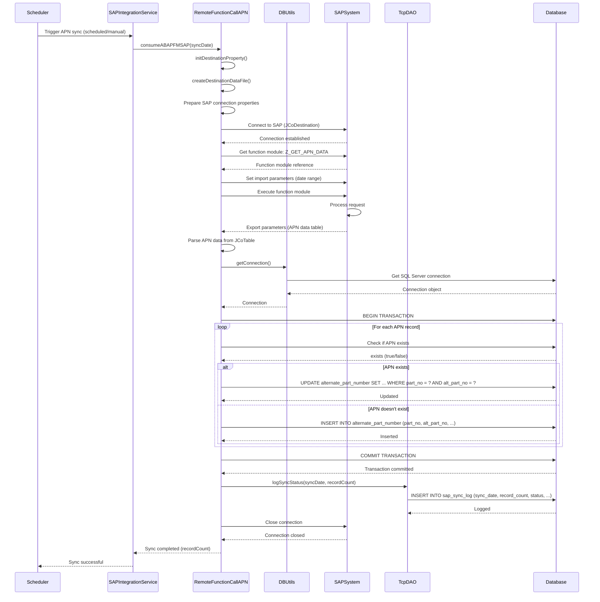
```mermaid
sequenceDiagram
    participant Scheduler
    participant SAPIntegrationService
    participant RemoteFunctionCallAPN
    participant DBUtils
    participant SAPSystem
    participant TcpDAO
    participant Database
    
    Scheduler->>SAPIntegrationService: Trigger APN sync (scheduled/manual)
    SAPIntegrationService->>RemoteFunctionCallAPN: consumeABAPFMSAP(syncDate)
    
    RemoteFunctionCallAPN->>RemoteFunctionCallAPN: initDestinationProperty()
    RemoteFunctionCallAPN->>RemoteFunctionCallAPN: createDestinationDataFile()
    RemoteFunctionCallAPN->>RemoteFunctionCallAPN: Prepare SAP connection properties
    
    RemoteFunctionCallAPN->>SAPSystem: Connect to SAP (JCoDestination)
    SAPSystem-->>RemoteFunctionCallAPN: Connection established
    
    RemoteFunctionCallAPN->>SAPSystem: Get function module: Z_GET_APN_DATA
    SAPSystem-->>RemoteFunctionCallAPN: Function module reference
    
    RemoteFunctionCallAPN->>SAPSystem: Set import parameters (date range)
    RemoteFunctionCallAPN->>SAPSystem: Execute function module
    SAPSystem->>SAPSystem: Process request
    SAPSystem-->>RemoteFunctionCallAPN: Export parameters (APN data table)
    
    RemoteFunctionCallAPN->>RemoteFunctionCallAPN: Parse APN data from JCoTable
    
    RemoteFunctionCallAPN->>DBUtils: getConnection()
    DBUtils->>Database: Get SQL Server connection
    Database-->>DBUtils: Connection object
    DBUtils-->>RemoteFunctionCallAPN: Connection
    
    RemoteFunctionCallAPN->>Database: BEGIN TRANSACTION
    
    loop For each APN record
        RemoteFunctionCallAPN->>Database: Check if APN exists
        Database-->>RemoteFunctionCallAPN: exists (true/false)
        
        alt APN exists
            RemoteFunctionCallAPN->>Database: UPDATE alternate_part_number SET ... WHERE part_no = ? AND alt_part_no = ?
            Database-->>RemoteFunctionCallAPN: Updated
        else APN doesn't exist
            RemoteFunctionCallAPN->>Database: INSERT INTO alternate_part_number (part_no, alt_part_no, ...)
            Database-->>RemoteFunctionCallAPN: Inserted
        end
    end
    
    RemoteFunctionCallAPN->>Database: COMMIT TRANSACTION
    Database-->>RemoteFunctionCallAPN: Transaction committed
    
    RemoteFunctionCallAPN->>TcpDAO: logSyncStatus(syncDate, recordCount)
    TcpDAO->>Database: INSERT INTO sap_sync_log (sync_date, record_count, status, ...)
    Database-->>TcpDAO: Logged
    
    RemoteFunctionCallAPN->>SAPSystem: Close connection
    SAPSystem-->>RemoteFunctionCallAPN: Connection closed
    
    RemoteFunctionCallAPN-->>SAPIntegrationService: Sync completed (recordCount)
    SAPIntegrationService-->>Scheduler: Sync successful
```

## 8. Report Generation - MIS Report Sequence

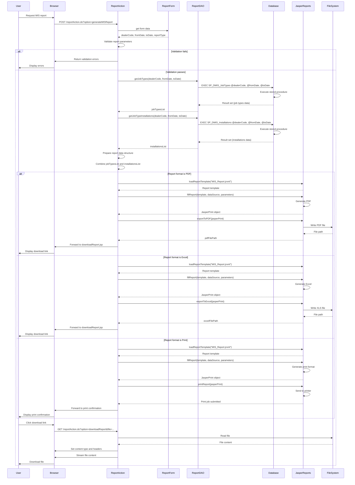
```mermaid
sequenceDiagram
    participant User
    participant Browser
    participant ReportAction
    participant ReportForm
    participant ReportDAO
    participant Database
    participant JasperReports
    participant FileSystem
    
    User->>Browser: Request MIS report
    Browser->>ReportAction: POST /reportAction.do?option=generateMISReport
    ReportAction->>ReportForm: get form data
    ReportForm-->>ReportAction: dealerCode, fromDate, toDate, reportType
    
    ReportAction->>ReportAction: Validate report parameters
    
    alt Validation fails
        ReportAction->>Browser: Return validation errors
        Browser->>User: Display errors
    else Validation passes
        ReportAction->>ReportDAO: getJobTypes(dealerCode, fromDate, toDate)
        ReportDAO->>Database: EXEC SP_DMIS_JobTypes @dealerCode, @fromDate, @toDate
        Database->>Database: Execute stored procedure
        Database-->>ReportDAO: Result set (job types data)
        ReportDAO-->>ReportAction: jobTypesList
        
        ReportAction->>ReportDAO: getJobTypeInstallations(dealerCode, fromDate, toDate)
        ReportDAO->>Database: EXEC SP_DMIS_Installations @dealerCode, @fromDate, @toDate
        Database->>Database: Execute stored procedure
        Database-->>ReportDAO: Result set (installations data)
        ReportDAO-->>ReportAction: installationsList
        
        ReportAction->>ReportAction: Prepare report data structure
        ReportAction->>ReportAction: Combine jobTypesList and installationsList
        
        alt Report format is PDF
            ReportAction->>JasperReports: loadReportTemplate("MIS_Report.jrxml")
            JasperReports-->>ReportAction: Report template
            
            ReportAction->>JasperReports: fillReport(template, dataSource, parameters)
            JasperReports->>JasperReports: Generate PDF
            JasperReports-->>ReportAction: JasperPrint object
            
            ReportAction->>JasperReports: exportToPDF(jasperPrint)
            JasperReports->>FileSystem: Write PDF file
            FileSystem-->>JasperReports: File path
            JasperReports-->>ReportAction: pdfFilePath
            
            ReportAction->>Browser: Forward to downloadReport.jsp
            Browser->>User: Display download link
            
        else Report format is Excel
            ReportAction->>JasperReports: loadReportTemplate("MIS_Report.jrxml")
            JasperReports-->>ReportAction: Report template
            
            ReportAction->>JasperReports: fillReport(template, dataSource, parameters)
            JasperReports->>JasperReports: Generate Excel
            JasperReports-->>ReportAction: JasperPrint object
            
            ReportAction->>JasperReports: exportToExcel(jasperPrint)
            JasperReports->>FileSystem: Write XLS file
            FileSystem-->>JasperReports: File path
            JasperReports-->>ReportAction: excelFilePath
            
            ReportAction->>Browser: Forward to downloadReport.jsp
            Browser->>User: Display download link
            
        else Report format is Print
            ReportAction->>JasperReports: loadReportTemplate("MIS_Report.jrxml")
            JasperReports-->>ReportAction: Report template
            
            ReportAction->>JasperReports: fillReport(template, dataSource, parameters)
            JasperReports->>JasperReports: Generate print format
            JasperReports-->>ReportAction: JasperPrint object
            
            ReportAction->>JasperReports: printReport(jasperPrint)
            JasperReports->>JasperReports: Send to printer
            JasperReports-->>ReportAction: Print job submitted
            
            ReportAction->>Browser: Forward to print confirmation
            Browser->>User: Display print confirmation
        end
        
        User->>Browser: Click download link
        Browser->>ReportAction: GET /reportAction.do?option=downloadReport&file=...
        ReportAction->>FileSystem: Read file
        FileSystem-->>ReportAction: File content
        ReportAction->>Browser: Set content type and headers
        ReportAction->>Browser: Stream file content
        Browser->>User: Download file
    end
```

## 9. User Management - Create User Sequence

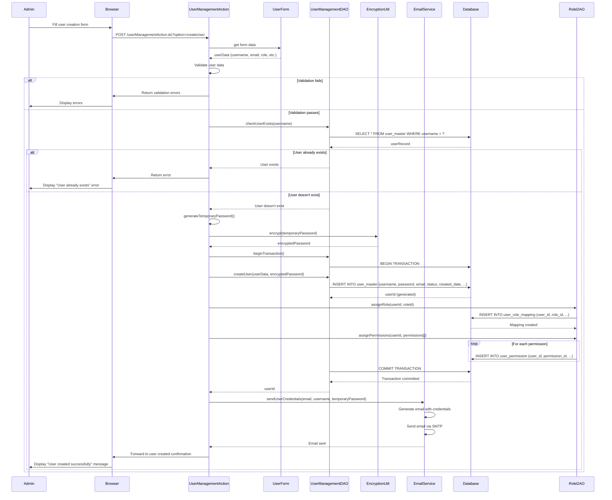
```mermaid
sequenceDiagram
    participant Admin
    participant Browser
    participant UserManagementAction
    participant UserForm
    participant UserManagementDAO
    participant EncryptionUtil
    participant EmailService
    participant Database
    participant RoleDAO
    
    Admin->>Browser: Fill user creation form
    Browser->>UserManagementAction: POST /userManagementAction.do?option=createUser
    UserManagementAction->>UserForm: get form data
    UserForm-->>UserManagementAction: userData (username, email, role, etc.)
    
    UserManagementAction->>UserManagementAction: Validate user data
    
    alt Validation fails
        UserManagementAction->>Browser: Return validation errors
        Browser->>Admin: Display errors
    else Validation passes
        UserManagementAction->>UserManagementDAO: checkUserExists(username)
        UserManagementDAO->>Database: SELECT * FROM user_master WHERE username = ?
        Database-->>UserManagementDAO: userRecord
        
        alt User already exists
            UserManagementDAO-->>UserManagementAction: User exists
            UserManagementAction->>Browser: Return error
            Browser->>Admin: Display "User already exists" error
        else User doesn't exist
            UserManagementDAO-->>UserManagementAction: User doesn't exist
            
            UserManagementAction->>UserManagementAction: generateTemporaryPassword()
            UserManagementAction->>EncryptionUtil: encrypt(temporaryPassword)
            EncryptionUtil-->>UserManagementAction: encryptedPassword
            
            UserManagementAction->>UserManagementDAO: beginTransaction()
            UserManagementDAO->>Database: BEGIN TRANSACTION
            
            UserManagementAction->>UserManagementDAO: createUser(userData, encryptedPassword)
            UserManagementDAO->>Database: INSERT INTO user_master (username, password, email, status, created_date, ...)
            Database-->>UserManagementDAO: userId (generated)
            
            UserManagementAction->>RoleDAO: assignRole(userId, roleId)
            RoleDAO->>Database: INSERT INTO user_role_mapping (user_id, role_id, ...)
            Database-->>RoleDAO: Mapping created
            
            UserManagementAction->>RoleDAO: assignPermissions(userId, permissions[])
            loop For each permission
                RoleDAO->>Database: INSERT INTO user_permission (user_id, permission_id, ...)
            end
            
            UserManagementDAO->>Database: COMMIT TRANSACTION
            Database-->>UserManagementDAO: Transaction committed
            UserManagementDAO-->>UserManagementAction: userId
            
            UserManagementAction->>EmailService: sendUserCredentials(email, username, temporaryPassword)
            EmailService->>EmailService: Generate email with credentials
            EmailService->>EmailService: Send email via SMTP
            EmailService-->>UserManagementAction: Email sent
            
            UserManagementAction->>Browser: Forward to user created confirmation
            Browser->>Admin: Display "User created successfully" message
        end
    end
```

## 10. Stock Transfer Between Branches Sequence

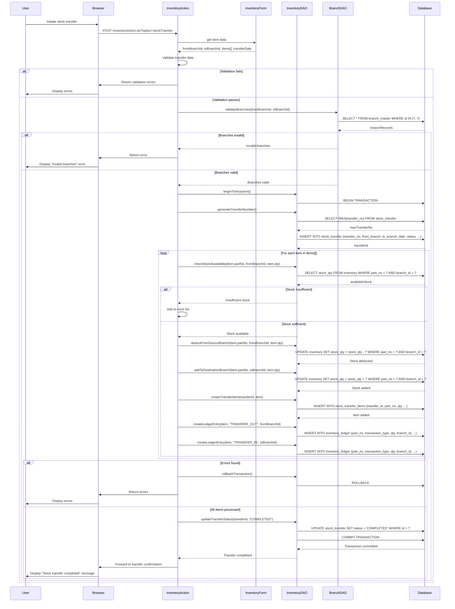
```mermaid
sequenceDiagram
    participant User
    participant Browser
    participant InventoryAction
    participant InventoryForm
    participant InventoryDAO
    participant BranchDAO
    participant Database
    
    User->>Browser: Initiate stock transfer
    Browser->>InventoryAction: POST /inventoryAction.do?option=stockTransfer
    InventoryAction->>InventoryForm: get form data
    InventoryForm-->>InventoryAction: fromBranchId, toBranchId, items[], transferDate
    
    InventoryAction->>InventoryAction: Validate transfer data
    
    alt Validation fails
        InventoryAction->>Browser: Return validation errors
        Browser->>User: Display errors
    else Validation passes
        InventoryAction->>BranchDAO: validateBranches(fromBranchId, toBranchId)
        BranchDAO->>Database: SELECT * FROM branch_master WHERE id IN (?, ?)
        Database-->>BranchDAO: branchRecords
        
        alt Branches invalid
            BranchDAO-->>InventoryAction: Invalid branches
            InventoryAction->>Browser: Return error
            Browser->>User: Display "Invalid branches" error
        else Branches valid
            BranchDAO-->>InventoryAction: Branches valid
            
            InventoryAction->>InventoryDAO: beginTransaction()
            InventoryDAO->>Database: BEGIN TRANSACTION
            
            InventoryAction->>InventoryDAO: generateTransferNumber()
            InventoryDAO->>Database: SELECT MAX(transfer_no) FROM stock_transfer
            Database-->>InventoryDAO: maxTransferNo
            InventoryDAO->>Database: INSERT INTO stock_transfer (transfer_no, from_branch, to_branch, date, status, ...)
            Database-->>InventoryDAO: transferId
            
            loop For each item in items[]
                InventoryAction->>InventoryDAO: checkStockAvailability(item.partNo, fromBranchId, item.qty)
                InventoryDAO->>Database: SELECT stock_qty FROM inventory WHERE part_no = ? AND branch_id = ?
                Database-->>InventoryDAO: availableStock
                
                alt Stock insufficient
                    InventoryDAO-->>InventoryAction: Insufficient stock
                    InventoryAction->>InventoryAction: Add to error list
                else Stock sufficient
                    InventoryDAO-->>InventoryAction: Stock available
                    
                    InventoryAction->>InventoryDAO: deductFromSourceBranch(item.partNo, fromBranchId, item.qty)
                    InventoryDAO->>Database: UPDATE inventory SET stock_qty = stock_qty - ? WHERE part_no = ? AND branch_id = ?
                    Database-->>InventoryDAO: Stock deducted
                    
                    InventoryAction->>InventoryDAO: addToDestinationBranch(item.partNo, toBranchId, item.qty)
                    InventoryDAO->>Database: UPDATE inventory SET stock_qty = stock_qty + ? WHERE part_no = ? AND branch_id = ?
                    Database-->>InventoryDAO: Stock added
                    
                    InventoryAction->>InventoryDAO: createTransferItem(transferId, item)
                    InventoryDAO->>Database: INSERT INTO stock_transfer_items (transfer_id, part_no, qty, ...)
                    Database-->>InventoryDAO: Item added
                    
                    InventoryAction->>InventoryDAO: createLedgerEntry(item, "TRANSFER_OUT", fromBranchId)
                    InventoryDAO->>Database: INSERT INTO inventory_ledger (part_no, transaction_type, qty, branch_id, ...)
                    
                    InventoryAction->>InventoryDAO: createLedgerEntry(item, "TRANSFER_IN", toBranchId)
                    InventoryDAO->>Database: INSERT INTO inventory_ledger (part_no, transaction_type, qty, branch_id, ...)
                end
            end
            
            alt Errors found
                InventoryAction->>InventoryDAO: rollbackTransaction()
                InventoryDAO->>Database: ROLLBACK
                InventoryAction->>Browser: Return errors
                Browser->>User: Display errors
            else All items processed
                InventoryAction->>InventoryDAO: updateTransferStatus(transferId, "COMPLETED")
                InventoryDAO->>Database: UPDATE stock_transfer SET status = 'COMPLETED' WHERE id = ?
                
                InventoryDAO->>Database: COMMIT TRANSACTION
                Database-->>InventoryDAO: Transaction committed
                InventoryDAO-->>InventoryAction: Transfer completed
                
                InventoryAction->>Browser: Forward to transfer confirmation
                Browser->>User: Display "Stock transfer completed" message
            end
        end
    end
```

## 11. KUBOTA User Management - Create/Update User Sequence

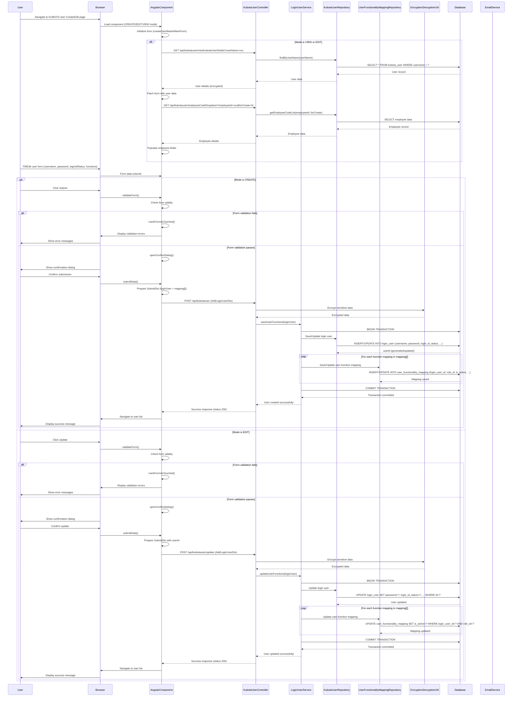
```mermaid
sequenceDiagram
    participant User
    participant Browser
    participant AngularComponent
    participant KubotaUserController
    participant LoginUserService
    participant KubotaUserRepository
    participant UserFunctionalityMappingRepository
    participant EncryptionDecryptionUtil
    participant Database
    participant EmailService
    
    User->>Browser: Navigate to KUBOTA User Create/Edit page
    Browser->>AngularComponent: Load component (CREATE/EDIT/VIEW mode)
    AngularComponent->>AngularComponent: Initialize form (createUserMasterMainForm)
    
    alt Mode is VIEW or EDIT
        AngularComponent->>KubotaUserController: GET /api/kubotauser/viewKubotaUserDetails?userName=xxx
        KubotaUserController->>KubotaUserRepository: findByUserName(userName)
        KubotaUserRepository->>Database: SELECT * FROM kubota_user WHERE username = ?
        Database-->>KubotaUserRepository: User record
        KubotaUserRepository-->>KubotaUserController: User data
        KubotaUserController-->>AngularComponent: User details (encrypted)
        
        AngularComponent->>AngularComponent: Patch form with user data
        AngularComponent->>KubotaUserController: GET /api/kubotauser/employeeCodeDropdown?employeeId=xxx&forCreate=N
        KubotaUserController->>KubotaUserRepository: getEmployeeCodeList(employeeId, forCreate)
        KubotaUserRepository->>Database: SELECT employee data
        Database-->>KubotaUserRepository: Employee record
        KubotaUserRepository-->>KubotaUserController: Employee data
        KubotaUserController-->>AngularComponent: Employee details
        AngularComponent->>AngularComponent: Populate employee fields
    end
    
    User->>Browser: Fill/Edit user form (username, password, loginIdStatus, functions)
    Browser->>AngularComponent: Form data entered
    
    alt Mode is CREATE
        User->>Browser: Click Submit
        Browser->>AngularComponent: validateForm()
        AngularComponent->>AngularComponent: Check form validity
        
        alt Form validation fails
            AngularComponent->>AngularComponent: markFormAsTouched()
            AngularComponent->>Browser: Display validation errors
            Browser->>User: Show error messages
        else Form validation passes
            AngularComponent->>AngularComponent: openConfirmDialog()
            Browser->>User: Show confirmation dialog
            User->>Browser: Confirm submission
            Browser->>AngularComponent: submitData()
            
            AngularComponent->>AngularComponent: Prepare SubmitDto (loginUser + mapping[])
            AngularComponent->>KubotaUserController: POST /api/kubotauser (AddLoginUserDto)
            KubotaUserController->>EncryptionDecryptionUtil: Encrypt sensitive data
            EncryptionDecryptionUtil-->>KubotaUserController: Encrypted data
            
            KubotaUserController->>LoginUserService: saveUserFunctions(loginUser)
            LoginUserService->>Database: BEGIN TRANSACTION
            
            LoginUserService->>KubotaUserRepository: Save/Update login user
            KubotaUserRepository->>Database: INSERT/UPDATE INTO login_user (username, password, login_id_status, ...)
            Database-->>KubotaUserRepository: userId (generated/updated)
            
            loop For each function mapping in mapping[]
                LoginUserService->>UserFunctionalityMappingRepository: Save/Update user-function mapping
                UserFunctionalityMappingRepository->>Database: INSERT/UPDATE INTO user_functionality_mapping (login_user_id, role_id, is_active, ...)
                Database-->>UserFunctionalityMappingRepository: Mapping saved
            end
            
            LoginUserService->>Database: COMMIT TRANSACTION
            Database-->>LoginUserService: Transaction committed
            LoginUserService-->>KubotaUserController: User created successfully
            KubotaUserController-->>AngularComponent: Success response (status 200)
            AngularComponent->>Browser: Navigate to user list
            Browser->>User: Display success message
        end
        
    else Mode is EDIT
        User->>Browser: Click Update
        Browser->>AngularComponent: validateForm()
        AngularComponent->>AngularComponent: Check form validity
        
        alt Form validation fails
            AngularComponent->>AngularComponent: markFormAsTouched()
            AngularComponent->>Browser: Display validation errors
            Browser->>User: Show error messages
        else Form validation passes
            AngularComponent->>AngularComponent: openConfirmDialog()
            Browser->>User: Show confirmation dialog
            User->>Browser: Confirm update
            Browser->>AngularComponent: submitData()
            
            AngularComponent->>AngularComponent: Prepare SubmitDto with userId
            AngularComponent->>KubotaUserController: POST /api/kubotauser/update (AddLoginUserDto)
            KubotaUserController->>EncryptionDecryptionUtil: Encrypt sensitive data
            EncryptionDecryptionUtil-->>KubotaUserController: Encrypted data
            
            KubotaUserController->>LoginUserService: updateUserFunctions(loginUser)
            LoginUserService->>Database: BEGIN TRANSACTION
            
            LoginUserService->>KubotaUserRepository: Update login user
            KubotaUserRepository->>Database: UPDATE login_user SET password=?, login_id_status=?, ... WHERE id=?
            Database-->>KubotaUserRepository: User updated
            
            loop For each function mapping in mapping[]
                LoginUserService->>UserFunctionalityMappingRepository: Update user-function mapping
                UserFunctionalityMappingRepository->>Database: UPDATE user_functionality_mapping SET is_active=? WHERE login_user_id=? AND role_id=?
                Database-->>UserFunctionalityMappingRepository: Mapping updated
            end
            
            LoginUserService->>Database: COMMIT TRANSACTION
            Database-->>LoginUserService: Transaction committed
            LoginUserService-->>KubotaUserController: User updated successfully
            KubotaUserController-->>AngularComponent: Success response (status 200)
            AngularComponent->>Browser: Navigate to user list
            Browser->>User: Display success message
        end
    end
```

## 12. KUBOTA User Management - Login Sequence

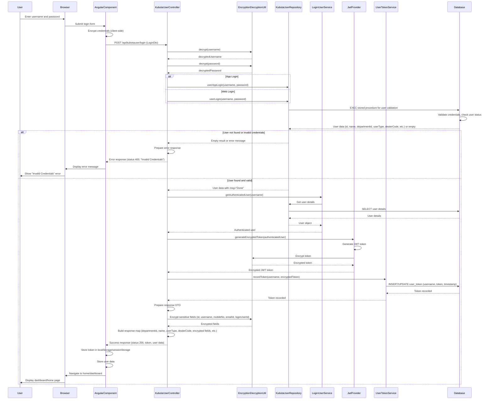
```mermaid
sequenceDiagram
    participant User
    participant Browser
    participant AngularComponent
    participant KubotaUserController
    participant EncryptionDecryptionUtil
    participant KubotaUserRepository
    participant LoginUserService
    participant JwtProvider
    participant UserTokenService
    participant Database
    
    User->>Browser: Enter username and password
    Browser->>AngularComponent: Submit login form
    AngularComponent->>AngularComponent: Encrypt credentials (client-side)
    AngularComponent->>KubotaUserController: POST /api/kubotauser/login (LoginDto)
    
    KubotaUserController->>EncryptionDecryptionUtil: decrypt(username)
    EncryptionDecryptionUtil-->>KubotaUserController: decryptedUsername
    KubotaUserController->>EncryptionDecryptionUtil: decrypt(password)
    EncryptionDecryptionUtil-->>KubotaUserController: decryptedPassword
    
    alt App Login
        KubotaUserController->>KubotaUserRepository: userAppLogin(username, password)
    else Web Login
        KubotaUserController->>KubotaUserRepository: userLogin(username, password)
    end
    
    KubotaUserRepository->>Database: EXEC stored procedure for user validation
    Database->>Database: Validate credentials, check user status
    Database-->>KubotaUserRepository: User data (id, name, departmentId, userType, dealerCode, etc.) or empty
    
    alt User not found or invalid credentials
        KubotaUserRepository-->>KubotaUserController: Empty result or error message
        KubotaUserController->>KubotaUserController: Prepare error response
        KubotaUserController-->>AngularComponent: Error response (status 400, "Invalid Credentials")
        AngularComponent->>Browser: Display error message
        Browser->>User: Show "Invalid Credentials" error
    else User found and valid
        KubotaUserRepository-->>KubotaUserController: User data with msg="Done"
        
        KubotaUserController->>LoginUserService: getAuthenticatedUser(username)
        LoginUserService->>KubotaUserRepository: Get user details
        KubotaUserRepository->>Database: SELECT user details
        Database-->>KubotaUserRepository: User details
        KubotaUserRepository-->>LoginUserService: User object
        LoginUserService-->>KubotaUserController: Authenticated user
        
        KubotaUserController->>JwtProvider: generateEncryptedToken(authenticatedUser)
        JwtProvider->>JwtProvider: Generate JWT token
        JwtProvider->>EncryptionDecryptionUtil: Encrypt token
        EncryptionDecryptionUtil-->>JwtProvider: Encrypted token
        JwtProvider-->>KubotaUserController: Encrypted JWT token
        
        KubotaUserController->>UserTokenService: recordToken(username, encryptedToken)
        UserTokenService->>Database: INSERT/UPDATE user_token (username, token, timestamp)
        Database-->>UserTokenService: Token recorded
        UserTokenService-->>KubotaUserController: Token recorded
        
        KubotaUserController->>KubotaUserController: Prepare response DTO
        KubotaUserController->>EncryptionDecryptionUtil: Encrypt sensitive fields (id, username, mobileNo, emailId, loginUserId)
        EncryptionDecryptionUtil-->>KubotaUserController: Encrypted fields
        
        KubotaUserController->>KubotaUserController: Build response map (departmentId, name, userType, dealerCode, encrypted fields, etc.)
        KubotaUserController-->>AngularComponent: Success response (status 200, token, user data)
        
        AngularComponent->>AngularComponent: Store token in localStorage/sessionStorage
        AngularComponent->>AngularComponent: Store user data
        AngularComponent->>Browser: Navigate to home/dashboard
        Browser->>User: Display dashboard/home page
    end
```

## 13. KUBOTA User Management - Search Users Sequence

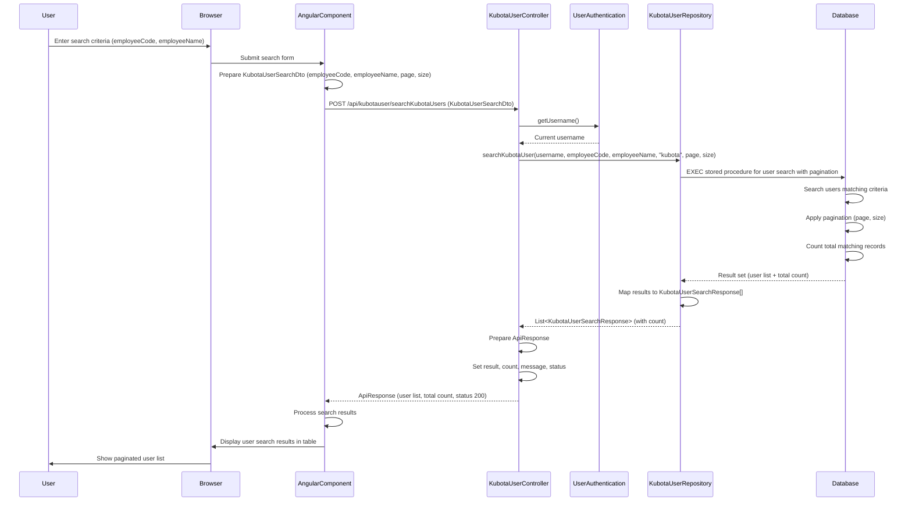
```mermaid
sequenceDiagram
    participant User
    participant Browser
    participant AngularComponent
    participant KubotaUserController
    participant UserAuthentication
    participant KubotaUserRepository
    participant Database
    
    User->>Browser: Enter search criteria (employeeCode, employeeName)
    Browser->>AngularComponent: Submit search form
    AngularComponent->>AngularComponent: Prepare KubotaUserSearchDto (employeeCode, employeeName, page, size)
    AngularComponent->>KubotaUserController: POST /api/kubotauser/searchKubotaUsers (KubotaUserSearchDto)
    
    KubotaUserController->>UserAuthentication: getUsername()
    UserAuthentication-->>KubotaUserController: Current username
    
    KubotaUserController->>KubotaUserRepository: searchKubotaUser(username, employeeCode, employeeName, "kubota", page, size)
    KubotaUserRepository->>Database: EXEC stored procedure for user search with pagination
    Database->>Database: Search users matching criteria
    Database->>Database: Apply pagination (page, size)
    Database->>Database: Count total matching records
    Database-->>KubotaUserRepository: Result set (user list + total count)
    
    KubotaUserRepository->>KubotaUserRepository: Map results to KubotaUserSearchResponse[]
    KubotaUserRepository-->>KubotaUserController: List<KubotaUserSearchResponse> (with count)
    
    KubotaUserController->>KubotaUserController: Prepare ApiResponse
    KubotaUserController->>KubotaUserController: Set result, count, message, status
    KubotaUserController-->>AngularComponent: ApiResponse (user list, total count, status 200)
    
    AngularComponent->>AngularComponent: Process search results
    AngularComponent->>Browser: Display user search results in table
    Browser->>User: Show paginated user list
```

## 14. KUBOTA User Management - Forgot Password Sequence

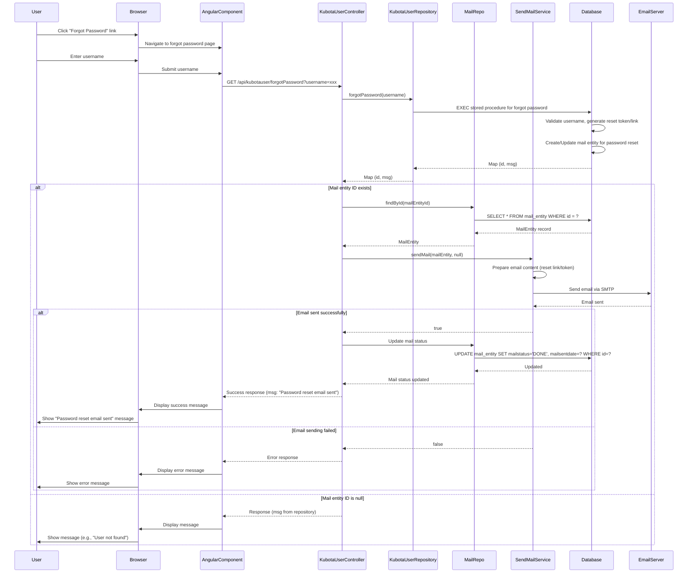
```mermaid
sequenceDiagram
    participant User
    participant Browser
    participant AngularComponent
    participant KubotaUserController
    participant KubotaUserRepository
    participant MailRepo
    participant SendMailService
    participant Database
    participant EmailServer
    
    User->>Browser: Click "Forgot Password" link
    Browser->>AngularComponent: Navigate to forgot password page
    User->>Browser: Enter username
    Browser->>AngularComponent: Submit username
    AngularComponent->>KubotaUserController: GET /api/kubotauser/forgotPassword?username=xxx
    
    KubotaUserController->>KubotaUserRepository: forgotPassword(username)
    KubotaUserRepository->>Database: EXEC stored procedure for forgot password
    Database->>Database: Validate username, generate reset token/link
    Database->>Database: Create/Update mail entity for password reset
    Database-->>KubotaUserRepository: Map (id, msg)
    
    KubotaUserRepository-->>KubotaUserController: Map (id, msg)
    
    alt Mail entity ID exists
        KubotaUserController->>MailRepo: findById(mailEntityId)
        MailRepo->>Database: SELECT * FROM mail_entity WHERE id = ?
        Database-->>MailRepo: MailEntity record
        MailRepo-->>KubotaUserController: MailEntity
        
        KubotaUserController->>SendMailService: sendMail(mailEntity, null)
        SendMailService->>SendMailService: Prepare email content (reset link/token)
        SendMailService->>EmailServer: Send email via SMTP
        EmailServer-->>SendMailService: Email sent
        
        alt Email sent successfully
            SendMailService-->>KubotaUserController: true
            KubotaUserController->>MailRepo: Update mail status
            MailRepo->>Database: UPDATE mail_entity SET mailstatus='DONE', mailsentdate=? WHERE id=?
            Database-->>MailRepo: Updated
            MailRepo-->>KubotaUserController: Mail status updated
            
            KubotaUserController-->>AngularComponent: Success response (msg: "Password reset email sent")
            AngularComponent->>Browser: Display success message
            Browser->>User: Show "Password reset email sent" message
        else Email sending failed
            SendMailService-->>KubotaUserController: false
            KubotaUserController-->>AngularComponent: Error response
            AngularComponent->>Browser: Display error message
            Browser->>User: Show error message
        end
    else Mail entity ID is null
        KubotaUserController-->>AngularComponent: Response (msg from repository)
        AngularComponent->>Browser: Display message
        Browser->>User: Show message (e.g., "User not found")
    end
```

