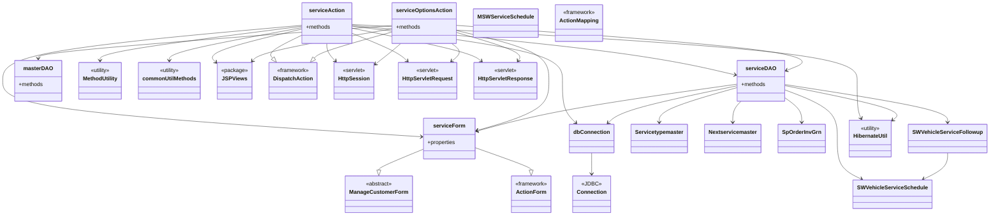

# ITLDIS Service Module - UML Class Diagram (Simplified)

```mermaid
classDiagram
    class serviceAction {
        +methods
    }
    class serviceOptionsAction {
        +methods
    }
    class serviceDAO {
        +methods
    }
    class serviceForm {
        +properties
    }
    class masterDAO {
        +methods
    }
    class ManageCustomerForm {
        <<abstract>>
    }
    class SWVehicleServiceSchedule
    class SWVehicleServiceFollowup
    class Servicetypemaster
    class Nextservicemaster
    class MSWServiceSchedule
    class SpOrderInvGrn
    class dbConnection
    class MethodUtility {
        <<utility>>
    }
    class HibernateUtil {
        <<utility>>
    }
    class commonUtilMethods {
        <<utility>>
    }
    class JSPViews {
        <<package>>
    }
    class DispatchAction {
        <<framework>>
    }
    class ActionForm {
        <<framework>>
    }
    class ActionMapping {
        <<framework>>
    }
    class Connection {
        <<JDBC>>
    }
    class HttpSession {
        <<servlet>>
    }
    class HttpServletRequest {
        <<servlet>>
    }
    class HttpServletResponse {
        <<servlet>>
    }
    
    serviceAction --> serviceDAO
    serviceAction --> serviceForm
    serviceAction --> dbConnection
    serviceAction --> MethodUtility
    serviceAction --> HibernateUtil
    serviceAction --> commonUtilMethods
    serviceOptionsAction --> serviceDAO
    serviceOptionsAction --> serviceForm
    serviceOptionsAction --> masterDAO
    serviceDAO --> serviceForm
    serviceDAO --> dbConnection
    serviceDAO --> HibernateUtil
    serviceDAO --> SWVehicleServiceSchedule
    serviceDAO --> SWVehicleServiceFollowup
    serviceDAO --> Servicetypemaster
    serviceDAO --> Nextservicemaster
    serviceDAO --> SpOrderInvGrn
    serviceForm --|> ManageCustomerForm
    SWVehicleServiceFollowup --> SWVehicleServiceSchedule
    serviceAction --> JSPViews
    serviceOptionsAction --> JSPViews
    serviceAction --|> DispatchAction
    serviceOptionsAction --|> DispatchAction
    serviceForm --|> ActionForm
    dbConnection --> Connection
    serviceAction --> HttpSession
    serviceOptionsAction --> HttpSession
    serviceAction --> HttpServletRequest
    serviceAction --> HttpServletResponse
    serviceOptionsAction --> HttpServletRequest
    serviceOptionsAction --> HttpServletResponse
```
