# ITLDIS Service Module - UML Class Diagram

```mermaid
classDiagram
    %% Action Layer (Controllers)
    class serviceAction {
        -String dbPATH
        +getPartNumberAjax()
        +getPartPriceBypartNo()
        +getPartCheck()
        +getPartDescAjax()
        +getPartPriceBypartDesc()
        +init_viewallJobcarddetails()
        +getVimNumberDetails()
        +getvinNumberAjax()
        +getServiceHrsAjax()
        +initPending4validateVinNo()
        +validateVinNoNupdate()
        +initCloseJobCards()
        +initReOpenJobCards()
        +initSearchHistory()
        +viewJobcard()
        +setJobCardNoStatus()
        +initCreateInvoiceList()
        +approveJobCard()
        +generateInvoice()
        +initviewInvoiceList()
        +printInvoice()
        +printTrasDetails()
        +invoiceTransctionList()
        +initsercviceReminder()
        +initServiceDoneLapse()
        +printGrn()
        +getFollowup()
        +updateFollowUp()
        +printTaxInvoice()
        +initAddExtWarranty()
        +addExtWarranty()
        +getPremiumAmt()
        +isVehicleExist()
        +isChassisExist()
        +viewExtendedWarranty()
        +getExtWarrPopupView()
        +editExtWarranty()
        +updateExtWarranty()
        +initAddItlExtWarranty()
        +addItlExtWarranty()
        +viewItlExtendedWarranty()
        +fetchDistricts()
        +fetchCities()
        +fetchTehsils()
        +isChassisExistInItlExtWty()
        +getItlExtWarrPopupView()
        +editItlExtWarranty()
        +updateItlExtWarranty()
        +printGstTaxInvoice()
        +isVehicleExistForItlExtWty()
        +printReport()
    }

    class serviceOptionsAction {
        -String dbPATH
        +initJobCardForPDI()
    }

    %% DAO Layer
    class masterDAO {
        <<DAO>>
        +getCommonLabelValues()
    }

    class serviceDAO {
        -Connection conn
        +serviceDAO()
        +check_in_Db()
        +check_and_getfrom_Db()
        +getJobType()
        +getJobLocation()
        +getNextService()
        +getJobCardStatus()
        +getOwnerDriven()
        +getServiceType()
        +getApplicationCode()
        +getComplaintCode()
        +getCausalCode()
        +getConsequenceCode()
        +getComplaintJobCardList()
        +getBillCode()
        +getOtherjobworkmaster()
        +getComplaintCodeOnCompDetails()
        +getActionTakenOnCompCode()
        +getCommonLabelValues()
        +addComplaintDetailJobCard()
        +getComponentList()
        +getPart_in_db()
        +getPartno_in_db()
        +getPriceByPartNo()
        +getPartNoCheck()
        +getParameterActionTaken()
        +getHesConstantValue()
        +getFormContent()
        +getForm_id()
        +getvehicle_History()
        +getJobCardNumber()
        +addVehileInformation()
        +UpdateVehileInformation()
        +addCustomerPayeeInformation()
        +getJobCardDetails()
        +getBayCode()
        +getMechanicCode()
        +getInspectionBy()
        +addStatus()
        +getJobCard_vehicale_DetailFor_singleJobcard()
        +getWarrantyModeldetail()
        +getVinDetails()
        +getVimDetailsFromServer()
        +getVinNoList()
        +getCustomerDetailsVinNo()
        +getCustomerDetail4JobcardNo()
        +getCustomerDetailById()
        +getJobCardHistory()
        +getJobCardOpenList()
        +setJobCardNoStatus()
        +approveJobCard()
        +generateInvoice()
        +getInvNoList4print()
        +printInvoiceData()
        +printConSaleReturn()
        +printExportDetails()
        +printInvOtherDealer()
        +invTransListByRefNo()
        +counterSaleReturnList()
        +invOtherDealerList()
        +invoiceGrnList()
        +invExportDealerList()
        +getsercviceReminder()
        +getServiceDoneLapse()
        +getInvoiceGrn()
        +getInvoiceGrnDetailsList()
        +followUpHistoryList()
        +addFollowUp()
        +saveExtWarranty()
        +getPremiumAmt()
        +isVehicleExist()
        +isChassisAlreadyExist()
        +getViewExpWarrDetails()
        +getExpWarrDetailsExport()
        +getExtWarrPopupView()
        +getExtWarrStatus()
        +updateExtWarranty()
        +saveItlExtWarranty()
        +getViewExpItlExtWarrDetails()
        +getItlExtWarrPopupView()
        +updateItlExtWarranty()
        +getPolicyType()
        +getVehicleDetails()
        +getExtendedWarrantyDetails()
        +getStates()
        +getDistricts()
        +getCities()
        +getTehsil()
        +isChassisExistInItlExtWty()
        +isVehicleExistForItlExtWty()
        +getMechanicCode()
        +getCommonLabelValueHiber()
    }

    %% Form Bean Layer
    class serviceForm {
        -String jobType
        -String jobTypeDesc
        -String jobLocation
        -String nextService
        -String jobCardStatus
        -String ownerDriven
        -String serviceType
        -String vinNo
        -String jobCardNo
        -String modelFamily
        -String engineNumber
        -String dealerJobCardNo
        -String modelCode
        -String saleDate
        -String registrationNo
        -String hmr
        -String serviceBookletNo
        -String jobCardDate
        -String keyIdentificationNo
        -String warrantyApplicable
        -String customerName
        -String payeeName
        -String village
        -String mobilePhone
        -String landline
        -String emailId
        -String district
        -String pinCode
        -String state
        -String country
        -String partNo
        -String partDesc
        -String unitPrice
        -String quantityS
        -String partPriceAmount
        -String complaintCode
        -String actionTaken
        -String labourChargesAmount
        -String workCode
        -String workDescription
        -String workAmount
        -String totalPartsValue
        -String totalLubesValue
        -String totalLabourCharges
        -String totalOtherCharges
        -String totalEstimate
        -String dealercode
        -String fromdate
        -String todate
        -String userId
        -String invoiceno
        -String status
        -String chassisNo
        -String ewLoaderId
        -String policyType
        -String policyTerm
        -String deliveryDate
        -String visitDate
        -String followUpStatus
        -String scheduleID
        -String followUpId
        -String callDate
        -String callDescription
        -String nextFollowUpDate
        -String createdBy
        +getJobType()
        +setJobType()
        +getVinNo()
        +setVinNo()
        +getJobCardNo()
        +setJobCardNo()
        +getCustomerName()
        +setCustomerName()
        +getPartNo()
        +setPartNo()
        +getTotalPartsValue()
        +setTotalPartsValue()
        +getDealercode()
        +setDealercode()
        +getStatus()
        +setStatus()
        +getChassisNo()
        +setChassisNo()
        +getEwLoaderId()
        +setEwLoaderId()
        +getPolicyType()
        +setPolicyType()
        +getFollowUpId()
        +setFollowUpId()
        +getScheduleID()
        +setScheduleID()
    }

    class ManageCustomerForm {
        <<abstract>>
        +getCustomerId()
        +setCustomerId()
    }

    %% Hibernate Entity Layer
    class SWVehicleServiceSchedule {
        -BigInteger scheduleID
        -Date dueDate
        -String status
        -String jobCardNo
        -Date jobCardDate
        -String serviceDealer
        -String followUpStatus
        -Date lastFollowupDate
        -String vinNo
        -int jobTypeId
        -Date deliveryDate
        +getScheduleID()
        +setScheduleID()
        +getDueDate()
        +setDueDate()
        +getStatus()
        +setStatus()
        +getVinNo()
        +setVinNo()
    }

    class SWVehicleServiceFollowup {
        -BigInteger followUpId
        -Double scheduleID
        -int serviceTypeID
        -Date callDate
        -String callDescription
        -String doorstepServiceRequired
        -Date customerPromisedDate
        -Date nextFollowUpDate
        -String status
        -String createdBy
        -Date createdOn
        +getFollowUpId()
        +setFollowUpId()
        +getScheduleID()
        +setScheduleID()
        +getCallDate()
        +setCallDate()
        +getCallDescription()
        +setCallDescription()
        +getCreatedBy()
        +setCreatedBy()
    }

    class Servicetypemaster {
        -int serviceTypeID
        -String serviceTypeDesc
        -int seqNo
        +getServiceTypeID()
        +setServiceTypeID()
        +getServiceTypeDesc()
        +setServiceTypeDesc()
    }

    class Nextservicemaster {
        -int nextServiceID
        -String nextServiceDesc
        -int seqNo
        +getNextServiceID()
        +setNextServiceID()
        +getNextServiceDesc()
        +setNextServiceDesc()
    }

    class MSWServiceSchedule {
        -BigInteger scheduleID
        -Date dueDate
        -String status
        +getScheduleID()
        +setScheduleID()
        +getDueDate()
        +setDueDate()
    }

    class SpOrderInvGrn {
        -String grnNo
        -Date grnDate
        -String dealerCode
        +getGrnNo()
        +setGrnNo()
        +getGrnDate()
        +setGrnDate()
    }

    %% Utility Classes
    class dbConnection {
        +String dbPathAuth
        +getConnection()
        +getDbConnection()
    }

    class MethodUtility {
        <<utility>>
        +getDealersDetailsUnderUser()
        +check_in_Db_HQL()
        +getNumberEW()
        +getStateIdByDealer()
    }

    class HibernateUtil {
        <<utility>>
        +getSessionFactory()
        +openSession()
    }

    class commonUtilMethods {
        <<utility>>
        +decodeBase64()
        +encodeToBase64()
    }

    %% Relationships
    serviceAction --> serviceDAO : uses
    serviceAction --> serviceForm : uses
    serviceAction --> dbConnection : uses
    serviceAction --> MethodUtility : uses
    serviceAction --> HibernateUtil : uses
    serviceAction --> commonUtilMethods : uses

    serviceOptionsAction --> serviceDAO : uses
    serviceOptionsAction --> serviceForm : uses
    serviceOptionsAction --> masterDAO : uses

    serviceDAO --> serviceForm : returnsUses
    serviceDAO --> dbConnection : uses
    serviceDAO --> HibernateUtil : uses
    serviceDAO --> SWVehicleServiceSchedule : uses
    serviceDAO --> SWVehicleServiceFollowup : uses
    serviceDAO --> Servicetypemaster : uses
    serviceDAO --> Nextservicemaster : uses
    serviceDAO --> SpOrderInvGrn : uses

    serviceForm --|> ManageCustomerForm : extends

    SWVehicleServiceFollowup --> SWVehicleServiceSchedule : references

    %% JSP Views (represented as a package)
    class JSPViews {
        <<package>>
        +addExtendedWarrenty
        +addItlExtendedWarrenty
        +exportExtWarranty
        +exportServiceDoneLapse
        +ExportServiceReminder
        +printInvoice
        +printJobCard
        +printTaxInvoice
        +sercviceReminder
        +serviceDoneLapseReport
        +v_closejobcard
        +v_generateInvoice
        +v_InvoiceTransList
        +v_ListofInv4print
        +v_ListofJC4Invoice
        +v_Tractorhistory
        +v_update_folloup
        +v_viewalljobcard
        +v_viewjobcardDetail
        +v_vinValidation
        +viewExtentedWarranty
        +viewExtWarrPopup
        +viewItlExtendedWarranty
        +viewItlExtWarrPopup
    }

    serviceAction --> JSPViews : forwardsTo
    serviceOptionsAction --> JSPViews : forwardsTo

    %% External Dependencies
    class DispatchAction {
        <<framework>>
        +execute()
        +findForward()
    }

    class ActionForm {
        <<framework>>
        +reset()
        +validate()
    }

    class ActionMapping {
        <<framework>>
        +findForward()
    }

    serviceAction --|> DispatchAction : extends
    serviceOptionsAction --|> DispatchAction : extends
    serviceForm --|> ActionForm : extends

    %% Database Connection
    class Connection {
        <<JDBC>>
        +createStatement()
        +prepareStatement()
        +close()
    }

    dbConnection --> Connection : creates

    %% Session Management
    class HttpSession {
        <<servlet>>
        +getAttribute()
        +setAttribute()
        +getValue()
    }

    serviceAction --> HttpSession : uses
    serviceOptionsAction --> HttpSession : uses

    class HttpServletRequest {
        <<servlet>>
        +getParameter()
        +getSession()
        +setAttribute()
    }

    class HttpServletResponse {
        <<servlet>>
        +getWriter()
        +setContentType()
        +getOutputStream()
    }

    serviceAction --> HttpServletRequest : uses
    serviceAction --> HttpServletResponse : uses
    serviceOptionsAction --> HttpServletRequest : uses
    serviceOptionsAction --> HttpServletResponse : uses
```

## Module Overview

The **Service Module** is a comprehensive module in the ITLDIS application that handles:

### Core Functionalities:

1. **Job Card Management**
   - Create, view, update, and close job cards
   - Job card approval workflow
   - Job card history tracking
   - VIN number validation

2. **Invoice Management**
   - Generate invoices from job cards
   - Print invoices (regular and tax invoices)
   - View invoice lists
   - Invoice transaction management

3. **Service Scheduling & Follow-up**
   - Service reminders
   - Service follow-up tracking
   - Service done lapse reporting
   - Service schedule management

4. **Extended Warranty**
   - Add extended warranty (EW and ITL EW)
   - View extended warranty details
   - Update extended warranty information
   - Premium amount calculation

5. **Parts & Pricing**
   - Part number lookup
   - Part price retrieval
   - Component list management
   - Part validation

6. **Reports & Exports**
   - Service reminder reports
   - Service done lapse reports
   - Invoice transaction reports
   - Export functionality (Excel)

### Key Components:

- **serviceAction**: Main controller with 50+ action methods
- **serviceDAO**: Data access layer with 80+ methods for database operations
- **serviceForm**: Form bean with 200+ properties for data transfer
- **Hibernate Entities**: 6+ entity classes for database mapping
- **JSP Views**: 37+ JSP pages for user interface

### Technology Stack:

- **Framework**: Apache Struts 1.x (DispatchAction pattern)
- **ORM**: Hibernate
- **Database**: SQL Server
- **View Layer**: JSP
- **Reporting**: JasperReports

### Data Flow:

1. **Request Flow**: HTTP Request → Action Class → DAO → Database
2. **Response Flow**: Database → DAO → Form Bean → Action → JSP View
3. **Session Management**: Uses HttpSession for user context
4. **Transaction Management**: Database transactions handled at DAO level

