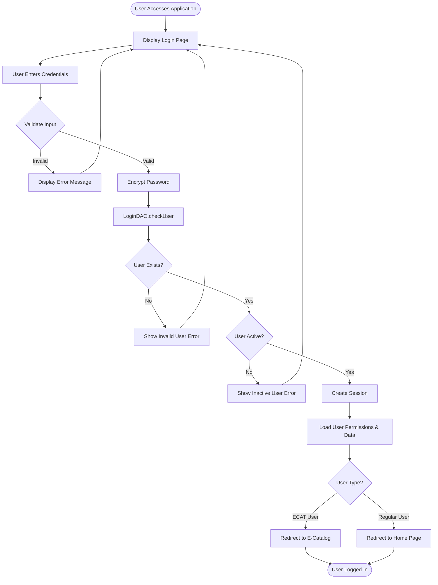
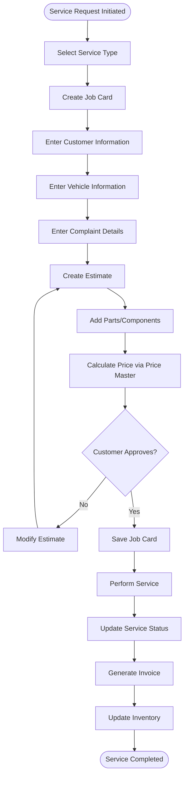
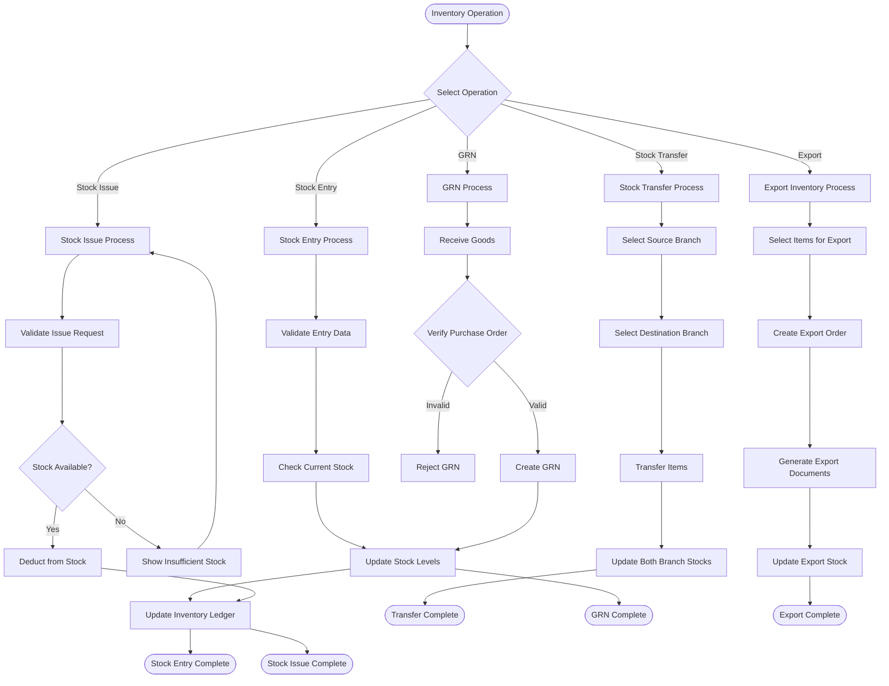
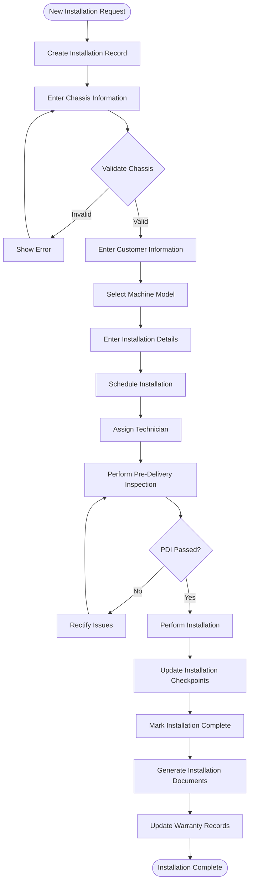
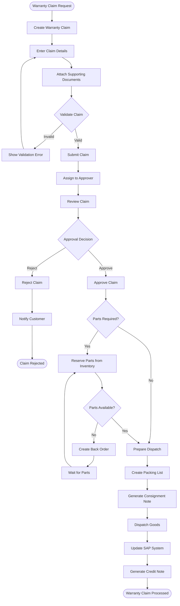
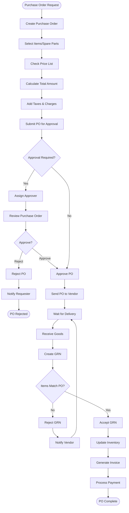
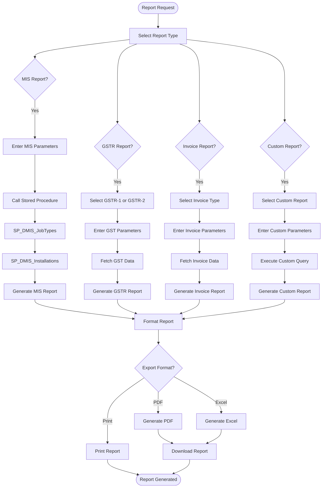
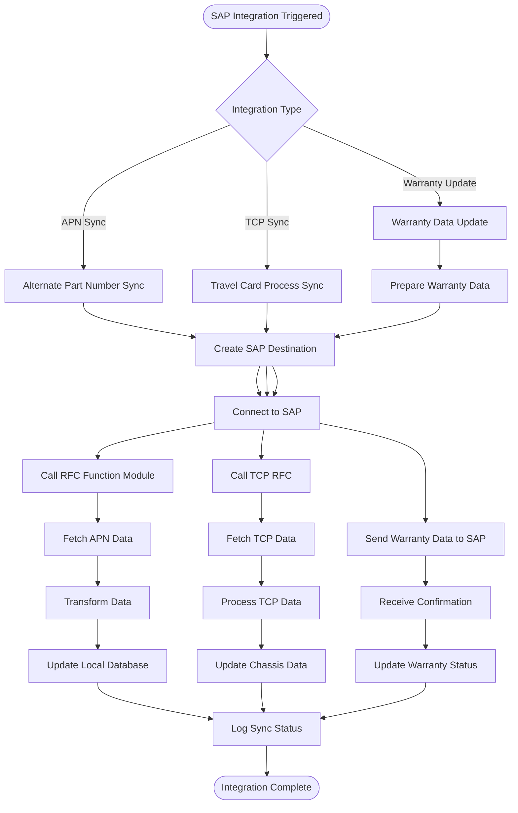
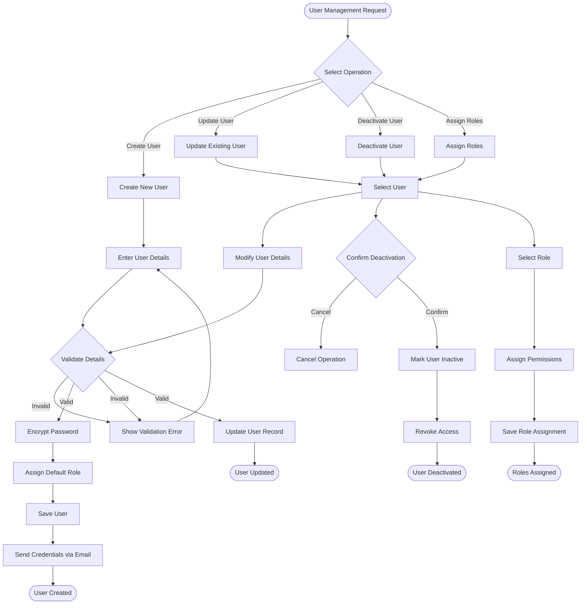
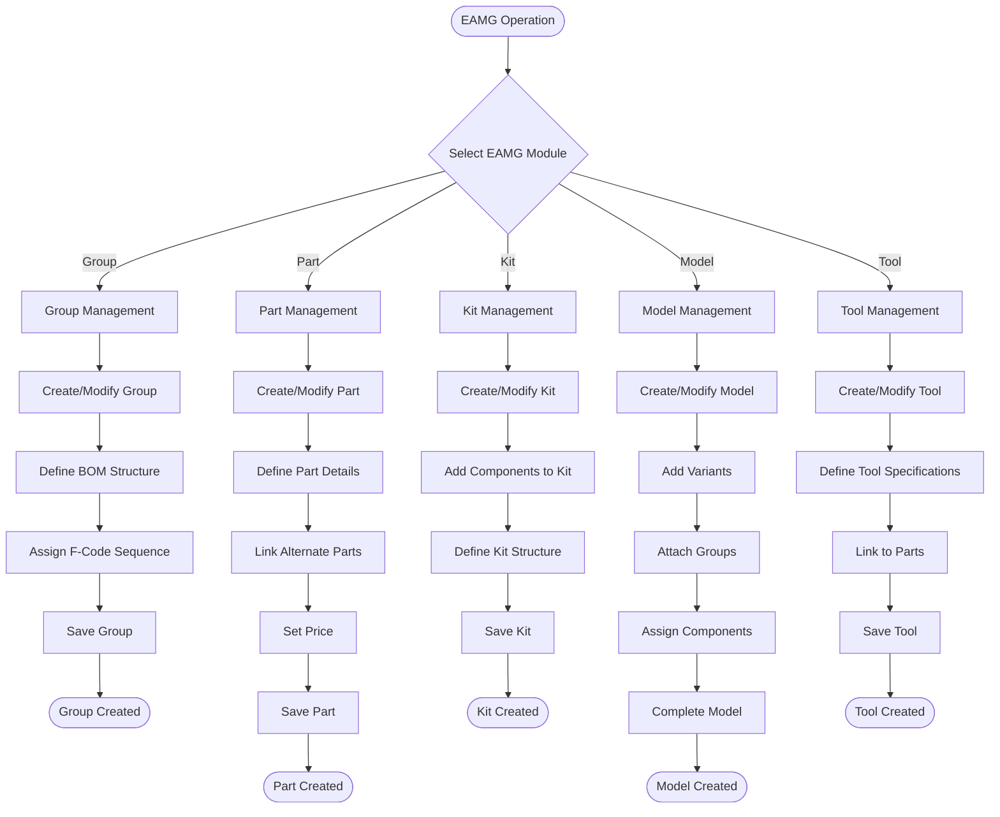

# ITLDIS Workflow Diagrams

## 1. User Authentication & Login Workflow

## 2. Service Management Workflow

## 3. Inventory Management Workflow

## 4. Installation Management Workflow

## 5. Warranty Claim Workflow

## 6. Purchase Order Workflow

## 7. Report Generation Workflow

## 8. SAP Integration Workflow

## 9. User Management Workflow

## 10. EAMG Module Workflow

