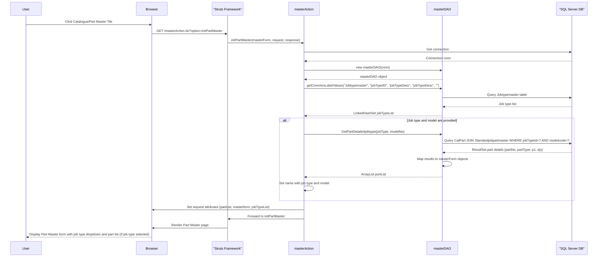
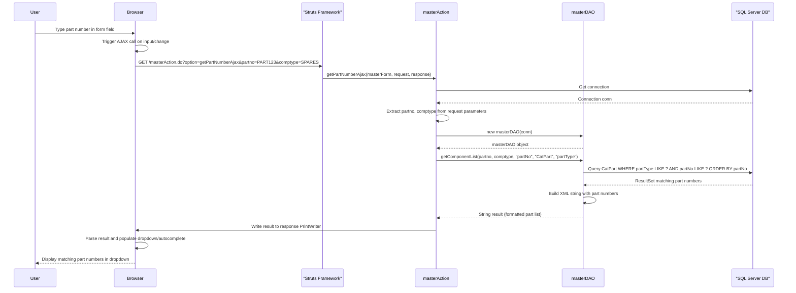
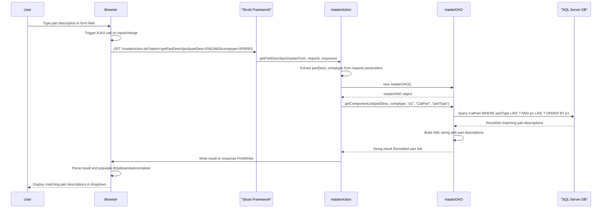
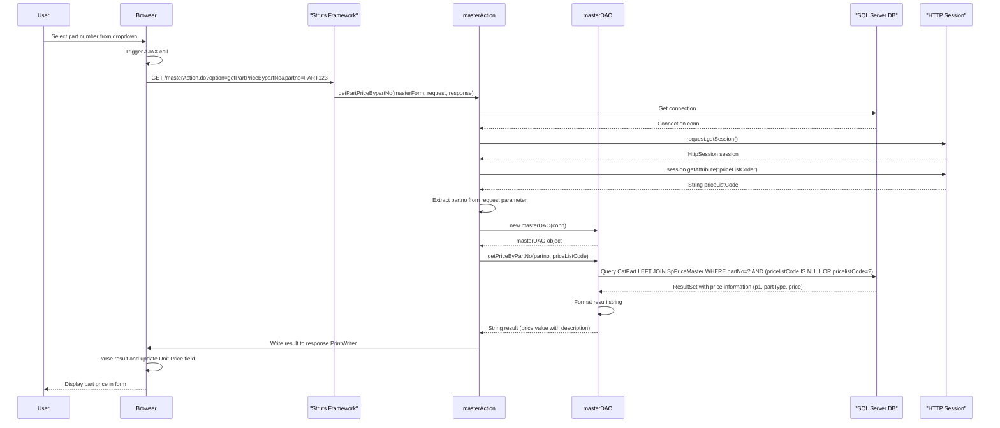
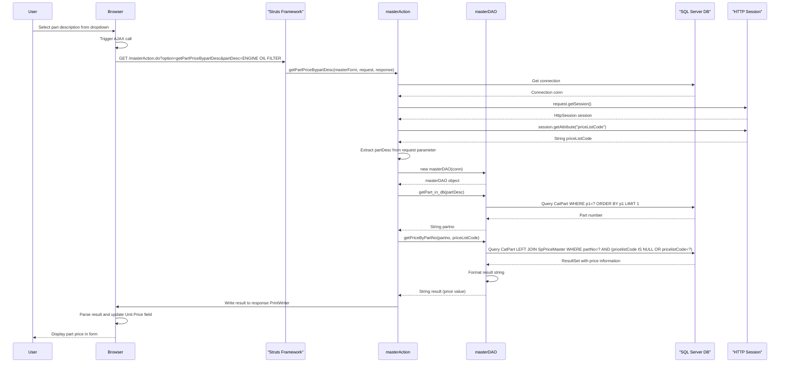
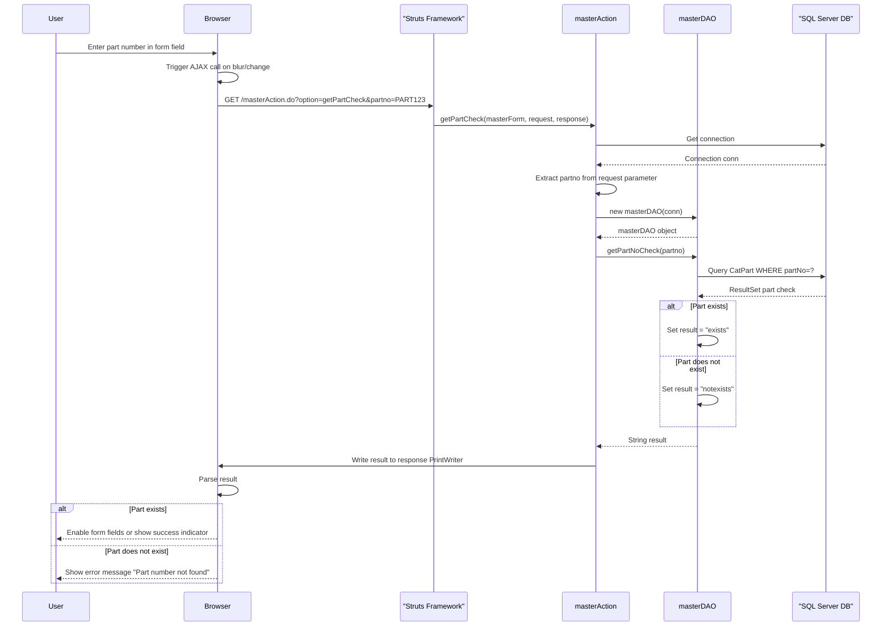
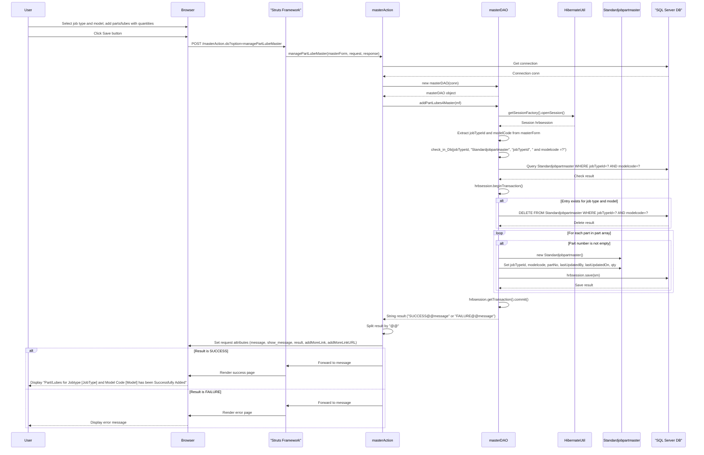
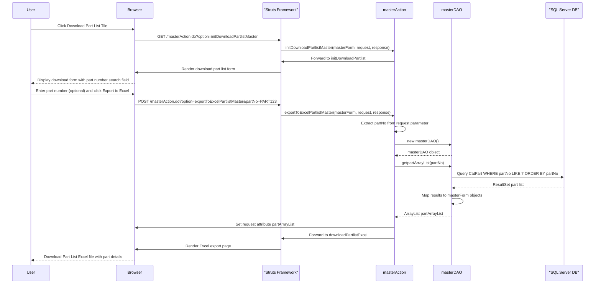
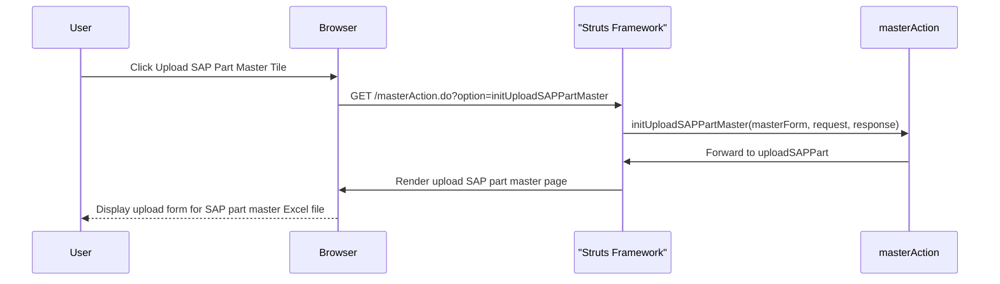

# Catalogue Module Sequence Diagrams

This document contains detailed sequence diagrams for all flows within the Catalogue Module of the ITLDIS system. The Catalogue module manages Part Master data, including parts and lubes cataloging, pricing, and standard job part assignments.

## Table of Contents

1. [Initialize Part Master Flow](#1-initialize-part-master-flow)
2. [Get Part Number by AJAX Flow](#2-get-part-number-by-ajax-flow)
3. [Get Part Description by AJAX Flow](#3-get-part-description-by-ajax-flow)
4. [Get Part Price by Part Number Flow (AJAX)](#4-get-part-price-by-part-number-flow-ajax)
5. [Get Part Price by Part Description Flow (AJAX)](#5-get-part-price-by-part-description-flow-ajax)
6. [Check Part Number Flow (AJAX)](#6-check-part-number-flow-ajax)
7. [Manage Part/Lube Master Flow](#7-manage-partlube-master-flow)
8. [Download Part List Master Flow](#8-download-part-list-master-flow)
9. [Upload SAP Part Master Flow](#9-upload-sap-part-master-flow)

---

## 1. Initialize Part Master Flow

This diagram shows the process of initializing the Part Master page with job types and part lists.

---

## 2. Get Part Number by AJAX Flow

This diagram shows the AJAX flow for retrieving part numbers based on partial input.

---

## 3. Get Part Description by AJAX Flow

This diagram shows the AJAX flow for retrieving part descriptions based on partial input.

---

## 4. Get Part Price by Part Number Flow (AJAX)

This diagram shows the AJAX flow for retrieving part price based on part number.

---

## 5. Get Part Price by Part Description Flow (AJAX)

This diagram shows the AJAX flow for retrieving part price based on part description.

---

## 6. Check Part Number Flow (AJAX)

This diagram shows the AJAX flow for validating if a part number exists in the system.

---

## 7. Manage Part/Lube Master Flow

This diagram shows the process of adding or updating parts/lubes for a job type and model.

---

## 8. Download Part List Master Flow

This diagram shows the process of downloading part list to Excel.

---

## 9. Upload SAP Part Master Flow

This diagram shows the process of initializing the SAP Part Master upload page.

---

## Summary

The Catalogue Module handles:

1. **Part Master Management**: Viewing and managing parts/lubes catalog with job type and model associations
2. **Part Lookup**: AJAX-based part number and description lookup with price retrieval
3. **Standard Job Part Assignment**: Associating parts/lubes with specific job types and models with quantities
4. **Part Price Management**: Retrieving part prices based on price list codes
5. **Part Validation**: Checking if part numbers exist in the catalog
6. **Part List Export**: Downloading part lists to Excel format
7. **SAP Integration**: Uploading part master data from SAP systems

All flows integrate with the SQL Server database through Hibernate ORM and JDBC connections. The module uses the `CatPart` table for part catalog data, `Standardjobpartmaster` for job type-part associations, and `SpPriceMaster` for pricing information. The module supports dealer-level operations with appropriate access controls based on user permissions.

