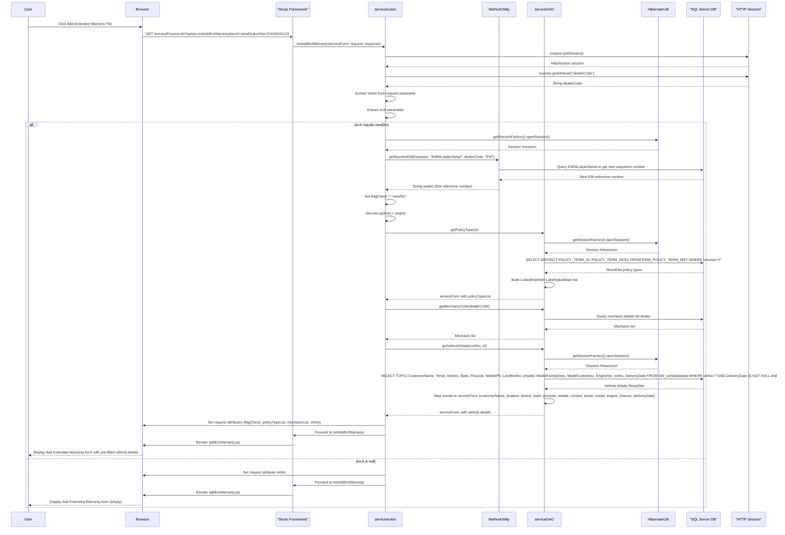
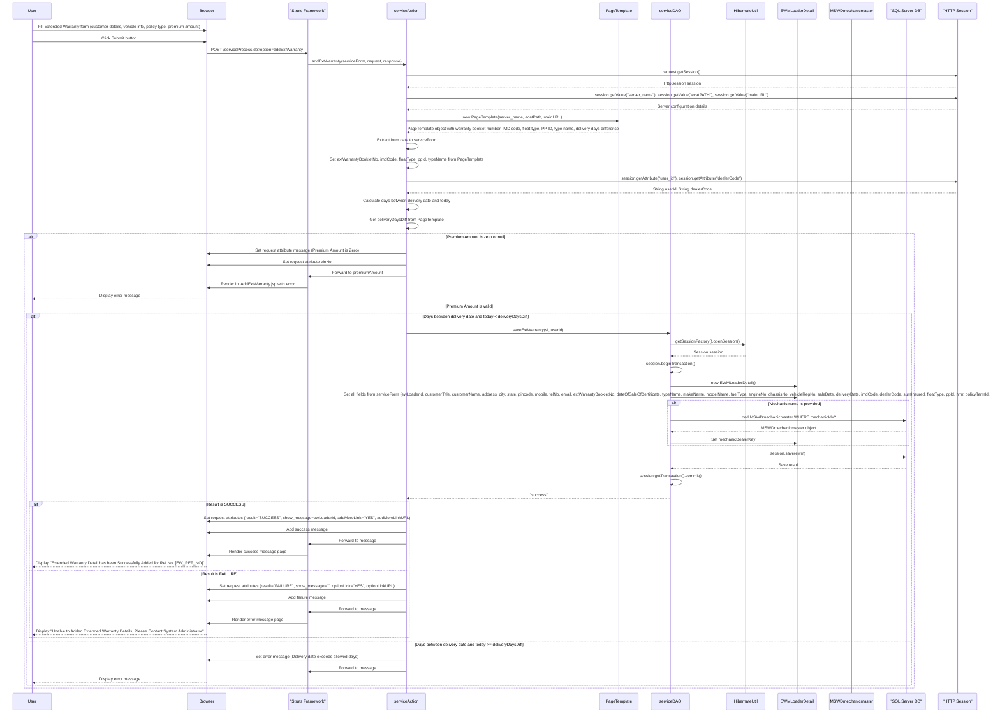
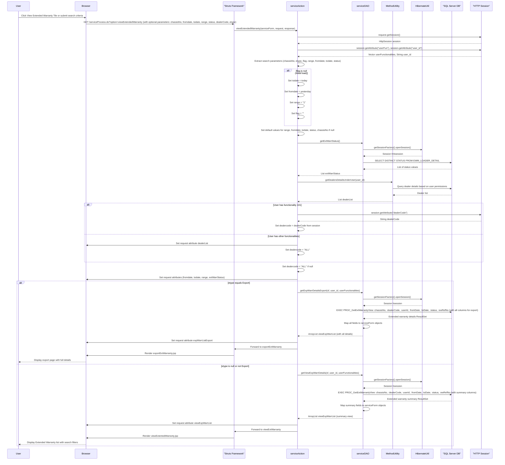
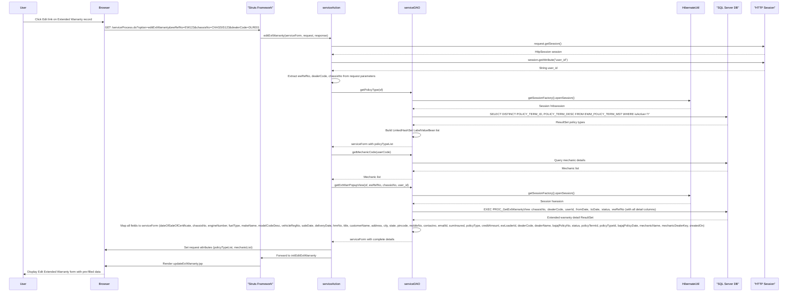
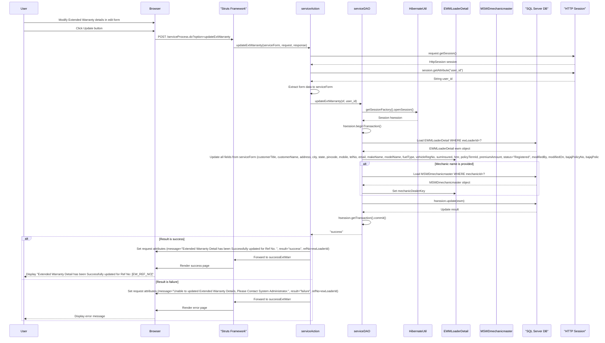
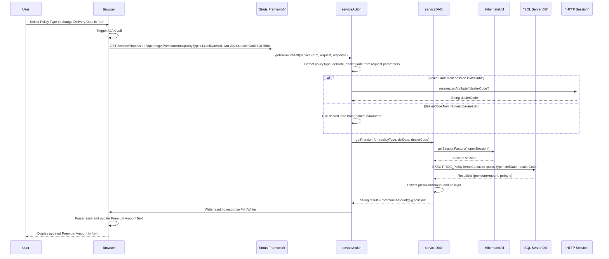
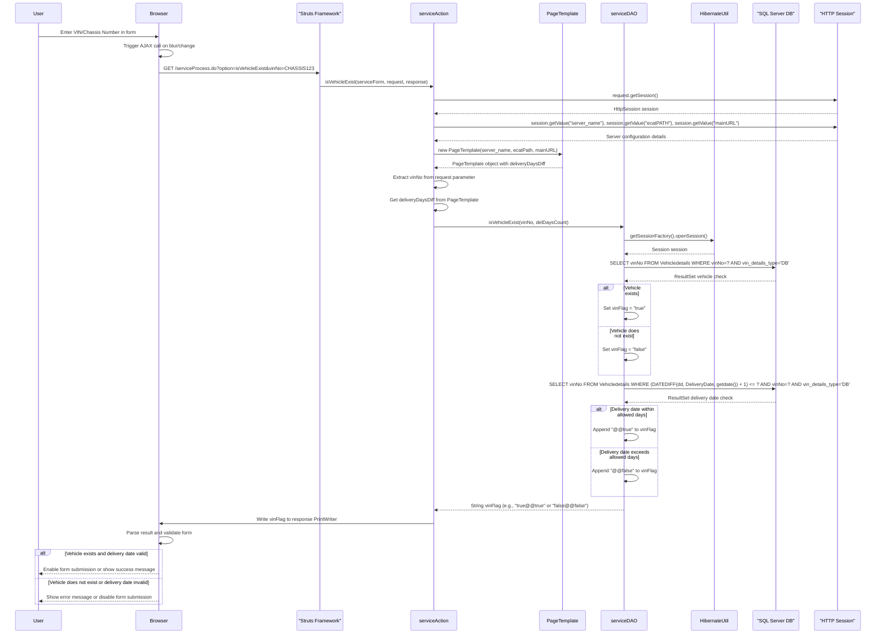
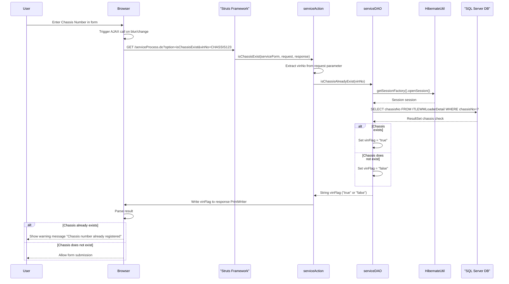
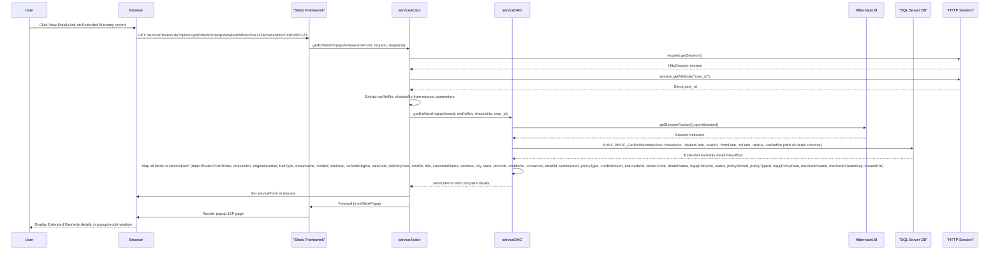
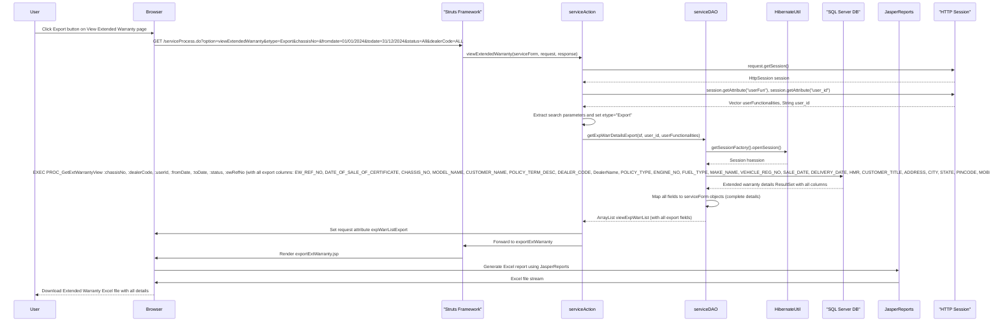

# Extended Warranty Registration Module Sequence Diagrams

This document contains detailed sequence diagrams for all flows within the Extended Warranty Registration (EXT WARRANTY REG) Module of the ITLDIS system.

## Table of Contents

1. [Initialize Add Extended Warranty Flow](#1-initialize-add-extended-warranty-flow)
2. [Add Extended Warranty Flow](#2-add-extended-warranty-flow)
3. [View Extended Warranty Flow](#3-view-extended-warranty-flow)
4. [Edit Extended Warranty Flow](#4-edit-extended-warranty-flow)
5. [Update Extended Warranty Flow](#5-update-extended-warranty-flow)
6. [Get Premium Amount Flow (AJAX)](#6-get-premium-amount-flow-ajax)
7. [Check Vehicle Existence Flow (AJAX)](#7-check-vehicle-existence-flow-ajax)
8. [Check Chassis Existence Flow (AJAX)](#8-check-chassis-existence-flow-ajax)
9. [Get Extended Warranty Popup View Flow](#9-get-extended-warranty-popup-view-flow)
10. [Export Extended Warranty Flow](#10-export-extended-warranty-flow)

---

## 1. Initialize Add Extended Warranty Flow

This diagram shows the initialization process when adding a new Extended Warranty registration.

---

## 2. Add Extended Warranty Flow

This diagram shows the complete process of saving a new Extended Warranty registration.

---

## 3. View Extended Warranty Flow

This diagram shows the process of viewing Extended Warranty registrations with search and filter capabilities.

---

## 4. Edit Extended Warranty Flow

This diagram shows the process of loading Extended Warranty details for editing.

---

## 5. Update Extended Warranty Flow

This diagram shows the process of updating an existing Extended Warranty registration.

---

## 6. Get Premium Amount Flow (AJAX)

This diagram shows the AJAX flow for calculating premium amount based on policy type and delivery date.

---

## 7. Check Vehicle Existence Flow (AJAX)

This diagram shows the AJAX flow for checking if a vehicle exists in the system.

---

## 8. Check Chassis Existence Flow (AJAX)

This diagram shows the AJAX flow for checking if a chassis number already exists in Extended Warranty records.

---

## 9. Get Extended Warranty Popup View Flow

This diagram shows the flow for displaying Extended Warranty details in a popup view.

---

## 10. Export Extended Warranty Flow

This diagram shows the flow for exporting Extended Warranty data to Excel format.

---

## Summary

The Extended Warranty Registration Module handles:

1. **Registration Management**: Adding new Extended Warranty registrations with vehicle and customer details
2. **View and Search**: Viewing Extended Warranty records with search filters (chassis number, date range, status, dealer)
3. **Edit and Update**: Modifying existing Extended Warranty registrations
4. **Validation**: AJAX-based validation for vehicle existence, chassis uniqueness, and premium calculation
5. **Export**: Exporting Extended Warranty data to Excel format with complete details
6. **Policy Management**: Integration with policy types and premium calculation based on delivery date
7. **Mechanic Assignment**: Associating mechanics with Extended Warranty registrations

All flows integrate with the SQL Server database through Hibernate ORM and use stored procedures for complex queries. The module supports both regular Extended Warranty and ITL Extended Warranty registrations.

