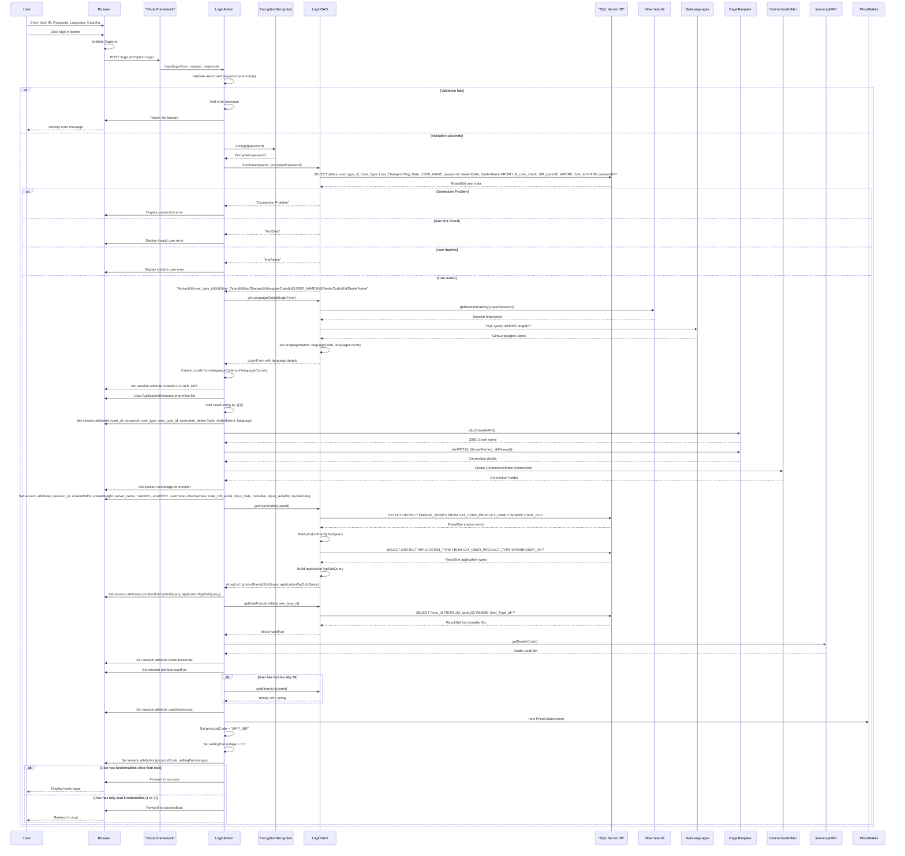
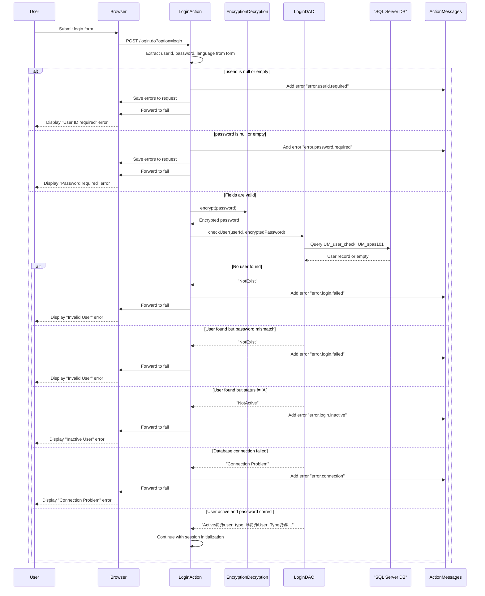
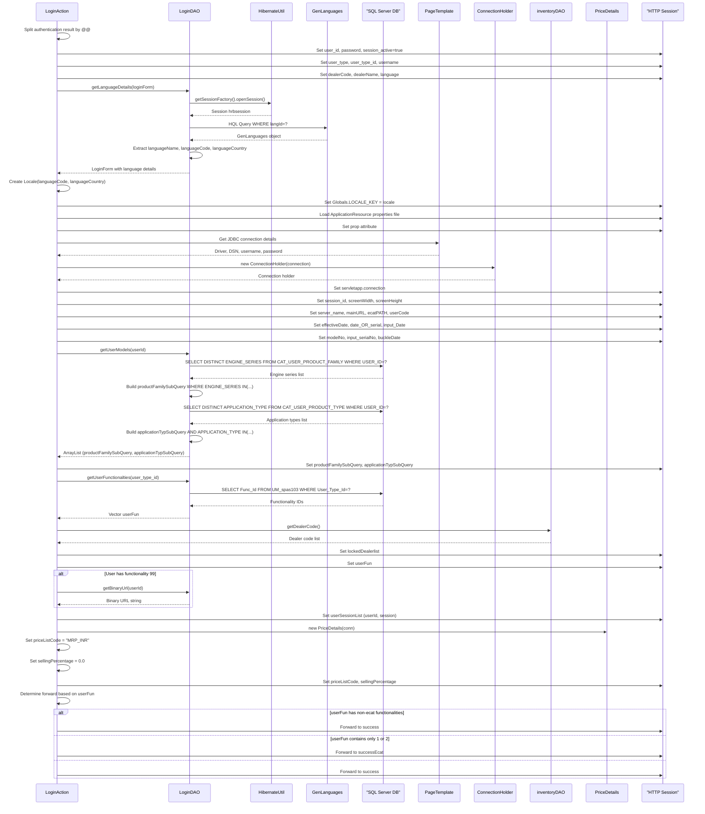
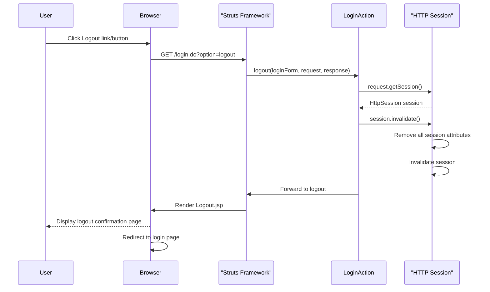
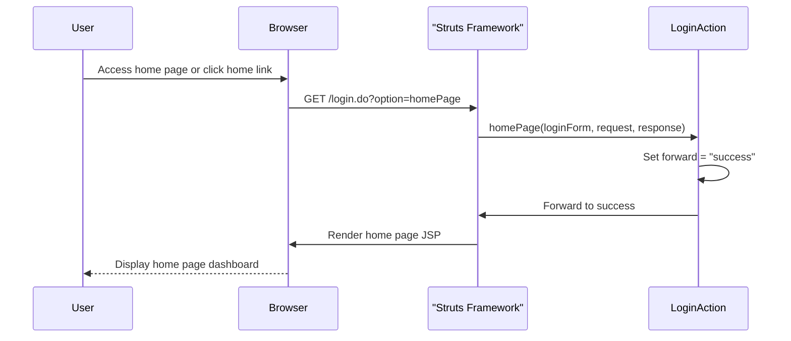
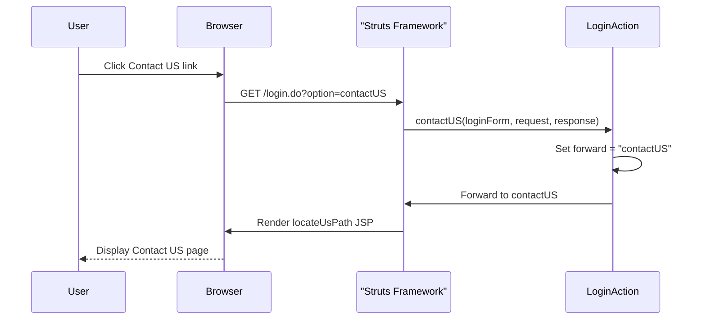
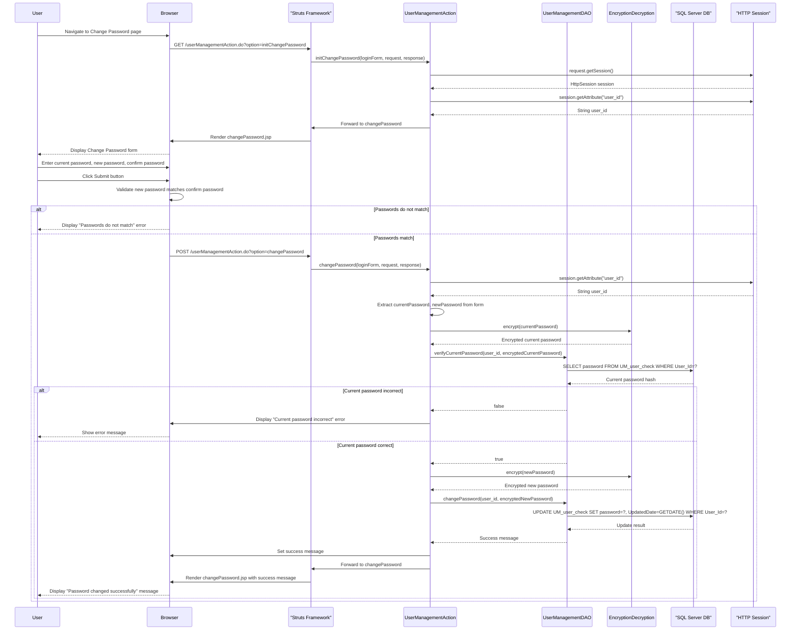

# Login Module Sequence Diagrams

This document contains detailed sequence diagrams for all flows within the Login Module of the ITLDIS system.

## Table of Contents

1. [Main Login Flow](#1-main-login-flow)
2. [Login Validation Flow](#2-login-validation-flow)
3. [Session Initialization Flow](#3-session-initialization-flow)
4. [Logout Flow](#4-logout-flow)
5. [Home Page Flow](#5-home-page-flow)
6. [Contact US Flow](#6-contact-us-flow)
7. [Change Password Flow](#7-change-password-flow)

---

## 1. Main Login Flow

This diagram shows the complete login process including authentication, session setup, language configuration, user models, and functionality loading.

---

## 2. Login Validation Flow

This diagram shows the detailed validation process including field validation, password encryption, and error handling.

---

## 3. Session Initialization Flow

This diagram shows the detailed session initialization process after successful authentication.

---

## 4. Logout Flow

This diagram shows the logout process which invalidates the user session.

---

## 5. Home Page Flow

This diagram shows the flow when accessing the home page after login.

---

## 6. Contact US Flow

This diagram shows the flow when accessing the Contact US page.

---

## 7. Change Password Flow

This diagram shows the password change flow from the User Management module.

---

## Summary

The Login Module handles:

1. **Authentication**: User validation, password encryption, and credential verification
2. **Session Management**: Comprehensive session initialization with user details, language, models, functionalities, and connection setup
3. **Authorization**: Loading user functionalities and permissions based on user type
4. **Localization**: Language selection and resource bundle loading
5. **Logout**: Session invalidation and cleanup
6. **Password Management**: Password change functionality with current password verification

All flows integrate with the SQL Server database through DAO classes and use Hibernate for ORM operations where applicable.

