# Masters Module Sequence Diagrams

This document contains detailed sequence diagrams for all flows within the Masters Module of the ITLDIS system. The Masters module manages various master data including Job Types, Service Types, Mechanics, Bays, Wages, Aggregates, Complaint Codes, Causal Codes, Applications, Bills, Consequences, Contents, SubContents, SubAssemblies, SubAggregates, Rejection Codes, Vendor Codes, and Form Check Lists.

## Table of Contents

1. [Generic Master CRUD Flow](#1-generic-master-crud-flow)
2. [Job Type Master Flow](#2-job-type-master-flow)
3. [Service Type Master Flow](#3-service-type-master-flow)
4. [Mechanic Master Flow](#4-mechanic-master-flow)
5. [Bay Master Flow](#5-bay-master-flow)
6. [Wage Master Flow](#6-wage-master-flow)
7. [Aggregate Master Flow](#7-aggregate-master-flow)
8. [Complaint Code Master Flow](#8-complaint-code-master-flow)
9. [Causal Code Master Flow](#9-causal-code-master-flow)
10. [Application Master Flow](#10-application-master-flow)
11. [Bill Master Flow](#11-bill-master-flow)
12. [Consequence Master Flow](#12-consequence-master-flow)
13. [Content Master Flow](#13-content-master-flow)
14. [SubContent Master Flow](#14-subcontent-master-flow)
15. [SubAssembly Master Flow](#15-subassembly-master-flow)
16. [SubAggregate Master Flow](#16-subaggregate-master-flow)
17. [Rejection Code Master Flow](#17-rejection-code-master-flow)
18. [Vendor Code Master Flow](#18-vendor-code-master-flow)
19. [Form Check List Master Flow](#19-form-check-list-master-flow)

---

## 1. Generic Master CRUD Flow

This diagram shows the generic CRUD (Create, Read, Update, Delete) pattern used by most master types.

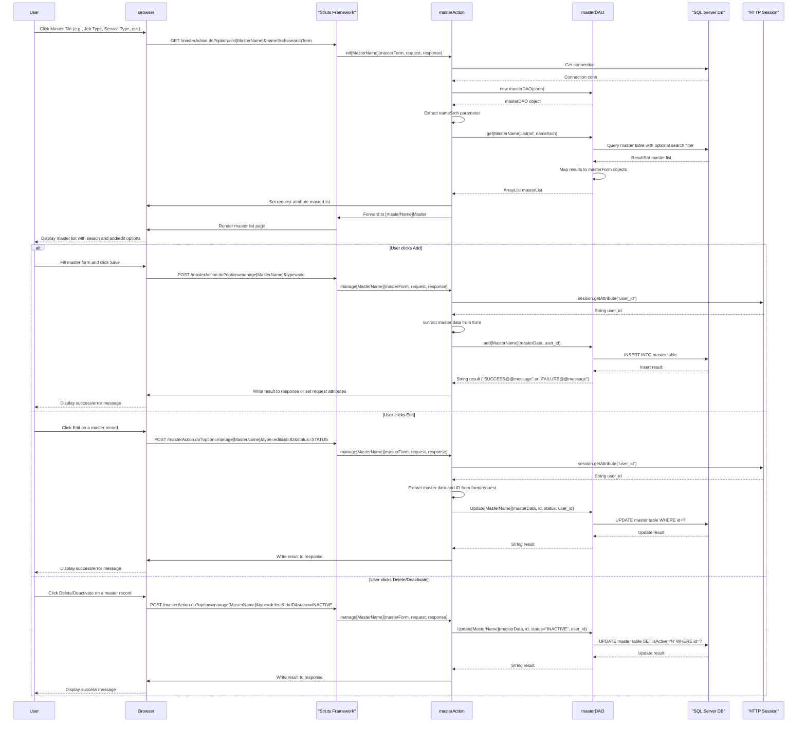
```mermaid
sequenceDiagram
    participant User
    participant Browser
    participant StrutsFramework as "Struts Framework"
    participant MasterAction as masterAction
    participant MasterDAO as masterDAO
    participant Database as "SQL Server DB"
    participant HTTPSession as "HTTP Session"

    User->>Browser: Click Master Tile (e.g., Job Type, Service Type, etc.)
    Browser->>StrutsFramework: GET /masterAction.do?option=init[MasterName]&nameSrch=searchTerm
    StrutsFramework->>MasterAction: init[MasterName](masterForm, request, response)
    
    MasterAction->>Database: Get connection
    Database-->>MasterAction: Connection conn
    
    MasterAction->>MasterDAO: new masterDAO(conn)
    MasterDAO-->>MasterAction: masterDAO object
    
    MasterAction->>MasterAction: Extract nameSrch parameter
    
    MasterAction->>MasterDAO: get[MasterName]List(mf, nameSrch)
    MasterDAO->>Database: Query master table with optional search filter
    Database-->>MasterDAO: ResultSet master list
    MasterDAO->>MasterDAO: Map results to masterForm objects
    MasterDAO-->>MasterAction: ArrayList masterList
    
    MasterAction->>Browser: Set request attribute masterList
    MasterAction->>StrutsFramework: Forward to [masterName]Master
    StrutsFramework->>Browser: Render master list page
    Browser-->>User: Display master list with search and add/edit options
    
    alt User clicks Add
        User->>Browser: Fill master form and click Save
        Browser->>StrutsFramework: POST /masterAction.do?option=manage[MasterName]&type=add
        StrutsFramework->>MasterAction: manage[MasterName](masterForm, request, response)
        
        MasterAction->>HTTPSession: session.getAttribute("user_id")
        HTTPSession-->>MasterAction: String user_id
        
        MasterAction->>MasterAction: Extract master data from form
        MasterAction->>MasterDAO: add[MasterName](masterData, user_id)
        MasterDAO->>Database: INSERT INTO master table
        Database-->>MasterDAO: Insert result
        MasterDAO-->>MasterAction: String result ("SUCCESS@@message" or "FAILURE@@message")
        
        MasterAction->>Browser: Write result to response or set request attributes
        Browser-->>User: Display success/error message
    else User clicks Edit
        User->>Browser: Click Edit on a master record
        Browser->>StrutsFramework: POST /masterAction.do?option=manage[MasterName]&type=edit&id=ID&status=STATUS
        StrutsFramework->>MasterAction: manage[MasterName](masterForm, request, response)
        
        MasterAction->>HTTPSession: session.getAttribute("user_id")
        HTTPSession-->>MasterAction: String user_id
        
        MasterAction->>MasterAction: Extract master data and ID from form/request
        MasterAction->>MasterDAO: Update[MasterName](masterData, id, status, user_id)
        MasterDAO->>Database: UPDATE master table WHERE id=?
        Database-->>MasterDAO: Update result
        MasterDAO-->>MasterAction: String result
        
        MasterAction->>Browser: Write result to response
        Browser-->>User: Display success/error message
    else User clicks Delete/Deactivate
        User->>Browser: Click Delete/Deactivate on a master record
        Browser->>StrutsFramework: POST /masterAction.do?option=manage[MasterName]&type=delete&id=ID&status=INACTIVE
        StrutsFramework->>MasterAction: manage[MasterName](masterForm, request, response)
        
        MasterAction->>MasterDAO: Update[MasterName](masterData, id, status="INACTIVE", user_id)
        MasterDAO->>Database: UPDATE master table SET isActive='N' WHERE id=?
        Database-->>MasterDAO: Update result
        MasterDAO-->>MasterAction: String result
        
        MasterAction->>Browser: Write result to response
        Browser-->>User: Display success message
    end
```

---

## 2. Job Type Master Flow

This diagram shows the Job Type Master management flow.

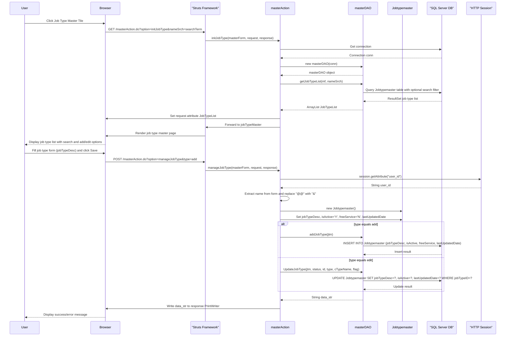
```mermaid
sequenceDiagram
    participant User
    participant Browser
    participant StrutsFramework as "Struts Framework"
    participant MasterAction as masterAction
    participant MasterDAO as masterDAO
    participant Jobtypemaster as Jobtypemaster
    participant Database as "SQL Server DB"
    participant HTTPSession as "HTTP Session"

    User->>Browser: Click Job Type Master Tile
    Browser->>StrutsFramework: GET /masterAction.do?option=initJobType&nameSrch=searchTerm
    StrutsFramework->>MasterAction: initJobType(masterForm, request, response)
    
    MasterAction->>Database: Get connection
    Database-->>MasterAction: Connection conn
    
    MasterAction->>MasterDAO: new masterDAO(conn)
    MasterDAO-->>MasterAction: masterDAO object
    
    MasterAction->>MasterDAO: getJobTypeList(mf, nameSrch)
    MasterDAO->>Database: Query Jobtypemaster table with optional search filter
    Database-->>MasterDAO: ResultSet job type list
    MasterDAO-->>MasterAction: ArrayList JobTypeList
    
    MasterAction->>Browser: Set request attribute JobTypeList
    MasterAction->>StrutsFramework: Forward to jobTypeMaster
    StrutsFramework->>Browser: Render job type master page
    Browser-->>User: Display job type list with search and add/edit options
    
    User->>Browser: Fill job type form (jobTypeDesc) and click Save
    Browser->>StrutsFramework: POST /masterAction.do?option=manageJobType&type=add
    StrutsFramework->>MasterAction: manageJobType(masterForm, request, response)
    
    MasterAction->>HTTPSession: session.getAttribute("user_id")
    HTTPSession-->>MasterAction: String user_id
    
    MasterAction->>MasterAction: Extract name from form and replace "@@" with "&"
    MasterAction->>Jobtypemaster: new Jobtypemaster()
    MasterAction->>Jobtypemaster: Set jobTypeDesc, isActive='Y', freeService='N', lastUpdatedDate
    
    alt type equals add
        MasterAction->>MasterDAO: addJobType(jtm)
        MasterDAO->>Database: INSERT INTO Jobtypemaster (jobTypeDesc, isActive, freeService, lastUpdatedDate)
        Database-->>MasterDAO: Insert result
    else type equals edit
        MasterAction->>MasterDAO: UpdateJobType(jtm, status, id, type, cTypeName, flag)
        MasterDAO->>Database: UPDATE Jobtypemaster SET jobTypeDesc=?, isActive=?, lastUpdatedDate=? WHERE jobTypeID=?
        Database-->>MasterDAO: Update result
    end
    
    MasterDAO-->>MasterAction: String data_str
    
    MasterAction->>Browser: Write data_str to response PrintWriter
    Browser-->>User: Display success/error message
```

---

## 3. Service Type Master Flow

This diagram shows the Service Type Master management flow.

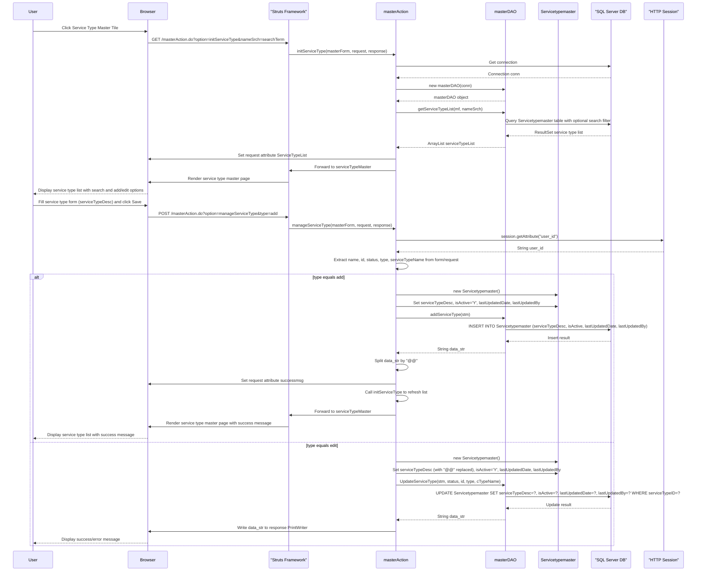
```mermaid
sequenceDiagram
    participant User
    participant Browser
    participant StrutsFramework as "Struts Framework"
    participant MasterAction as masterAction
    participant MasterDAO as masterDAO
    participant Servicetypemaster as Servicetypemaster
    participant Database as "SQL Server DB"
    participant HTTPSession as "HTTP Session"

    User->>Browser: Click Service Type Master Tile
    Browser->>StrutsFramework: GET /masterAction.do?option=initServiceType&nameSrch=searchTerm
    StrutsFramework->>MasterAction: initServiceType(masterForm, request, response)
    
    MasterAction->>Database: Get connection
    Database-->>MasterAction: Connection conn
    
    MasterAction->>MasterDAO: new masterDAO(conn)
    MasterDAO-->>MasterAction: masterDAO object
    
    MasterAction->>MasterDAO: getServiceTypeList(mf, nameSrch)
    MasterDAO->>Database: Query Servicetypemaster table with optional search filter
    Database-->>MasterDAO: ResultSet service type list
    MasterDAO-->>MasterAction: ArrayList serviceTypeList
    
    MasterAction->>Browser: Set request attribute ServiceTypeList
    MasterAction->>StrutsFramework: Forward to serviceTypeMaster
    StrutsFramework->>Browser: Render service type master page
    Browser-->>User: Display service type list with search and add/edit options
    
    User->>Browser: Fill service type form (serviceTypeDesc) and click Save
    Browser->>StrutsFramework: POST /masterAction.do?option=manageServiceType&type=add
    StrutsFramework->>MasterAction: manageServiceType(masterForm, request, response)
    
    MasterAction->>HTTPSession: session.getAttribute("user_id")
    HTTPSession-->>MasterAction: String user_id
    
    MasterAction->>MasterAction: Extract name, id, status, type, serviceTypeName from form/request
    
    alt type equals add
        MasterAction->>Servicetypemaster: new Servicetypemaster()
        MasterAction->>Servicetypemaster: Set serviceTypeDesc, isActive='Y', lastUpdatedDate, lastUpdatedBy
        MasterAction->>MasterDAO: addServiceType(stm)
        MasterDAO->>Database: INSERT INTO Servicetypemaster (serviceTypeDesc, isActive, lastUpdatedDate, lastUpdatedBy)
        Database-->>MasterDAO: Insert result
        MasterDAO-->>MasterAction: String data_str
        MasterAction->>MasterAction: Split data_str by "@@"
        MasterAction->>Browser: Set request attribute successmsg
        MasterAction->>MasterAction: Call initServiceType to refresh list
        MasterAction->>StrutsFramework: Forward to serviceTypeMaster
        StrutsFramework->>Browser: Render service type master page with success message
        Browser-->>User: Display service type list with success message
    else type equals edit
        MasterAction->>Servicetypemaster: new Servicetypemaster()
        MasterAction->>Servicetypemaster: Set serviceTypeDesc (with "@@" replaced), isActive='Y', lastUpdatedDate, lastUpdatedBy
        MasterAction->>MasterDAO: UpdateServiceType(stm, status, id, type, cTypeName)
        MasterDAO->>Database: UPDATE Servicetypemaster SET serviceTypeDesc=?, isActive=?, lastUpdatedDate=?, lastUpdatedBy=? WHERE serviceTypeID=?
        Database-->>MasterDAO: Update result
        MasterDAO-->>MasterAction: String data_str
        MasterAction->>Browser: Write data_str to response PrintWriter
        Browser-->>User: Display success/error message
    end
```

---

## 4. Mechanic Master Flow

This diagram shows the Mechanic Master management flow with dealer code association.

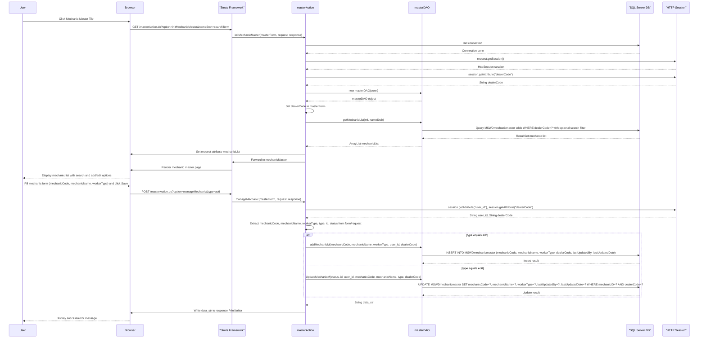
```mermaid
sequenceDiagram
    participant User
    participant Browser
    participant StrutsFramework as "Struts Framework"
    participant MasterAction as masterAction
    participant MasterDAO as masterDAO
    participant Database as "SQL Server DB"
    participant HTTPSession as "HTTP Session"

    User->>Browser: Click Mechanic Master Tile
    Browser->>StrutsFramework: GET /masterAction.do?option=initMechanicMaster&nameSrch=searchTerm
    StrutsFramework->>MasterAction: initMechanicMaster(masterForm, request, response)
    
    MasterAction->>Database: Get connection
    Database-->>MasterAction: Connection conn
    
    MasterAction->>HTTPSession: request.getSession()
    HTTPSession-->>MasterAction: HttpSession session
    
    MasterAction->>HTTPSession: session.getAttribute("dealerCode")
    HTTPSession-->>MasterAction: String dealerCode
    
    MasterAction->>MasterDAO: new masterDAO(conn)
    MasterDAO-->>MasterAction: masterDAO object
    
    MasterAction->>MasterAction: Set dealerCode in masterForm
    MasterAction->>MasterDAO: getMechanicList(mf, nameSrch)
    MasterDAO->>Database: Query MSWDmechanicmaster table WHERE dealerCode=? with optional search filter
    Database-->>MasterDAO: ResultSet mechanic list
    MasterDAO-->>MasterAction: ArrayList mechanicList
    
    MasterAction->>Browser: Set request attribute mechanicList
    MasterAction->>StrutsFramework: Forward to mechanicMaster
    StrutsFramework->>Browser: Render mechanic master page
    Browser-->>User: Display mechanic list with search and add/edit options
    
    User->>Browser: Fill mechanic form (mechanicCode, mechanicName, workerType) and click Save
    Browser->>StrutsFramework: POST /masterAction.do?option=manageMechanic&type=add
    StrutsFramework->>MasterAction: manageMechanic(masterForm, request, response)
    
    MasterAction->>HTTPSession: session.getAttribute("user_id"), session.getAttribute("dealerCode")
    HTTPSession-->>MasterAction: String user_id, String dealerCode
    
    MasterAction->>MasterAction: Extract mechanicCode, mechanicName, workerType, type, id, status from form/request
    
    alt type equals add
        MasterAction->>MasterDAO: addMechanicM(mechanicCode, mechanicName, workerType, user_id, dealerCode)
        MasterDAO->>Database: INSERT INTO MSWDmechanicmaster (mechanicCode, mechanicName, workerType, dealerCode, lastUpdatedBy, lastUpdatedDate)
        Database-->>MasterDAO: Insert result
    else type equals edit
        MasterAction->>MasterDAO: UpdateMechanicM(status, id, user_id, mechanicCode, mechanicName, type, dealerCode)
        MasterDAO->>Database: UPDATE MSWDmechanicmaster SET mechanicCode=?, mechanicName=?, workerType=?, lastUpdatedBy=?, lastUpdatedDate=? WHERE mechanicID=? AND dealerCode=?
        Database-->>MasterDAO: Update result
    end
    
    MasterDAO-->>MasterAction: String data_str
    
    MasterAction->>Browser: Write data_str to response PrintWriter
    Browser-->>User: Display success/error message
```

---

## 5. Bay Master Flow

This diagram shows the Bay Master management flow.

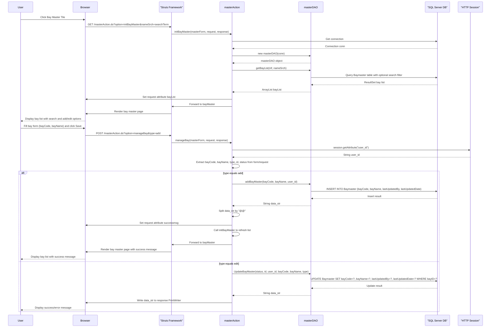
```mermaid
sequenceDiagram
    participant User
    participant Browser
    participant StrutsFramework as "Struts Framework"
    participant MasterAction as masterAction
    participant MasterDAO as masterDAO
    participant Database as "SQL Server DB"
    participant HTTPSession as "HTTP Session"

    User->>Browser: Click Bay Master Tile
    Browser->>StrutsFramework: GET /masterAction.do?option=initBayMaster&nameSrch=searchTerm
    StrutsFramework->>MasterAction: initBayMaster(masterForm, request, response)
    
    MasterAction->>Database: Get connection
    Database-->>MasterAction: Connection conn
    
    MasterAction->>MasterDAO: new masterDAO(conn)
    MasterDAO-->>MasterAction: masterDAO object
    
    MasterAction->>MasterDAO: getBayList(mf, nameSrch)
    MasterDAO->>Database: Query Baymaster table with optional search filter
    Database-->>MasterDAO: ResultSet bay list
    MasterDAO-->>MasterAction: ArrayList bayList
    
    MasterAction->>Browser: Set request attribute bayList
    MasterAction->>StrutsFramework: Forward to bayMaster
    StrutsFramework->>Browser: Render bay master page
    Browser-->>User: Display bay list with search and add/edit options
    
    User->>Browser: Fill bay form (bayCode, bayName) and click Save
    Browser->>StrutsFramework: POST /masterAction.do?option=manageBay&type=add
    StrutsFramework->>MasterAction: manageBay(masterForm, request, response)
    
    MasterAction->>HTTPSession: session.getAttribute("user_id")
    HTTPSession-->>MasterAction: String user_id
    
    MasterAction->>MasterAction: Extract bayCode, bayName, type, id, status from form/request
    
    alt type equals add
        MasterAction->>MasterDAO: addBayMaster(bayCode, bayName, user_id)
        MasterDAO->>Database: INSERT INTO Baymaster (bayCode, bayName, lastUpdatedBy, lastUpdatedDate)
        Database-->>MasterDAO: Insert result
        MasterDAO-->>MasterAction: String data_str
        MasterAction->>MasterAction: Split data_str by "@@"
        MasterAction->>Browser: Set request attribute successmsg
        MasterAction->>MasterAction: Call initBayMaster to refresh list
        MasterAction->>StrutsFramework: Forward to bayMaster
        StrutsFramework->>Browser: Render bay master page with success message
        Browser-->>User: Display bay list with success message
    else type equals edit
        MasterAction->>MasterDAO: UpdateBayMaster(status, id, user_id, bayCode, bayName, type)
        MasterDAO->>Database: UPDATE Baymaster SET bayCode=?, bayName=?, lastUpdatedBy=?, lastUpdatedDate=? WHERE bayID=?
        Database-->>MasterDAO: Update result
        MasterDAO-->>MasterAction: String data_str
        MasterAction->>Browser: Write data_str to response PrintWriter
        Browser-->>User: Display success/error message
    end
```

---

## 6. Wage Master Flow

This diagram shows the Wage Master management flow with dealer code association.

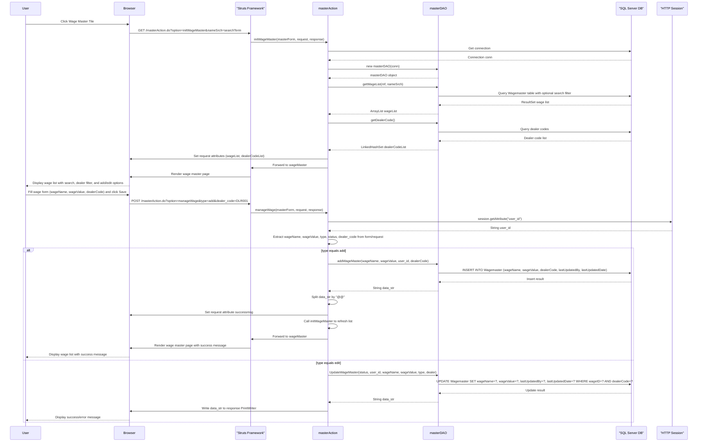
```mermaid
sequenceDiagram
    participant User
    participant Browser
    participant StrutsFramework as "Struts Framework"
    participant MasterAction as masterAction
    participant MasterDAO as masterDAO
    participant Database as "SQL Server DB"
    participant HTTPSession as "HTTP Session"

    User->>Browser: Click Wage Master Tile
    Browser->>StrutsFramework: GET /masterAction.do?option=initWageMaster&nameSrch=searchTerm
    StrutsFramework->>MasterAction: initWageMaster(masterForm, request, response)
    
    MasterAction->>Database: Get connection
    Database-->>MasterAction: Connection conn
    
    MasterAction->>MasterDAO: new masterDAO(conn)
    MasterDAO-->>MasterAction: masterDAO object
    
    MasterAction->>MasterDAO: getWageList(mf, nameSrch)
    MasterDAO->>Database: Query Wagemaster table with optional search filter
    Database-->>MasterDAO: ResultSet wage list
    MasterDAO-->>MasterAction: ArrayList wageList
    
    MasterAction->>MasterDAO: getDealerCode()
    MasterDAO->>Database: Query dealer codes
    Database-->>MasterDAO: Dealer code list
    MasterDAO-->>MasterAction: LinkedHashSet dealerCodeList
    
    MasterAction->>Browser: Set request attributes (wageList, dealerCodeList)
    MasterAction->>StrutsFramework: Forward to wageMaster
    StrutsFramework->>Browser: Render wage master page
    Browser-->>User: Display wage list with search, dealer filter, and add/edit options
    
    User->>Browser: Fill wage form (wageName, wageValue, dealerCode) and click Save
    Browser->>StrutsFramework: POST /masterAction.do?option=manageWage&type=add&dealer_code=DLR001
    StrutsFramework->>MasterAction: manageWage(masterForm, request, response)
    
    MasterAction->>HTTPSession: session.getAttribute("user_id")
    HTTPSession-->>MasterAction: String user_id
    
    MasterAction->>MasterAction: Extract wageName, wageValue, type, status, dealer_code from form/request
    
    alt type equals add
        MasterAction->>MasterDAO: addWageMaster(wageName, wageValue, user_id, dealerCode)
        MasterDAO->>Database: INSERT INTO Wagemaster (wageName, wageValue, dealerCode, lastUpdatedBy, lastUpdatedDate)
        Database-->>MasterDAO: Insert result
        MasterDAO-->>MasterAction: String data_str
        MasterAction->>MasterAction: Split data_str by "@@"
        MasterAction->>Browser: Set request attribute successmsg
        MasterAction->>MasterAction: Call initWageMaster to refresh list
        MasterAction->>StrutsFramework: Forward to wageMaster
        StrutsFramework->>Browser: Render wage master page with success message
        Browser-->>User: Display wage list with success message
    else type equals edit
        MasterAction->>MasterDAO: UpdateWageMaster(status, user_id, wageName, wageValue, type, dealer)
        MasterDAO->>Database: UPDATE Wagemaster SET wageName=?, wageValue=?, lastUpdatedBy=?, lastUpdatedDate=? WHERE wageID=? AND dealerCode=?
        Database-->>MasterDAO: Update result
        MasterDAO-->>MasterAction: String data_str
        MasterAction->>Browser: Write data_str to response PrintWriter
        Browser-->>User: Display success/error message
    end
```

---

## 7. Aggregate Master Flow

This diagram shows the Aggregate Master management flow with code validation.

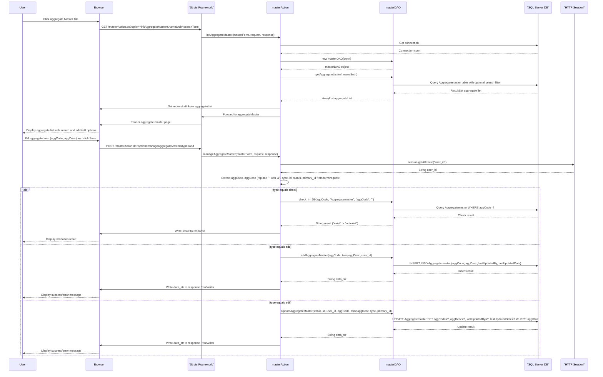
```mermaid
sequenceDiagram
    participant User
    participant Browser
    participant StrutsFramework as "Struts Framework"
    participant MasterAction as masterAction
    participant MasterDAO as masterDAO
    participant Database as "SQL Server DB"
    participant HTTPSession as "HTTP Session"

    User->>Browser: Click Aggregate Master Tile
    Browser->>StrutsFramework: GET /masterAction.do?option=initAggregateMaster&nameSrch=searchTerm
    StrutsFramework->>MasterAction: initAggregateMaster(masterForm, request, response)
    
    MasterAction->>Database: Get connection
    Database-->>MasterAction: Connection conn
    
    MasterAction->>MasterDAO: new masterDAO(conn)
    MasterDAO-->>MasterAction: masterDAO object
    
    MasterAction->>MasterDAO: getAggregateList(mf, nameSrch)
    MasterDAO->>Database: Query Aggregatemaster table with optional search filter
    Database-->>MasterDAO: ResultSet aggregate list
    MasterDAO-->>MasterAction: ArrayList aggregateList
    
    MasterAction->>Browser: Set request attribute aggregateList
    MasterAction->>StrutsFramework: Forward to aggregateMaster
    StrutsFramework->>Browser: Render aggregate master page
    Browser-->>User: Display aggregate list with search and add/edit options
    
    User->>Browser: Fill aggregate form (aggCode, aggDesc) and click Save
    Browser->>StrutsFramework: POST /masterAction.do?option=manageAggregateMaster&type=add
    StrutsFramework->>MasterAction: manageAggregateMaster(masterForm, request, response)
    
    MasterAction->>HTTPSession: session.getAttribute("user_id")
    HTTPSession-->>MasterAction: String user_id
    
    MasterAction->>MasterAction: Extract aggCode, aggDesc (replace '`' with '&'), type, id, status, primary_id from form/request
    
    alt type equals check
        MasterAction->>MasterDAO: check_in_Db(aggCode, "Aggregatemaster", "aggCode", "")
        MasterDAO->>Database: Query Aggregatemaster WHERE aggCode=?
        Database-->>MasterDAO: Check result
        MasterDAO-->>MasterAction: String result ("exist" or "notexist")
        MasterAction->>Browser: Write result to response
        Browser-->>User: Display validation result
    else type equals add
        MasterAction->>MasterDAO: addAggregateMaster(aggCode, tempaggDesc, user_id)
        MasterDAO->>Database: INSERT INTO Aggregatemaster (aggCode, aggDesc, lastUpdatedBy, lastUpdatedDate)
        Database-->>MasterDAO: Insert result
        MasterDAO-->>MasterAction: String data_str
        MasterAction->>Browser: Write data_str to response PrintWriter
        Browser-->>User: Display success/error message
    else type equals edit
        MasterAction->>MasterDAO: UpdateAggregateMaster(status, id, user_id, aggCode, tempaggDesc, type, primary_id)
        MasterDAO->>Database: UPDATE Aggregatemaster SET aggCode=?, aggDesc=?, lastUpdatedBy=?, lastUpdatedDate=? WHERE aggID=?
        Database-->>MasterDAO: Update result
        MasterDAO-->>MasterAction: String data_str
        MasterAction->>Browser: Write data_str to response PrintWriter
        Browser-->>User: Display success/error message
    end
```

---

## 8. Complaint Code Master Flow

This diagram shows the Complaint Code Master management flow with assembly association.

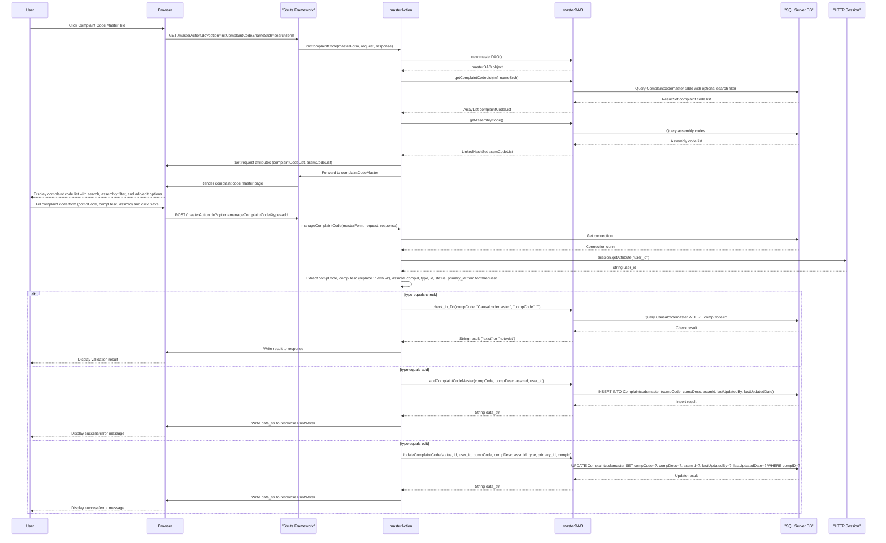
```mermaid
sequenceDiagram
    participant User
    participant Browser
    participant StrutsFramework as "Struts Framework"
    participant MasterAction as masterAction
    participant MasterDAO as masterDAO
    participant Database as "SQL Server DB"
    participant HTTPSession as "HTTP Session"

    User->>Browser: Click Complaint Code Master Tile
    Browser->>StrutsFramework: GET /masterAction.do?option=initComplaintCode&nameSrch=searchTerm
    StrutsFramework->>MasterAction: initComplaintCode(masterForm, request, response)
    
    MasterAction->>MasterDAO: new masterDAO()
    MasterDAO-->>MasterAction: masterDAO object
    
    MasterAction->>MasterDAO: getComplaintCodeList(mf, nameSrch)
    MasterDAO->>Database: Query Complaintcodemaster table with optional search filter
    Database-->>MasterDAO: ResultSet complaint code list
    MasterDAO-->>MasterAction: ArrayList complaintCodeList
    
    MasterAction->>MasterDAO: getAssemblyCode()
    MasterDAO->>Database: Query assembly codes
    Database-->>MasterDAO: Assembly code list
    MasterDAO-->>MasterAction: LinkedHashSet assmCodeList
    
    MasterAction->>Browser: Set request attributes (complaintCodeList, assmCodeList)
    MasterAction->>StrutsFramework: Forward to complaintCodeMaster
    StrutsFramework->>Browser: Render complaint code master page
    Browser-->>User: Display complaint code list with search, assembly filter, and add/edit options
    
    User->>Browser: Fill complaint code form (compCode, compDesc, assmId) and click Save
    Browser->>StrutsFramework: POST /masterAction.do?option=manageComplaintCode&type=add
    StrutsFramework->>MasterAction: manageComplaintCode(masterForm, request, response)
    
    MasterAction->>Database: Get connection
    Database-->>MasterAction: Connection conn
    
    MasterAction->>HTTPSession: session.getAttribute("user_id")
    HTTPSession-->>MasterAction: String user_id
    
    MasterAction->>MasterAction: Extract compCode, compDesc (replace '`' with '&'), assmId, compid, type, id, status, primary_id from form/request
    
    alt type equals check
        MasterAction->>MasterDAO: check_in_Db(compCode, "Causalcodemaster", "compCode", "")
        MasterDAO->>Database: Query Causalcodemaster WHERE compCode=?
        Database-->>MasterDAO: Check result
        MasterDAO-->>MasterAction: String result ("exist" or "notexist")
        MasterAction->>Browser: Write result to response
        Browser-->>User: Display validation result
    else type equals add
        MasterAction->>MasterDAO: addComplaintCodeMaster(compCode, compDesc, assmId, user_id)
        MasterDAO->>Database: INSERT INTO Complaintcodemaster (compCode, compDesc, assmId, lastUpdatedBy, lastUpdatedDate)
        Database-->>MasterDAO: Insert result
        MasterDAO-->>MasterAction: String data_str
        MasterAction->>Browser: Write data_str to response PrintWriter
        Browser-->>User: Display success/error message
    else type equals edit
        MasterAction->>MasterDAO: UpdateComplaintCode(status, id, user_id, compCode, compDesc, assmId, type, primary_id, compid)
        MasterDAO->>Database: UPDATE Complaintcodemaster SET compCode=?, compDesc=?, assmId=?, lastUpdatedBy=?, lastUpdatedDate=? WHERE compID=?
        Database-->>MasterDAO: Update result
        MasterDAO-->>MasterAction: String data_str
        MasterAction->>Browser: Write data_str to response PrintWriter
        Browser-->>User: Display success/error message
    end
```

---

## 9. Causal Code Master Flow

This diagram shows the Causal Code Master management flow with complaint code association.

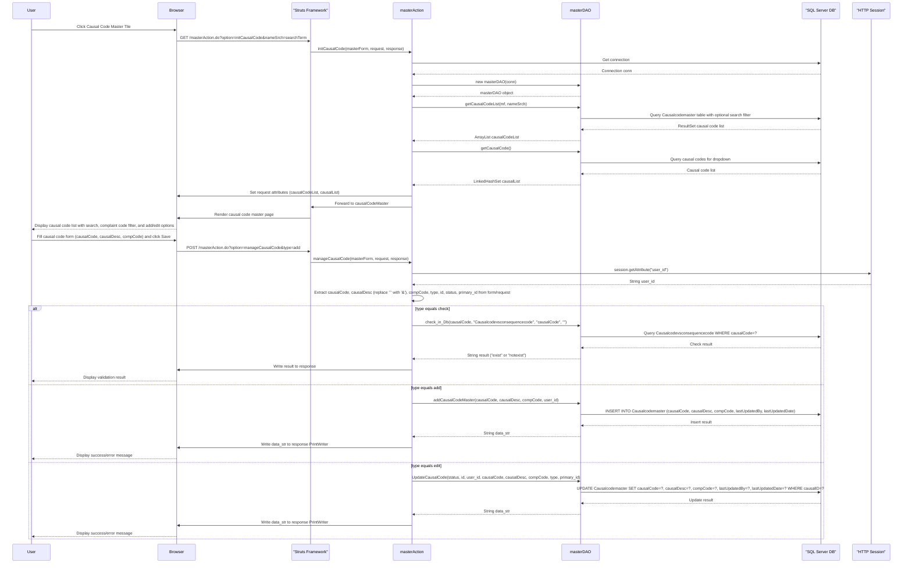
```mermaid
sequenceDiagram
    participant User
    participant Browser
    participant StrutsFramework as "Struts Framework"
    participant MasterAction as masterAction
    participant MasterDAO as masterDAO
    participant Database as "SQL Server DB"
    participant HTTPSession as "HTTP Session"

    User->>Browser: Click Causal Code Master Tile
    Browser->>StrutsFramework: GET /masterAction.do?option=initCausalCode&nameSrch=searchTerm
    StrutsFramework->>MasterAction: initCausalCode(masterForm, request, response)
    
    MasterAction->>Database: Get connection
    Database-->>MasterAction: Connection conn
    
    MasterAction->>MasterDAO: new masterDAO(conn)
    MasterDAO-->>MasterAction: masterDAO object
    
    MasterAction->>MasterDAO: getCausalCodeList(mf, nameSrch)
    MasterDAO->>Database: Query Causalcodemaster table with optional search filter
    Database-->>MasterDAO: ResultSet causal code list
    MasterDAO-->>MasterAction: ArrayList causalCodeList
    
    MasterAction->>MasterDAO: getCausalCode()
    MasterDAO->>Database: Query causal codes for dropdown
    Database-->>MasterDAO: Causal code list
    MasterDAO-->>MasterAction: LinkedHashSet causalList
    
    MasterAction->>Browser: Set request attributes (causalCodeList, causalList)
    MasterAction->>StrutsFramework: Forward to causalCodeMaster
    StrutsFramework->>Browser: Render causal code master page
    Browser-->>User: Display causal code list with search, complaint code filter, and add/edit options
    
    User->>Browser: Fill causal code form (causalCode, causalDesc, compCode) and click Save
    Browser->>StrutsFramework: POST /masterAction.do?option=manageCausalCode&type=add
    StrutsFramework->>MasterAction: manageCausalCode(masterForm, request, response)
    
    MasterAction->>HTTPSession: session.getAttribute("user_id")
    HTTPSession-->>MasterAction: String user_id
    
    MasterAction->>MasterAction: Extract causalCode, causalDesc (replace '`' with '&'), compCode, type, id, status, primary_id from form/request
    
    alt type equals check
        MasterAction->>MasterDAO: check_in_Db(causalCode, "Causalcodevsconsequencecode", "causalCode", "")
        MasterDAO->>Database: Query Causalcodevsconsequencecode WHERE causalCode=?
        Database-->>MasterDAO: Check result
        MasterDAO-->>MasterAction: String result ("exist" or "notexist")
        MasterAction->>Browser: Write result to response
        Browser-->>User: Display validation result
    else type equals add
        MasterAction->>MasterDAO: addCausalCodeMaster(causalCode, causalDesc, compCode, user_id)
        MasterDAO->>Database: INSERT INTO Causalcodemaster (causalCode, causalDesc, compCode, lastUpdatedBy, lastUpdatedDate)
        Database-->>MasterDAO: Insert result
        MasterDAO-->>MasterAction: String data_str
        MasterAction->>Browser: Write data_str to response PrintWriter
        Browser-->>User: Display success/error message
    else type equals edit
        MasterAction->>MasterDAO: UpdateCausalCode(status, id, user_id, causalCode, causalDesc, compCode, type, primary_id)
        MasterDAO->>Database: UPDATE Causalcodemaster SET causalCode=?, causalDesc=?, compCode=?, lastUpdatedBy=?, lastUpdatedDate=? WHERE causalID=?
        Database-->>MasterDAO: Update result
        MasterDAO-->>MasterAction: String data_str
        MasterAction->>Browser: Write data_str to response PrintWriter
        Browser-->>User: Display success/error message
    end
```

---

## 10. Application Master Flow

This diagram shows the Application Master management flow.

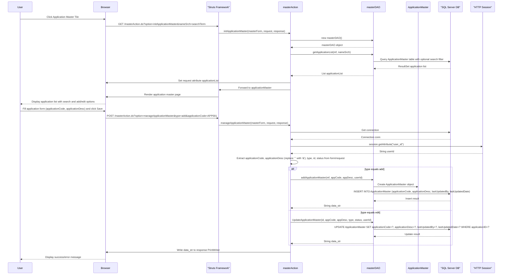
```mermaid
sequenceDiagram
    participant User
    participant Browser
    participant StrutsFramework as "Struts Framework"
    participant MasterAction as masterAction
    participant MasterDAO as masterDAO
    participant ApplicationMaster as ApplicationMaster
    participant Database as "SQL Server DB"
    participant HTTPSession as "HTTP Session"

    User->>Browser: Click Application Master Tile
    Browser->>StrutsFramework: GET /masterAction.do?option=initApplicationMaster&nameSrch=searchTerm
    StrutsFramework->>MasterAction: initApplicationMaster(masterForm, request, response)
    
    MasterAction->>MasterDAO: new masterDAO()
    MasterDAO-->>MasterAction: masterDAO object
    
    MasterAction->>MasterDAO: getApplicationList(mf, nameSrch)
    MasterDAO->>Database: Query ApplicationMaster table with optional search filter
    Database-->>MasterDAO: ResultSet application list
    MasterDAO-->>MasterAction: List applicationList
    
    MasterAction->>Browser: Set request attribute applicationList
    MasterAction->>StrutsFramework: Forward to applicationMaster
    StrutsFramework->>Browser: Render application master page
    Browser-->>User: Display application list with search and add/edit options
    
    User->>Browser: Fill application form (applicationCode, applicationDesc) and click Save
    Browser->>StrutsFramework: POST /masterAction.do?option=manageApplicationMaster&type=add&applicationCode=APP001
    StrutsFramework->>MasterAction: manageApplicationMaster(masterForm, request, response)
    
    MasterAction->>Database: Get connection
    Database-->>MasterAction: Connection conn
    
    MasterAction->>HTTPSession: session.getAttribute("user_id")
    HTTPSession-->>MasterAction: String userId
    
    MasterAction->>MasterAction: Extract applicationCode, applicationDesc (replace '`' with '&'), type, id, status from form/request
    
    alt type equals add
        MasterAction->>MasterDAO: addApplicationMaster(mf, appCode, appDesc, userId)
        MasterDAO->>ApplicationMaster: Create ApplicationMaster object
        MasterDAO->>Database: INSERT INTO ApplicationMaster (applicationCode, applicationDesc, lastUpdatedBy, lastUpdatedDate)
        Database-->>MasterDAO: Insert result
        MasterDAO-->>MasterAction: String data_str
    else type equals edit
        MasterAction->>MasterDAO: UpdateApplicationMaster(id, appCode, appDesc, type, status, userId)
        MasterDAO->>Database: UPDATE ApplicationMaster SET applicationCode=?, applicationDesc=?, lastUpdatedBy=?, lastUpdatedDate=? WHERE applicationID=?
        Database-->>MasterDAO: Update result
        MasterDAO-->>MasterAction: String data_str
    end
    
    MasterAction->>Browser: Write data_str to response PrintWriter
    Browser-->>User: Display success/error message
```

---

## 11. Bill Master Flow

This diagram shows the Bill Master management flow with percentage field.

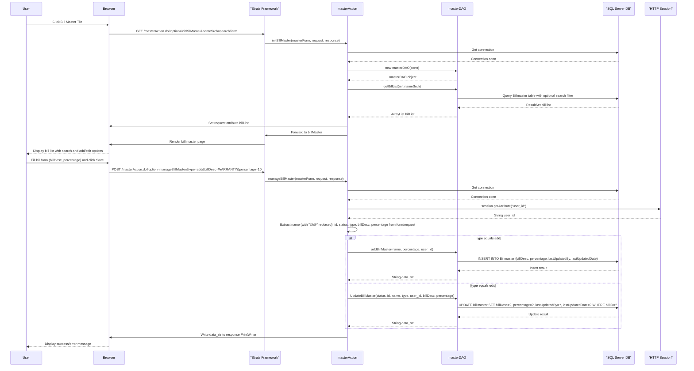
```mermaid
sequenceDiagram
    participant User
    participant Browser
    participant StrutsFramework as "Struts Framework"
    participant MasterAction as masterAction
    participant MasterDAO as masterDAO
    participant Database as "SQL Server DB"
    participant HTTPSession as "HTTP Session"

    User->>Browser: Click Bill Master Tile
    Browser->>StrutsFramework: GET /masterAction.do?option=initBillMaster&nameSrch=searchTerm
    StrutsFramework->>MasterAction: initBillMaster(masterForm, request, response)
    
    MasterAction->>Database: Get connection
    Database-->>MasterAction: Connection conn
    
    MasterAction->>MasterDAO: new masterDAO(conn)
    MasterDAO-->>MasterAction: masterDAO object
    
    MasterAction->>MasterDAO: getBillList(mf, nameSrch)
    MasterDAO->>Database: Query Billmaster table with optional search filter
    Database-->>MasterDAO: ResultSet bill list
    MasterDAO-->>MasterAction: ArrayList billList
    
    MasterAction->>Browser: Set request attribute billList
    MasterAction->>StrutsFramework: Forward to billMaster
    StrutsFramework->>Browser: Render bill master page
    Browser-->>User: Display bill list with search and add/edit options
    
    User->>Browser: Fill bill form (billDesc, percentage) and click Save
    Browser->>StrutsFramework: POST /masterAction.do?option=manageBillMaster&type=add&billDesc=WARRANTY&percentage=10
    StrutsFramework->>MasterAction: manageBillMaster(masterForm, request, response)
    
    MasterAction->>Database: Get connection
    Database-->>MasterAction: Connection conn
    
    MasterAction->>HTTPSession: session.getAttribute("user_id")
    HTTPSession-->>MasterAction: String user_id
    
    MasterAction->>MasterAction: Extract name (with "@@" replaced), id, status, type, billDesc, percentage from form/request
    
    alt type equals add
        MasterAction->>MasterDAO: addBillMaster(name, percentage, user_id)
        MasterDAO->>Database: INSERT INTO Billmaster (billDesc, percentage, lastUpdatedBy, lastUpdatedDate)
        Database-->>MasterDAO: Insert result
        MasterDAO-->>MasterAction: String data_str
    else type equals edit
        MasterAction->>MasterDAO: UpdateBillMaster(status, id, name, type, user_id, billDesc, percentage)
        MasterDAO->>Database: UPDATE Billmaster SET billDesc=?, percentage=?, lastUpdatedBy=?, lastUpdatedDate=? WHERE billID=?
        Database-->>MasterDAO: Update result
        MasterDAO-->>MasterAction: String data_str
    end
    
    MasterAction->>Browser: Write data_str to response PrintWriter
    Browser-->>User: Display success/error message
```

---

## 12. Consequence Master Flow

This diagram shows the Consequence Master management flow.

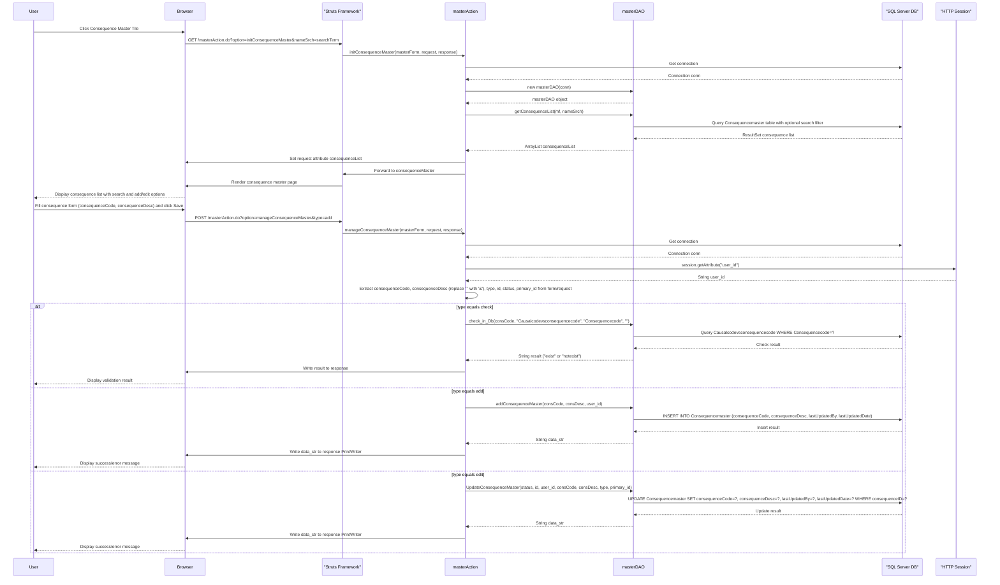
```mermaid
sequenceDiagram
    participant User
    participant Browser
    participant StrutsFramework as "Struts Framework"
    participant MasterAction as masterAction
    participant MasterDAO as masterDAO
    participant Database as "SQL Server DB"
    participant HTTPSession as "HTTP Session"

    User->>Browser: Click Consequence Master Tile
    Browser->>StrutsFramework: GET /masterAction.do?option=initConsequenceMaster&nameSrch=searchTerm
    StrutsFramework->>MasterAction: initConsequenceMaster(masterForm, request, response)
    
    MasterAction->>Database: Get connection
    Database-->>MasterAction: Connection conn
    
    MasterAction->>MasterDAO: new masterDAO(conn)
    MasterDAO-->>MasterAction: masterDAO object
    
    MasterAction->>MasterDAO: getConsequenceList(mf, nameSrch)
    MasterDAO->>Database: Query Consequencemaster table with optional search filter
    Database-->>MasterDAO: ResultSet consequence list
    MasterDAO-->>MasterAction: ArrayList consequenceList
    
    MasterAction->>Browser: Set request attribute consequenceList
    MasterAction->>StrutsFramework: Forward to consequenceMaster
    StrutsFramework->>Browser: Render consequence master page
    Browser-->>User: Display consequence list with search and add/edit options
    
    User->>Browser: Fill consequence form (consequenceCode, consequenceDesc) and click Save
    Browser->>StrutsFramework: POST /masterAction.do?option=manageConsequenceMaster&type=add
    StrutsFramework->>MasterAction: manageConsequenceMaster(masterForm, request, response)
    
    MasterAction->>Database: Get connection
    Database-->>MasterAction: Connection conn
    
    MasterAction->>HTTPSession: session.getAttribute("user_id")
    HTTPSession-->>MasterAction: String user_id
    
    MasterAction->>MasterAction: Extract consequenceCode, consequenceDesc (replace '`' with '&'), type, id, status, primary_id from form/request
    
    alt type equals check
        MasterAction->>MasterDAO: check_in_Db(consCode, "Causalcodevsconsequencecode", "Consequencecode", "")
        MasterDAO->>Database: Query Causalcodevsconsequencecode WHERE Consequencecode=?
        Database-->>MasterDAO: Check result
        MasterDAO-->>MasterAction: String result ("exist" or "notexist")
        MasterAction->>Browser: Write result to response
        Browser-->>User: Display validation result
    else type equals add
        MasterAction->>MasterDAO: addConsequenceMaster(consCode, consDesc, user_id)
        MasterDAO->>Database: INSERT INTO Consequencemaster (consequenceCode, consequenceDesc, lastUpdatedBy, lastUpdatedDate)
        Database-->>MasterDAO: Insert result
        MasterDAO-->>MasterAction: String data_str
        MasterAction->>Browser: Write data_str to response PrintWriter
        Browser-->>User: Display success/error message
    else type equals edit
        MasterAction->>MasterDAO: UpdateConsequenceMaster(status, id, user_id, consCode, consDesc, type, primary_id)
        MasterDAO->>Database: UPDATE Consequencemaster SET consequenceCode=?, consequenceDesc=?, lastUpdatedBy=?, lastUpdatedDate=? WHERE consequenceID=?
        Database-->>MasterDAO: Update result
        MasterDAO-->>MasterAction: String data_str
        MasterAction->>Browser: Write data_str to response PrintWriter
        Browser-->>User: Display success/error message
    end
```

---

## 13. Content Master Flow

This diagram shows the Content Master management flow with bulk upload capability.

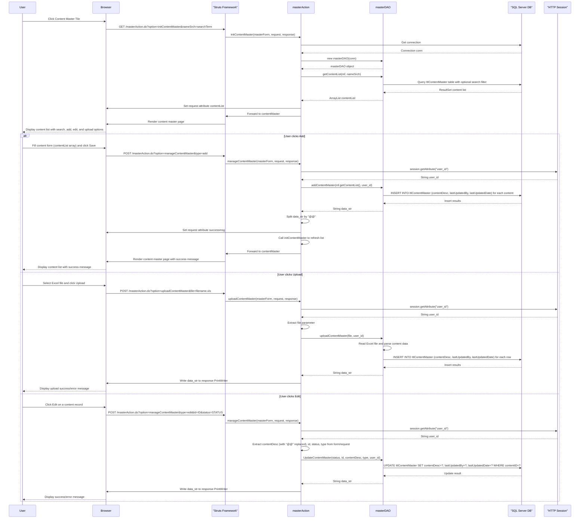
```mermaid
sequenceDiagram
    participant User
    participant Browser
    participant StrutsFramework as "Struts Framework"
    participant MasterAction as masterAction
    participant MasterDAO as masterDAO
    participant Database as "SQL Server DB"
    participant HTTPSession as "HTTP Session"

    User->>Browser: Click Content Master Tile
    Browser->>StrutsFramework: GET /masterAction.do?option=initContentMaster&nameSrch=searchTerm
    StrutsFramework->>MasterAction: initContentMaster(masterForm, request, response)
    
    MasterAction->>Database: Get connection
    Database-->>MasterAction: Connection conn
    
    MasterAction->>MasterDAO: new masterDAO(conn)
    MasterDAO-->>MasterAction: masterDAO object
    
    MasterAction->>MasterDAO: getContentList(mf, nameSrch)
    MasterDAO->>Database: Query ItlContentMaster table with optional search filter
    Database-->>MasterDAO: ResultSet content list
    MasterDAO-->>MasterAction: ArrayList contentList
    
    MasterAction->>Browser: Set request attribute contentList
    MasterAction->>StrutsFramework: Forward to contentMaster
    StrutsFramework->>Browser: Render content master page
    Browser-->>User: Display content list with search, add, edit, and upload options
    
    alt User clicks Add
        User->>Browser: Fill content form (contentList array) and click Save
        Browser->>StrutsFramework: POST /masterAction.do?option=manageContentMaster&type=add
        StrutsFramework->>MasterAction: manageContentMaster(masterForm, request, response)
        
        MasterAction->>HTTPSession: session.getAttribute("user_id")
        HTTPSession-->>MasterAction: String user_id
        
        MasterAction->>MasterDAO: addContentMaster(mf.getContentList(), user_id)
        MasterDAO->>Database: INSERT INTO ItlContentMaster (contentDesc, lastUpdatedBy, lastUpdatedDate) for each content
        Database-->>MasterDAO: Insert results
        MasterDAO-->>MasterAction: String data_str
        MasterAction->>MasterAction: Split data_str by "@@"
        MasterAction->>Browser: Set request attribute successmsg
        MasterAction->>MasterAction: Call initContentMaster to refresh list
        MasterAction->>StrutsFramework: Forward to contentMaster
        StrutsFramework->>Browser: Render content master page with success message
        Browser-->>User: Display content list with success message
    else User clicks Upload
        User->>Browser: Select Excel file and click Upload
        Browser->>StrutsFramework: POST /masterAction.do?option=uploadContentMaster&file=filename.xls
        StrutsFramework->>MasterAction: uploadContentMaster(masterForm, request, response)
        
        MasterAction->>HTTPSession: session.getAttribute("user_id")
        HTTPSession-->>MasterAction: String user_id
        
        MasterAction->>MasterAction: Extract file parameter
        MasterAction->>MasterDAO: uploadContentMaster(file, user_id)
        MasterDAO->>MasterDAO: Read Excel file and parse content data
        MasterDAO->>Database: INSERT INTO ItlContentMaster (contentDesc, lastUpdatedBy, lastUpdatedDate) for each row
        Database-->>MasterDAO: Insert results
        MasterDAO-->>MasterAction: String data_str
        MasterAction->>Browser: Write data_str to response PrintWriter
        Browser-->>User: Display upload success/error message
    else User clicks Edit
        User->>Browser: Click Edit on a content record
        Browser->>StrutsFramework: POST /masterAction.do?option=manageContentMaster&type=edit&id=ID&status=STATUS
        StrutsFramework->>MasterAction: manageContentMaster(masterForm, request, response)
        
        MasterAction->>HTTPSession: session.getAttribute("user_id")
        HTTPSession-->>MasterAction: String user_id
        
        MasterAction->>MasterAction: Extract contentDesc (with "@@" replaced), id, status, type from form/request
        MasterAction->>MasterDAO: UpdateContentMaster(status, id, contentDesc, type, user_id)
        MasterDAO->>Database: UPDATE ItlContentMaster SET contentDesc=?, lastUpdatedBy=?, lastUpdatedDate=? WHERE contentID=?
        Database-->>MasterDAO: Update result
        MasterDAO-->>MasterAction: String data_str
        MasterAction->>Browser: Write data_str to response PrintWriter
        Browser-->>User: Display success/error message
    end
```

---

## 14. SubContent Master Flow

This diagram shows the SubContent Master management flow with content association.

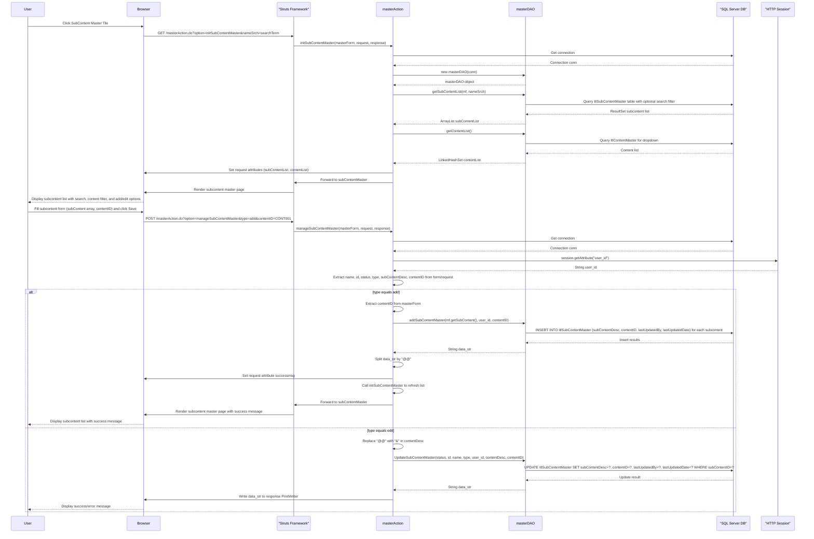
```mermaid
sequenceDiagram
    participant User
    participant Browser
    participant StrutsFramework as "Struts Framework"
    participant MasterAction as masterAction
    participant MasterDAO as masterDAO
    participant Database as "SQL Server DB"
    participant HTTPSession as "HTTP Session"

    User->>Browser: Click SubContent Master Tile
    Browser->>StrutsFramework: GET /masterAction.do?option=initSubContentMaster&nameSrch=searchTerm
    StrutsFramework->>MasterAction: initSubContentMaster(masterForm, request, response)
    
    MasterAction->>Database: Get connection
    Database-->>MasterAction: Connection conn
    
    MasterAction->>MasterDAO: new masterDAO(conn)
    MasterDAO-->>MasterAction: masterDAO object
    
    MasterAction->>MasterDAO: getSubContentList(mf, nameSrch)
    MasterDAO->>Database: Query ItlSubContentMaster table with optional search filter
    Database-->>MasterDAO: ResultSet subcontent list
    MasterDAO-->>MasterAction: ArrayList subContentList
    
    MasterAction->>MasterDAO: getContentList()
    MasterDAO->>Database: Query ItlContentMaster for dropdown
    Database-->>MasterDAO: Content list
    MasterDAO-->>MasterAction: LinkedHashSet contentList
    
    MasterAction->>Browser: Set request attributes (subContentList, contentList)
    MasterAction->>StrutsFramework: Forward to subContentMaster
    StrutsFramework->>Browser: Render subcontent master page
    Browser-->>User: Display subcontent list with search, content filter, and add/edit options
    
    User->>Browser: Fill subcontent form (subContent array, contentID) and click Save
    Browser->>StrutsFramework: POST /masterAction.do?option=manageSubContentMaster&type=add&contentID=CONT001
    StrutsFramework->>MasterAction: manageSubContentMaster(masterForm, request, response)
    
    MasterAction->>Database: Get connection
    Database-->>MasterAction: Connection conn
    
    MasterAction->>HTTPSession: session.getAttribute("user_id")
    HTTPSession-->>MasterAction: String user_id
    
    MasterAction->>MasterAction: Extract name, id, status, type, subContentDesc, contentID from form/request
    
    alt type equals add
        MasterAction->>MasterAction: Extract contentID from masterForm
        MasterAction->>MasterDAO: addSubContentMaster(mf.getSubContent(), user_id, contentID)
        MasterDAO->>Database: INSERT INTO ItlSubContentMaster (subContentDesc, contentID, lastUpdatedBy, lastUpdatedDate) for each subcontent
        Database-->>MasterDAO: Insert results
        MasterDAO-->>MasterAction: String data_str
        MasterAction->>MasterAction: Split data_str by "@@"
        MasterAction->>Browser: Set request attribute successmsg
        MasterAction->>MasterAction: Call initSubContentMaster to refresh list
        MasterAction->>StrutsFramework: Forward to subContentMaster
        StrutsFramework->>Browser: Render subcontent master page with success message
        Browser-->>User: Display subcontent list with success message
    else type equals edit
        MasterAction->>MasterAction: Replace "@@" with "&" in contentDesc
        MasterAction->>MasterDAO: UpdateSubContentMaster(status, id, name, type, user_id, contentDesc, contentID)
        MasterDAO->>Database: UPDATE ItlSubContentMaster SET subContentDesc=?, contentID=?, lastUpdatedBy=?, lastUpdatedDate=? WHERE subContentID=?
        Database-->>MasterDAO: Update result
        MasterDAO-->>MasterAction: String data_str
        MasterAction->>Browser: Write data_str to response PrintWriter
        Browser-->>User: Display success/error message
    end
```

---

## 15. SubAssembly Master Flow

This diagram shows the SubAssembly Master management flow with aggregate association.

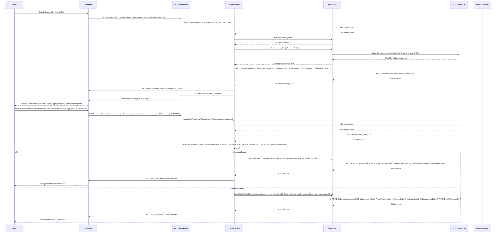
```mermaid
sequenceDiagram
    participant User
    participant Browser
    participant StrutsFramework as "Struts Framework"
    participant MasterAction as masterAction
    participant MasterDAO as masterDAO
    participant Database as "SQL Server DB"
    participant HTTPSession as "HTTP Session"

    User->>Browser: Click SubAssembly Master Tile
    Browser->>StrutsFramework: GET /masterAction.do?option=initSubAssemblyMaster&nameSrch=searchTerm
    StrutsFramework->>MasterAction: initSubAssemblyMaster(masterForm, request, response)
    
    MasterAction->>Database: Get connection
    Database-->>MasterAction: Connection conn
    
    MasterAction->>MasterDAO: new masterDAO(conn)
    MasterDAO-->>MasterAction: masterDAO object
    
    MasterAction->>MasterDAO: getSubAssemblyList(mf, nameSrch)
    MasterDAO->>Database: Query Subassemblymaster table with optional search filter
    Database-->>MasterDAO: ResultSet subassembly list
    MasterDAO-->>MasterAction: ArrayList subassemblyList
    
    MasterAction->>MasterDAO: getCommonLabelValues("Subaggregatemaster", "subAggCode", "subAggDesc", "subAggDesc", "where isActive='Y'")
    MasterDAO->>Database: Query Subaggregatemaster WHERE isActive='Y'
    Database-->>MasterDAO: Aggregate list
    MasterDAO-->>MasterAction: LinkedHashSet aggList
    
    MasterAction->>Browser: Set request attributes (subassemblyList, aggList)
    MasterAction->>StrutsFramework: Forward to subAssemblyMaster
    StrutsFramework->>Browser: Render subassembly master page
    Browser-->>User: Display subassembly list with search, aggregate filter, and add/edit options
    
    User->>Browser: Fill subassembly form (subAssemblyCode, subAssemblyDesc, aggCode) and click Save
    Browser->>StrutsFramework: POST /masterAction.do?option=manageSubAssemblyMaster&type=add&primary_id=ID&assemblyid=ASM001
    StrutsFramework->>MasterAction: manageSubAssemblyMaster(masterForm, request, response)
    
    MasterAction->>Database: Get connection
    Database-->>MasterAction: Connection conn
    
    MasterAction->>HTTPSession: session.getAttribute("user_id")
    HTTPSession-->>MasterAction: String user_id
    
    MasterAction->>MasterAction: Extract subAssemblyCode, subAssemblyDesc (replace '`' with '&'), aggCode, idpk, assemblyid, type, id, status from form/request
    
    alt type equals add
        MasterAction->>MasterDAO: addSubAssemblyMaster(subAssemblyCode, subAssemblyDesc, aggCode, user_id)
        MasterDAO->>Database: INSERT INTO Subassemblymaster (subAssemblyCode, subAssemblyDesc, aggCode, lastUpdatedBy, lastUpdatedDate)
        Database-->>MasterDAO: Insert result
        MasterDAO-->>MasterAction: String data_str
        MasterAction->>Browser: Write data_str to response PrintWriter
        Browser-->>User: Display success/error message
    else type equals edit
        MasterAction->>MasterDAO: UpdateSubAssemblyMaster(status, id, user_id, subAssemblyCode, subAssemblyDesc, aggCode, type, idpk, assemblyid)
        MasterDAO->>Database: UPDATE Subassemblymaster SET subAssemblyCode=?, subAssemblyDesc=?, aggCode=?, lastUpdatedBy=?, lastUpdatedDate=? WHERE subAssemblyID=?
        Database-->>MasterDAO: Update result
        MasterDAO-->>MasterAction: String data_str
        MasterAction->>Browser: Write data_str to response PrintWriter
        Browser-->>User: Display success/error message
    end
```

---

## 16. SubAggregate Master Flow

This diagram shows the SubAggregate Master management flow with aggregate association.

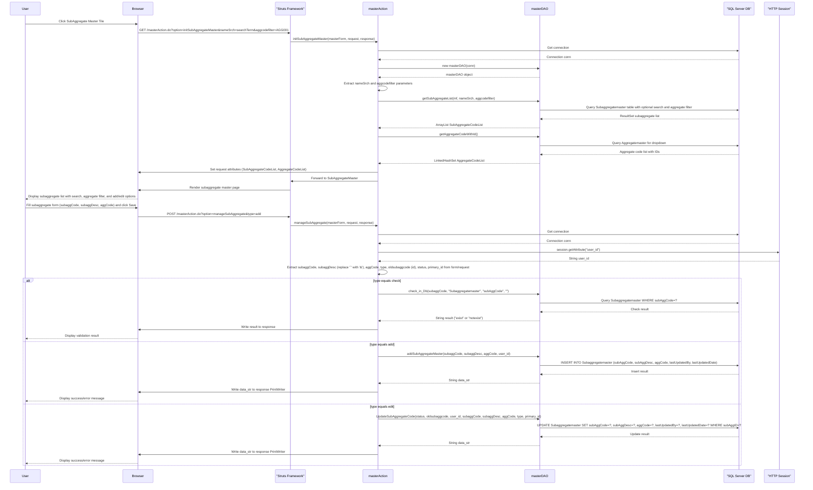
```mermaid
sequenceDiagram
    participant User
    participant Browser
    participant StrutsFramework as "Struts Framework"
    participant MasterAction as masterAction
    participant MasterDAO as masterDAO
    participant Database as "SQL Server DB"
    participant HTTPSession as "HTTP Session"

    User->>Browser: Click SubAggregate Master Tile
    Browser->>StrutsFramework: GET /masterAction.do?option=initSubAggregateMaster&nameSrch=searchTerm&aggcodefilter=AGG001
    StrutsFramework->>MasterAction: initSubAggregateMaster(masterForm, request, response)
    
    MasterAction->>Database: Get connection
    Database-->>MasterAction: Connection conn
    
    MasterAction->>MasterDAO: new masterDAO(conn)
    MasterDAO-->>MasterAction: masterDAO object
    
    MasterAction->>MasterAction: Extract nameSrch and aggcodefilter parameters
    
    MasterAction->>MasterDAO: getSubAggregateList(mf, nameSrch, aggcodefilter)
    MasterDAO->>Database: Query Subaggregatemaster table with optional search and aggregate filter
    Database-->>MasterDAO: ResultSet subaggregate list
    MasterDAO-->>MasterAction: ArrayList SubAggregateCodeList
    
    MasterAction->>MasterDAO: getAggregateCodeWithId()
    MasterDAO->>Database: Query Aggregatemaster for dropdown
    Database-->>MasterDAO: Aggregate code list with IDs
    MasterDAO-->>MasterAction: LinkedHashSet AggregateCodeList
    
    MasterAction->>Browser: Set request attributes (SubAggregateCodeList, AggregateCodeList)
    MasterAction->>StrutsFramework: Forward to SubAggregateMaster
    StrutsFramework->>Browser: Render subaggregate master page
    Browser-->>User: Display subaggregate list with search, aggregate filter, and add/edit options
    
    User->>Browser: Fill subaggregate form (subaggCode, subaggDesc, aggCode) and click Save
    Browser->>StrutsFramework: POST /masterAction.do?option=manageSubAggregate&type=add
    StrutsFramework->>MasterAction: manageSubAggregate(masterForm, request, response)
    
    MasterAction->>Database: Get connection
    Database-->>MasterAction: Connection conn
    
    MasterAction->>HTTPSession: session.getAttribute("user_id")
    HTTPSession-->>MasterAction: String user_id
    
    MasterAction->>MasterAction: Extract subaggCode, subaggDesc (replace '`' with '&'), aggCode, type, oldsubaggcode (id), status, primary_id from form/request
    
    alt type equals check
        MasterAction->>MasterDAO: check_in_Db(subaggCode, "Subaggregatemaster", "subAggCode", "")
        MasterDAO->>Database: Query Subaggregatemaster WHERE subAggCode=?
        Database-->>MasterDAO: Check result
        MasterDAO-->>MasterAction: String result ("exist" or "notexist")
        MasterAction->>Browser: Write result to response
        Browser-->>User: Display validation result
    else type equals add
        MasterAction->>MasterDAO: addSubAggregateMaster(subaggCode, subaggDesc, aggCode, user_id)
        MasterDAO->>Database: INSERT INTO Subaggregatemaster (subAggCode, subAggDesc, aggCode, lastUpdatedBy, lastUpdatedDate)
        Database-->>MasterDAO: Insert result
        MasterDAO-->>MasterAction: String data_str
        MasterAction->>Browser: Write data_str to response PrintWriter
        Browser-->>User: Display success/error message
    else type equals edit
        MasterAction->>MasterDAO: UpdateSubAggregateCode(status, oldsubaggcode, user_id, subaggCode, subaggDesc, aggCode, type, primary_id)
        MasterDAO->>Database: UPDATE Subaggregatemaster SET subAggCode=?, subAggDesc=?, aggCode=?, lastUpdatedBy=?, lastUpdatedDate=? WHERE subAggID=?
        Database-->>MasterDAO: Update result
        MasterDAO-->>MasterAction: String data_str
        MasterAction->>Browser: Write data_str to response PrintWriter
        Browser-->>User: Display success/error message
    end
```

---

## 17. Rejection Code Master Flow

This diagram shows the Rejection Code Master management flow.

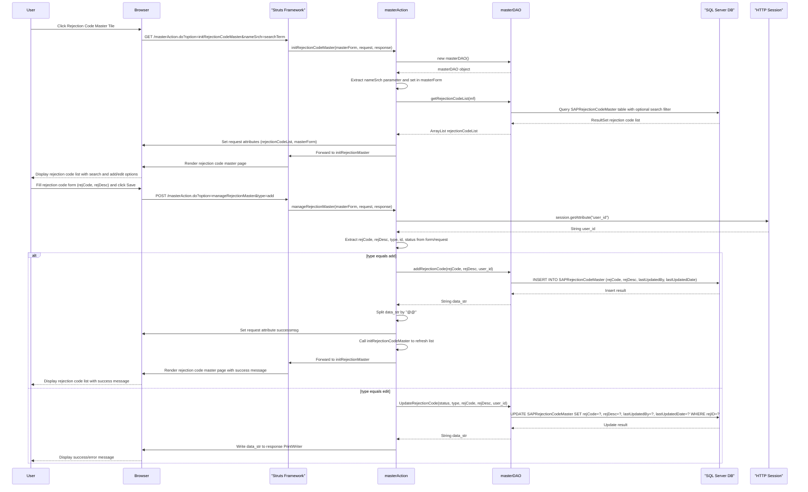
```mermaid
sequenceDiagram
    participant User
    participant Browser
    participant StrutsFramework as "Struts Framework"
    participant MasterAction as masterAction
    participant MasterDAO as masterDAO
    participant Database as "SQL Server DB"
    participant HTTPSession as "HTTP Session"

    User->>Browser: Click Rejection Code Master Tile
    Browser->>StrutsFramework: GET /masterAction.do?option=initRejectionCodeMaster&nameSrch=searchTerm
    StrutsFramework->>MasterAction: initRejectionCodeMaster(masterForm, request, response)
    
    MasterAction->>MasterDAO: new masterDAO()
    MasterDAO-->>MasterAction: masterDAO object
    
    MasterAction->>MasterAction: Extract nameSrch parameter and set in masterForm
    
    MasterAction->>MasterDAO: getRejectionCodeList(mf)
    MasterDAO->>Database: Query SAPRejectionCodeMaster table with optional search filter
    Database-->>MasterDAO: ResultSet rejection code list
    MasterDAO-->>MasterAction: ArrayList rejectionCodeList
    
    MasterAction->>Browser: Set request attributes (rejectionCodeList, masterForm)
    MasterAction->>StrutsFramework: Forward to initRejectionMaster
    StrutsFramework->>Browser: Render rejection code master page
    Browser-->>User: Display rejection code list with search and add/edit options
    
    User->>Browser: Fill rejection code form (rejCode, rejDesc) and click Save
    Browser->>StrutsFramework: POST /masterAction.do?option=manageRejectionMaster&type=add
    StrutsFramework->>MasterAction: manageRejectionMaster(masterForm, request, response)
    
    MasterAction->>HTTPSession: session.getAttribute("user_id")
    HTTPSession-->>MasterAction: String user_id
    
    MasterAction->>MasterAction: Extract rejCode, rejDesc, type, id, status from form/request
    
    alt type equals add
        MasterAction->>MasterDAO: addRejectionCode(rejCode, rejDesc, user_id)
        MasterDAO->>Database: INSERT INTO SAPRejectionCodeMaster (rejCode, rejDesc, lastUpdatedBy, lastUpdatedDate)
        Database-->>MasterDAO: Insert result
        MasterDAO-->>MasterAction: String data_str
        MasterAction->>MasterAction: Split data_str by "@@"
        MasterAction->>Browser: Set request attribute successmsg
        MasterAction->>MasterAction: Call initRejectionCodeMaster to refresh list
        MasterAction->>StrutsFramework: Forward to initRejectionMaster
        StrutsFramework->>Browser: Render rejection code master page with success message
        Browser-->>User: Display rejection code list with success message
    else type equals edit
        MasterAction->>MasterDAO: UpdateRejectionCode(status, type, rejCode, rejDesc, user_id)
        MasterDAO->>Database: UPDATE SAPRejectionCodeMaster SET rejCode=?, rejDesc=?, lastUpdatedBy=?, lastUpdatedDate=? WHERE rejID=?
        Database-->>MasterDAO: Update result
        MasterDAO-->>MasterAction: String data_str
        MasterAction->>Browser: Write data_str to response PrintWriter
        Browser-->>User: Display success/error message
    end
```

---

## 18. Vendor Code Master Flow

This diagram shows the Vendor Code Master management flow.

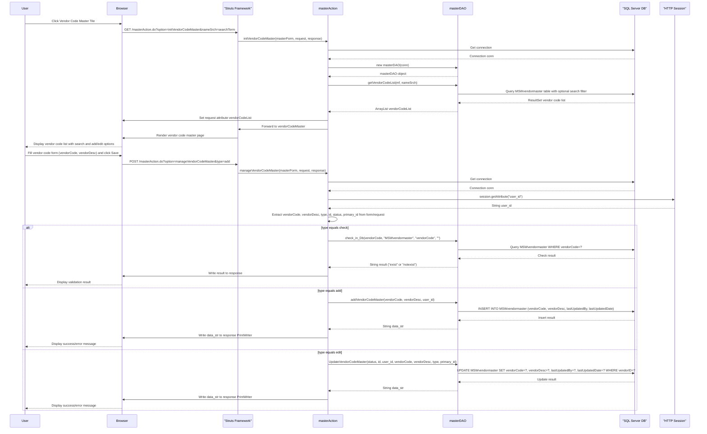
```mermaid
sequenceDiagram
    participant User
    participant Browser
    participant StrutsFramework as "Struts Framework"
    participant MasterAction as masterAction
    participant MasterDAO as masterDAO
    participant Database as "SQL Server DB"
    participant HTTPSession as "HTTP Session"

    User->>Browser: Click Vendor Code Master Tile
    Browser->>StrutsFramework: GET /masterAction.do?option=initVendorCodeMaster&nameSrch=searchTerm
    StrutsFramework->>MasterAction: initVendorCodeMaster(masterForm, request, response)
    
    MasterAction->>Database: Get connection
    Database-->>MasterAction: Connection conn
    
    MasterAction->>MasterDAO: new masterDAO(conn)
    MasterDAO-->>MasterAction: masterDAO object
    
    MasterAction->>MasterDAO: getVendorCodeList(mf, nameSrch)
    MasterDAO->>Database: Query MSWvendormaster table with optional search filter
    Database-->>MasterDAO: ResultSet vendor code list
    MasterDAO-->>MasterAction: ArrayList vendorCodeList
    
    MasterAction->>Browser: Set request attribute vendorCodeList
    MasterAction->>StrutsFramework: Forward to vendorCodeMaster
    StrutsFramework->>Browser: Render vendor code master page
    Browser-->>User: Display vendor code list with search and add/edit options
    
    User->>Browser: Fill vendor code form (vendorCode, vendorDesc) and click Save
    Browser->>StrutsFramework: POST /masterAction.do?option=manageVendorCodeMaster&type=add
    StrutsFramework->>MasterAction: manageVendorCodeMaster(masterForm, request, response)
    
    MasterAction->>Database: Get connection
    Database-->>MasterAction: Connection conn
    
    MasterAction->>HTTPSession: session.getAttribute("user_id")
    HTTPSession-->>MasterAction: String user_id
    
    MasterAction->>MasterAction: Extract vendorCode, vendorDesc, type, id, status, primary_id from form/request
    
    alt type equals check
        MasterAction->>MasterDAO: check_in_Db(vendorCode, "MSWvendormaster", "vendorCode", "")
        MasterDAO->>Database: Query MSWvendormaster WHERE vendorCode=?
        Database-->>MasterDAO: Check result
        MasterDAO-->>MasterAction: String result ("exist" or "notexist")
        MasterAction->>Browser: Write result to response
        Browser-->>User: Display validation result
    else type equals add
        MasterAction->>MasterDAO: addVendorCodeMaster(vendorCode, vendorDesc, user_id)
        MasterDAO->>Database: INSERT INTO MSWvendormaster (vendorCode, vendorDesc, lastUpdatedBy, lastUpdatedDate)
        Database-->>MasterDAO: Insert result
        MasterDAO-->>MasterAction: String data_str
        MasterAction->>Browser: Write data_str to response PrintWriter
        Browser-->>User: Display success/error message
    else type equals edit
        MasterAction->>MasterDAO: UpdateVendorCodeMaster(status, id, user_id, vendorCode, vendorDesc, type, primary_id)
        MasterDAO->>Database: UPDATE MSWvendormaster SET vendorCode=?, vendorDesc=?, lastUpdatedBy=?, lastUpdatedDate=? WHERE vendorID=?
        Database-->>MasterDAO: Update result
        MasterDAO-->>MasterAction: String data_str
        MasterAction->>Browser: Write data_str to response PrintWriter
        Browser-->>User: Display success/error message
    end
```

---

## 19. Form Check List Master Flow

This diagram shows the Form Check List Master management flow with content and subcontent associations.

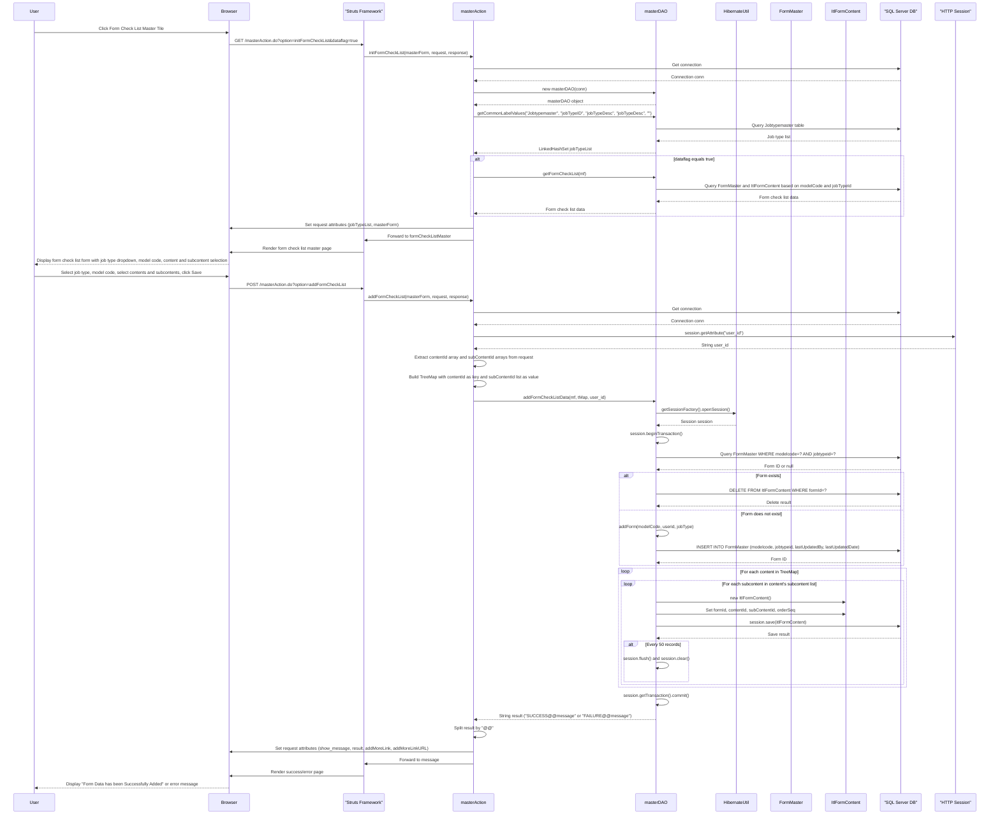
```mermaid
sequenceDiagram
    participant User
    participant Browser
    participant StrutsFramework as "Struts Framework"
    participant MasterAction as masterAction
    participant MasterDAO as masterDAO
    participant HibernateUtil as HibernateUtil
    participant FormMaster as FormMaster
    participant ItlFormContent as ItlFormContent
    participant Database as "SQL Server DB"
    participant HTTPSession as "HTTP Session"

    User->>Browser: Click Form Check List Master Tile
    Browser->>StrutsFramework: GET /masterAction.do?option=initFormCheckList&dataflag=true
    StrutsFramework->>MasterAction: initFormCheckList(masterForm, request, response)
    
    MasterAction->>Database: Get connection
    Database-->>MasterAction: Connection conn
    
    MasterAction->>MasterDAO: new masterDAO(conn)
    MasterDAO-->>MasterAction: masterDAO object
    
    MasterAction->>MasterDAO: getCommonLabelValues("Jobtypemaster", "jobTypeID", "jobTypeDesc", "jobTypeDesc", "")
    MasterDAO->>Database: Query Jobtypemaster table
    Database-->>MasterDAO: Job type list
    MasterDAO-->>MasterAction: LinkedHashSet jobTypeList
    
    alt dataflag equals true
        MasterAction->>MasterDAO: getFormCheckList(mf)
        MasterDAO->>Database: Query FormMaster and ItlFormContent based on modelCode and jobTypeId
        Database-->>MasterDAO: Form check list data
        MasterDAO-->>MasterAction: Form check list data
    end
    
    MasterAction->>Browser: Set request attributes (jobTypeList, masterForm)
    MasterAction->>StrutsFramework: Forward to formCheckListMaster
    StrutsFramework->>Browser: Render form check list master page
    Browser-->>User: Display form check list form with job type dropdown, model code, content and subcontent selection
    
    User->>Browser: Select job type, model code, select contents and subcontents, click Save
    Browser->>StrutsFramework: POST /masterAction.do?option=addFormCheckList
    StrutsFramework->>MasterAction: addFormCheckList(masterForm, request, response)
    
    MasterAction->>Database: Get connection
    Database-->>MasterAction: Connection conn
    
    MasterAction->>HTTPSession: session.getAttribute("user_id")
    HTTPSession-->>MasterAction: String user_id
    
    MasterAction->>MasterAction: Extract contentId array and subContentId arrays from request
    MasterAction->>MasterAction: Build TreeMap with contentId as key and subContentId list as value
    
    MasterAction->>MasterDAO: addFormCheckListData(mf, tMap, user_id)
    
    MasterDAO->>HibernateUtil: getSessionFactory().openSession()
    HibernateUtil-->>MasterDAO: Session session
    
    MasterDAO->>MasterDAO: session.beginTransaction()
    
    MasterDAO->>Database: Query FormMaster WHERE modelcode=? AND jobtypeid=?
    Database-->>MasterDAO: Form ID or null
    
    alt Form exists
        MasterDAO->>Database: DELETE FROM ItlFormContent WHERE formId=?
        Database-->>MasterDAO: Delete result
    else Form does not exist
        MasterDAO->>MasterDAO: addForm(modelCode, userid, jobType)
        MasterDAO->>Database: INSERT INTO FormMaster (modelcode, jobtypeid, lastUpdatedBy, lastUpdatedDate)
        Database-->>MasterDAO: Form ID
    end
    
    loop For each content in TreeMap
        loop For each subcontent in content's subcontent list
            MasterDAO->>ItlFormContent: new ItlFormContent()
            MasterDAO->>ItlFormContent: Set formId, contentId, subContentId, orderSeq
            MasterDAO->>Database: session.save(itlFormContent)
            Database-->>MasterDAO: Save result
            
            alt Every 50 records
                MasterDAO->>MasterDAO: session.flush() and session.clear()
            end
        end
    end
    
    MasterDAO->>MasterDAO: session.getTransaction().commit()
    MasterDAO-->>MasterAction: String result ("SUCCESS@@message" or "FAILURE@@message")
    
    MasterAction->>MasterAction: Split result by "@@"
    MasterAction->>Browser: Set request attributes (show_message, result, addMoreLink, addMoreLinkURL)
    MasterAction->>StrutsFramework: Forward to message
    StrutsFramework->>Browser: Render success/error page
    Browser-->>User: Display "Form Data has been Successfully Added" or error message
```

---

## Summary

The Masters Module handles:

1. **Job Type Master**: Managing job types for service operations
2. **Service Type Master**: Managing service type classifications
3. **Mechanic Master**: Managing mechanic/worker information with dealer association
4. **Bay Master**: Managing service bay information
5. **Wage Master**: Managing wage rates with dealer association
6. **Aggregate Master**: Managing aggregate codes and descriptions
7. **Complaint Code Master**: Managing complaint codes with assembly association
8. **Causal Code Master**: Managing causal codes with complaint code association
9. **Application Master**: Managing application codes and descriptions
10. **Bill Master**: Managing bill types with percentage values
11. **Consequence Master**: Managing consequence codes
12. **Content Master**: Managing content master data with bulk upload capability
13. **SubContent Master**: Managing subcontent data with content association
14. **SubAssembly Master**: Managing subassembly data with aggregate association
15. **SubAggregate Master**: Managing subaggregate data with aggregate association
16. **Rejection Code Master**: Managing rejection codes for warranty claims
17. **Vendor Code Master**: Managing vendor codes and descriptions
18. **Form Check List Master**: Managing form check lists with content and subcontent associations for job types and models

All flows integrate with the SQL Server database through JDBC connections and Hibernate ORM. The module follows a consistent CRUD pattern (Create, Read, Update, Delete) with search functionality. Most masters support add, edit, and delete operations with proper validation and user tracking. The module supports dealer-level operations where applicable and maintains audit trails with lastUpdatedBy and lastUpdatedDate fields.

