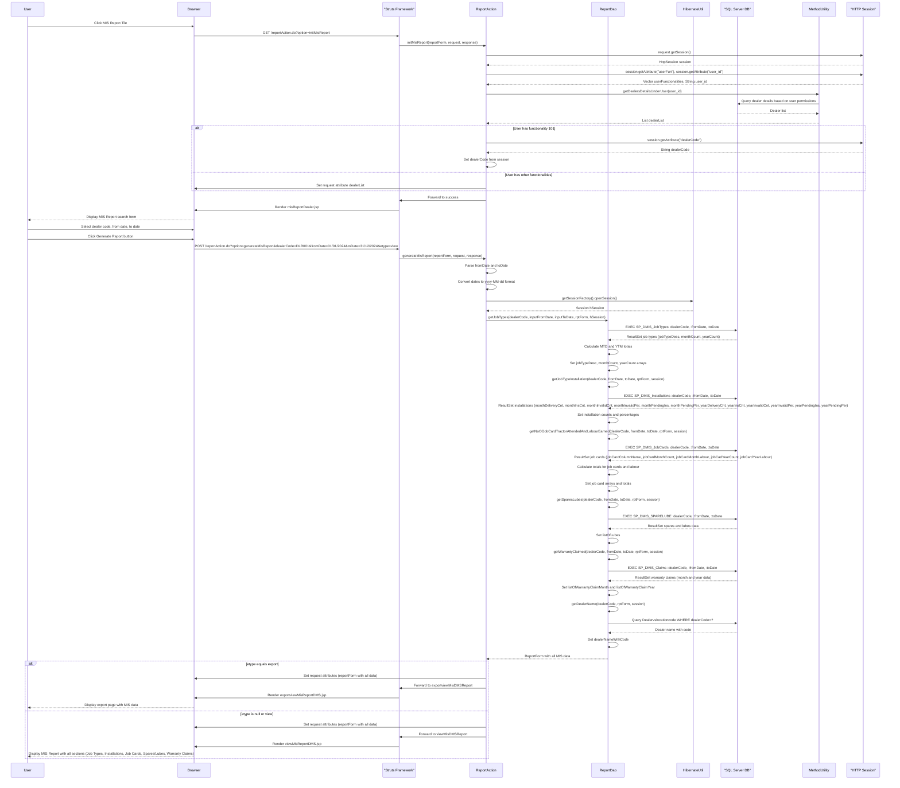
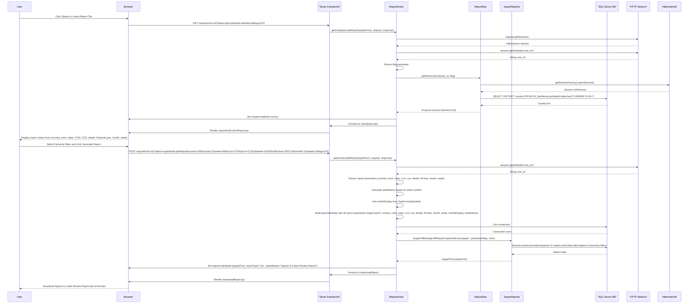
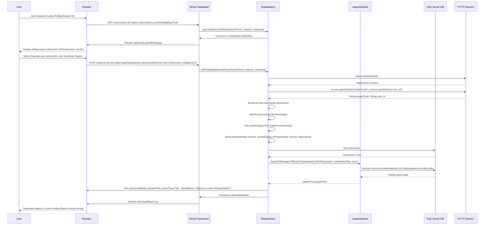
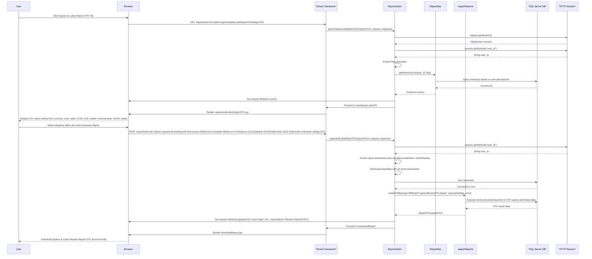
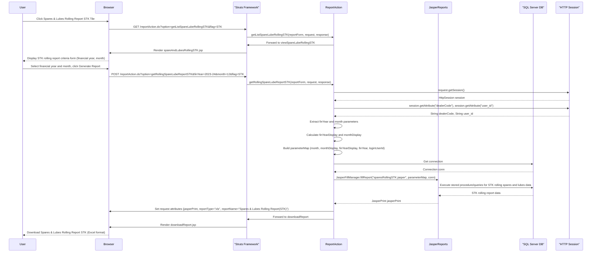
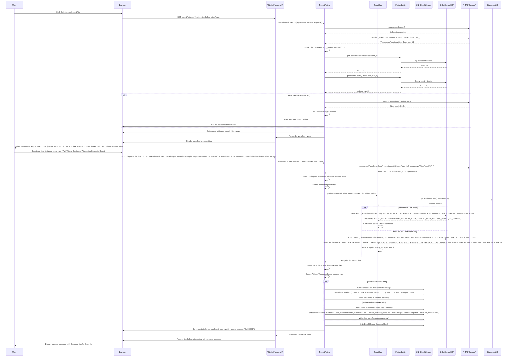
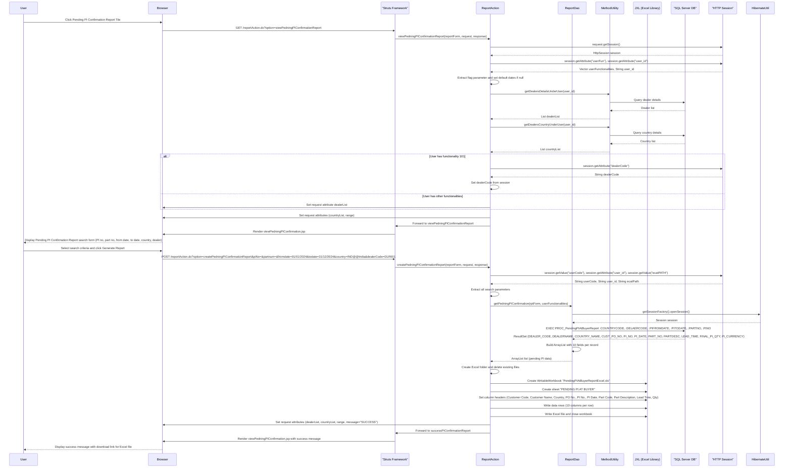
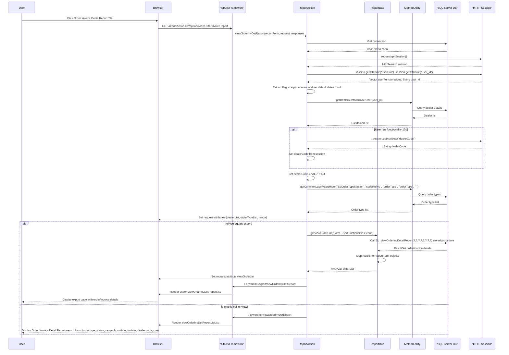
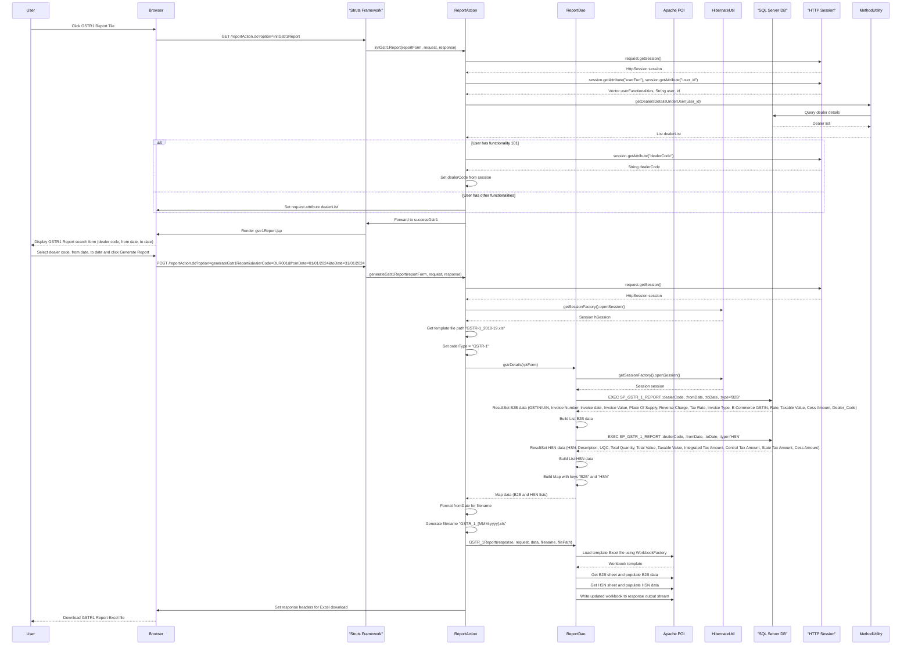
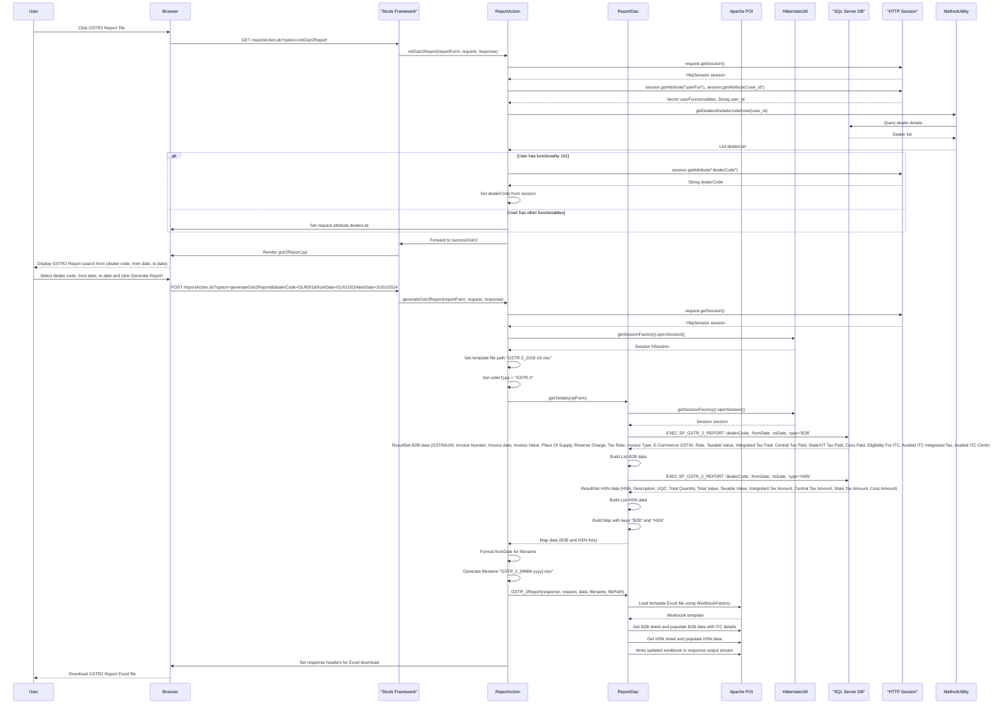

# Report Module Sequence Diagrams

This document contains detailed sequence diagrams for all flows within the Report Module of the ITLDIS system.

## Table of Contents

1. [MIS Report (DMS Report) Flow](#1-mis-report-dms-report-flow)
2. [Spares & Lubes Report Flow](#2-spares--lubes-report-flow)
3. [Spares & Lubes Rolling Report Flow](#3-spares--lubes-rolling-report-flow)
4. [Spares & Lubes Report STK Flow](#4-spares--lubes-report-stk-flow)
5. [Spares & Lubes Rolling Report STK Flow](#5-spares--lubes-rolling-report-stk-flow)
6. [Sale Invoice Report Flow](#6-sale-invoice-report-flow)
7. [Pending PI Confirmation Report Flow](#7-pending-pi-confirmation-report-flow)
8. [Order Invoice Detail Report Flow](#8-order-invoice-detail-report-flow)
9. [GSTR1 Report Flow](#9-gstr1-report-flow)
10. [GSTR2 Report Flow](#10-gstr2-report-flow)

---

## 1. MIS Report (DMS Report) Flow

This diagram shows the complete MIS Report generation process including job types, installations, job cards, spares/lubes, and warranty claims.

---

## 2. Spares & Lubes Report Flow

This diagram shows the Spares & Lubes Review Report generation with hierarchy filters.

---

## 3. Spares & Lubes Rolling Report Flow

This diagram shows the Spares & Lubes Rolling Report generation.

---

## 4. Spares & Lubes Report STK Flow

This diagram shows the Spares & Lubes Report STK generation with hierarchy filters.

---

## 5. Spares & Lubes Rolling Report STK Flow

This diagram shows the Spares & Lubes Rolling Report STK generation.

---

## 6. Sale Invoice Report Flow

This diagram shows the Sale Invoice Report generation with Part Wise and Customer Wise options.

---

## 7. Pending PI Confirmation Report Flow

This diagram shows the Pending PI Confirmation Report generation.

---

## 8. Order Invoice Detail Report Flow

This diagram shows the Order Invoice Detail Report generation.

---

## 9. GSTR1 Report Flow

This diagram shows the GSTR1 (GST Return) Report generation.

---

## 10. GSTR2 Report Flow

This diagram shows the GSTR2 (GST Return) Report generation.

---

## Summary

The Report Module handles:

1. **MIS Report (DMS Report)**: Comprehensive dealer management information system report with job types, installations, job cards, spares/lubes, and warranty claims
2. **Spares & Lubes Reports**: Multiple variants (Review, Rolling, STK versions) with hierarchy-based filtering
3. **Sale Invoice Report**: Part-wise and Customer-wise sales summary reports with Excel export
4. **Pending PI Confirmation Report**: Reports on pending Purchase Indents at buyer level
5. **Order Invoice Detail Report**: Detailed order and invoice information reports
6. **GST Reports**: GSTR1 and GSTR2 reports for GST compliance with B2B and HSN data

All flows integrate with the SQL Server database through Hibernate ORM and use stored procedures for complex queries. Reports are generated using JasperReports for PDF/Excel output or JXL/Apache POI for Excel generation. The module supports dealer-level and HO/Regional-level operations with appropriate access controls based on user functionalities.

