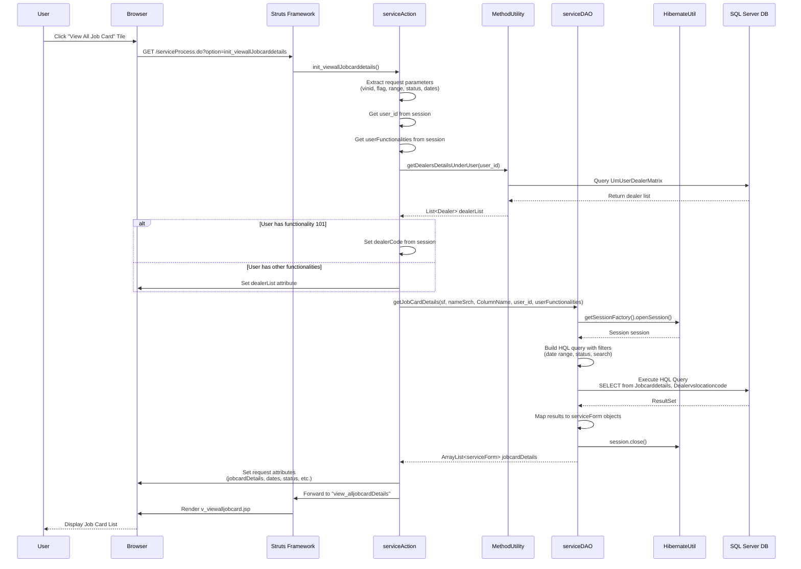
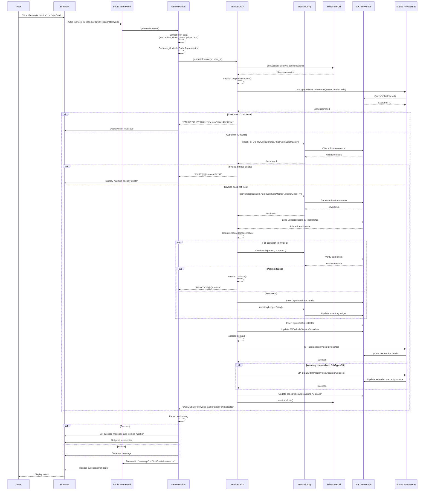
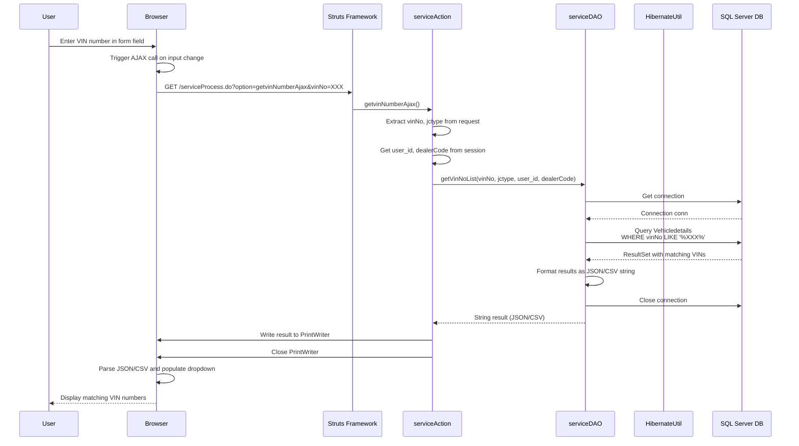
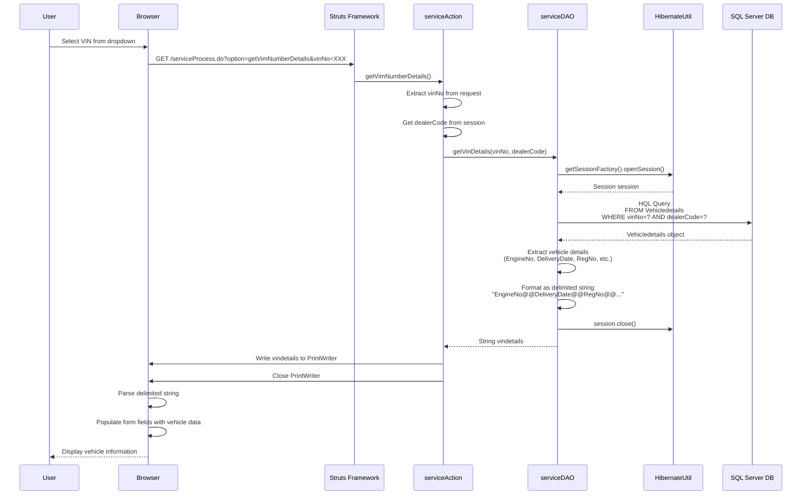
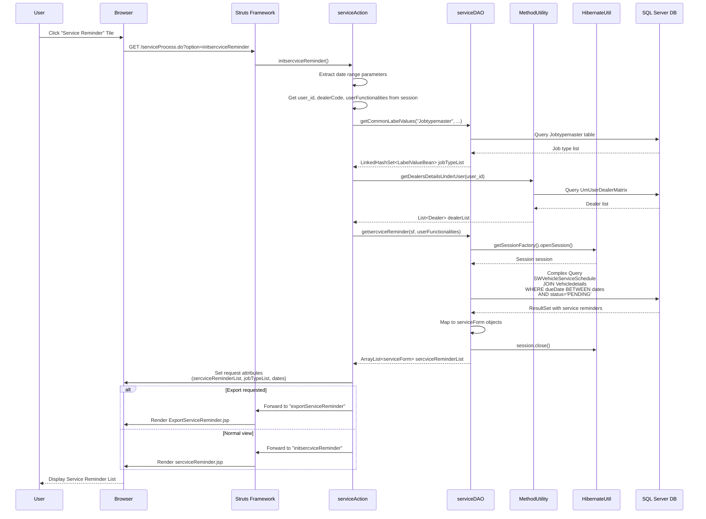
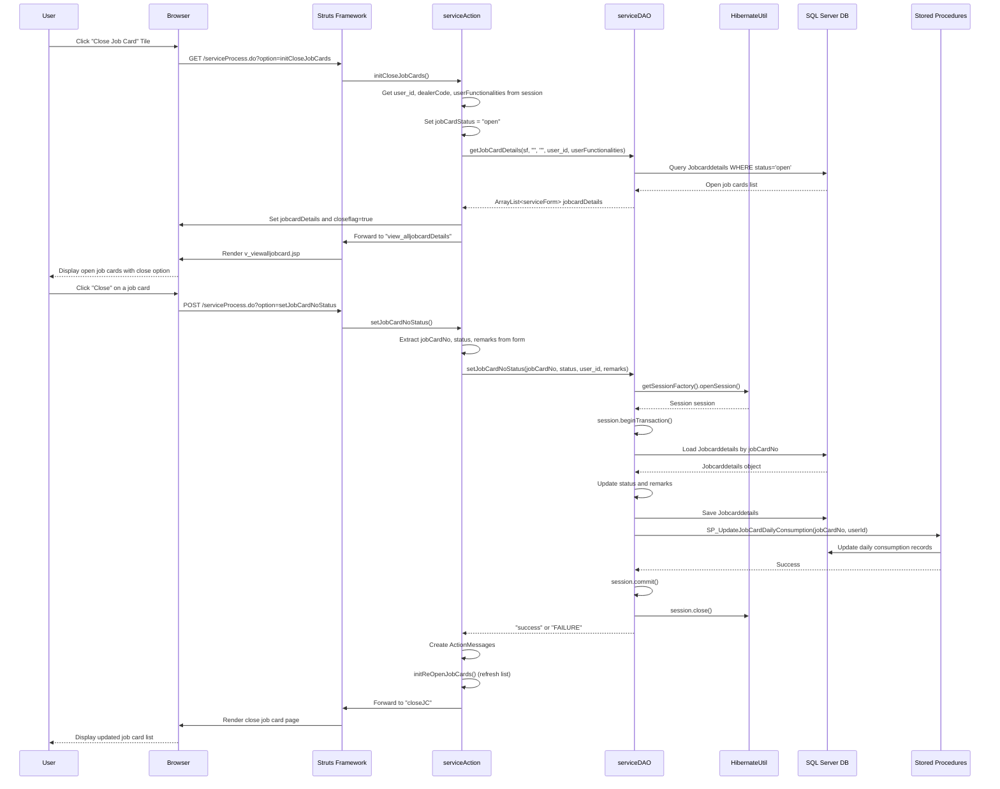
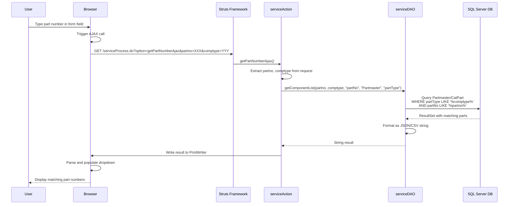
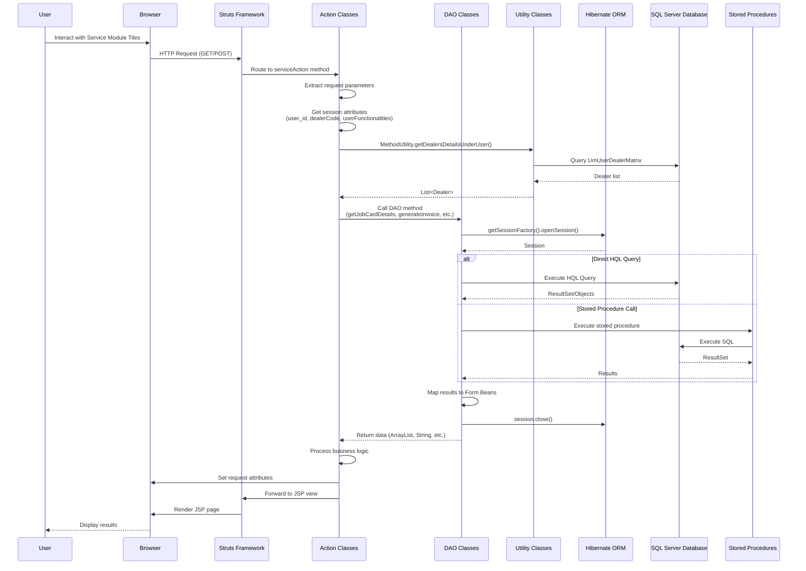

# Service Module Sequence Diagrams

This document contains sequence diagrams for the ITLDIS Service Module, showing the interaction flow between different components.

## 1. View All Job Cards Flow

## 2. Generate Invoice Flow

## 3. VIN Number Details Lookup (AJAX)

## 4. Get VIN Details Flow

## 5. Service Reminder Flow

## 6. Close Job Card Flow

## 7. Part Number Lookup (AJAX)

## 8. Overall Service Module Architecture

## Component Interaction Summary

### Key Components:

1. **User Interface Layer**
   - Browser/Client
   - JSP Pages (v_viewalljobcard.jsp, sercviceReminder.jsp, etc.)

2. **Controller Layer**
   - Struts Framework (routing)
   - serviceAction (business logic coordination)

3. **Service Layer**
   - serviceDAO (data access)
   - MethodUtility (common utilities)

4. **Data Access Layer**
   - Hibernate ORM (object-relational mapping)
   - Direct SQL queries
   - Stored Procedures

5. **Database Layer**
   - SQL Server Database
   - Tables: Jobcarddetails, Vehicledetails, SpInventSaleMaster, etc.
   - Stored Procedures: SP_getVehicleCustomerID, SP_updateTaxInvoice, etc.

### Common Patterns:

1. **Session Management**: User context (user_id, dealerCode, userFunctionalities) stored in HTTP session
2. **Transaction Management**: Hibernate transactions for data consistency
3. **Error Handling**: Try-catch blocks with rollback on errors
4. **AJAX Calls**: Asynchronous requests for dynamic data loading
5. **Form Validation**: Request parameter validation before processing
6. **Authorization**: User functionality checks before allowing operations

