# Spares Module Sequence Diagrams

This document contains detailed sequence diagrams for all flows within the Spares Module of the ITLDIS system. The Spares module is integrated across Service, Inventory, Reports, and PI (Purchase Indent) modules.

## Table of Contents

1. [Add Spares to Job Card Estimate Flow](#1-add-spares-to-job-card-estimate-flow)
2. [Add Spares to Job Card Actual Flow](#2-add-spares-to-job-card-actual-flow)
3. [Get Part Number by AJAX Flow](#3-get-part-number-by-ajax-flow)
4. [Get Part Price by Part Number Flow (AJAX)](#4-get-part-price-by-part-number-flow-ajax)
5. [Get Part Description by AJAX Flow](#5-get-part-description-by-ajax-flow)
6. [Get Part Price by Part Description Flow (AJAX)](#6-get-part-price-by-part-description-flow-ajax)
7. [Check Part Number Flow (AJAX)](#7-check-part-number-flow-ajax)
8. [View Inventory Flow](#8-view-inventory-flow)
9. [Counter Sale Flow](#9-counter-sale-flow)
10. [Spares & Lubes Report Flow](#10-spares--lubes-report-flow)
11. [Create PI for Spares Flow](#11-create-pi-for-spares-flow)

---

## 1. Add Spares to Job Card Estimate Flow

This diagram shows the process of adding spare parts to a job card estimate.

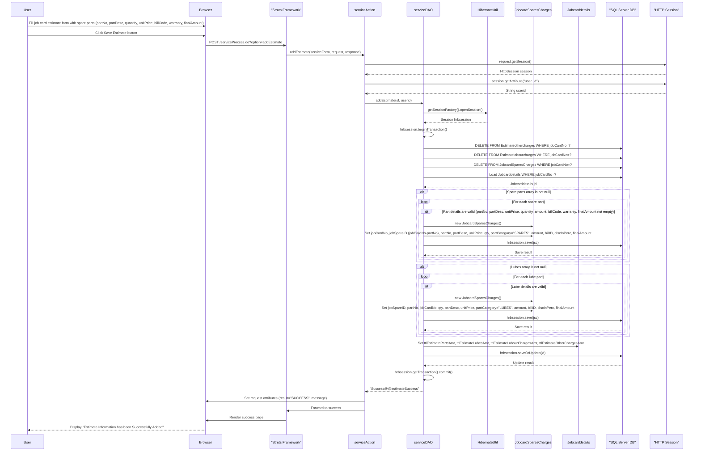

---

## 2. Add Spares to Job Card Actual Flow

This diagram shows the process of adding actual spare parts used to a job card.

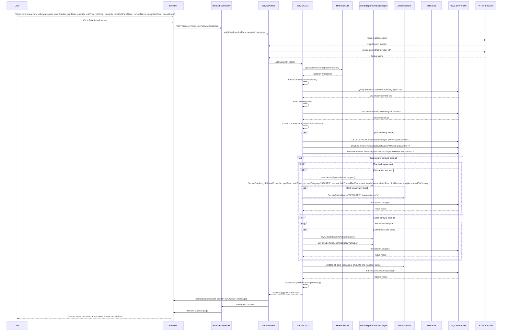

---

## 3. Get Part Number by AJAX Flow

This diagram shows the AJAX flow for retrieving part numbers based on partial input.

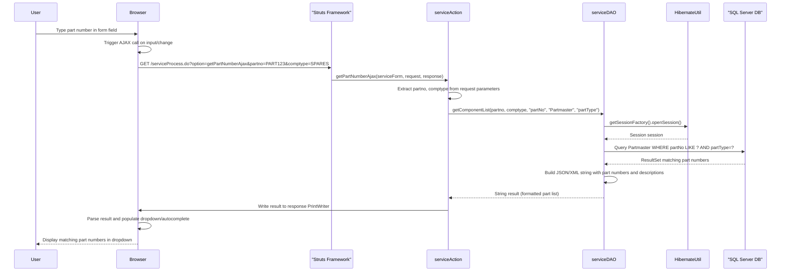

---

## 4. Get Part Price by Part Number Flow (AJAX)

This diagram shows the AJAX flow for retrieving part price based on part number.

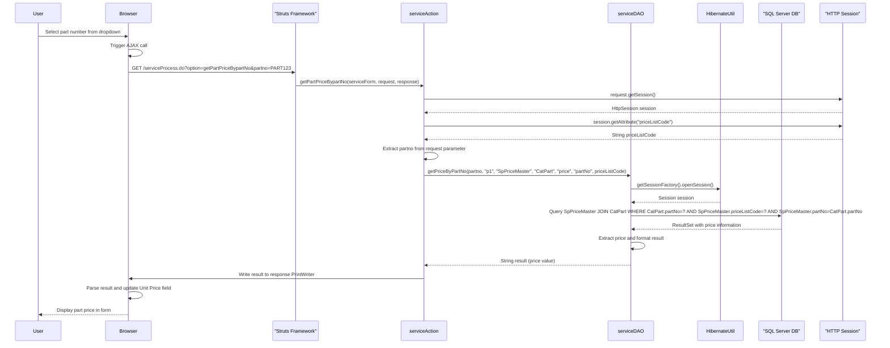

---

## 5. Get Part Description by AJAX Flow

This diagram shows the AJAX flow for retrieving part descriptions based on partial input.

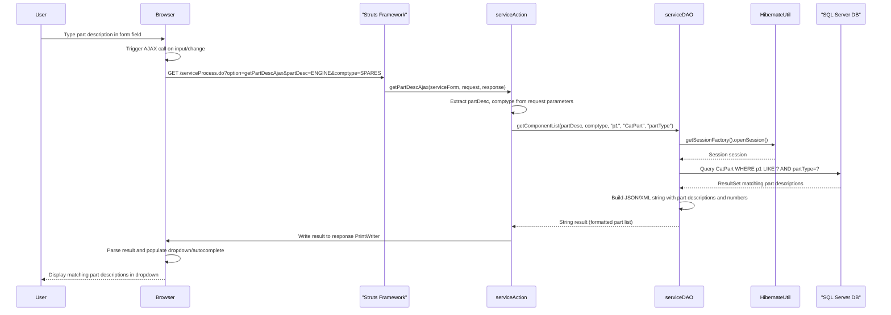

---

## 6. Get Part Price by Part Description Flow (AJAX)

This diagram shows the AJAX flow for retrieving part price based on part description.

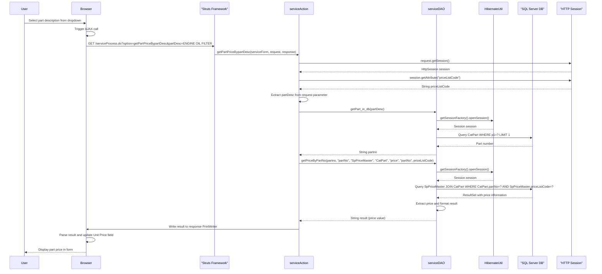

---

## 7. Check Part Number Flow (AJAX)

This diagram shows the AJAX flow for validating if a part number exists in the system.

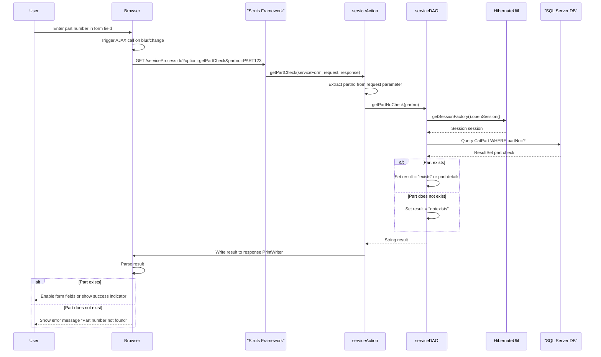

---

## 8. View Inventory Flow

This diagram shows the process of viewing spare parts inventory.

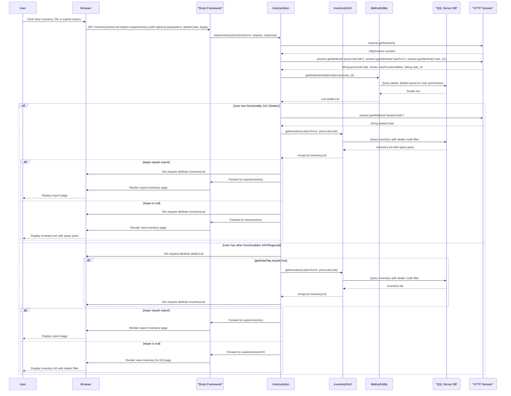

---

## 9. Counter Sale Flow

This diagram shows the process of performing a counter sale of spare parts.

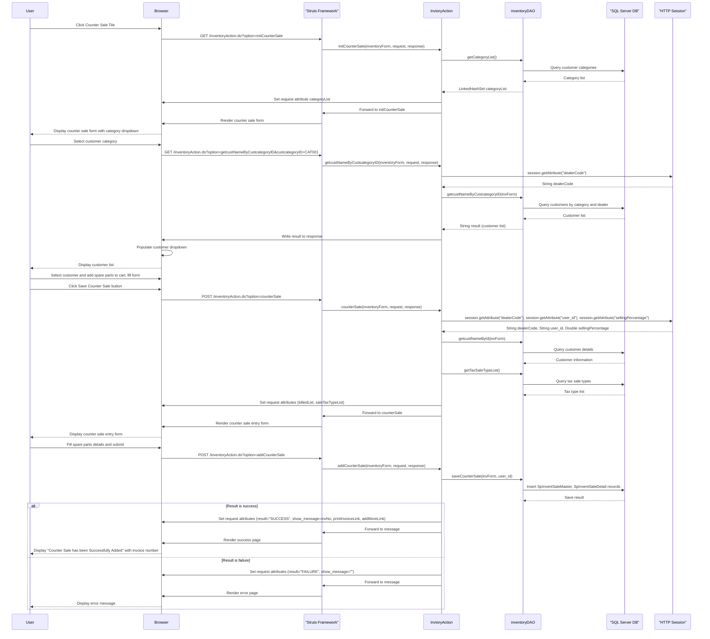

---

## 10. Spares & Lubes Report Flow

This diagram shows the process of generating Spares & Lubes reports.

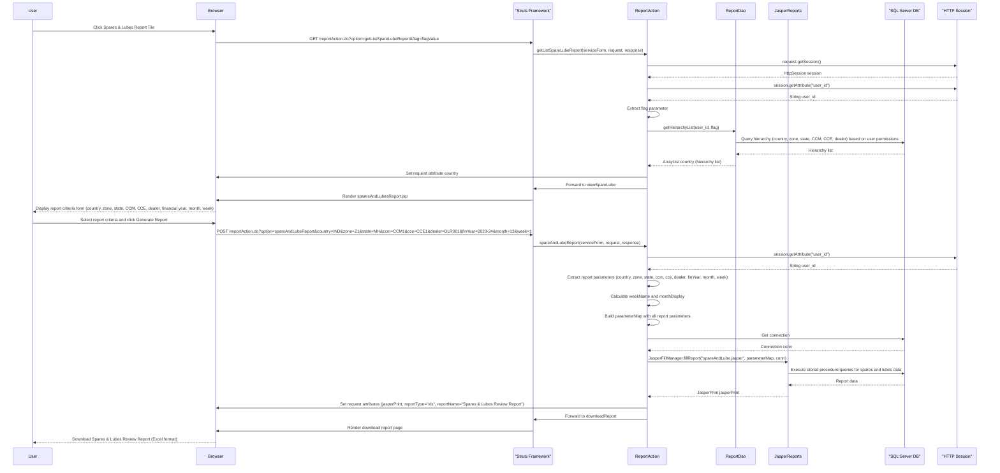

---

## 11. Create PI for Spares Flow

This diagram shows the process of creating a Purchase Indent (PI) for spare parts.

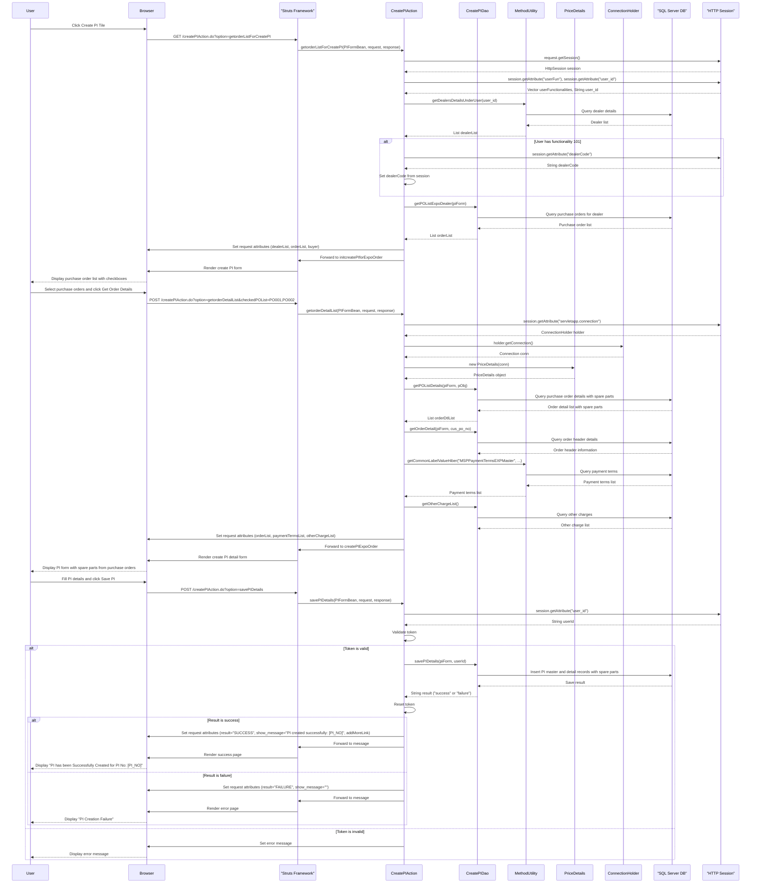

---

## Summary

The Spares Module handles:

1. **Job Card Integration**: Adding spare parts to job card estimates and actuals with warranty tracking
2. **Part Lookup**: AJAX-based part number and description lookup with price retrieval
3. **Inventory Management**: Viewing and managing spare parts inventory across dealers
4. **Counter Sales**: Selling spare parts directly to customers with invoice generation
5. **Reporting**: Generating comprehensive Spares & Lubes reports with hierarchy filters
6. **Purchase Indents**: Creating PIs for spare parts procurement from purchase orders
7. **Price Management**: Retrieving part prices based on price list codes and dealer settings
8. **Warranty Tracking**: Identifying warranty-eligible spare parts and updating job card warranty status

All flows integrate with the SQL Server database through Hibernate ORM and use stored procedures for complex queries. The module supports dealer-level and HO/Regional-level operations with appropriate access controls.

