# Warranty Module Sequence Diagrams

This document contains detailed sequence diagrams for the ITLDIS Warranty Module, showing the interaction flow between different components for all 14 warranty tiles.

## Warranty Module Tiles Overview

1. **Pending for Warranty** (701) - `initWarrantyList`
2. **View Warranty Claim** (703) - `viewWarrantyClaim`
3. **Pending for Pack Gen** (706) - `pendingForDispatch`
4. **Pending 4 Dispatch** (707) - `initPackedWarrantyList`
5. **View Packing List** (708) - `viewPackingList`
6. **Pending For Acknow** (709) - `pendingForAcknow`
7. **Pending Warranty Claim** (705) - `viewPendingWarrantyClaim`
8. **Pending SAP generation** (711) - `pendingSAPList`
9. **View Credit Note** (712) - `viewCreditNote`
10. **Claim Report** (713) - `viewClaimReoprt`
11. **SAP Dump Claim Report** (714) - `viewSAPDumpClaimReoprt`
12. **Update Tax Invoice** (715) - `viewTaxInvoiceUpdate`
13. **Upload Tax Invoice** (716) - `viewTaxInvoiceUpload`
14. **Warranty Dashboard** (1013) - `warrantyClaimStatusDashboard`

---

## 1. Pending for Warranty Flow (Tile #1)

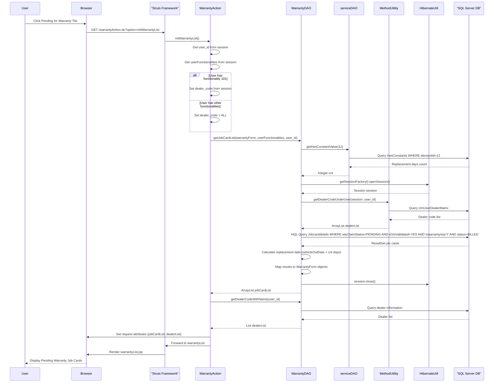
```mermaid
sequenceDiagram
    participant User
    participant Browser
    participant StrutsFramework as "Struts Framework"
    participant WarrantyAction as WarrantyAction
    participant WarrantyDAO as WarrantyDAO
    participant ServiceDAO as serviceDAO
    participant MethodUtility as MethodUtility
    participant HibernateUtil as HibernateUtil
    participant Database as "SQL Server DB"

    User->>Browser: Click Pending for Warranty Tile
    Browser->>StrutsFramework: GET /warrantyAction.do?option=initWarrantyList
    StrutsFramework->>WarrantyAction: initWarrantyList()
    
    WarrantyAction->>WarrantyAction: Get user_id from session
    WarrantyAction->>WarrantyAction: Get userFunctionalities from session
    
    alt User has functionality 101
        WarrantyAction->>WarrantyAction: Set dealer_code from session
    else User has other functionalities
        WarrantyAction->>WarrantyAction: Set dealer_code = ALL
    end
    
    WarrantyAction->>WarrantyDAO: getJobCardList(warrantyForm, userFunctionalities, user_id)
    
    WarrantyDAO->>ServiceDAO: getHesConstantValue(12)
    ServiceDAO->>Database: Query HesConstants WHERE elementId=12
    Database-->>ServiceDAO: Replacement days count
    ServiceDAO-->>WarrantyDAO: Integer cnt
    
    WarrantyDAO->>HibernateUtil: getSessionFactory().openSession()
    HibernateUtil-->>WarrantyDAO: Session session
    
    WarrantyDAO->>MethodUtility: getDealerCodeUnderUser(session, user_id)
    MethodUtility->>Database: Query UmUserDealerMatrix
    Database-->>MethodUtility: Dealer code list
    MethodUtility-->>WarrantyDAO: ArrayList dealerList
    
    WarrantyDAO->>Database: HQL Query Jobcarddetails WHERE wtyClaimStatus=PENDING AND isVinValidated=YES AND iswarrantyreq=Y AND status=BILLED
    Database-->>WarrantyDAO: ResultSet job cards
    
    WarrantyDAO->>WarrantyDAO: Calculate replacement date (vehicleOutDate + cnt days)
    WarrantyDAO->>WarrantyDAO: Map results to WarrantyForm objects
    WarrantyDAO->>HibernateUtil: session.close()
    WarrantyDAO-->>WarrantyAction: ArrayList jobCardList
    
    WarrantyAction->>WarrantyDAO: getDealerCodeWithName(user_id)
    WarrantyDAO->>Database: Query dealer information
    Database-->>WarrantyDAO: Dealer list
    WarrantyDAO-->>WarrantyAction: List dealerList
    
    WarrantyAction->>Browser: Set request attributes (jobCardList, dealerList)
    WarrantyAction->>StrutsFramework: Forward to warrantyList
    StrutsFramework->>Browser: Render warrantyList.jsp
    Browser-->>User: Display Pending Warranty Job Cards
```

## 2. Create Warranty Claim Flow

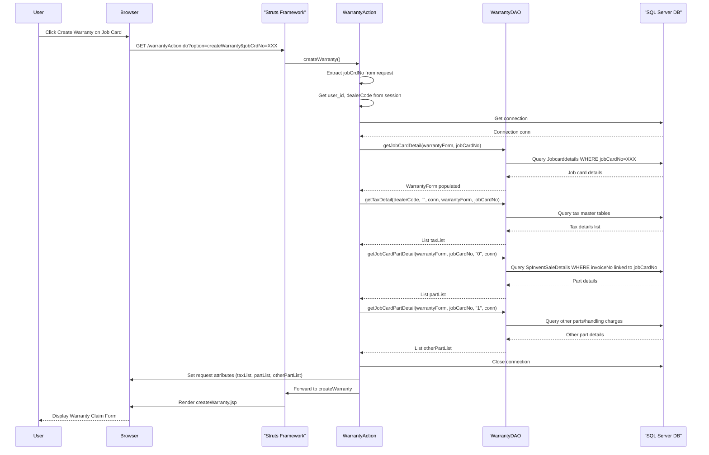
```mermaid
sequenceDiagram
    participant User
    participant Browser
    participant StrutsFramework as "Struts Framework"
    participant WarrantyAction as WarrantyAction
    participant WarrantyDAO as WarrantyDAO
    participant Database as "SQL Server DB"

    User->>Browser: Click Create Warranty on Job Card
    Browser->>StrutsFramework: GET /warrantyAction.do?option=createWarranty&jobCrdNo=XXX
    StrutsFramework->>WarrantyAction: createWarranty()
    
    WarrantyAction->>WarrantyAction: Extract jobCrdNo from request
    WarrantyAction->>WarrantyAction: Get user_id, dealerCode from session
    
    WarrantyAction->>Database: Get connection
    Database-->>WarrantyAction: Connection conn
    
    WarrantyAction->>WarrantyDAO: getJobCardDetail(warrantyForm, jobCardNo)
    WarrantyDAO->>Database: Query Jobcarddetails WHERE jobCardNo=XXX
    Database-->>WarrantyDAO: Job card details
    WarrantyDAO-->>WarrantyAction: WarrantyForm populated
    
    WarrantyAction->>WarrantyDAO: getTaxDetail(dealerCode, "", conn, warrantyForm, jobCardNo)
    WarrantyDAO->>Database: Query tax master tables
    Database-->>WarrantyDAO: Tax details list
    WarrantyDAO-->>WarrantyAction: List taxList
    
    WarrantyAction->>WarrantyDAO: getJobCardPartDetail(warrantyForm, jobCardNo, "0", conn)
    WarrantyDAO->>Database: Query SpInventSaleDetails WHERE invoiceNo linked to jobCardNo
    Database-->>WarrantyDAO: Part details
    WarrantyDAO-->>WarrantyAction: List partList
    
    WarrantyAction->>WarrantyDAO: getJobCardPartDetail(warrantyForm, jobCardNo, "1", conn)
    WarrantyDAO->>Database: Query other parts/handling charges
    Database-->>WarrantyDAO: Other part details
    WarrantyDAO-->>WarrantyAction: List otherPartList
    
    WarrantyAction->>Database: Close connection
    WarrantyAction->>Browser: Set request attributes (taxList, partList, otherPartList)
    WarrantyAction->>StrutsFramework: Forward to createWarranty
    StrutsFramework->>Browser: Render createWarranty.jsp
    Browser-->>User: Display Warranty Claim Form
```

## 3. Save Warranty Claim Flow

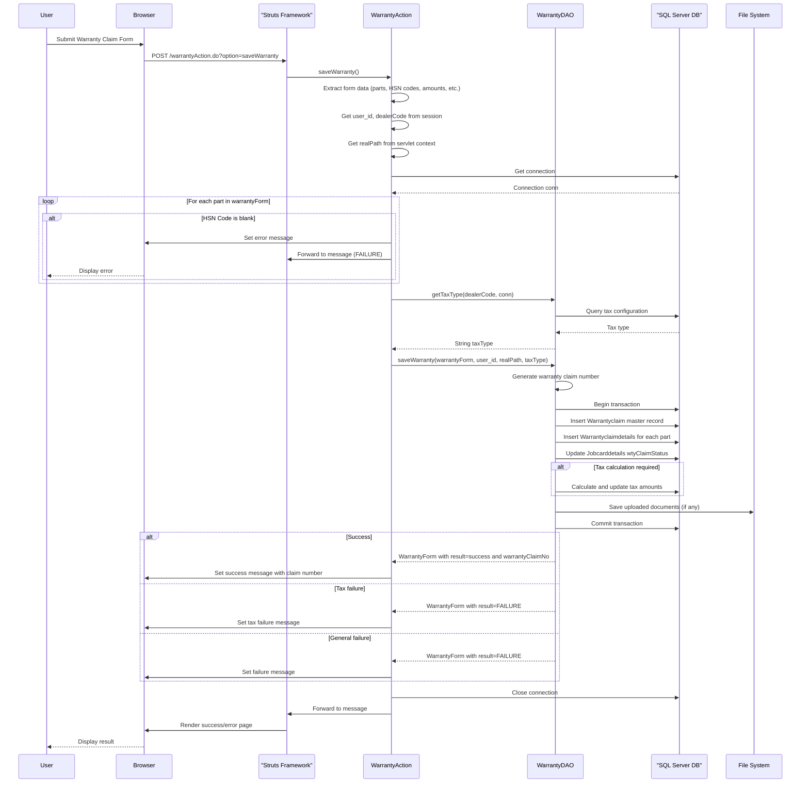
```mermaid
sequenceDiagram
    participant User
    participant Browser
    participant StrutsFramework as "Struts Framework"
    participant WarrantyAction as WarrantyAction
    participant WarrantyDAO as WarrantyDAO
    participant Database as "SQL Server DB"
    participant FileSystem as File System

    User->>Browser: Submit Warranty Claim Form
    Browser->>StrutsFramework: POST /warrantyAction.do?option=saveWarranty
    StrutsFramework->>WarrantyAction: saveWarranty()
    
    WarrantyAction->>WarrantyAction: Extract form data (parts, HSN codes, amounts, etc.)
    WarrantyAction->>WarrantyAction: Get user_id, dealerCode from session
    WarrantyAction->>WarrantyAction: Get realPath from servlet context
    
    WarrantyAction->>Database: Get connection
    Database-->>WarrantyAction: Connection conn
    
    loop For each part in warrantyForm
        alt HSN Code is blank
            WarrantyAction->>Browser: Set error message
            WarrantyAction->>StrutsFramework: Forward to message (FAILURE)
            Browser-->>User: Display error
        end
    end
    
    WarrantyAction->>WarrantyDAO: getTaxType(dealerCode, conn)
    WarrantyDAO->>Database: Query tax configuration
    Database-->>WarrantyDAO: Tax type
    WarrantyDAO-->>WarrantyAction: String taxType
    
    WarrantyAction->>WarrantyDAO: saveWarranty(warrantyForm, user_id, realPath, taxType)
    
    WarrantyDAO->>WarrantyDAO: Generate warranty claim number
    WarrantyDAO->>Database: Begin transaction
    
    WarrantyDAO->>Database: Insert Warrantyclaim master record
    WarrantyDAO->>Database: Insert Warrantyclaimdetails for each part
    WarrantyDAO->>Database: Update Jobcarddetails wtyClaimStatus
    
    alt Tax calculation required
        WarrantyDAO->>Database: Calculate and update tax amounts
    end
    
    WarrantyDAO->>FileSystem: Save uploaded documents (if any)
    WarrantyDAO->>Database: Commit transaction
    
    alt Success
        WarrantyDAO-->>WarrantyAction: WarrantyForm with result=success and warrantyClaimNo
        WarrantyAction->>Browser: Set success message with claim number
    else Tax failure
        WarrantyDAO-->>WarrantyAction: WarrantyForm with result=FAILURE
        WarrantyAction->>Browser: Set tax failure message
    else General failure
        WarrantyDAO-->>WarrantyAction: WarrantyForm with result=FAILURE
        WarrantyAction->>Browser: Set failure message
    end
    
    WarrantyAction->>Database: Close connection
    WarrantyAction->>StrutsFramework: Forward to message
    StrutsFramework->>Browser: Render success/error page
    Browser-->>User: Display result
```

## 4. View Warranty Claim Flow (Tile #2)

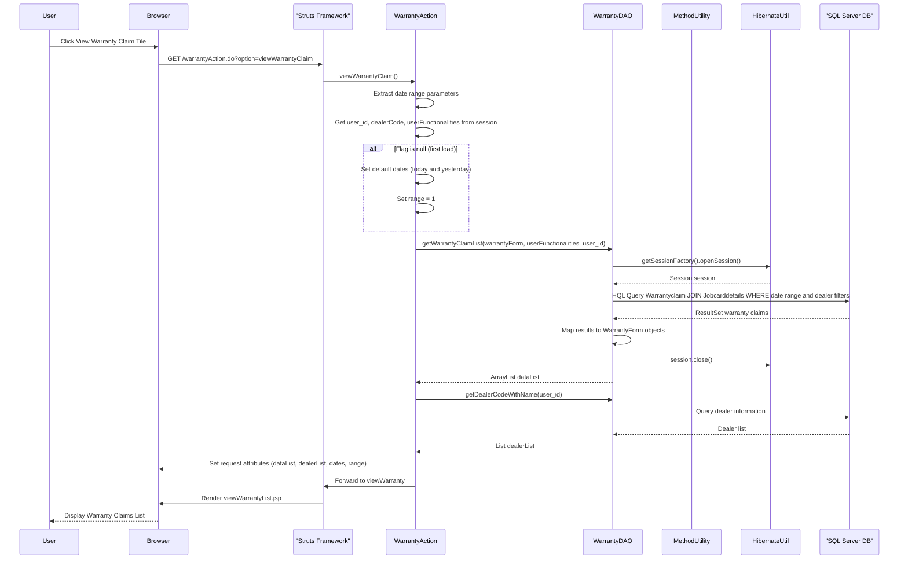
```mermaid
sequenceDiagram
    participant User
    participant Browser
    participant StrutsFramework as "Struts Framework"
    participant WarrantyAction as WarrantyAction
    participant WarrantyDAO as WarrantyDAO
    participant MethodUtility as MethodUtility
    participant HibernateUtil as HibernateUtil
    participant Database as "SQL Server DB"

    User->>Browser: Click View Warranty Claim Tile
    Browser->>StrutsFramework: GET /warrantyAction.do?option=viewWarrantyClaim
    StrutsFramework->>WarrantyAction: viewWarrantyClaim()
    
    WarrantyAction->>WarrantyAction: Extract date range parameters
    WarrantyAction->>WarrantyAction: Get user_id, dealerCode, userFunctionalities from session
    
    alt Flag is null (first load)
        WarrantyAction->>WarrantyAction: Set default dates (today and yesterday)
        WarrantyAction->>WarrantyAction: Set range = 1
    end
    
    WarrantyAction->>WarrantyDAO: getWarrantyClaimList(warrantyForm, userFunctionalities, user_id)
    
    WarrantyDAO->>HibernateUtil: getSessionFactory().openSession()
    HibernateUtil-->>WarrantyDAO: Session session
    
    WarrantyDAO->>Database: HQL Query Warrantyclaim JOIN Jobcarddetails WHERE date range and dealer filters
    Database-->>WarrantyDAO: ResultSet warranty claims
    
    WarrantyDAO->>WarrantyDAO: Map results to WarrantyForm objects
    WarrantyDAO->>HibernateUtil: session.close()
    WarrantyDAO-->>WarrantyAction: ArrayList dataList
    
    WarrantyAction->>WarrantyDAO: getDealerCodeWithName(user_id)
    WarrantyDAO->>Database: Query dealer information
    Database-->>WarrantyDAO: Dealer list
    WarrantyDAO-->>WarrantyAction: List dealerList
    
    WarrantyAction->>Browser: Set request attributes (dataList, dealerList, dates, range)
    WarrantyAction->>StrutsFramework: Forward to viewWarranty
    StrutsFramework->>Browser: Render viewWarrantyList.jsp
    Browser-->>User: Display Warranty Claims List
```

## 5. View Warranty Claim Detail Flow

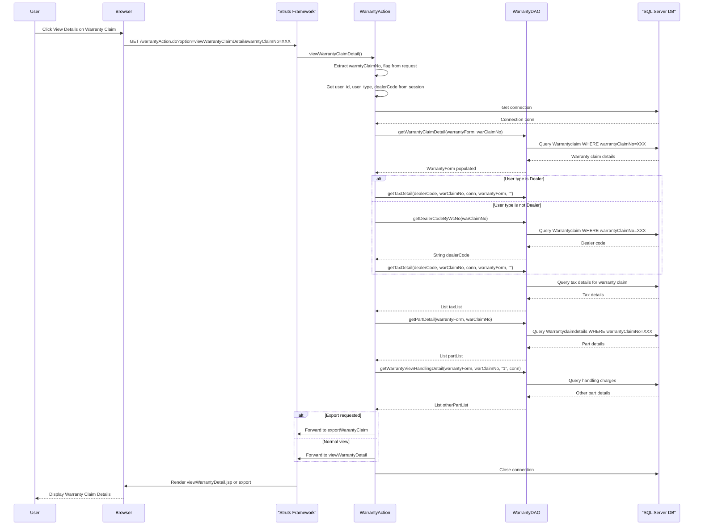
```mermaid
sequenceDiagram
    participant User
    participant Browser
    participant StrutsFramework as "Struts Framework"
    participant WarrantyAction as WarrantyAction
    participant WarrantyDAO as WarrantyDAO
    participant Database as "SQL Server DB"

    User->>Browser: Click View Details on Warranty Claim
    Browser->>StrutsFramework: GET /warrantyAction.do?option=viewWarrantyClaimDetail&warrntyClaimNo=XXX
    StrutsFramework->>WarrantyAction: viewWarrantyClaimDetail()
    
    WarrantyAction->>WarrantyAction: Extract warrntyClaimNo, flag from request
    WarrantyAction->>WarrantyAction: Get user_id, user_type, dealerCode from session
    
    WarrantyAction->>Database: Get connection
    Database-->>WarrantyAction: Connection conn
    
    WarrantyAction->>WarrantyDAO: getWarrantyClaimDetail(warrantyForm, warClaimNo)
    WarrantyDAO->>Database: Query Warrantyclaim WHERE warrantyClaimNo=XXX
    Database-->>WarrantyDAO: Warranty claim details
    WarrantyDAO-->>WarrantyAction: WarrantyForm populated
    
    alt User type is Dealer
        WarrantyAction->>WarrantyDAO: getTaxDetail(dealerCode, warClaimNo, conn, warrantyForm, "")
    else User type is not Dealer
        WarrantyAction->>WarrantyDAO: getDealerCodeByWcNo(warClaimNo)
        WarrantyDAO->>Database: Query Warrantyclaim WHERE warrantyClaimNo=XXX
        Database-->>WarrantyDAO: Dealer code
        WarrantyDAO-->>WarrantyAction: String dealerCode
        WarrantyAction->>WarrantyDAO: getTaxDetail(dealerCode, warClaimNo, conn, warrantyForm, "")
    end
    
    WarrantyDAO->>Database: Query tax details for warranty claim
    Database-->>WarrantyDAO: Tax details
    WarrantyDAO-->>WarrantyAction: List taxList
    
    WarrantyAction->>WarrantyDAO: getPartDetail(warrantyForm, warClaimNo)
    WarrantyDAO->>Database: Query Warrantyclaimdetails WHERE warrantyClaimNo=XXX
    Database-->>WarrantyDAO: Part details
    WarrantyDAO-->>WarrantyAction: List partList
    
    WarrantyAction->>WarrantyDAO: getWarrantyViewHandlingDetail(warrantyForm, warClaimNo, "1", conn)
    WarrantyDAO->>Database: Query handling charges
    Database-->>WarrantyDAO: Other part details
    WarrantyDAO-->>WarrantyAction: List otherPartList
    
    alt Export requested
        WarrantyAction->>StrutsFramework: Forward to exportWarantyClaim
    else Normal view
        WarrantyAction->>StrutsFramework: Forward to viewWarrantyDetail
    end
    
    WarrantyAction->>Database: Close connection
    StrutsFramework->>Browser: Render viewWarrantyDetail.jsp or export
    Browser-->>User: Display Warranty Claim Details
```

## 6. Approve Warranty Claim Flow

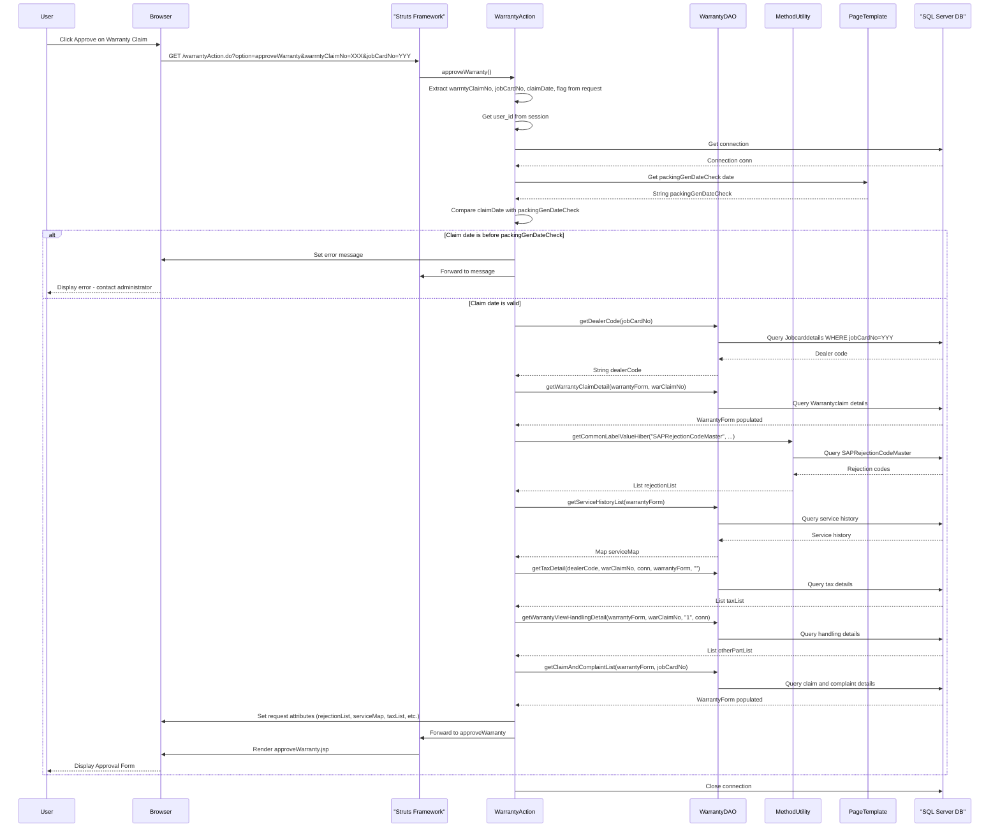
```mermaid
sequenceDiagram
    participant User
    participant Browser
    participant StrutsFramework as "Struts Framework"
    participant WarrantyAction as WarrantyAction
    participant WarrantyDAO as WarrantyDAO
    participant MethodUtility as MethodUtility
    participant PageTemplate as PageTemplate
    participant Database as "SQL Server DB"

    User->>Browser: Click Approve on Warranty Claim
    Browser->>StrutsFramework: GET /warrantyAction.do?option=approveWarranty&warrntyClaimNo=XXX&jobCardNo=YYY
    StrutsFramework->>WarrantyAction: approveWarranty()
    
    WarrantyAction->>WarrantyAction: Extract warrntyClaimNo, jobCardNo, claimDate, flag from request
    WarrantyAction->>WarrantyAction: Get user_id from session
    
    WarrantyAction->>Database: Get connection
    Database-->>WarrantyAction: Connection conn
    
    WarrantyAction->>PageTemplate: Get packingGenDateCheck date
    PageTemplate-->>WarrantyAction: String packingGenDateCheck
    
    WarrantyAction->>WarrantyAction: Compare claimDate with packingGenDateCheck
    
    alt Claim date is before packingGenDateCheck
        WarrantyAction->>Browser: Set error message
        WarrantyAction->>StrutsFramework: Forward to message
        Browser-->>User: Display error - contact administrator
    else Claim date is valid
        WarrantyAction->>WarrantyDAO: getDealerCode(jobCardNo)
        WarrantyDAO->>Database: Query Jobcarddetails WHERE jobCardNo=YYY
        Database-->>WarrantyDAO: Dealer code
        WarrantyDAO-->>WarrantyAction: String dealerCode
        
        WarrantyAction->>WarrantyDAO: getWarrantyClaimDetail(warrantyForm, warClaimNo)
        WarrantyDAO->>Database: Query Warrantyclaim details
        Database-->>WarrantyAction: WarrantyForm populated
        
        WarrantyAction->>MethodUtility: getCommonLabelValueHiber("SAPRejectionCodeMaster", ...)
        MethodUtility->>Database: Query SAPRejectionCodeMaster
        Database-->>MethodUtility: Rejection codes
        MethodUtility-->>WarrantyAction: List rejectionList
        
        WarrantyAction->>WarrantyDAO: getServiceHistoryList(warrantyForm)
        WarrantyDAO->>Database: Query service history
        Database-->>WarrantyDAO: Service history
        WarrantyDAO-->>WarrantyAction: Map serviceMap
        
        WarrantyAction->>WarrantyDAO: getTaxDetail(dealerCode, warClaimNo, conn, warrantyForm, "")
        WarrantyDAO->>Database: Query tax details
        Database-->>WarrantyAction: List taxList
        
        WarrantyAction->>WarrantyDAO: getWarrantyViewHandlingDetail(warrantyForm, warClaimNo, "1", conn)
        WarrantyDAO->>Database: Query handling details
        Database-->>WarrantyAction: List otherPartList
        
        WarrantyAction->>WarrantyDAO: getClaimAndComplaintList(warrantyForm, jobCardNo)
        WarrantyDAO->>Database: Query claim and complaint details
        Database-->>WarrantyAction: WarrantyForm populated
        
        WarrantyAction->>Browser: Set request attributes (rejectionList, serviceMap, taxList, etc.)
        WarrantyAction->>StrutsFramework: Forward to approveWarranty
        StrutsFramework->>Browser: Render approveWarranty.jsp
        Browser-->>User: Display Approval Form
    end
    
    WarrantyAction->>Database: Close connection
```

## 7. Save Approve Warranty Flow

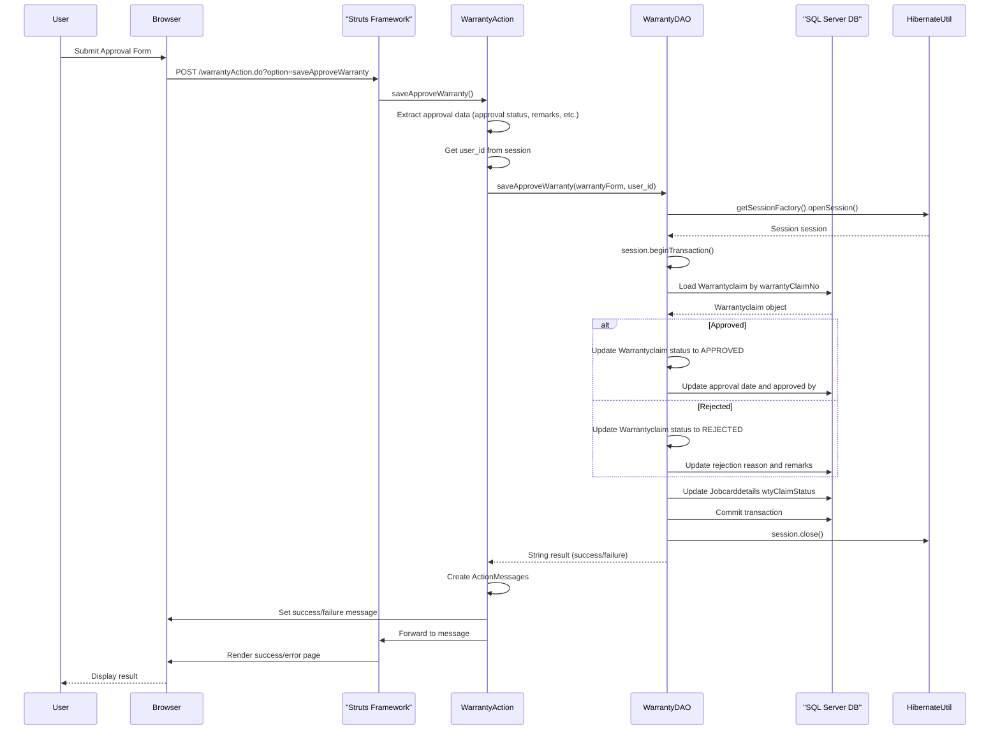
```mermaid
sequenceDiagram
    participant User
    participant Browser
    participant StrutsFramework as "Struts Framework"
    participant WarrantyAction as WarrantyAction
    participant WarrantyDAO as WarrantyDAO
    participant Database as "SQL Server DB"

    User->>Browser: Submit Approval Form
    Browser->>StrutsFramework: POST /warrantyAction.do?option=saveApproveWarranty
    StrutsFramework->>WarrantyAction: saveApproveWarranty()
    
    WarrantyAction->>WarrantyAction: Extract approval data (approval status, remarks, etc.)
    WarrantyAction->>WarrantyAction: Get user_id from session
    
    WarrantyAction->>WarrantyDAO: saveApproveWarranty(warrantyForm, user_id)
    
    WarrantyDAO->>HibernateUtil: getSessionFactory().openSession()
    HibernateUtil-->>WarrantyDAO: Session session
    WarrantyDAO->>WarrantyDAO: session.beginTransaction()
    
    WarrantyDAO->>Database: Load Warrantyclaim by warrantyClaimNo
    Database-->>WarrantyDAO: Warrantyclaim object
    
    alt Approved
        WarrantyDAO->>WarrantyDAO: Update Warrantyclaim status to APPROVED
        WarrantyDAO->>Database: Update approval date and approved by
    else Rejected
        WarrantyDAO->>WarrantyDAO: Update Warrantyclaim status to REJECTED
        WarrantyDAO->>Database: Update rejection reason and remarks
    end
    
    WarrantyDAO->>Database: Update Jobcarddetails wtyClaimStatus
    WarrantyDAO->>Database: Commit transaction
    WarrantyDAO->>HibernateUtil: session.close()
    
    WarrantyDAO-->>WarrantyAction: String result (success/failure)
    
    WarrantyAction->>WarrantyAction: Create ActionMessages
    WarrantyAction->>Browser: Set success/failure message
    WarrantyAction->>StrutsFramework: Forward to message
    StrutsFramework->>Browser: Render success/error page
    Browser-->>User: Display result
```

## 8. Pending for Pack Gen Flow (Tile #3)

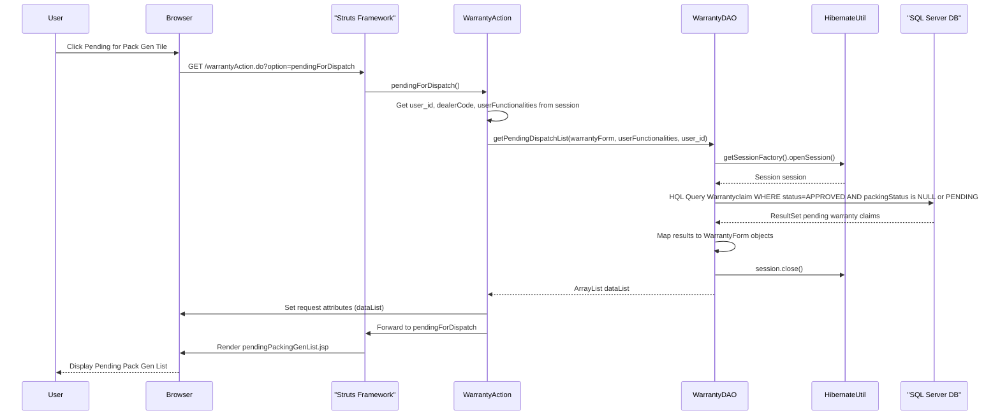
```mermaid
sequenceDiagram
    participant User
    participant Browser
    participant StrutsFramework as "Struts Framework"
    participant WarrantyAction as WarrantyAction
    participant WarrantyDAO as WarrantyDAO
    participant HibernateUtil as HibernateUtil
    participant Database as "SQL Server DB"

    User->>Browser: Click Pending for Pack Gen Tile
    Browser->>StrutsFramework: GET /warrantyAction.do?option=pendingForDispatch
    StrutsFramework->>WarrantyAction: pendingForDispatch()
    
    WarrantyAction->>WarrantyAction: Get user_id, dealerCode, userFunctionalities from session
    
    WarrantyAction->>WarrantyDAO: getPendingDispatchList(warrantyForm, userFunctionalities, user_id)
    
    WarrantyDAO->>HibernateUtil: getSessionFactory().openSession()
    HibernateUtil-->>WarrantyDAO: Session session
    
    WarrantyDAO->>Database: HQL Query Warrantyclaim WHERE status=APPROVED AND packingStatus is NULL or PENDING
    Database-->>WarrantyDAO: ResultSet pending warranty claims
    
    WarrantyDAO->>WarrantyDAO: Map results to WarrantyForm objects
    WarrantyDAO->>HibernateUtil: session.close()
    WarrantyDAO-->>WarrantyAction: ArrayList dataList
    
    WarrantyAction->>Browser: Set request attributes (dataList)
    WarrantyAction->>StrutsFramework: Forward to pendingForDispatch
    StrutsFramework->>Browser: Render pendingPackingGenList.jsp
    Browser-->>User: Display Pending Pack Gen List
```

## 9. Generate Packing List Flow

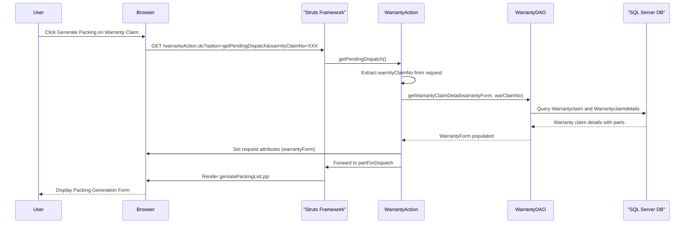
```mermaid
sequenceDiagram
    participant User
    participant Browser
    participant StrutsFramework as "Struts Framework"
    participant WarrantyAction as WarrantyAction
    participant WarrantyDAO as WarrantyDAO
    participant Database as "SQL Server DB"

    User->>Browser: Click Generate Packing on Warranty Claim
    Browser->>StrutsFramework: GET /warrantyAction.do?option=getPendingDispatch&warrntyClaimNo=XXX
    StrutsFramework->>WarrantyAction: getPendingDispatch()
    
    WarrantyAction->>WarrantyAction: Extract warrntyClaimNo from request
    WarrantyAction->>WarrantyDAO: getWarrantyClaimDetail(warrantyForm, warClaimNo)
    
    WarrantyDAO->>Database: Query Warrantyclaim and Warrantyclaimdetails
    Database-->>WarrantyDAO: Warranty claim details with parts
    WarrantyDAO-->>WarrantyAction: WarrantyForm populated
    
    WarrantyAction->>Browser: Set request attributes (warrantyForm)
    WarrantyAction->>StrutsFramework: Forward to partForDispatch
    StrutsFramework->>Browser: Render genratePackingList.jsp
    Browser-->>User: Display Packing Generation Form
```

## 10. Save Part Dispatch Flow

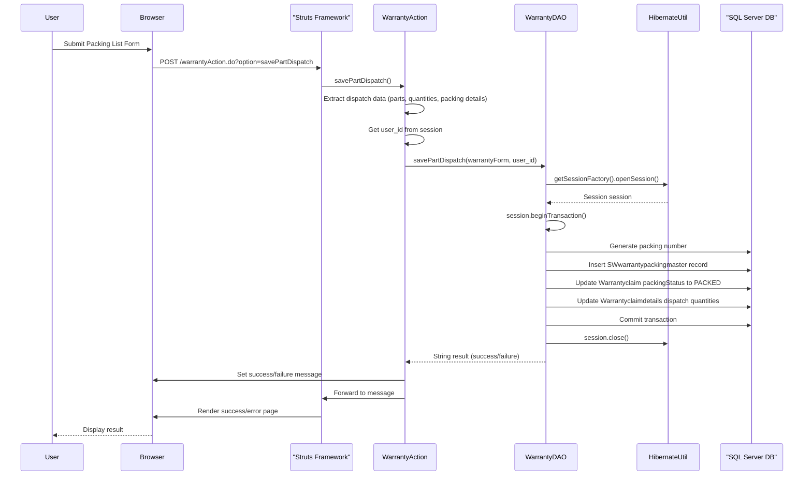
```mermaid
sequenceDiagram
    participant User
    participant Browser
    participant StrutsFramework as "Struts Framework"
    participant WarrantyAction as WarrantyAction
    participant WarrantyDAO as WarrantyDAO
    participant HibernateUtil as HibernateUtil
    participant Database as "SQL Server DB"

    User->>Browser: Submit Packing List Form
    Browser->>StrutsFramework: POST /warrantyAction.do?option=savePartDispatch
    StrutsFramework->>WarrantyAction: savePartDispatch()
    
    WarrantyAction->>WarrantyAction: Extract dispatch data (parts, quantities, packing details)
    WarrantyAction->>WarrantyAction: Get user_id from session
    
    WarrantyAction->>WarrantyDAO: savePartDispatch(warrantyForm, user_id)
    
    WarrantyDAO->>HibernateUtil: getSessionFactory().openSession()
    HibernateUtil-->>WarrantyDAO: Session session
    WarrantyDAO->>WarrantyDAO: session.beginTransaction()
    
    WarrantyDAO->>Database: Generate packing number
    WarrantyDAO->>Database: Insert SWwarrantypackingmaster record
    WarrantyDAO->>Database: Update Warrantyclaim packingStatus to PACKED
    WarrantyDAO->>Database: Update Warrantyclaimdetails dispatch quantities
    
    WarrantyDAO->>Database: Commit transaction
    WarrantyDAO->>HibernateUtil: session.close()
    
    WarrantyDAO-->>WarrantyAction: String result (success/failure)
    
    WarrantyAction->>Browser: Set success/failure message
    WarrantyAction->>StrutsFramework: Forward to message
    StrutsFramework->>Browser: Render success/error page
    Browser-->>User: Display result
```

## 11. Pending 4 Dispatch Flow (Tile #4)

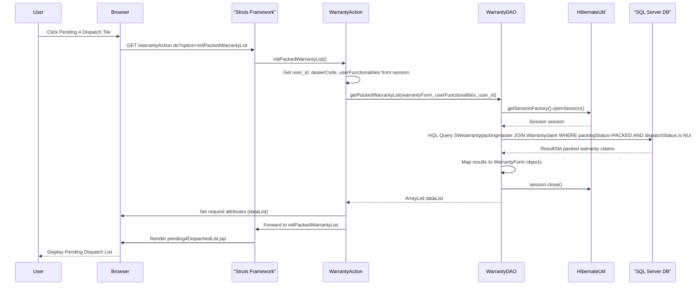
```mermaid
sequenceDiagram
    participant User
    participant Browser
    participant StrutsFramework as "Struts Framework"
    participant WarrantyAction as WarrantyAction
    participant WarrantyDAO as WarrantyDAO
    participant HibernateUtil as HibernateUtil
    participant Database as "SQL Server DB"

    User->>Browser: Click Pending 4 Dispatch Tile
    Browser->>StrutsFramework: GET /warrantyAction.do?option=initPackedWarrantyList
    StrutsFramework->>WarrantyAction: initPackedWarrantyList()
    
    WarrantyAction->>WarrantyAction: Get user_id, dealerCode, userFunctionalities from session
    
    WarrantyAction->>WarrantyDAO: getPackedWarrantyList(warrantyForm, userFunctionalities, user_id)
    
    WarrantyDAO->>HibernateUtil: getSessionFactory().openSession()
    HibernateUtil-->>WarrantyDAO: Session session
    
    WarrantyDAO->>Database: HQL Query SWwarrantypackingmaster JOIN Warrantyclaim WHERE packingStatus=PACKED AND dispatchStatus is NULL or PENDING
    Database-->>WarrantyDAO: ResultSet packed warranty claims
    
    WarrantyDAO->>WarrantyDAO: Map results to WarrantyForm objects
    WarrantyDAO->>HibernateUtil: session.close()
    WarrantyDAO-->>WarrantyAction: ArrayList dataList
    
    WarrantyAction->>Browser: Set request attributes (dataList)
    WarrantyAction->>StrutsFramework: Forward to initPackedWarrantyList
    StrutsFramework->>Browser: Render pending4DispachedList.jsp
    Browser-->>User: Display Pending Dispatch List
```

## 12. View Packing List Flow (Tile #5)

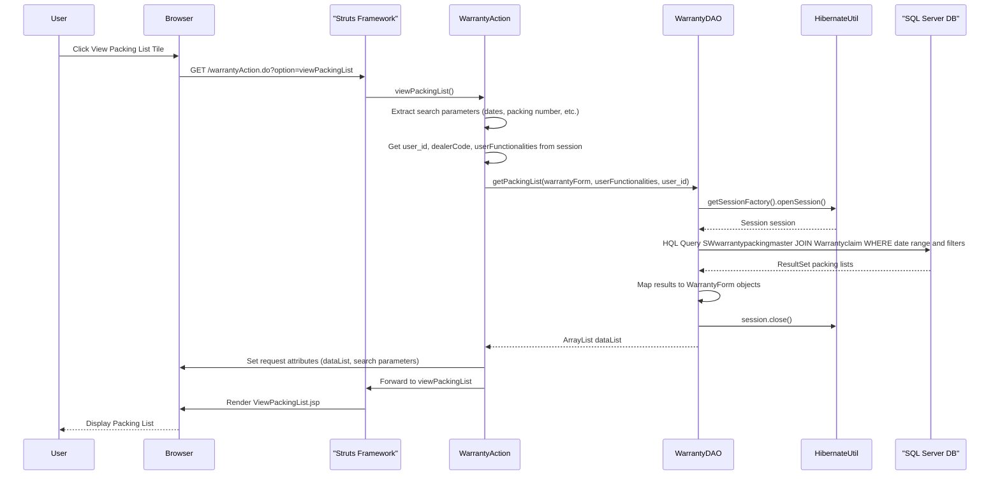
```mermaid
sequenceDiagram
    participant User
    participant Browser
    participant StrutsFramework as "Struts Framework"
    participant WarrantyAction as WarrantyAction
    participant WarrantyDAO as WarrantyDAO
    participant HibernateUtil as HibernateUtil
    participant Database as "SQL Server DB"

    User->>Browser: Click View Packing List Tile
    Browser->>StrutsFramework: GET /warrantyAction.do?option=viewPackingList
    StrutsFramework->>WarrantyAction: viewPackingList()
    
    WarrantyAction->>WarrantyAction: Extract search parameters (dates, packing number, etc.)
    WarrantyAction->>WarrantyAction: Get user_id, dealerCode, userFunctionalities from session
    
    WarrantyAction->>WarrantyDAO: getPackingList(warrantyForm, userFunctionalities, user_id)
    
    WarrantyDAO->>HibernateUtil: getSessionFactory().openSession()
    HibernateUtil-->>WarrantyDAO: Session session
    
    WarrantyDAO->>Database: HQL Query SWwarrantypackingmaster JOIN Warrantyclaim WHERE date range and filters
    Database-->>WarrantyDAO: ResultSet packing lists
    
    WarrantyDAO->>WarrantyDAO: Map results to WarrantyForm objects
    WarrantyDAO->>HibernateUtil: session.close()
    WarrantyDAO-->>WarrantyAction: ArrayList dataList
    
    WarrantyAction->>Browser: Set request attributes (dataList, search parameters)
    WarrantyAction->>StrutsFramework: Forward to viewPackingList
    StrutsFramework->>Browser: Render ViewPackingList.jsp
    Browser-->>User: Display Packing List
```

## 13. Pending For Acknow Flow (Tile #6)

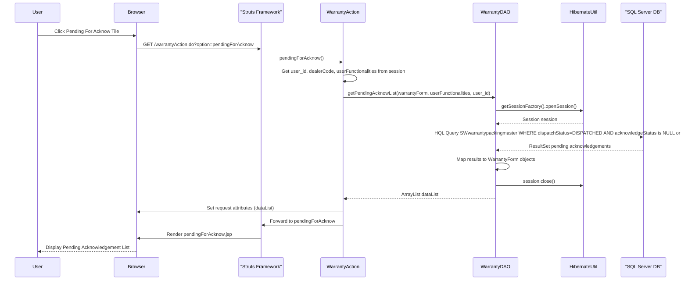
```mermaid
sequenceDiagram
    participant User
    participant Browser
    participant StrutsFramework as "Struts Framework"
    participant WarrantyAction as WarrantyAction
    participant WarrantyDAO as WarrantyDAO
    participant HibernateUtil as HibernateUtil
    participant Database as "SQL Server DB"

    User->>Browser: Click Pending For Acknow Tile
    Browser->>StrutsFramework: GET /warrantyAction.do?option=pendingForAcknow
    StrutsFramework->>WarrantyAction: pendingForAcknow()
    
    WarrantyAction->>WarrantyAction: Get user_id, dealerCode, userFunctionalities from session
    
    WarrantyAction->>WarrantyDAO: getPendingAcknowList(warrantyForm, userFunctionalities, user_id)
    
    WarrantyDAO->>HibernateUtil: getSessionFactory().openSession()
    HibernateUtil-->>WarrantyDAO: Session session
    
    WarrantyDAO->>Database: HQL Query SWwarrantypackingmaster WHERE dispatchStatus=DISPATCHED AND acknowledgeStatus is NULL or PENDING
    Database-->>WarrantyDAO: ResultSet pending acknowledgements
    
    WarrantyDAO->>WarrantyDAO: Map results to WarrantyForm objects
    WarrantyDAO->>HibernateUtil: session.close()
    WarrantyDAO-->>WarrantyAction: ArrayList dataList
    
    WarrantyAction->>Browser: Set request attributes (dataList)
    WarrantyAction->>StrutsFramework: Forward to pendingForAcknow
    StrutsFramework->>Browser: Render pendingForAcknow.jsp
    Browser-->>User: Display Pending Acknowledgement List
```

## 14. Pending Warranty Claim Flow (Tile #7)

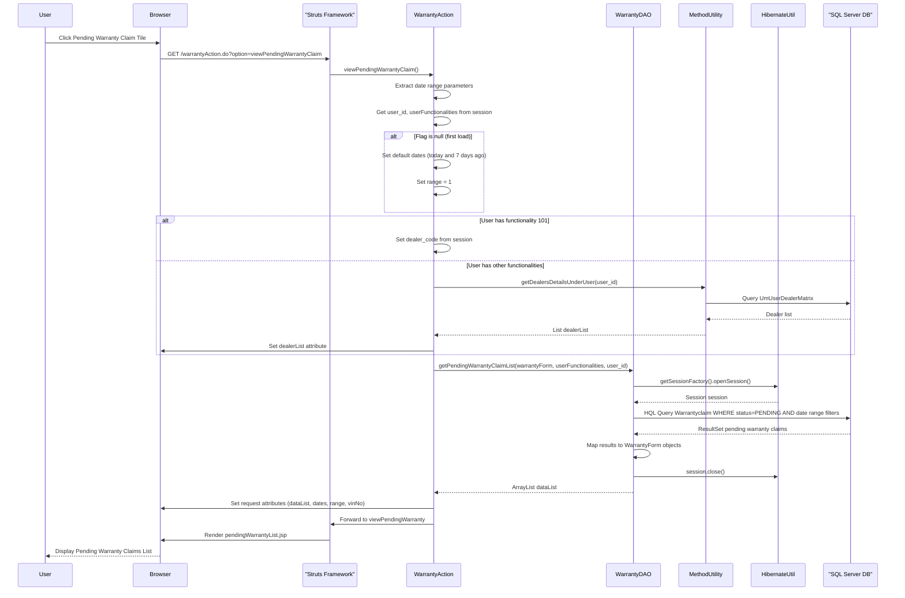
```mermaid
sequenceDiagram
    participant User
    participant Browser
    participant StrutsFramework as "Struts Framework"
    participant WarrantyAction as WarrantyAction
    participant WarrantyDAO as WarrantyDAO
    participant MethodUtility as MethodUtility
    participant HibernateUtil as HibernateUtil
    participant Database as "SQL Server DB"

    User->>Browser: Click Pending Warranty Claim Tile
    Browser->>StrutsFramework: GET /warrantyAction.do?option=viewPendingWarrantyClaim
    StrutsFramework->>WarrantyAction: viewPendingWarrantyClaim()
    
    WarrantyAction->>WarrantyAction: Extract date range parameters
    WarrantyAction->>WarrantyAction: Get user_id, userFunctionalities from session
    
    alt Flag is null (first load)
        WarrantyAction->>WarrantyAction: Set default dates (today and 7 days ago)
        WarrantyAction->>WarrantyAction: Set range = 1
    end
    
    alt User has functionality 101
        WarrantyAction->>WarrantyAction: Set dealer_code from session
    else User has other functionalities
        WarrantyAction->>MethodUtility: getDealersDetailsUnderUser(user_id)
        MethodUtility->>Database: Query UmUserDealerMatrix
        Database-->>MethodUtility: Dealer list
        MethodUtility-->>WarrantyAction: List dealerList
        WarrantyAction->>Browser: Set dealerList attribute
    end
    
    WarrantyAction->>WarrantyDAO: getPendingWarrantyClaimList(warrantyForm, userFunctionalities, user_id)
    
    WarrantyDAO->>HibernateUtil: getSessionFactory().openSession()
    HibernateUtil-->>WarrantyDAO: Session session
    
    WarrantyDAO->>Database: HQL Query Warrantyclaim WHERE status=PENDING AND date range filters
    Database-->>WarrantyDAO: ResultSet pending warranty claims
    
    WarrantyDAO->>WarrantyDAO: Map results to WarrantyForm objects
    WarrantyDAO->>HibernateUtil: session.close()
    WarrantyDAO-->>WarrantyAction: ArrayList dataList
    
    WarrantyAction->>Browser: Set request attributes (dataList, dates, range, vinNo)
    WarrantyAction->>StrutsFramework: Forward to viewPendingWarranty
    StrutsFramework->>Browser: Render pendingWarrantyList.jsp
    Browser-->>User: Display Pending Warranty Claims List
```

## 15. Pending SAP List Flow (Tile #8)

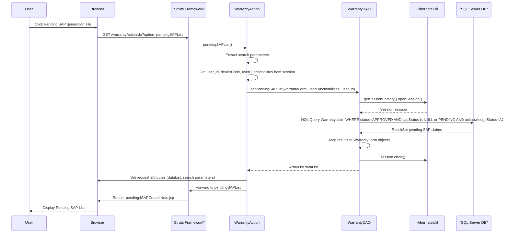
```mermaid
sequenceDiagram
    participant User
    participant Browser
    participant StrutsFramework as "Struts Framework"
    participant WarrantyAction as WarrantyAction
    participant WarrantyDAO as WarrantyDAO
    participant HibernateUtil as HibernateUtil
    participant Database as "SQL Server DB"

    User->>Browser: Click Pending SAP generation Tile
    Browser->>StrutsFramework: GET /warrantyAction.do?option=pendingSAPList
    StrutsFramework->>WarrantyAction: pendingSAPList()
    
    WarrantyAction->>WarrantyAction: Extract search parameters
    WarrantyAction->>WarrantyAction: Get user_id, dealerCode, userFunctionalities from session
    
    WarrantyAction->>WarrantyDAO: getPendingSAPList(warrantyForm, userFunctionalities, user_id)
    
    WarrantyDAO->>HibernateUtil: getSessionFactory().openSession()
    HibernateUtil-->>WarrantyDAO: Session session
    
    WarrantyDAO->>Database: HQL Query Warrantyclaim WHERE status=APPROVED AND sapStatus is NULL or PENDING AND acknowledgeStatus=ACKNOWLEDGED
    Database-->>WarrantyDAO: ResultSet pending SAP claims
    
    WarrantyDAO->>WarrantyDAO: Map results to WarrantyForm objects
    WarrantyDAO->>HibernateUtil: session.close()
    WarrantyDAO-->>WarrantyAction: ArrayList dataList
    
    WarrantyAction->>Browser: Set request attributes (dataList, search parameters)
    WarrantyAction->>StrutsFramework: Forward to pendingSAPList
    StrutsFramework->>Browser: Render pending4SAPCreaditNote.jsp
    Browser-->>User: Display Pending SAP List
```

## 16. View Credit Note Flow (Tile #9)

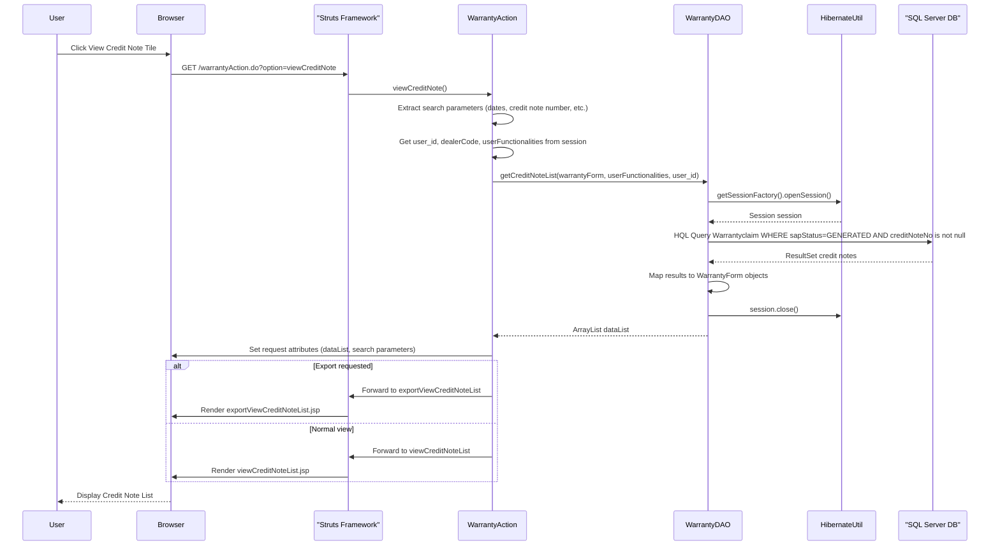
```mermaid
sequenceDiagram
    participant User
    participant Browser
    participant StrutsFramework as "Struts Framework"
    participant WarrantyAction as WarrantyAction
    participant WarrantyDAO as WarrantyDAO
    participant HibernateUtil as HibernateUtil
    participant Database as "SQL Server DB"

    User->>Browser: Click View Credit Note Tile
    Browser->>StrutsFramework: GET /warrantyAction.do?option=viewCreditNote
    StrutsFramework->>WarrantyAction: viewCreditNote()
    
    WarrantyAction->>WarrantyAction: Extract search parameters (dates, credit note number, etc.)
    WarrantyAction->>WarrantyAction: Get user_id, dealerCode, userFunctionalities from session
    
    WarrantyAction->>WarrantyDAO: getCreditNoteList(warrantyForm, userFunctionalities, user_id)
    
    WarrantyDAO->>HibernateUtil: getSessionFactory().openSession()
    HibernateUtil-->>WarrantyDAO: Session session
    
    WarrantyDAO->>Database: HQL Query Warrantyclaim WHERE sapStatus=GENERATED AND creditNoteNo is not null
    Database-->>WarrantyDAO: ResultSet credit notes
    
    WarrantyDAO->>WarrantyDAO: Map results to WarrantyForm objects
    WarrantyDAO->>HibernateUtil: session.close()
    WarrantyDAO-->>WarrantyAction: ArrayList dataList
    
    WarrantyAction->>Browser: Set request attributes (dataList, search parameters)
    
    alt Export requested
        WarrantyAction->>StrutsFramework: Forward to exportViewCreditNoteList
        StrutsFramework->>Browser: Render exportViewCreditNoteList.jsp
    else Normal view
        WarrantyAction->>StrutsFramework: Forward to viewCreditNoteList
        StrutsFramework->>Browser: Render viewCreditNoteList.jsp
    end
    
    Browser-->>User: Display Credit Note List
```

## 17. Claim Report Flow (Tile #10)

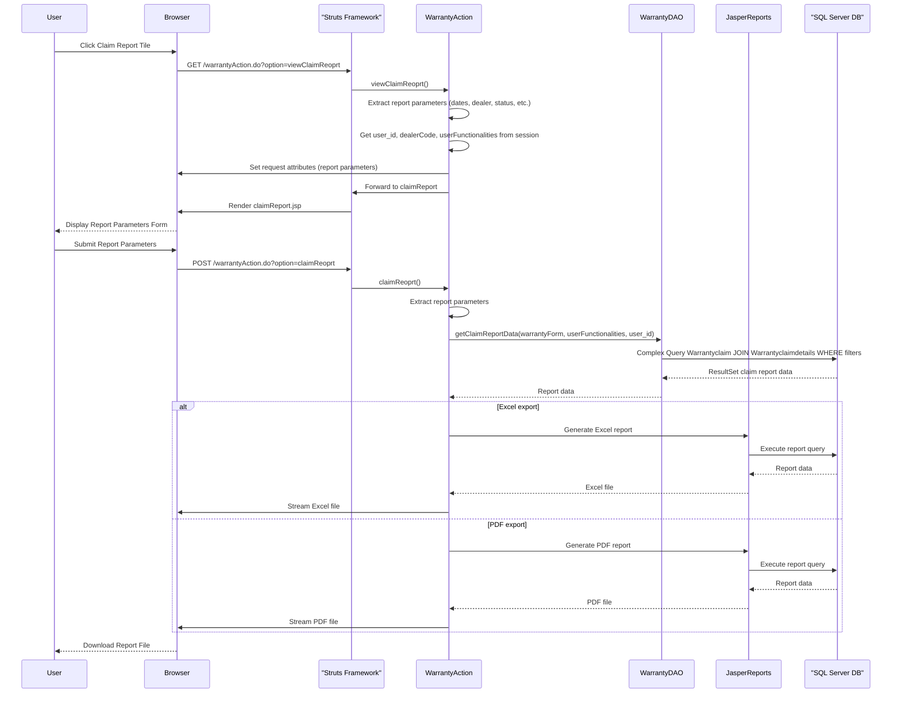
```mermaid
sequenceDiagram
    participant User
    participant Browser
    participant StrutsFramework as "Struts Framework"
    participant WarrantyAction as WarrantyAction
    participant WarrantyDAO as WarrantyDAO
    participant JasperReports as JasperReports
    participant Database as "SQL Server DB"

    User->>Browser: Click Claim Report Tile
    Browser->>StrutsFramework: GET /warrantyAction.do?option=viewClaimReoprt
    StrutsFramework->>WarrantyAction: viewClaimReoprt()
    
    WarrantyAction->>WarrantyAction: Extract report parameters (dates, dealer, status, etc.)
    WarrantyAction->>WarrantyAction: Get user_id, dealerCode, userFunctionalities from session
    
    WarrantyAction->>Browser: Set request attributes (report parameters)
    WarrantyAction->>StrutsFramework: Forward to claimReport
    StrutsFramework->>Browser: Render claimReport.jsp
    Browser-->>User: Display Report Parameters Form
    
    User->>Browser: Submit Report Parameters
    Browser->>StrutsFramework: POST /warrantyAction.do?option=claimReoprt
    StrutsFramework->>WarrantyAction: claimReoprt()
    
    WarrantyAction->>WarrantyAction: Extract report parameters
    WarrantyAction->>WarrantyDAO: getClaimReportData(warrantyForm, userFunctionalities, user_id)
    
    WarrantyDAO->>Database: Complex Query Warrantyclaim JOIN Warrantyclaimdetails WHERE filters
    Database-->>WarrantyDAO: ResultSet claim report data
    WarrantyDAO-->>WarrantyAction: Report data
    
    alt Excel export
        WarrantyAction->>JasperReports: Generate Excel report
        JasperReports->>Database: Execute report query
        Database-->>JasperReports: Report data
        JasperReports-->>WarrantyAction: Excel file
        WarrantyAction->>Browser: Stream Excel file
    else PDF export
        WarrantyAction->>JasperReports: Generate PDF report
        JasperReports->>Database: Execute report query
        Database-->>JasperReports: Report data
        JasperReports-->>WarrantyAction: PDF file
        WarrantyAction->>Browser: Stream PDF file
    end
    
    Browser-->>User: Download Report File
```

## 18. SAP Dump Claim Report Flow (Tile #11)

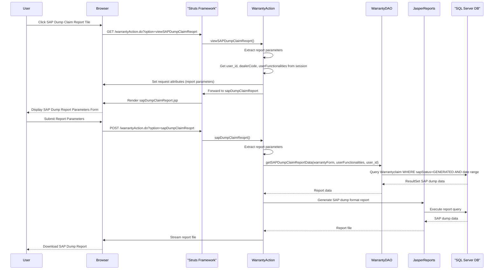
```mermaid
sequenceDiagram
    participant User
    participant Browser
    participant StrutsFramework as "Struts Framework"
    participant WarrantyAction as WarrantyAction
    participant WarrantyDAO as WarrantyDAO
    participant JasperReports as JasperReports
    participant Database as "SQL Server DB"

    User->>Browser: Click SAP Dump Claim Report Tile
    Browser->>StrutsFramework: GET /warrantyAction.do?option=viewSAPDumpClaimReoprt
    StrutsFramework->>WarrantyAction: viewSAPDumpClaimReoprt()
    
    WarrantyAction->>WarrantyAction: Extract report parameters
    WarrantyAction->>WarrantyAction: Get user_id, dealerCode, userFunctionalities from session
    
    WarrantyAction->>Browser: Set request attributes (report parameters)
    WarrantyAction->>StrutsFramework: Forward to sapDumpClaimReport
    StrutsFramework->>Browser: Render sapDumpClaimReport.jsp
    Browser-->>User: Display SAP Dump Report Parameters Form
    
    User->>Browser: Submit Report Parameters
    Browser->>StrutsFramework: POST /warrantyAction.do?option=sapDumpClaimReoprt
    StrutsFramework->>WarrantyAction: sapDumpClaimReoprt()
    
    WarrantyAction->>WarrantyAction: Extract report parameters
    WarrantyAction->>WarrantyDAO: getSAPDumpClaimReportData(warrantyForm, userFunctionalities, user_id)
    
    WarrantyDAO->>Database: Query Warrantyclaim WHERE sapStatus=GENERATED AND date range
    Database-->>WarrantyDAO: ResultSet SAP dump data
    WarrantyDAO-->>WarrantyAction: Report data
    
    WarrantyAction->>JasperReports: Generate SAP dump format report
    JasperReports->>Database: Execute report query
    Database-->>JasperReports: SAP dump data
    JasperReports-->>WarrantyAction: Report file
    
    WarrantyAction->>Browser: Stream report file
    Browser-->>User: Download SAP Dump Report
```

## 19. Update Tax Invoice Flow (Tile #12)

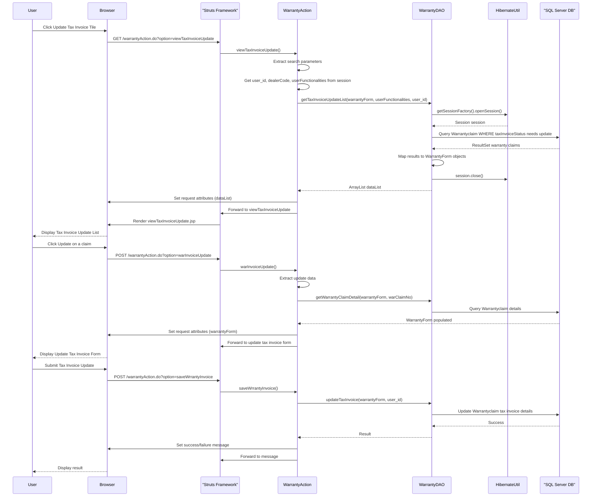
```mermaid
sequenceDiagram
    participant User
    participant Browser
    participant StrutsFramework as "Struts Framework"
    participant WarrantyAction as WarrantyAction
    participant WarrantyDAO as WarrantyDAO
    participant HibernateUtil as HibernateUtil
    participant Database as "SQL Server DB"

    User->>Browser: Click Update Tax Invoice Tile
    Browser->>StrutsFramework: GET /warrantyAction.do?option=viewTaxInvoiceUpdate
    StrutsFramework->>WarrantyAction: viewTaxInvoiceUpdate()
    
    WarrantyAction->>WarrantyAction: Extract search parameters
    WarrantyAction->>WarrantyAction: Get user_id, dealerCode, userFunctionalities from session
    
    WarrantyAction->>WarrantyDAO: getTaxInvoiceUpdateList(warrantyForm, userFunctionalities, user_id)
    
    WarrantyDAO->>HibernateUtil: getSessionFactory().openSession()
    HibernateUtil-->>WarrantyDAO: Session session
    
    WarrantyDAO->>Database: Query Warrantyclaim WHERE taxInvoiceStatus needs update
    Database-->>WarrantyDAO: ResultSet warranty claims
    
    WarrantyDAO->>WarrantyDAO: Map results to WarrantyForm objects
    WarrantyDAO->>HibernateUtil: session.close()
    WarrantyDAO-->>WarrantyAction: ArrayList dataList
    
    WarrantyAction->>Browser: Set request attributes (dataList)
    WarrantyAction->>StrutsFramework: Forward to viewTaxInvoiceUpdate
    StrutsFramework->>Browser: Render viewTaxInvoiceUpdate.jsp
    Browser-->>User: Display Tax Invoice Update List
    
    User->>Browser: Click Update on a claim
    Browser->>StrutsFramework: POST /warrantyAction.do?option=warInvoiceUpdate
    StrutsFramework->>WarrantyAction: warInvoiceUpdate()
    
    WarrantyAction->>WarrantyAction: Extract update data
    WarrantyAction->>WarrantyDAO: getWarrantyClaimDetail(warrantyForm, warClaimNo)
    WarrantyDAO->>Database: Query Warrantyclaim details
    Database-->>WarrantyAction: WarrantyForm populated
    
    WarrantyAction->>Browser: Set request attributes (warrantyForm)
    WarrantyAction->>StrutsFramework: Forward to update tax invoice form
    Browser-->>User: Display Update Tax Invoice Form
    
    User->>Browser: Submit Tax Invoice Update
    Browser->>StrutsFramework: POST /warrantyAction.do?option=saveWrrantyInvoice
    StrutsFramework->>WarrantyAction: saveWrrantyInvoice()
    
    WarrantyAction->>WarrantyDAO: updateTaxInvoice(warrantyForm, user_id)
    WarrantyDAO->>Database: Update Warrantyclaim tax invoice details
    Database-->>WarrantyDAO: Success
    WarrantyDAO-->>WarrantyAction: Result
    
    WarrantyAction->>Browser: Set success/failure message
    WarrantyAction->>StrutsFramework: Forward to message
    Browser-->>User: Display result
```

## 20. Upload Tax Invoice Flow (Tile #13)

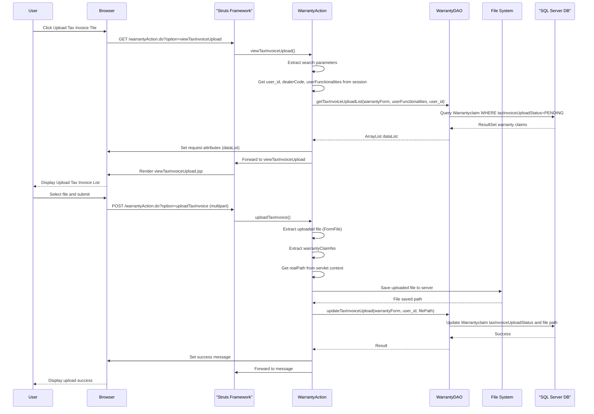
```mermaid
sequenceDiagram
    participant User
    participant Browser
    participant StrutsFramework as "Struts Framework"
    participant WarrantyAction as WarrantyAction
    participant WarrantyDAO as WarrantyDAO
    participant FileSystem as File System
    participant Database as "SQL Server DB"

    User->>Browser: Click Upload Tax Invoice Tile
    Browser->>StrutsFramework: GET /warrantyAction.do?option=viewTaxInvoiceUpload
    StrutsFramework->>WarrantyAction: viewTaxInvoiceUpload()
    
    WarrantyAction->>WarrantyAction: Extract search parameters
    WarrantyAction->>WarrantyAction: Get user_id, dealerCode, userFunctionalities from session
    
    WarrantyAction->>WarrantyDAO: getTaxInvoiceUploadList(warrantyForm, userFunctionalities, user_id)
    
    WarrantyDAO->>Database: Query Warrantyclaim WHERE taxInvoiceUploadStatus=PENDING
    Database-->>WarrantyDAO: ResultSet warranty claims
    WarrantyDAO-->>WarrantyAction: ArrayList dataList
    
    WarrantyAction->>Browser: Set request attributes (dataList)
    WarrantyAction->>StrutsFramework: Forward to viewTaxInvoiceUpload
    StrutsFramework->>Browser: Render viewTaxInvoiceUpload.jsp
    Browser-->>User: Display Upload Tax Invoice List
    
    User->>Browser: Select file and submit
    Browser->>StrutsFramework: POST /warrantyAction.do?option=uploadTaxInvoice (multipart)
    StrutsFramework->>WarrantyAction: uploadTaxInvoice()
    
    WarrantyAction->>WarrantyAction: Extract uploaded file (FormFile)
    WarrantyAction->>WarrantyAction: Extract warrantyClaimNo
    WarrantyAction->>WarrantyAction: Get realPath from servlet context
    
    WarrantyAction->>FileSystem: Save uploaded file to server
    FileSystem-->>WarrantyAction: File saved path
    
    WarrantyAction->>WarrantyDAO: updateTaxInvoiceUpload(warrantyForm, user_id, filePath)
    WarrantyDAO->>Database: Update Warrantyclaim taxInvoiceUploadStatus and file path
    Database-->>WarrantyDAO: Success
    WarrantyDAO-->>WarrantyAction: Result
    
    WarrantyAction->>Browser: Set success message
    WarrantyAction->>StrutsFramework: Forward to message
    Browser-->>User: Display upload success
```

## 21. Warranty Dashboard Flow (Tile #14)

```mermaid
sequenceDiagram
    participant User
    participant Browser
    participant StrutsFramework as "Struts Framework"
    participant WarrantyAction as WarrantyAction
    participant WarrantyDAO as WarrantyDAO
    participant JasperReports as JasperReports
    participant HibernateUtil as HibernateUtil
    participant Database as "SQL Server DB"

    User->>Browser: Click Warranty Dashboard Tile
    Browser->>StrutsFramework: GET /warrantyAction.do?option=warrantyClaimStatusDashboard
    StrutsFramework->>WarrantyAction: warrantyClaimStatusDashboard()
    
    WarrantyAction->>WarrantyAction: Extract dashboard parameters (dates, dealer, status, etc.)
    WarrantyAction->>WarrantyAction: Get user_id, dealerCode, userFunctionalities from session
    
    WarrantyAction->>WarrantyDAO: getWarrantyDashboardData(warrantyForm, userFunctionalities, user_id)
    
    WarrantyDAO->>HibernateUtil: getSessionFactory().openSession()
    HibernateUtil-->>WarrantyDAO: Session session
    
    WarrantyDAO->>Database: Multiple Queries for dashboard metrics: Total Claims, Pending Claims, Approved Claims, Rejected Claims, Packed Claims, Dispatched Claims, etc.
    Database-->>WarrantyDAO: Dashboard metrics data
    
    WarrantyDAO->>WarrantyDAO: Aggregate and calculate statistics
    WarrantyDAO->>HibernateUtil: session.close()
    WarrantyDAO-->>WarrantyAction: Dashboard data (Map or WarrantyForm)
    
    WarrantyAction->>Browser: Set request attributes (dashboard data, charts data)
    
    alt Export requested
        WarrantyAction->>JasperReports: Generate dashboard report
        JasperReports->>Database: Execute dashboard queries
        Database-->>JasperReports: Report data
        JasperReports-->>WarrantyAction: Report file
        WarrantyAction->>Browser: Stream report file
        Browser-->>User: Download Dashboard Report
    else Normal view
        WarrantyAction->>StrutsFramework: Forward to warrantyClaimStatusDashboard
        StrutsFramework->>Browser: Render warrantyClaimStatusDashboard.jsp
        Browser-->>User: Display Warranty Dashboard with Charts and Statistics
    end
```

## Component Interaction Summary

### Key Components:

1. **User Interface Layer**
   - Browser/Client
   - JSP Pages (warrantyList.jsp, createWarranty.jsp, viewWarrantyList.jsp, etc.)

2. **Controller Layer**
   - Struts Framework (routing)
   - WarrantyAction (business logic coordination)

3. **Service Layer**
   - WarrantyDAO (data access)
   - serviceDAO (shared service methods)
   - MethodUtility (common utilities)

4. **Data Access Layer**
   - Hibernate ORM (object-relational mapping)
   - Direct SQL queries
   - Stored Procedures

5. **Database Layer**
   - SQL Server Database
   - Tables: Warrantyclaim, Warrantyclaimdetails, Jobcarddetails, SWwarrantypackingmaster, etc.

6. **Reporting Layer**
   - JasperReports (for generating PDF/Excel reports)

### Common Patterns:

1. **Session Management**: User context (user_id, dealerCode, userFunctionalities) stored in HTTP session
2. **Transaction Management**: Hibernate transactions for data consistency
3. **Error Handling**: Try-catch blocks with rollback on errors
4. **File Upload**: Handling of tax invoice documents and other attachments
5. **Report Generation**: JasperReports integration for PDF/Excel exports
6. **Authorization**: User functionality checks before allowing operations
7. **Date Validation**: Checking claim dates against business rules (e.g., packingGenDateCheck)

