## KUBOTA DMS - High Level Architecture

This document describes the **overall architecture** of the KUBOTA Dealer Management System (DMS), including:

- **Angular micro frontends** (per domain) orchestrated by a **main shell app**
- A single **Spring Boot monolith backend** split into **20 functional modules**
- Shared **infrastructure services** (security, configuration, connection, utils, common)
- **External systems**: Microsoft SQL Server, SMTP, JasperReports, file system storage

---

## 1. System Context & Major Components

```mermaid
flowchart TB
    subgraph Users
        U1[Dealer Users\nService / Spares / Sales / Warranty]
        U2[Kubota HQ Users\nAdmin / Approvers]
    end

    subgraph Browser["Web Browser"]
        MF_Main[MAIN-MICROAPP\nAngular Shell\n(port 9000)]
        MF_Dashboard[CRM-MICROAPP\nDashboard/CRM UI]
        MF_Masters[MASTERS-MICROAPP\nMasters UI]
        MF_Sales[SALES-PRESALES-MICROAPP\nSales & Presales UI]
        MF_Service[SERVICE-MICROAPP\nService UI]
        MF_Spares[SPARES-MICROAPP\nSpares UI]
        MF_Training[TRAINING-MICROAPP\nTraining UI]
        MF_Warranty[WARRANTY-MICROAPP\nWarranty UI]
    end

    subgraph Backend["KUBOTA-BACKENED\nSpring Boot 2.3.3 (WAR)"]
        subgraph API["REST API Layer\ncom.i4o.dms.kubota.*.controller"]
            M_Security[security\nJWT login, token APIs]
            M_Sales[salesandpresales\nEnquiry, PO, GRN, DC, Invoice]
            M_Service[service\nBookings, Job Cards, Claims]
            M_Spares[spares\nStock, Orders, Reports]
            M_Warranty[warranty\nPCR, WCR, Goodwill, Hotline]
            M_CRM[crm\nCRM / Complaints / Surveys]
            M_Masters[masters\nDealer, Product, User, KAI masters]
            M_Training[training\nProgramme, Attendance, Reports]
            M_Dashboard[dashboard\nDashboards & KPIs]
            M_Feedback[feedback\nFeedback Forms]
        end

        subgraph Infra["Infrastructure / Cross-cutting"]
            M_Common[common\nMail, Lookups, Jasper Reports]
            M_Config[configurations\nWebConfig, CORS, Swagger, Jackson]
            M_Conn[connection\nEntityManager to JDBC Connection]
            M_Const[constant\nDmsConstants]
            M_Storage[storage\nFileStorageService]
            M_Utils[utils\nDates, Encryption, Excel, NumberGen, ApiResponse]
            M_Validation[validation\nFilters, Bean Validation]
            M_Exception[exception\nGlobalExceptionHandler]
            M_AOP[aop\nPurchaseOrderAop]
            M_Accpac[accpac\nACCPAC Integration]
        end
    end

    subgraph DataLayer["Data & External Systems"]
        DB[(Microsoft SQL Server\nDMS Schema)]
        FS[(File System\nupload-dir / report templates)]
        SMTP[(SMTP Server)]
        JR[(JasperReports Engine\n.jasper templates)]
    end

    %% User → Frontend
    U1 --> MF_Main
    U2 --> MF_Main

    %% Shell ↔ Micro frontends
    MF_Main <-->|Child App Ports\n9001-9008| MF_Dashboard
    MF_Main <-->|9005| MF_Masters
    MF_Main <-->|9001| MF_Sales
    MF_Main <-->|9002| MF_Service
    MF_Main <-->|9003| MF_Spares
    MF_Main <-->|9007| MF_Training
    MF_Main <-->|9004| MF_Warranty

    %% Frontend → Backend
    MF_Main -->|"HTTP/JSON\nbaseUrl: /kubota/api"| API
    MF_Dashboard --> API
    MF_Masters --> API
    MF_Sales --> API
    MF_Service --> API
    MF_Spares --> API
    MF_Warranty --> API
    MF_Training --> API

    %% Backend Modules → Infra
    API --> M_Security
    API --> M_Common
    API --> M_Config
    API --> M_Conn
    API --> M_Const
    API --> M_Storage
    API --> M_Utils
    API --> M_Validation
    API --> M_Exception
    API --> M_AOP
    API --> M_Accpac

    %% Infra → Data / External
    M_Security --> DB
    M_Sales --> DB
    M_Service --> DB
    M_Spares --> DB
    M_Warranty --> DB
    M_CRM --> DB
    M_Masters --> DB
    M_Training --> DB
    M_Dashboard --> DB

    M_Common --> SMTP
    M_Common --> JR
    M_Conn --> DB
    M_Storage --> FS
    M_Utils --> DB
```

---

## 2. Backend Module Layering

```mermaid
flowchart LR
    subgraph Presentation["Presentation Layer\n(REST Controllers)"]
        C_Sales[salesandpresales.controller]
        C_Service[service.controller]
        C_Spares[spares.controller]
        C_Warranty[warranty.controller]
        C_CRM[crm.controller]
        C_Masters[masters.controller]
        C_Training[training.controller]
        C_Dashboard[dashboard.controller]
        C_Security[security.controller]
        C_Common[common.controller]
    end

    subgraph ServiceLayer["Service Layer\n(Business Logic)"]
        S_Sales[salesandpresales.service]
        S_Service[service.service]
        S_Spares[spares.service]
        S_Warranty[warranty.service]
        S_CRM[crm.service]
        S_Masters[masters.service]
        S_Training[training.service]
        S_Dashboard[dashboard.service]
        S_Security[security.service]
        S_Common[common.service]
    end

    subgraph RepoLayer["Repository Layer\n(Spring Data JPA)"]
        R_Sales[salesandpresales.repository]
        R_Service[service.repository]
        R_Spares[spares.repository]
        R_Warranty[warranty.repository]
        R_CRM[crm.repository]
        R_Masters[masters.repository]
        R_Training[training.repository]
        R_Dashboard[dashboard.repository]
        R_Security[security.repository]
        R_Common[common.repository]
    end

    subgraph Infra2["Infrastructure Modules"]
        I_Conn[connection\nConnectionConfigurationImpl]
        I_Storage[storage\nFileStorageService]
        I_Utils[utils]
        I_Config[configurations]
        I_Exception[exception]
        I_Validation[validation]
        I_Const[constant]
        I_Accpac[accpac]
    end

    DB[(SQL Server DB)]
    FS[(File System)]

    %% Flows
    Presentation --> ServiceLayer --> RepoLayer --> DB
    ServiceLayer --> I_Storage --> FS
    ServiceLayer --> I_Conn --> DB
    ServiceLayer --> I_Utils
    Presentation --> I_Exception
    Presentation --> I_Validation
    ServiceLayer --> I_Const
    ServiceLayer --> I_Accpac
```



---

## 3. Frontend Composition Overview

```mermaid
flowchart TB
    subgraph Shell["MAIN-MICROAPP (Shell)"]
        ShellRouter[Shell Router\nAngular 8\nSSR + PWA]
        Nav[Global Navigation\n(menu, header, auth)]
    end

    subgraph MFEs["Domain Micro Frontends"]
        MF_CRM[CRM-MICROAPP\nkubota-dashboard]
        MF_MASTERS[MASTERS-MICROAPP\nkubota-master]
        MF_SALE[SALES-PRESALES-MICROAPP\nkubota-salepresale]
        MF_SERV[SERVICE-MICROAPP\nkubota-service]
        MF_SPAR[SPARES-MICROAPP\nkubota-spare]
        MF_TRAIN[TRAINING-MICROAPP\nkubota-training]
        MF_WARR[WARRANTY-MICROAPP\nkubota-warranty]
    end

    User[Dealer / Kubota User] --> ShellRouter
    ShellRouter --> Nav

    ShellRouter -->|route 'dashboard'| MF_CRM
    ShellRouter -->|route 'master'| MF_MASTERS
    ShellRouter -->|route 'sales-pre-sales'| MF_SALE
    ShellRouter -->|route 'service'| MF_SERV
    ShellRouter -->|route 'spares'| MF_SPAR
    ShellRouter -->|route 'training'| MF_TRAIN
    ShellRouter -->|route 'warranty'| MF_WARR

    MFEs -->|HTTP /api/...| Backend
```

---

## 4. Notes

- **Security**: All API calls are protected by Spring Security with JWT. Tokens are issued by `LoginController` / `JwtProvider` and stored in `SYS_USER_TOKEN` via `UserTokenService`.
- **Reporting**: Business modules delegate report generation to `JasperPrintService`, which uses `ConnectionConfigurationImpl` to obtain raw JDBC connections for JasperReports.
- **File Storage**: Modules (sales, service, warranty, CRM) upload and download documents via `FileUploadController` and `StorageService`, which writes to `upload-dir` and stores metadata in SQL Server.
- **Lookups & Templates**: UI dropdowns and import templates are served by the `common` module (`SysLookupController`, `/downloadTemplate`).

