# KUBOTA ACCPAC Module - UML Class Diagram

```mermaid
classDiagram
    %% ============================================
    %% CONTROLLER LAYER (3 Controllers)
    %% ============================================
    
    class AccPacController {
        -AccPacDealerMasterRepository dealerMasterRepository
        +uploadDealerMasterExcel(multipartFile)
        +dealerCodeAuto(dealerCode)
        +getDetailsByDealerCode(dealerCode)
        +dealerTypeList()
    }
    
    class AccpacPoDetailsController {
        -AccpacPoDetailsRepo accpacPoDetailsRepo
        +saveaccpacpodetails(accpacPoDetails)
        +getOsStatus(dealerCode, poid)
    }
    
    class AccpacChannelFinanceController {
        -InvoiceDetailsRepo invoiceDetailsRepo
        +saveInvoiceDetails(accpacChannelFinanceInvoice)
    }
    
    %% ============================================
    %% REPOSITORY LAYER (5 Repositories)
    %% ============================================
    
    class AccPacDealerMasterRepository {
        +findByDealerCodeContaining(dealerCode) List~Map~
        +getDetailsByDealerCode(dealerCode) List~Map~
        +getDealerType() List~Map~
        +saveAll(entities)
        +save(entity)
        +findById(id)
        +findAll()
    }
    
    class AccpacPoDetailsRepo {
        +getOsStatus(dealerCode, poid) Map~String,Object~
        +save(entity)
        +findById(id)
        +findAll()
    }
    
    class AccPacInvoiceRepository {
        +findByInvoiceNumber(invoiceNo) AccPacInvoice
        +getAccPacInvoiceDetails(invoiceNumber, grnType, branchId) List~Map~
        +save(entity)
        +findById(id)
        +findAll()
    }
    
    class AccPacInvoiceMachineDetailRepository {
        +save(entity)
        +findById(id)
        +findAll()
        +delete(entity)
    }
    
    class InvoiceDetailsRepo {
        +findByInvoiceNumber(invoiceNumber) AccpacChannelFinanceInvoice
        +findByDealerCodeAndStatusOrStatus(dealerID, noOfDays) List~AccpacChannelFinanceInvoice~
        +save(entity)
        +findById(id)
        +findAll()
    }
    
    %% ============================================
    %% DOMAIN ENTITIES - DEALER & MASTER (2 Entities)
    %% ============================================
    
    class AccPacDealerMaster {
        -Long id
        -String dealerCode
        -String dealerName
        -String status
        -String dealerFirmType
        -String gstNo
        -String panNo
        -String emailId
        -String address1
        -String address2
        -String address3
        -String address4
        -String pinCode
        -String tehsil
        -String city
        -String state
        -String country
        -String dealerType
        -String dealerCreditLimit
        -Date syncDate
        +getId() Long
        +getDealerCode() String
        +getDealerName() String
        +getStatus() String
        +getDealerFirmType() String
        +getGstNo() String
        +getPanNo() String
        +getEmailId() String
        +getAddress1() String
        +getAddress2() String
        +getAddress3() String
        +getAddress4() String
        +getPinCode() String
        +getTehsil() String
        +getCity() String
        +getState() String
        +getCountry() String
        +getDealerType() String
        +getDealerCreditLimit() String
        +getSyncDate() Date
    }
    
    class AccpacSparesDealerOutstanding {
        -String dealerCode
        -Double creditLimit
        -Double currentOutStanding
        -Double overDuesOutStanding
        -Double paymentUnderProcess
        -Double orderUnderProcess
        +getDealerCode() String
        +getCreditLimit() Double
        +getCurrentOutStanding() Double
        +getOverDuesOutStanding() Double
        +getPaymentUnderProcess() Double
        +getOrderUnderProcess() Double
    }
    
    %% ============================================
    %% DOMAIN ENTITIES - INVOICE (4 Entities)
    %% ============================================
    
    class AccPacInvoice {
        -Long id
        -String invoiceNumber
        -Date invoiceDate
        -String billTo
        -String shipTo
        -String lrNo
        -Boolean grnDoneFlag
        -Boolean mrcDoneFlag
        -Double invoiceTotalValue
        -Double additionalAmount
        -Double additionalCgstAmount
        -Double additionalSgstAmount
        -Double additionalIgstAmount
        -Double totalAdditionalAmount
        -String purchaseOrderNo
        -String dealerCode
        -Date syncDate
        +getId() Long
        +getInvoiceNumber() String
        +getInvoiceDate() Date
        +getBillTo() String
        +getShipTo() String
        +getLrNo() String
        +getGrnDoneFlag() Boolean
        +getMrcDoneFlag() Boolean
        +getInvoiceTotalValue() Double
        +getDealerCode() String
        +getSyncDate() Date
    }
    
    class AccPacInvoicePartDetails {
        -Long id
        -String itemNo
        -String itemDescription
        -Integer invoiceQuantity
        -String chassisNo
        -String engineNo
        -Double unitPrice
        -Double totalValue
        -Boolean mrcDoneFlag
        -AccPacInvoice accPacInvoice
        -String accpacInvoiceNo
        -Double gstAmount
        -Double assessableAmount
        +getId() Long
        +getItemNo() String
        +getItemDescription() String
        +getInvoiceQuantity() Integer
        +getChassisNo() String
        +getEngineNo() String
        +getUnitPrice() Double
        +getTotalValue() Double
        +getAccPacInvoice() AccPacInvoice
    }
    
    class AccpacChannelFinanceInvoice {
        -Long id
        -String dealerCode
        -Date invoiceDate
        -Double invoiceAmount
        -Double totalUtilisedAmount
        -String invoiceNumber
        -String status
        -Date syncDate
        +getId() Long
        +getDealerCode() String
        +getInvoiceDate() Date
        +getInvoiceAmount() Double
        +getTotalUtilisedAmount() Double
        +getInvoiceNumber() String
        +getStatus() String
        +getSyncDate() Date
    }
    
    class AccpacSparePartInvoice {
        -Long id
        -String accpacInvoiceNo
        -Date accpacInvoiceDate
        -Double invoiceValue
        -Integer sentBoxesQty
        -Double receiptValue
        -String dealerCode
        -String transportMode
        -String transporter
        -Date syncDate
        -Date expectedDeliveryDate
        -String lrNo
        -Boolean grnDoneFlag
        +getId() Long
        +getAccpacInvoiceNo() String
        +getAccpacInvoiceDate() Date
        +getInvoiceValue() Double
        +getDealerCode() String
        +getTransportMode() String
        +getTransporter() String
        +getSyncDate() Date
    }
    
    class AccpacSparePartInvoiceItem {
        -Long id
        -String invoiceNo
        -AccpacSparePartInvoice accpacSparePartInvoice
        -String accpacOrderNo
        -String itemNo
        -String itemDescription
        -String hsnCode
        -Double unitPrice
        -Double spmgst
        -Double spegst
        -Double spmrp
        -Integer invoiceQty
        -Double assessableValue
        -Double discount
        -Double cgstPercent
        -Double cgstAmount
        -Double sgstPercent
        -Double sgstAmount
        -Double igstPercent
        -Double igstAmount
        -Boolean grnDoneFlag
        +getId() Long
        +getInvoiceNo() String
        +getAccpacSparePartInvoice() AccpacSparePartInvoice
        +getAccpacOrderNo() String
        +getItemNo() String
        +getItemDescription() String
        +getHsnCode() String
        +getUnitPrice() Double
        +getInvoiceQty() Integer
        +getAssessableValue() Double
    }
    
    %% ============================================
    %% DOMAIN ENTITIES - PURCHASE ORDER (4 Entities)
    %% ============================================
    
    class AccpacPoDetails {
        -Long id
        -String dealerCode
        -Long dealer_id
        -Double totalCreditLimit
        -Double availableLimit
        -Double totalOs
        -Double currentOs
        -Double os0To30Days
        -Double os31To60Days
        -Double os61To90Days
        -Double os90Days
        -Double orderUnderProcess
        -Double pendingOrder
        -Double pendingPayment
        -Date syncDate
        +getId() Long
        +getDealerCode() String
        +getTotalCreditLimit() Double
        +getAvailableLimit() Double
        +getTotalOs() Double
        +getCurrentOs() Double
        +getOs0To30Days() Double
        +getOs31To60Days() Double
        +getOs61To90Days() Double
        +getOs90Days() Double
        +getSyncDate() Date
    }
    
    class DmsAccpacSparesPo {
        -Long id
        -String purchaseOrderNumber
        -Date purchaseOrderDate
        -String orderType
        -String freightBorneBy
        -String transportMode
        -String transporter
        -Double creditLimit
        -Double currentOutStanding
        -Double overduesOutStanding
        -Double paymentUnderProcess
        -Double ordersUnderProcess
        -Double availableLimit
        -Double netAmountPayable
        -String remarks
        -DealerMaster dealerMaster
        -String dealerCode
        -Double totalBaseAmount
        -Double totalPoAmount
        -String status
        +getId() Long
        +getPurchaseOrderNumber() String
        +getPurchaseOrderDate() Date
        +getOrderType() String
        +getDealerMaster() DealerMaster
        +getDealerCode() String
        +getTotalBaseAmount() Double
        +getTotalPoAmount() Double
        +getStatus() String
    }
    
    class DmsAccpacSparesPoItem {
        -Long id
        -Integer quantity
        -Double unitPrice
        -Double baseAmount
        -Double gstPercent
        -Double gstValue
        -Double totalAmount
        -DmsAccpacSparesPo dmsAccpacSparesPo
        -String partItemNo
        -String partDescription
        +getId() Long
        +getQuantity() Integer
        +getUnitPrice() Double
        +getBaseAmount() Double
        +getGstPercent() Double
        +getGstValue() Double
        +getTotalAmount() Double
        +getDmsAccpacSparesPo() DmsAccpacSparesPo
        +getPartItemNo() String
        +getPartDescription() String
    }
    
    class AccpacDmsSparesPoItemSplit {
        -Long id
        -Long quantity
        -Integer invoiceQuantity
        -Double unitPrice
        -Double baseAmount
        -Double cgstPercent
        -Double sgstPercent
        -Double igstPercent
        -Double cgstAmount
        -Double sgstAmount
        -Double igstAmount
        -Double totalAmount
        -String status
        -DmsAccpacSparesPo dmsAccpacSparesPo
        -String accpacOrderNo
        -String partItemNo
        -String partDescription
        -String kaiSupplyPartNo
        -String dmsPoNumber
        +getId() Long
        +getQuantity() Long
        +getUnitPrice() Double
        +getBaseAmount() Double
        +getTotalAmount() Double
        +getDmsAccpacSparesPo() DmsAccpacSparesPo
        +getAccpacOrderNo() String
        +getPartItemNo() String
    }
    
    class DmsAccpacSalesPo {
        -Long id
        -String accpacOrderNo
        -Date accpacOrderDate
        -String branchCode
        -String branchName
        -String poNumber
        -Date poDate
        -String dealerCode
        -String poType
        -String depot
        -Double paymentPending
        -Double totalOs
        -Double totalCreditLimit
        -String poStatus
        -Double basicAmount
        -Double totalGstAmount
        -Double totalAmount
        -Double availableLimit
        -Double os90Days
        -Double os61To90Days
        -Double os31To60Days
        -Double os0To30Days
        -Double netOs
        -Double currentOs
        -Double channelFinanceAvailable
        -List~DmsAccpacSalesPoItem~ dmsAccpacSalesPoItems
        +getId() Long
        +getAccpacOrderNo() String
        +getAccpacOrderDate() Date
        +getPoNumber() String
        +getDealerCode() String
        +getPoStatus() String
        +getTotalAmount() Double
        +getDmsAccpacSalesPoItems() List~DmsAccpacSalesPoItem~
    }
    
    class DmsAccpacSalesPoItem {
        -Long id
        -String itemNo
        -String itemDescription
        -String variant
        -String colour
        -int quantity
        -Integer accpacStockQuantity
        -Integer invoiceQuantity
        -String accpacOrderNo
        -Date accpacOrderDate
        -String status
        -String accpacLocationCode
        -double unitPrice
        -double amount
        -Double discountPercentage
        -Double discountAmount
        -String discountType
        -DmsAccpacSalesPo dmsAccpacSalesPo
        +getId() Long
        +getItemNo() String
        +getItemDescription() String
        +getQuantity() int
        +getUnitPrice() double
        +getAmount() double
        +getDmsAccpacSalesPo() DmsAccpacSalesPo
    }
    
    %% ============================================
    %% DOMAIN ENTITIES - STOCK (1 Entity)
    %% ============================================
    
    class AccpacStockQuantity {
        -String itemNo
        -String accpacLocationCode
        -Integer quantity
        -Date lastSyncDate
        +getItemNo() String
        +getAccpacLocationCode() String
        +getQuantity() Integer
        +getLastSyncDate() Date
    }
    
    %% ============================================
    %% EXTERNAL DEPENDENCIES
    %% ============================================
    
    class ApiResponse {
        -int status
        -String message
        -T result
        -Long count
        -Long id
        -String token
        +success(result) ApiResponse
        +error(message) ApiResponse
        +getStatus() int
        +getMessage() String
        +getResult() T
    }
    
    class JpaRepository {
        +save(entity) Object
        +saveAll(entities) List
        +findById(id) Optional
        +findAll() List
        +delete(entity) void
        +deleteById(id) void
        +count() long
    }
    
    class DealerMaster {
        -Long id
        -String dealerCode
        -String dealerName
        +getId() Long
        +getDealerCode() String
        +getDealerName() String
    }
    
    %% ============================================
    %% RELATIONSHIPS
    %% ============================================
    
    AccPacController --> AccPacDealerMasterRepository : uses
    AccPacController --> ApiResponse : returns
    AccPacController --> AccPacDealerMaster : manages
    
    AccpacPoDetailsController --> AccpacPoDetailsRepo : uses
    AccpacPoDetailsController --> ApiResponse : returns
    AccpacPoDetailsController --> AccpacPoDetails : manages
    
    AccpacChannelFinanceController --> InvoiceDetailsRepo : uses
    AccpacChannelFinanceController --> ApiResponse : returns
    AccpacChannelFinanceController --> AccpacChannelFinanceInvoice : manages
    
    AccPacDealerMasterRepository ..|> JpaRepository : extends
    AccPacDealerMasterRepository --> AccPacDealerMaster : manages
    
    AccpacPoDetailsRepo ..|> JpaRepository : extends
    AccpacPoDetailsRepo --> AccpacPoDetails : manages
    
    AccPacInvoiceRepository ..|> JpaRepository : extends
    AccPacInvoiceRepository --> AccPacInvoice : manages
    
    AccPacInvoiceMachineDetailRepository ..|> JpaRepository : extends
    AccPacInvoiceMachineDetailRepository --> AccPacInvoicePartDetails : manages
    
    InvoiceDetailsRepo ..|> JpaRepository : extends
    InvoiceDetailsRepo --> AccpacChannelFinanceInvoice : manages
    
    AccPacInvoicePartDetails --> AccPacInvoice : ManyToOne
    AccpacSparePartInvoiceItem --> AccpacSparePartInvoice : ManyToOne
    DmsAccpacSparesPoItem --> DmsAccpacSparesPo : ManyToOne
    AccpacDmsSparesPoItemSplit --> DmsAccpacSparesPo : ManyToOne
    DmsAccpacSalesPoItem --> DmsAccpacSalesPo : ManyToOne
    DmsAccpacSparesPo --> DealerMaster : ManyToOne
```

## ACCPAC Module Overview

The **ACCPAC Module** is responsible for integrating with the ACCPAC ERP system in the KUBOTA DMS. It handles dealer master data synchronization, purchase order management, invoice processing, channel finance operations, and stock quantity tracking.

### Module Structure

#### **Controller Layer** (3 Controllers)
- **AccPacController**: Handles dealer master operations
  - Excel upload for dealer master data
  - Dealer code autocomplete
  - Dealer details retrieval
  - Dealer type listing
  
- **AccpacPoDetailsController**: Manages purchase order details and outstanding status
  - Save ACCPAC PO details
  - Get outstanding status by dealer code and PO ID
  
- **AccpacChannelFinanceController**: Handles channel finance invoice operations
  - Save invoice details for channel finance

#### **Repository Layer** (5 Repositories)
- **AccPacDealerMasterRepository**: Data access for dealer master information
- **AccpacPoDetailsRepo**: Data access for PO details and outstanding calculations
- **AccPacInvoiceRepository**: Data access for ACCPAC invoices
- **AccPacInvoiceMachineDetailRepository**: Data access for invoice part/machine details
- **InvoiceDetailsRepo**: Data access for channel finance invoices

#### **Domain Entities** (14 Entities)

**Dealer & Master Entities:**
- **AccPacDealerMaster**: Dealer master data synchronized from ACCPAC
- **AccpacSparesDealerOutstanding**: Dealer outstanding amounts for spares

**Invoice Entities:**
- **AccPacInvoice**: Main invoice entity from ACCPAC
- **AccPacInvoicePartDetails**: Invoice line items with machine details
- **AccpacChannelFinanceInvoice**: Channel finance invoice details
- **AccpacSparePartInvoice**: Spare parts invoice header
- **AccpacSparePartInvoiceItem**: Spare parts invoice line items

**Purchase Order Entities:**
- **AccpacPoDetails**: Dealer outstanding details (credit limits, OS amounts)
- **DmsAccpacSparesPo**: Spares purchase order from ACCPAC
- **DmsAccpacSparesPoItem**: Spares PO line items
- **AccpacDmsSparesPoItemSplit**: Split PO items for invoicing
- **DmsAccpacSalesPo**: Sales purchase order from ACCPAC
- **DmsAccpacSalesPoItem**: Sales PO line items

**Stock Entity:**
- **AccpacStockQuantity**: Stock quantity synchronized from ACCPAC

### Key Features

- **Dealer Master Synchronization**: Excel-based upload and management of dealer master data
- **Purchase Order Management**: Complete PO lifecycle from ACCPAC to DMS
- **Invoice Processing**: Invoice synchronization and processing for both spares and sales
- **Channel Finance Integration**: Support for channel finance invoice tracking
- **Outstanding Management**: Credit limit and outstanding amount tracking
- **Stock Synchronization**: Stock quantity updates from ACCPAC
- **Multi-Entity Support**: Handles both spares and sales POs and invoices

### External Dependencies

- **ApiResponse**: Standardized API response wrapper
- **JpaRepository**: Spring Data JPA repository interface
- **DealerMaster**: Dealer master entity from masters module
- **Poiji**: Excel file parsing library for dealer master uploads

### Database Integration

- Uses stored procedures for complex queries:
  - `sp_accpac_dealer_master_dealer_code_auto`
  - `sp_accpac_dealer_get_details_by_dealer_code`
  - `sp_acc_pac_dealer_dealer_type_list`
  - `sp_accpac_get_dealer_os`
  - `sp_sales_grn_get_acc_pac_invoice_details`
  - `sp_getInvoicesForChannelFinanceIndent`

### Business Logic

- **Credit Limit Management**: Tracks total credit limit, available limit, and outstanding amounts
- **Aging Analysis**: Outstanding amounts categorized by 0-30, 31-60, 61-90, and 90+ days
- **Invoice Status Tracking**: GRN done flag, MRC done flag for invoice processing
- **Multi-location Support**: Stock quantities tracked by ACCPAC location code
- **Split PO Handling**: Support for splitting PO items for partial invoicing

