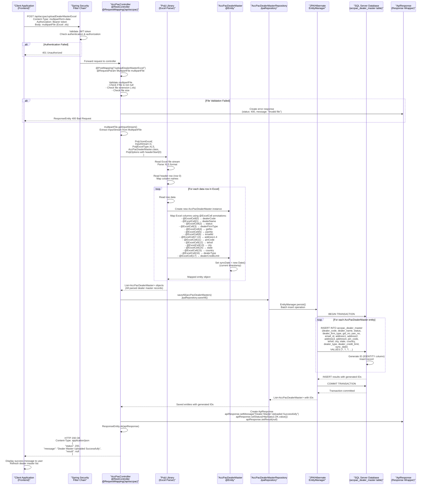
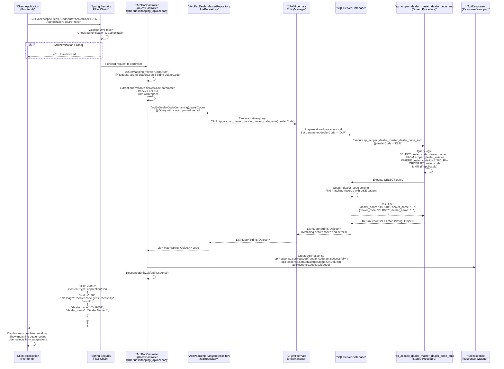
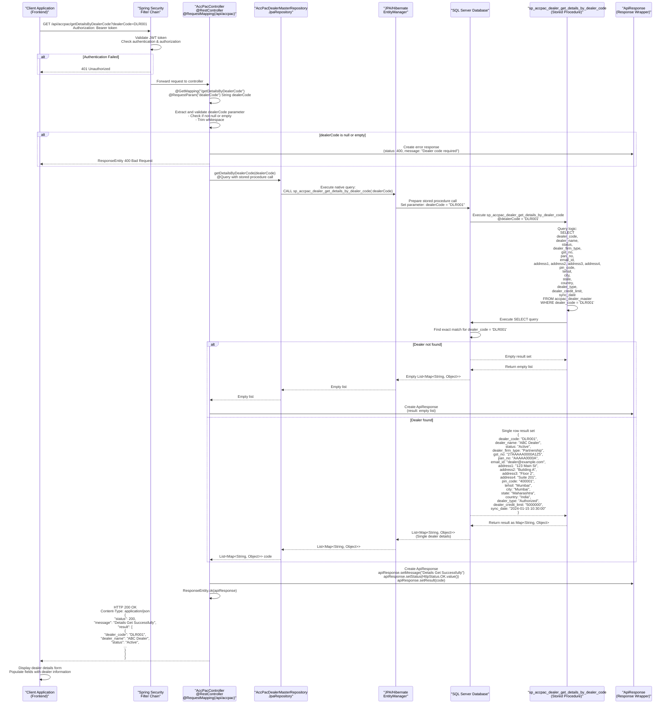
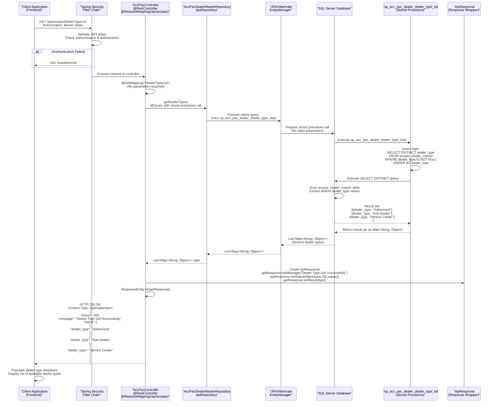
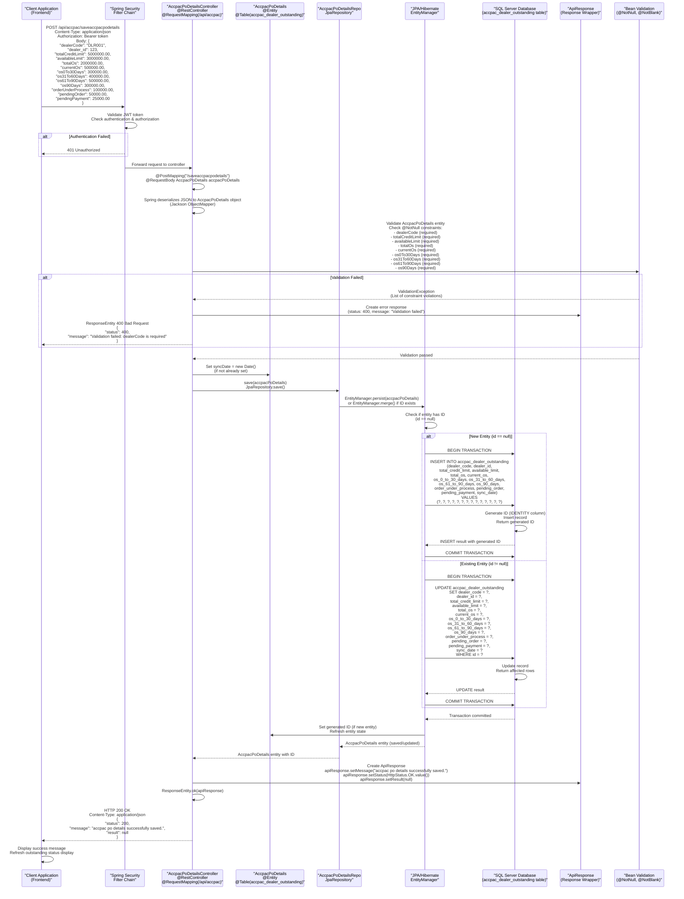
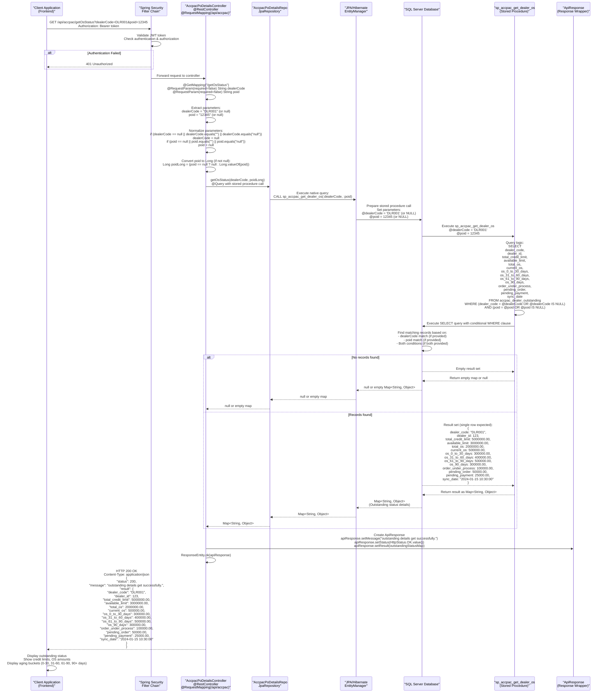
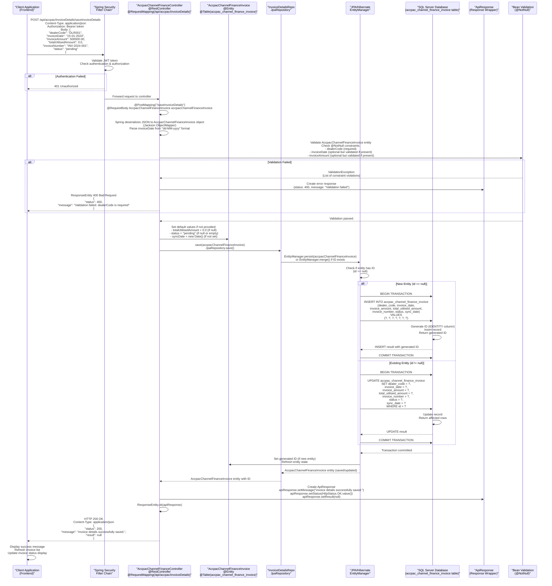

# ACCPAC Module - Detailed Sequence Diagrams

This document contains comprehensive and detailed sequence diagrams for all flows within the ACCPAC Module of the KUBOTA-BACKENED system. The ACCPAC module handles integration with ACCPAC accounting system, including dealer master management, purchase order details, and channel finance invoice management.

## Module Overview

The ACCPAC module consists of:

- **3 Controllers**: 
  - `AccPacController` - Dealer Master operations
  - `AccpacPoDetailsController` - Purchase Order Details and Outstanding Status
  - `AccpacChannelFinanceController` - Channel Finance Invoice operations

- **3 Repositories**:
  - `AccPacDealerMasterRepository` - Dealer Master data access
  - `AccpacPoDetailsRepo` - PO Details and Outstanding data access
  - `InvoiceDetailsRepo` - Invoice Details data access

- **3 Main Domain Entities**:
  - `AccPacDealerMaster` - Dealer master information
  - `AccpacPoDetails` - Dealer outstanding and PO details
  - `AccpacChannelFinanceInvoice` - Channel finance invoice information

---

## Table of Contents

1. [Upload Dealer Master Excel Flow](#1-upload-dealer-master-excel-flow)
2. [Dealer Code Autocomplete Flow](#2-dealer-code-autocomplete-flow)
3. [Get Details by Dealer Code Flow](#3-get-details-by-dealer-code-flow)
4. [Get Dealer Type List Flow](#4-get-dealer-type-list-flow)
5. [Save ACCPAC PO Details Flow](#5-save-accpac-po-details-flow)
6. [Get Outstanding Status Flow](#6-get-outstanding-status-flow)
7. [Save Invoice Details Flow](#7-save-invoice-details-flow)

---

## 1. Upload Dealer Master Excel Flow

This diagram shows the complete flow for uploading dealer master data from an Excel file, including file parsing, data mapping, and database persistence.

---

## 2. Dealer Code Autocomplete Flow

This diagram shows the flow for dealer code autocomplete functionality using stored procedures.

---

## 3. Get Details by Dealer Code Flow

This diagram shows the flow for retrieving complete dealer details by dealer code.

---

## 4. Get Dealer Type List Flow

This diagram shows the flow for retrieving the list of distinct dealer types.

---

## 5. Save ACCPAC PO Details Flow

This diagram shows the complete flow for saving ACCPAC purchase order details (dealer outstanding information).

---

## 6. Get Outstanding Status Flow

This diagram shows the flow for retrieving outstanding status for a dealer or purchase order using stored procedures.

---

## 7. Save Invoice Details Flow

This diagram shows the complete flow for saving channel finance invoice details.

---

## Summary

The ACCPAC Module provides comprehensive integration with the ACCPAC accounting system through the following functionalities:

### 1. **Dealer Master Management** (`AccPacController`)
   - **Upload Dealer Master Excel**: Bulk import dealer master data from Excel files using Poiji library
   - **Dealer Code Autocomplete**: Search and autocomplete dealer codes using stored procedures
   - **Get Details by Dealer Code**: Retrieve complete dealer information by dealer code
   - **Get Dealer Type List**: Fetch distinct dealer types for dropdowns

### 2. **Purchase Order Details Management** (`AccpacPoDetailsController`)
   - **Save ACCPAC PO Details**: Persist dealer outstanding information including credit limits, OS amounts, and aging buckets
   - **Get Outstanding Status**: Retrieve outstanding status for dealers or purchase orders using stored procedures with optional filtering

### 3. **Channel Finance Invoice Management** (`AccpacChannelFinanceController`)
   - **Save Invoice Details**: Store channel finance invoice information with default status and utilization tracking

### Technical Architecture

- **Framework**: Spring Boot 2.3.3.RELEASE with Spring Data JPA
- **Database**: Microsoft SQL Server with stored procedures for complex queries
- **Security**: Spring Security with JWT token authentication
- **Data Access**: JPA/Hibernate with custom repositories and native queries
- **Excel Processing**: Poiji library for Excel file parsing
- **Validation**: Bean Validation (JSR-303) with @NotNull constraints
- **Response Format**: Standardized ApiResponse wrapper for all API responses
- **Date Handling**: Jackson JSON serialization with custom date formats

### Key Features

1. **Stored Procedures**: Used for complex queries and business logic (dealer code search, outstanding calculations)
2. **Batch Operations**: Bulk insert support for Excel uploads
3. **Flexible Filtering**: Optional parameters for outstanding status queries
4. **Default Values**: Automatic setting of syncDate and default status values
5. **Error Handling**: Validation and error responses for invalid inputs
6. **Transaction Management**: Automatic transaction handling by Spring Data JPA

### Database Tables

- `accpac_dealer_master`: Dealer master information
- `accpac_dealer_outstanding`: Dealer outstanding and PO details
- `accpac_channel_finance_invoice`: Channel finance invoice details

### Stored Procedures

- `sp_accpac_dealer_master_dealer_code_auto`: Dealer code autocomplete search
- `sp_accpac_dealer_get_details_by_dealer_code`: Get dealer details by code
- `sp_acc_pac_dealer_dealer_type_list`: Get distinct dealer types
- `sp_accpac_get_dealer_os`: Get outstanding status for dealer/PO

---

**Document Version**: 1.0  
**Last Updated**: 2024  
**Module Path**: `com.i4o.dms.kubota.accpac`

