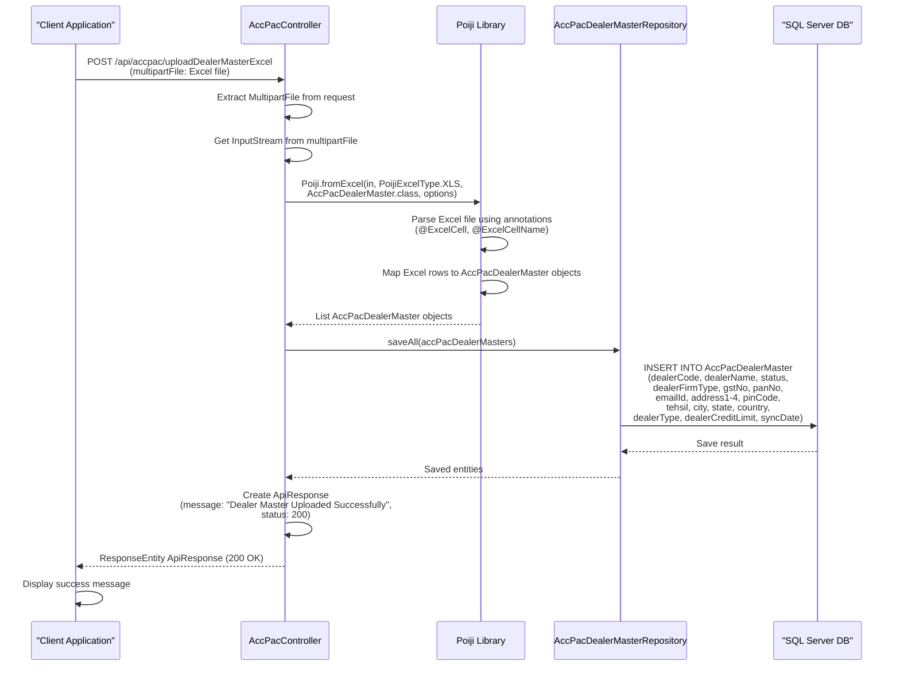
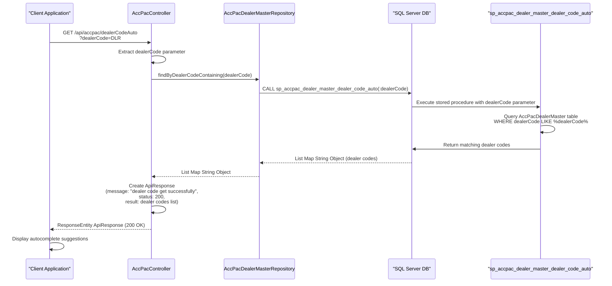
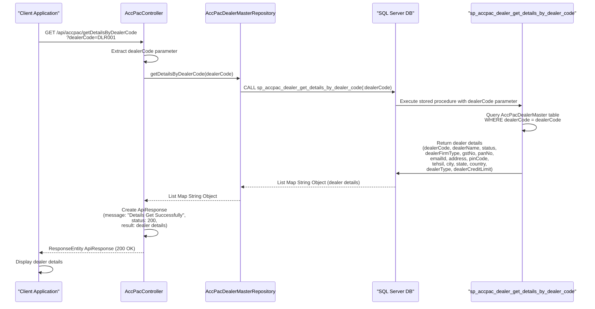
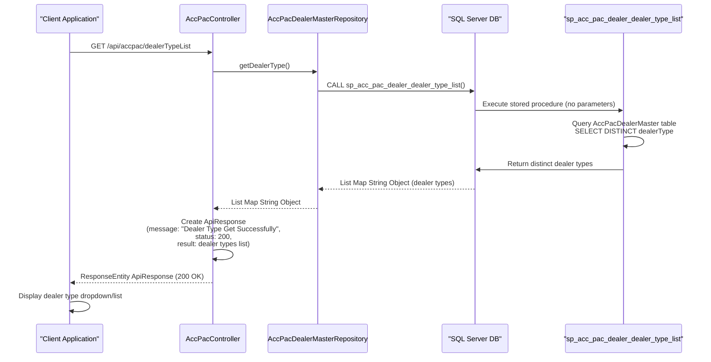
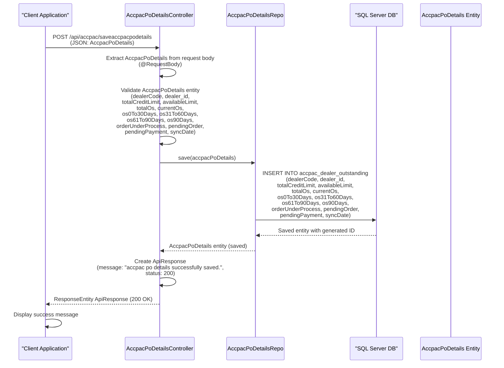
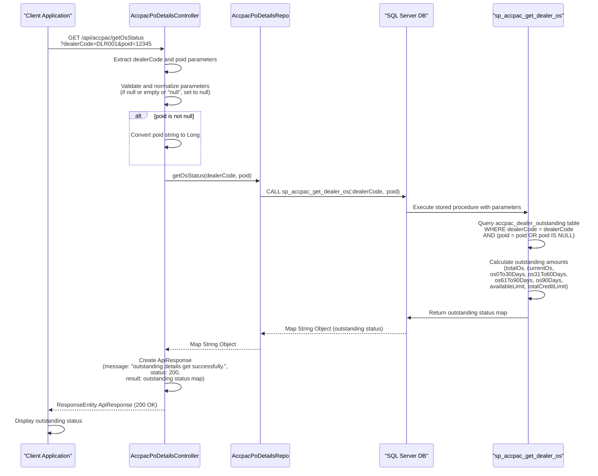
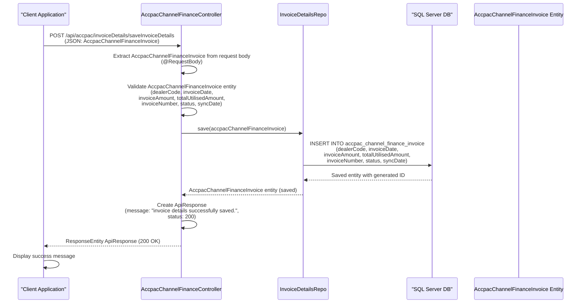

# ACCPAC Module Sequence Diagrams

This document contains detailed sequence diagrams for all flows within the ACCPAC Module of the KUBOTA-BACKENED system. The ACCPAC module handles integration with ACCPAC accounting system, including dealer master management, purchase order details, and channel finance invoice management.

## Table of Contents

1. [Upload Dealer Master Excel Flow](#1-upload-dealer-master-excel-flow)
2. [Dealer Code Autocomplete Flow](#2-dealer-code-autocomplete-flow)
3. [Get Details by Dealer Code Flow](#3-get-details-by-dealer-code-flow)
4. [Get Dealer Type List Flow](#4-get-dealer-type-list-flow)
5. [Save ACCPAC PO Details Flow](#5-save-accpac-po-details-flow)
6. [Get Outstanding Status Flow](#6-get-outstanding-status-flow)
7. [Save Invoice Details Flow](#7-save-invoice-details-flow)

---

## 1. Upload Dealer Master Excel Flow

This diagram shows the flow for uploading dealer master data from an Excel file.

---

## 2. Dealer Code Autocomplete Flow

This diagram shows the flow for dealer code autocomplete functionality.

---

## 3. Get Details by Dealer Code Flow

This diagram shows the flow for retrieving dealer details by dealer code.

---

## 4. Get Dealer Type List Flow

This diagram shows the flow for retrieving the list of dealer types.

---

## 5. Save ACCPAC PO Details Flow

This diagram shows the flow for saving ACCPAC purchase order details.

---

## 6. Get Outstanding Status Flow

This diagram shows the flow for retrieving outstanding status for a dealer or purchase order.

---

## 7. Save Invoice Details Flow

This diagram shows the flow for saving channel finance invoice details.

---

## Summary

The ACCPAC Module handles:

1. **Dealer Master Management**:
   - Upload dealer master data from Excel files
   - Autocomplete dealer codes
   - Retrieve dealer details by code
   - Get dealer type list

2. **Purchase Order Details Management**:
   - Save ACCPAC PO details (outstanding information)
   - Retrieve outstanding status for dealers or purchase orders

3. **Channel Finance Invoice Management**:
   - Save channel finance invoice details

All flows integrate with SQL Server database through JPA repositories and stored procedures. The module uses Spring Boot REST controllers with JSON request/response handling. Excel file processing is handled by the Poiji library for dealer master uploads. The module follows RESTful API patterns and returns standardized ApiResponse objects with status codes and messages.

