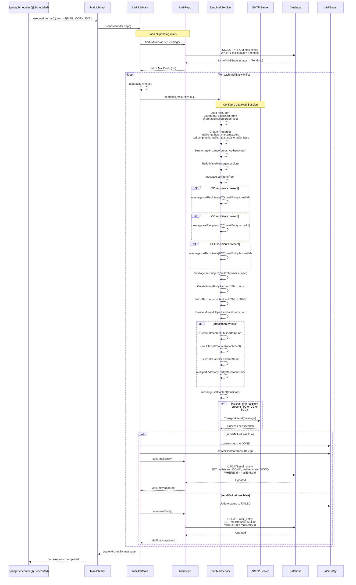
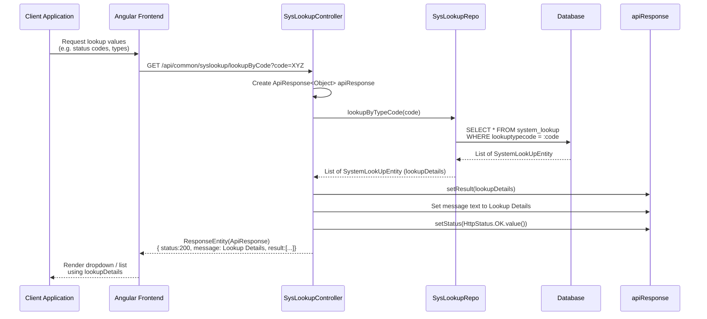
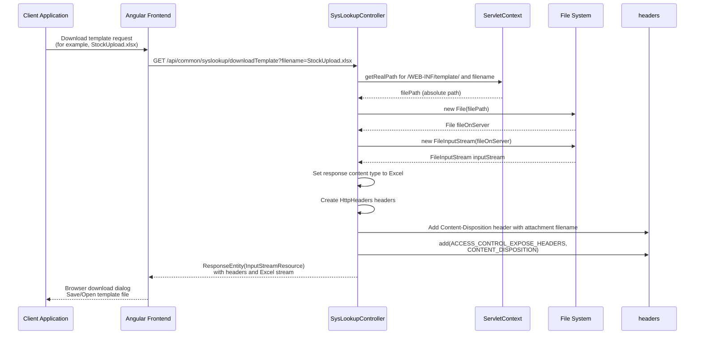
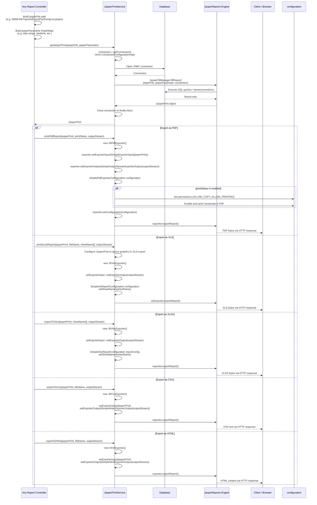

## Common Module - Detailed Sequence Diagrams

This document describes the **key technical flows** implemented in the `com.i4o.dms.kubota.common` module:

- **Mail sending pipeline** (scheduled job + mail service + mail repository).
- **System lookup API**.
- **Jasper report generation and export** (PDF/Excel/CSV/HTML).

All diagrams use Mermaid sequence diagrams and reflect the current implementation of the common module.

---

## 1. Mail Sending Pipeline (Scheduled Job → MailJobMain → SendMailService)

This flow shows how **pending emails** in the database are periodically sent via SMTP using `MailJobImpl`, `MailJobMain`, and `SendMailService`.

---

## 2. System Lookup API (SysLookupController.lookupByCode)

This flow shows how system lookup values are fetched for UI dropdowns or configuration using `SysLookupController` and underlying repository logic.

---

## 3. Template Download API (SysLookupController.downloadTemplate)

This flow describes downloading static Excel templates from `WEB-INF/template` using `downloadTemplate`.

---

## 4. Jasper Report Generation & Export (JasperPrintService)

This flow illustrates how a Jasper report is generated and exported to **PDF**, **Excel (XLS/XLSX)**, **CSV**, or **HTML** using `JasperPrintService`.

---

## Summary

The **common** module centralizes **cross-cutting infrastructure** for the KUBOTA DMS:

- **Email Delivery**:
  - `MailJobImpl` (scheduled by Spring) periodically triggers `MailJobMain`.
  - `MailJobMain` loads `Pending` mails from `MailRepo` and delegates sending to `SendMailService`.
  - `SendMailService` uses JavaMail to send HTML emails with optional attachments, updating each `MailEntity` to `DONE` or `FAILED`.

- **System Lookups & Templates**:
  - `SysLookupController` exposes lookup data via `/lookupByCode`.
  - `/downloadTemplate` serves static Excel templates from `/WEB-INF/template` for imports.

- **Reporting**:
  - `JasperPrintService` encapsulates all JasperReports integration:
    - Fills reports using DB connections from `ConnectionConfigurationImpl`.
    - Exports them into **PDF**, **XLS/XLSX**, **CSV**, or **HTML** for controllers to stream to clients.

These shared services simplify other modules (sales, service, warranty, etc.) by providing **reusable mail, lookup, and reporting capabilities** with well-defined APIs.

