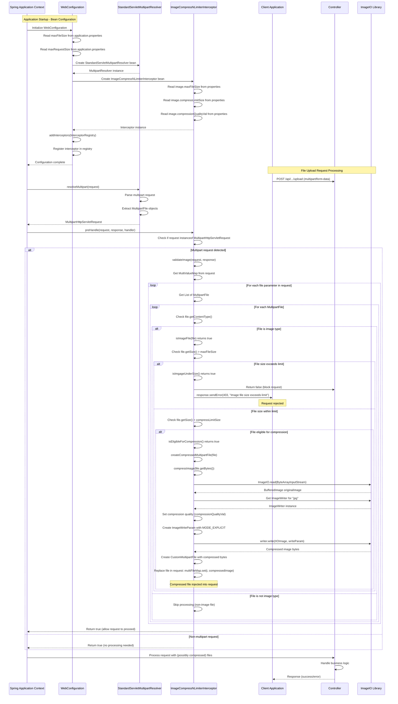
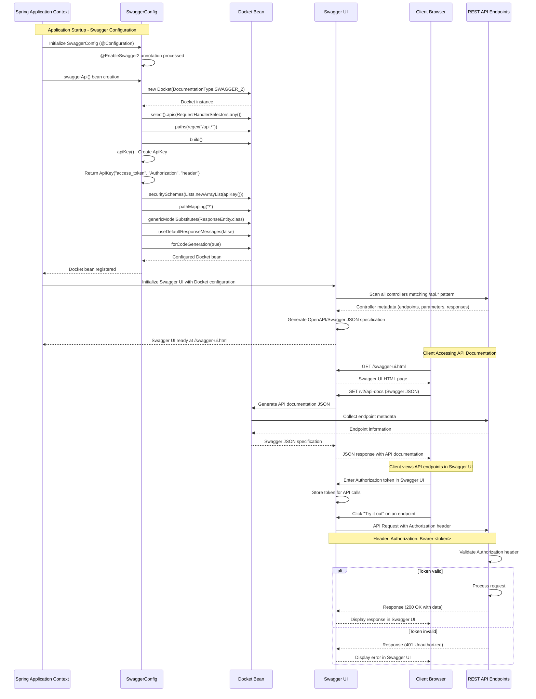
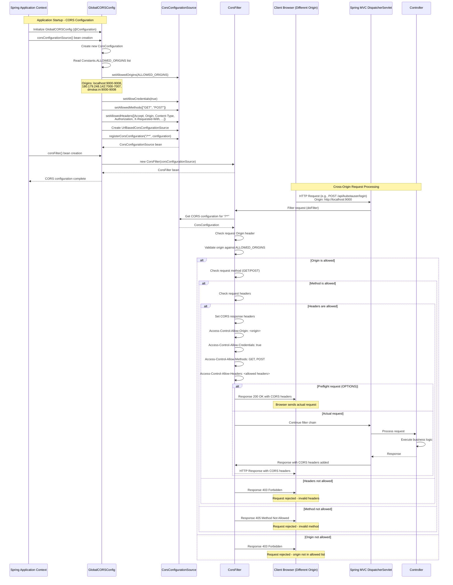
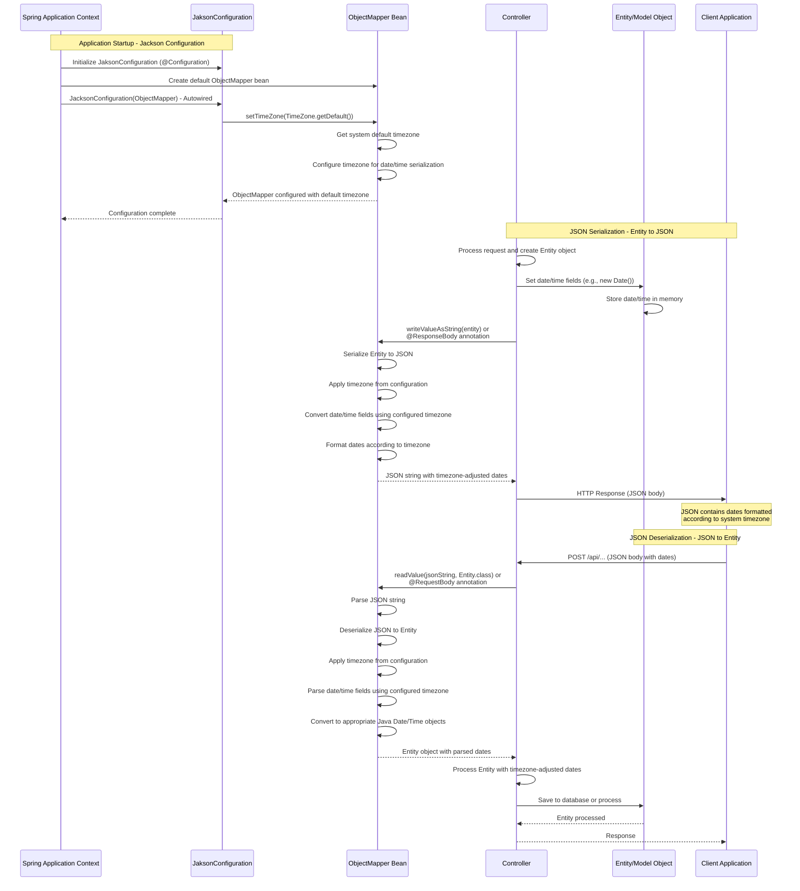
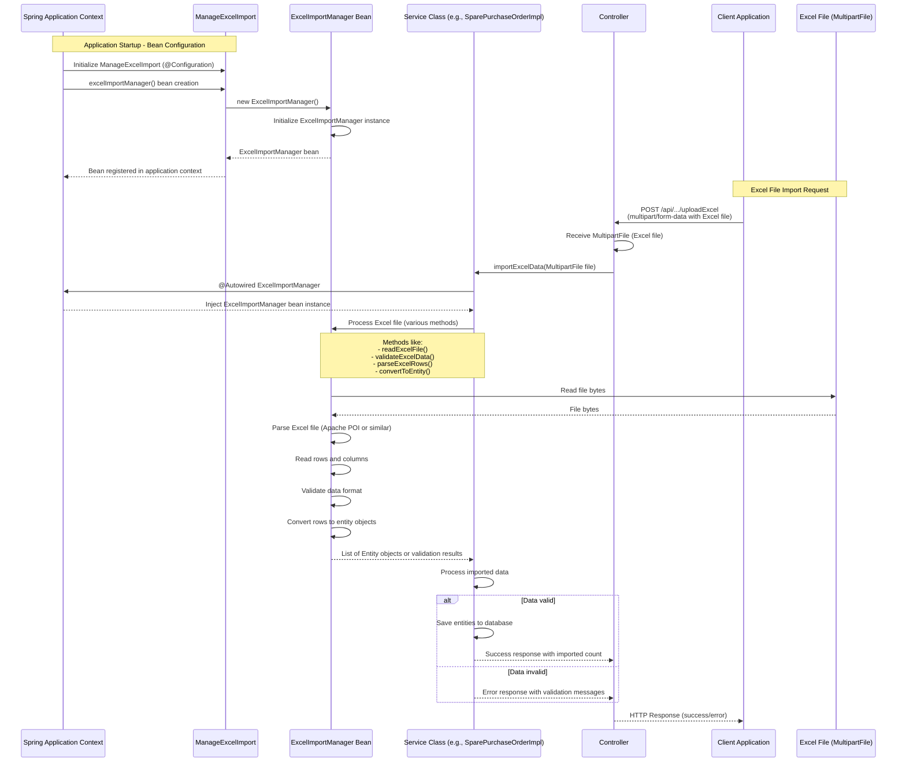

## Configurations Module - Detailed Sequence Diagrams

This document describes the **key technical flows** implemented in the `com.i4o.dms.kubota.configurations` module:

- **Web Configuration** (multipart file upload resolver + image compression interceptor).
- **Swagger API Documentation** (Swagger/OpenAPI configuration with authentication).
- **Global CORS Configuration** (Cross-Origin Resource Sharing filter).
- **Jackson JSON Configuration** (ObjectMapper timezone configuration).
- **Excel Import Manager** (Excel import utility bean configuration).

All diagrams use Mermaid sequence diagrams and reflect the current implementation of the configurations module.

---

## 1. Web Configuration - File Upload with Image Compression Interceptor Flow

This flow shows how **multipart file uploads** are handled and how the **ImageCompressNLimiterInterceptor** intercepts image uploads to validate size limits and compress images before they reach the controller.

---

## 2. Swagger API Documentation - Initialization and Access Flow

This flow shows how **Swagger/OpenAPI documentation** is configured during application startup and how clients access the API documentation with authentication.

---

## 3. Global CORS Configuration - Cross-Origin Request Handling Flow

This flow shows how **CORS (Cross-Origin Resource Sharing)** is configured globally and how the CORS filter intercepts requests to validate origins, headers, and methods.

---

## 4. Jackson JSON Configuration - ObjectMapper Timezone Configuration Flow

This flow shows how **Jackson ObjectMapper** is configured with timezone settings during application startup and how it affects JSON serialization/deserialization.

---

## 5. Excel Import Manager - Bean Configuration and Usage Flow

This flow shows how the **ExcelImportManager** bean is configured during application startup and how it's used by service classes to import Excel files.

---

## Summary

The **configurations** module provides **cross-cutting infrastructure configuration** for the KUBOTA DMS:

- **Web Configuration**:
  - Configures `StandardServletMultipartResolver` for handling multipart file uploads.
  - Registers `ImageCompressNLimiterInterceptor` to intercept image uploads, validate file sizes, and automatically compress images that exceed the compression threshold before they reach controllers.

- **Swagger API Documentation**:
  - Configures Swagger/OpenAPI documentation with API key authentication.
  - Scans all endpoints matching `/api.*` pattern and generates interactive API documentation accessible at `/swagger-ui.html`.
  - Supports Authorization header-based authentication for testing APIs.

- **Global CORS Configuration**:
  - Configures Cross-Origin Resource Sharing (CORS) filter globally.
  - Validates request origins against an allowed list (localhost ports, production IPs, and domains).
  - Sets appropriate CORS headers for allowed GET/POST requests with specific headers.

- **Jackson JSON Configuration**:
  - Configures Jackson `ObjectMapper` with system default timezone.
  - Ensures consistent date/time serialization and deserialization across all JSON operations.

- **Excel Import Manager**:
  - Provides a centralized `ExcelImportManager` bean for Excel file processing.
  - Used by multiple service classes (spares, warranty, inventory management) for importing Excel data.

These configuration classes ensure **consistent behavior** across the entire application for file uploads, API documentation, cross-origin requests, JSON processing, and Excel imports.

