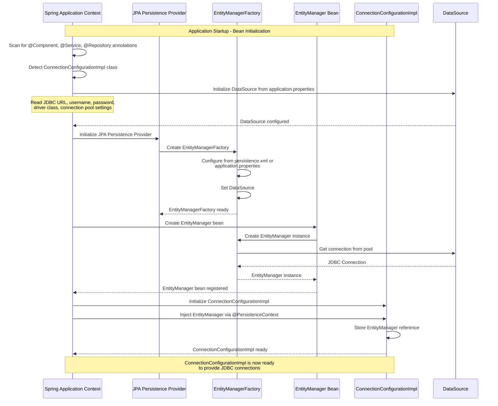
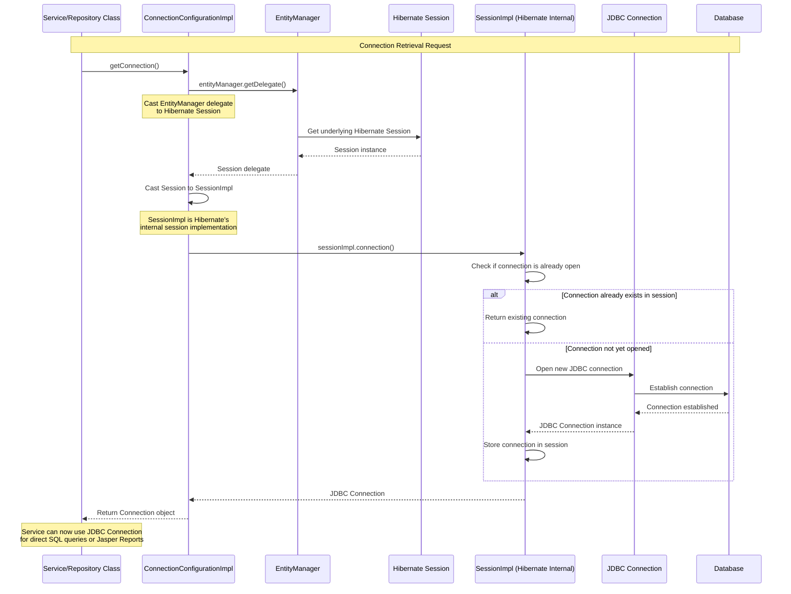
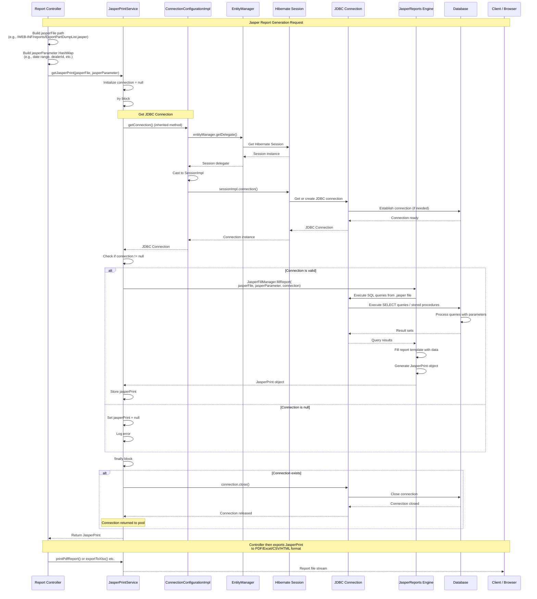
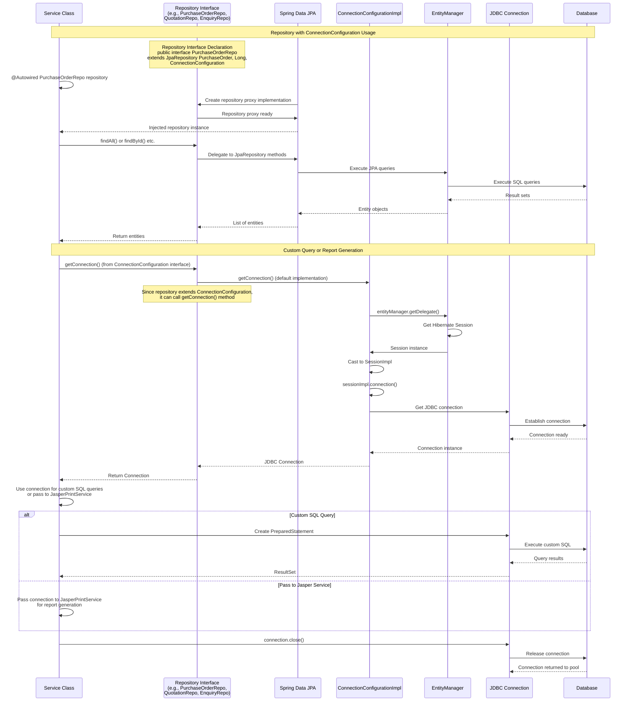
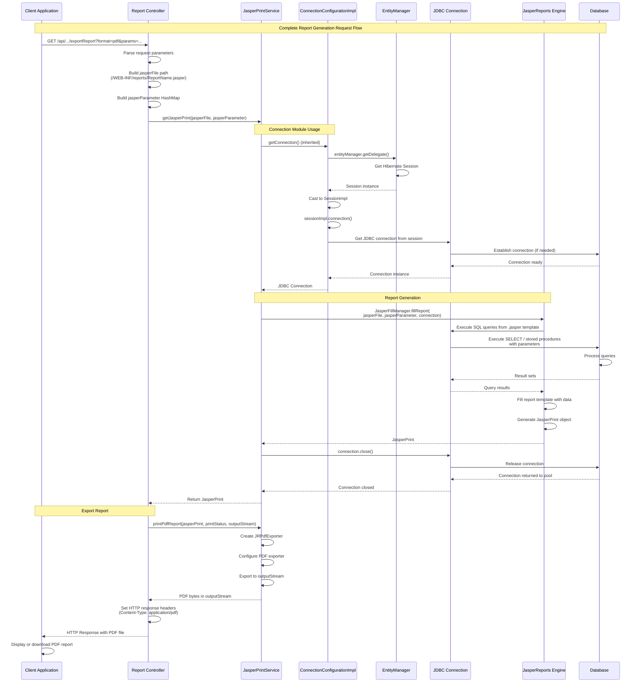

## Connection Module - Detailed Sequence Diagrams

This document describes the **key technical flows** implemented in the `com.i4o.dms.kubota.connection` module:

- **Connection Configuration** (EntityManager injection and JDBC connection extraction).
- **Connection Retrieval Flow** (Extracting JDBC Connection from Hibernate Session).
- **Usage in Jasper Reports** (JasperPrintService using connection for report generation).
- **Usage in Repositories** (Repositories implementing ConnectionConfiguration interface).

All diagrams use Mermaid sequence diagrams and reflect the current implementation of the connection module.

---

## 1. Connection Configuration - Bean Initialization and EntityManager Injection

This flow shows how **ConnectionConfigurationImpl** is initialized and how Spring injects the **EntityManager** through `@PersistenceContext`.

---

## 2. Connection Retrieval Flow - Extracting JDBC Connection from Hibernate Session

This flow shows how **getConnection()** method extracts a raw JDBC **Connection** from the Hibernate **EntityManager** by accessing the underlying Hibernate **Session**.

---

## 3. Usage in Jasper Reports - JasperPrintService Connection Flow

This flow shows how **JasperPrintService** (which extends **ConnectionConfigurationImpl**) uses the connection to generate Jasper reports by filling report templates with database data.

---

## 4. Usage in Repositories - Repository ConnectionConfiguration Implementation

This flow shows how various **Repository interfaces** extend **ConnectionConfiguration** to provide connection access, and how services use repositories to get connections for custom queries or reports.

---

## 5. Complete Flow - Report Generation with Connection Module

This flow shows the **complete end-to-end flow** of how a report request flows through the system, using the connection module to access the database.

---

## Summary

The **connection** module provides a **centralized way to access JDBC connections** from the Hibernate EntityManager for use in Jasper Reports and custom SQL queries:

- **ConnectionConfiguration Interface**:
  - Defines a simple contract: `Connection getConnection()`
  - Implemented by repositories and services that need direct JDBC access

- **ConnectionConfigurationImpl**:
  - Extracts JDBC `Connection` from Hibernate `EntityManager` by accessing the underlying `Session`
  - Uses Hibernate's internal `SessionImpl` to get the raw JDBC connection
  - Provides connection management without manual DataSource configuration

- **Usage Patterns**:
  - **JasperPrintService**: Extends `ConnectionConfigurationImpl` to get connections for filling Jasper report templates
  - **Repositories**: Implement `ConnectionConfiguration` interface to provide connection access for custom queries
  - **Services**: Can use repository's `getConnection()` method for direct SQL operations

- **Connection Lifecycle**:
  - Connections are obtained from the Hibernate session's connection pool
  - Connections must be properly closed after use (handled in `finally` blocks)
  - Connections are returned to the pool when closed

This module **bridges the gap** between JPA/Hibernate's EntityManager and JasperReports' requirement for raw JDBC connections, enabling seamless report generation while maintaining Spring's dependency injection and connection pooling benefits.

