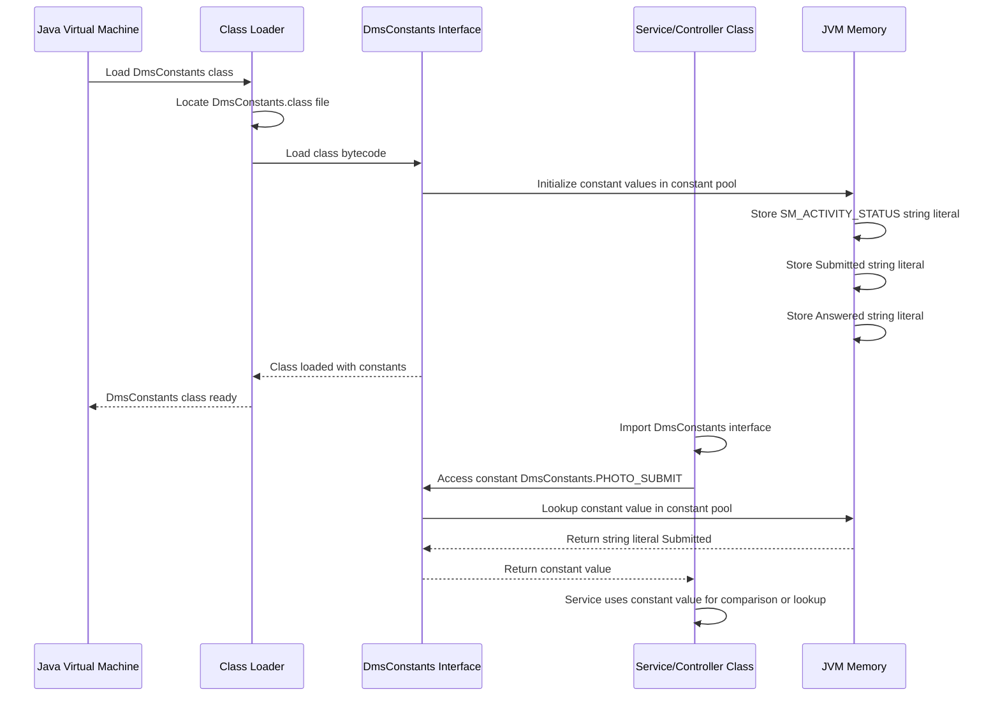
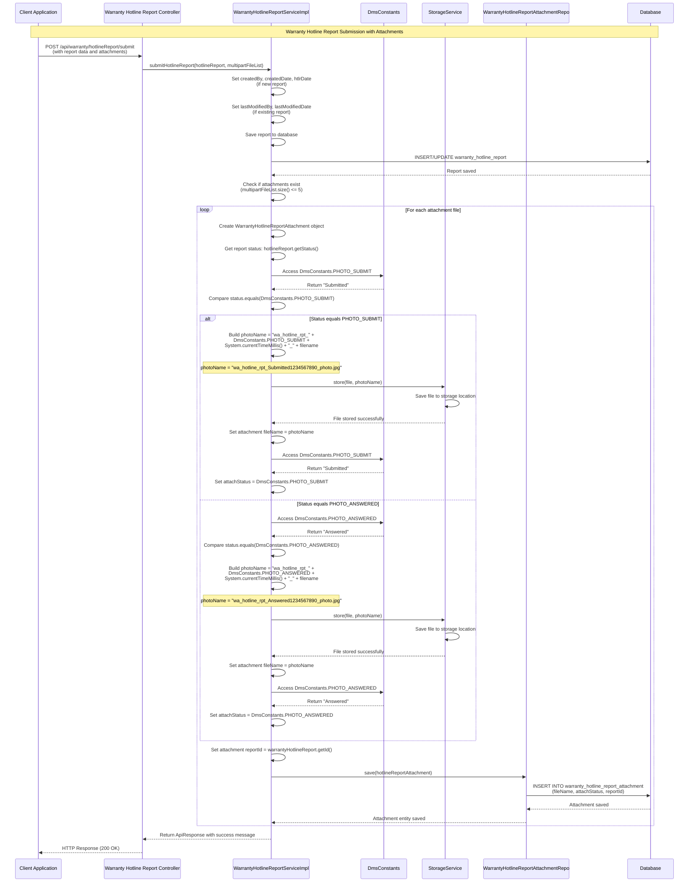
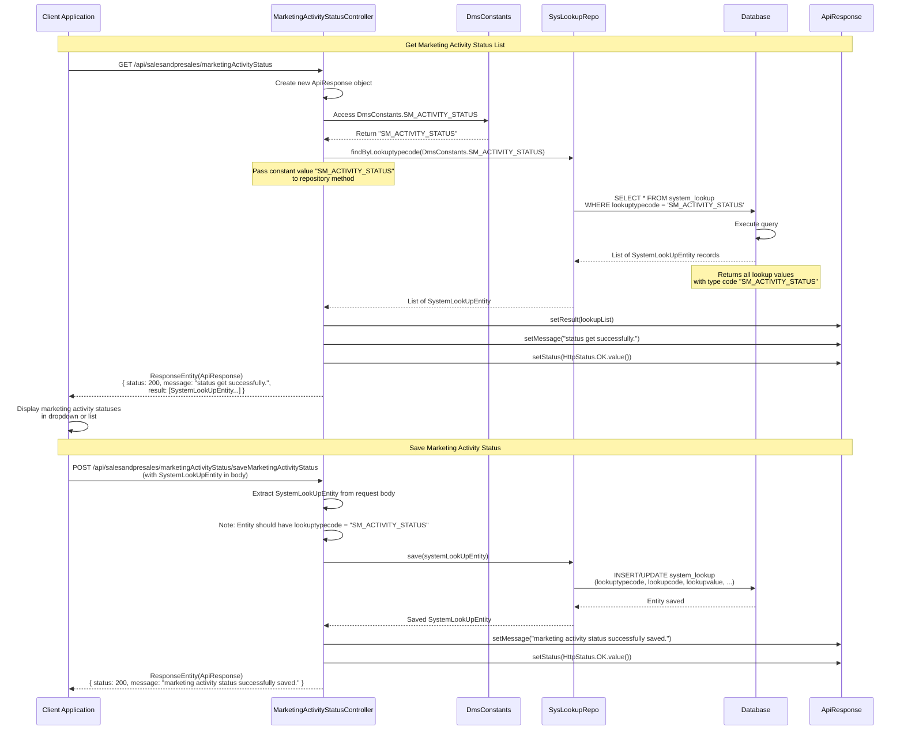
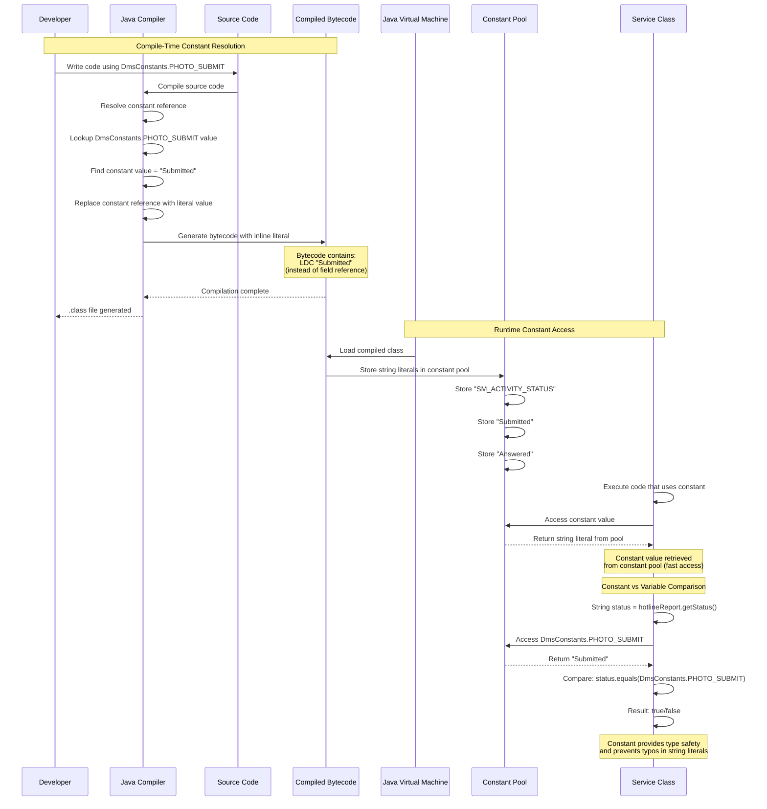
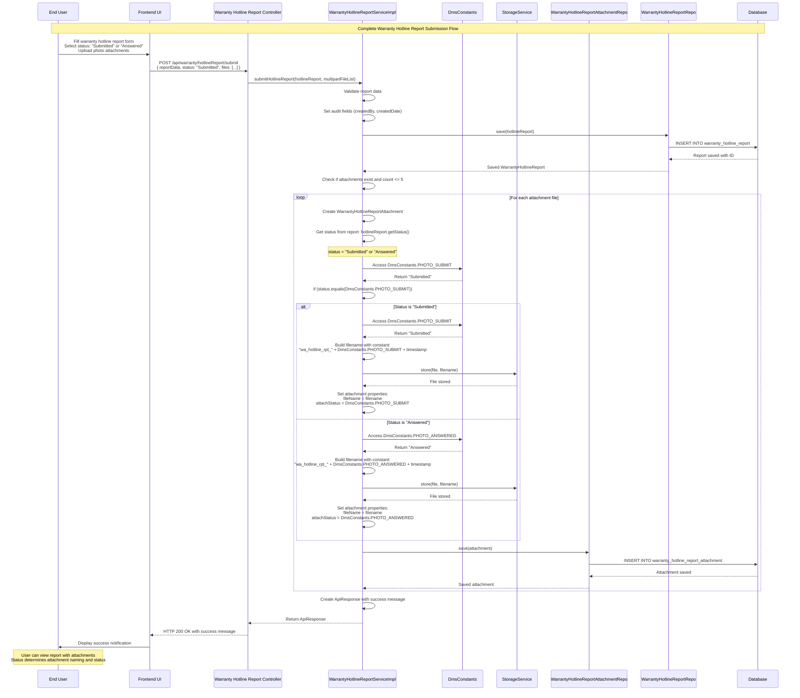

## Constant Module - Detailed Sequence Diagrams

This document describes the **key technical flows** implemented in the `com.i4o.dms.kubota.constant` module:

- **Constant Definition and Loading** (DmsConstants interface with constant values).
- **Usage in Warranty Hotline Report Service** (Status constants for photo submission and answering).
- **Usage in Marketing Activity Status Controller** (Lookup type code constant for system lookups).
- **Constant Access Pattern** (How constants are accessed across the application).

All diagrams use Mermaid sequence diagrams and reflect the current implementation of the constant module.

---

## 1. Constant Definition and Loading - DmsConstants Interface

This flow shows how **DmsConstants** interface defines constant values and how they are loaded and accessed by classes at compile-time and runtime.

---

## 2. Usage in Warranty Hotline Report Service - Photo Status Constants

This flow shows how **DmsConstants** constants are used in **WarrantyHotlineReportServiceImpl** to determine photo attachment status when submitting warranty hotline reports.

---

## 3. Usage in Marketing Activity Status Controller - System Lookup Constant

This flow shows how **DmsConstants.SM_ACTIVITY_STATUS** is used in **MarketingActivityStatusController** to query system lookup values for marketing activity statuses.

---

## 4. Constant Access Pattern - Compile-Time vs Runtime Access

This flow shows the **different patterns** of accessing constants and how they behave at compile-time vs runtime.

---

## 5. Complete Flow - Warranty Hotline Report with Constant-Based Status Management

This flow shows the **complete end-to-end flow** of how constants are used throughout the warranty hotline report submission and status management process.

---

## Summary

The **constant** module provides **centralized constant definitions** for the KUBOTA DMS:

- **DmsConstants Interface**:
  - Defines constant string values used across the application
  - `SM_ACTIVITY_STATUS`: Lookup type code for marketing activity statuses
  - `PHOTO_SUBMIT`: Status value for submitted photos ("Submitted")
  - `PHOTO_ANSWERED`: Status value for answered photos ("Answered")

- **Usage Patterns**:
  - **Status Comparison**: Used in `WarrantyHotlineReportServiceImpl` to determine photo attachment status and file naming
  - **System Lookup**: Used in `MarketingActivityStatusController` to query system lookup values by type code
  - **Type Safety**: Provides compile-time constant resolution and prevents typos in string literals

- **Benefits**:
  - **Centralized Management**: All constants defined in one place for easy maintenance
  - **Type Safety**: Compile-time checking prevents errors
  - **Performance**: Constants are stored in JVM constant pool for fast access
  - **Maintainability**: Changes to constant values only need to be made in one location

- **Constant Access**:
  - Constants are resolved at compile-time and stored in JVM constant pool
  - Access is fast and efficient (no field lookup overhead)
  - Values are inlined in bytecode for optimal performance

This module ensures **consistent use of string constants** across the application, reducing errors from typos and making it easier to maintain and update constant values throughout the codebase.

