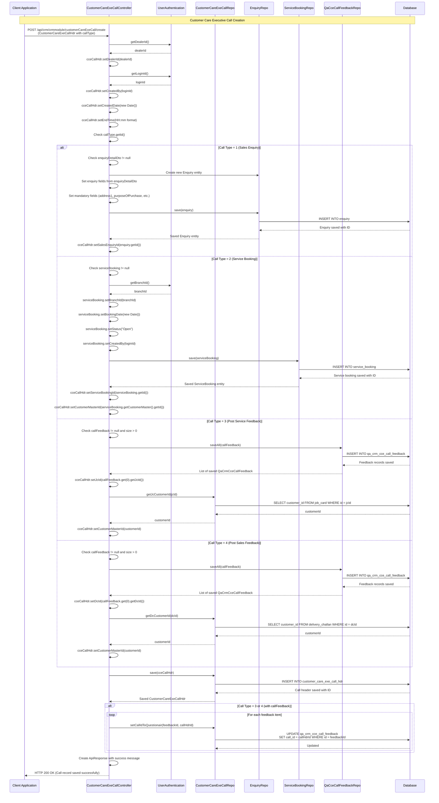
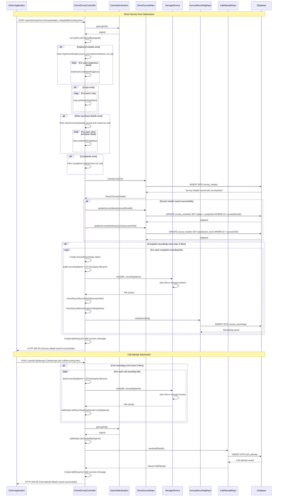
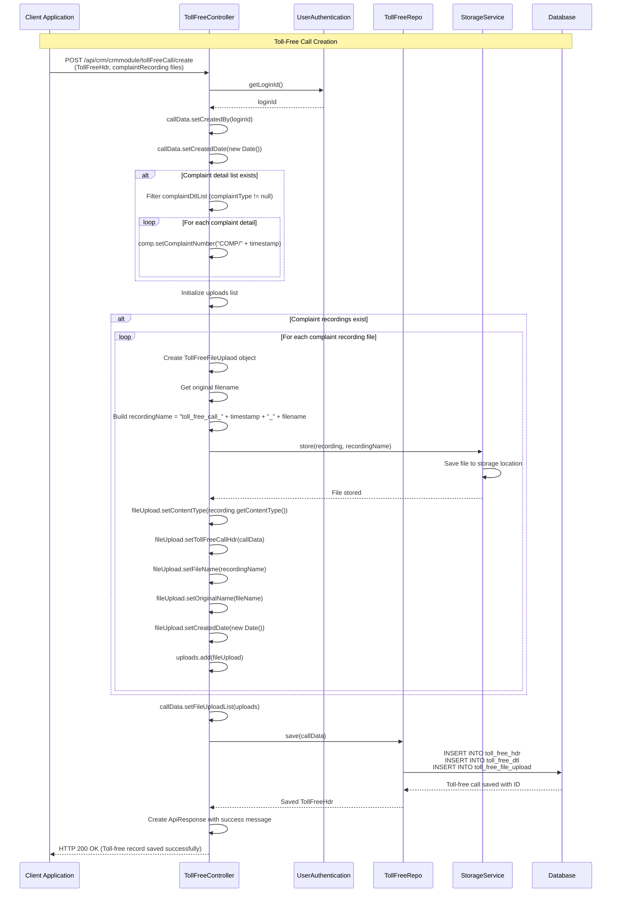
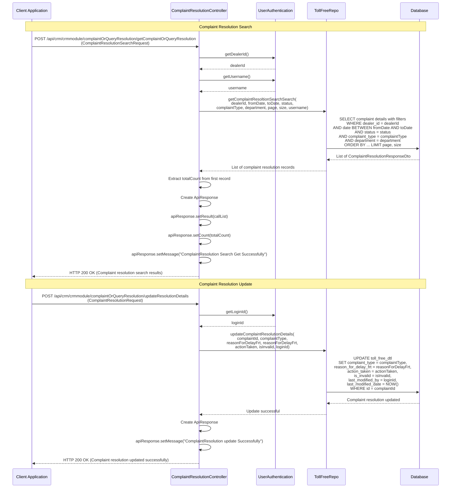
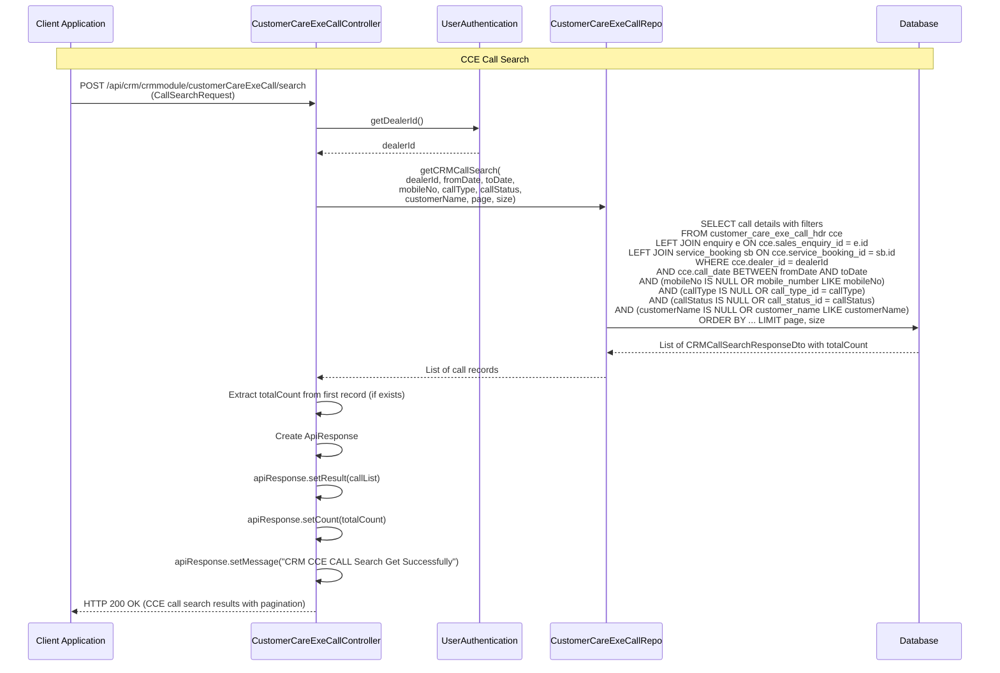
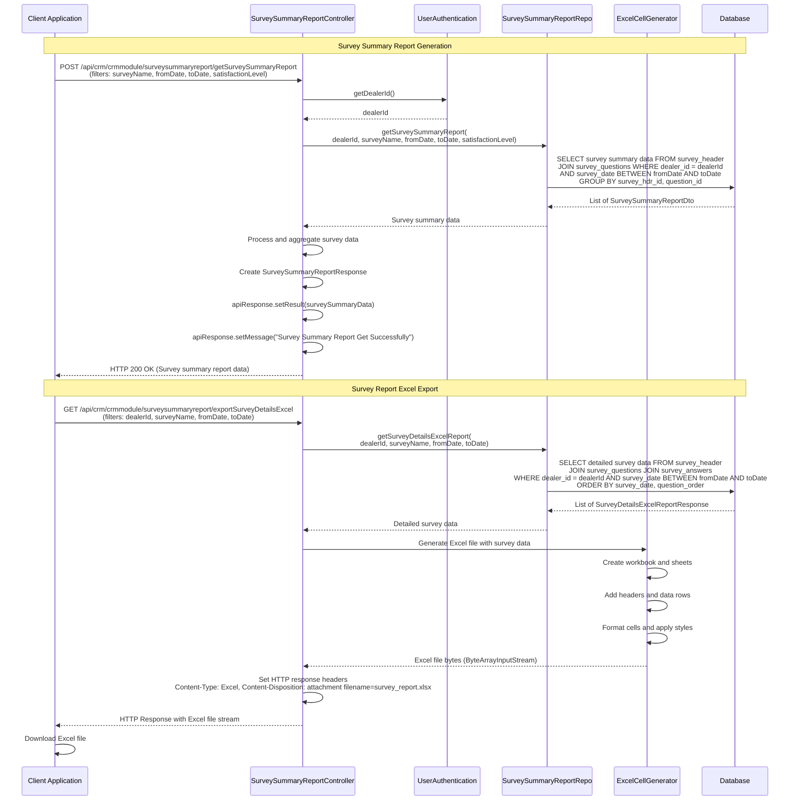

## CRM Module - Detailed Sequence Diagrams

This document describes the **key technical flows** implemented in the `com.i4o.dms.kubota.crm` module:

- **Customer Care Executive Call Creation** (Sales Enquiry, Service Booking, Post Service Feedback, Post Sales Feedback).
- **Direct Survey Submission** (Survey form submission with recordings and call attempts).
- **Toll-Free Call Management** (Toll-free call creation with complaint recordings).
- **Complaint Resolution** (Complaint search and resolution update).
- **Survey Summary Report Generation** (Survey reports and analytics).

All diagrams use Mermaid sequence diagrams and reflect the current implementation of the CRM module.

---

## 1. Customer Care Executive Call Creation Flow

This flow shows how **Customer Care Executive (CCE) calls** are created with different call types: Sales Enquiry (Type 1), Service Booking (Type 2), Post Service Feedback (Type 3), and Post Sales Feedback (Type 4).

---

## 2. Direct Survey Submission Flow

This flow shows how **direct surveys** are submitted with survey questions, answers, complaint recordings, and call attempt recordings.

---

## 3. Toll-Free Call Creation Flow

This flow shows how **toll-free calls** are created with complaint details and complaint recording files.

---

## 4. Complaint Resolution Search and Update Flow

This flow shows how **complaint resolution** searches are performed and how resolution details are updated.

---

## 5. CCE Call Search Flow

This flow shows how **CCE calls** are searched with various filters including call type, call status, mobile number, customer name, and date range.

---

## 6. Survey Summary Report Generation Flow

This flow shows how **survey summary reports** are generated with various filters and exported to Excel format.

---

## Summary

The **CRM module** provides comprehensive **Customer Relationship Management** functionality for the KUBOTA DMS:

- **Customer Care Executive Calls**:
  - Supports 4 call types: Sales Enquiry, Service Booking, Post Service Feedback, Post Sales Feedback
  - Automatically creates related entities (Enquiry, ServiceBooking) based on call type
  - Links call feedback questionnaires to job cards or delivery challans
  - Provides search functionality with multiple filters (date range, call type, status, customer details)

- **Direct Surveys**:
  - Survey form submission with questions, answers, and sub-answers
  - Complaint recording file uploads (up to 5 files)
  - Call attempt tracking with recording file uploads
  - Survey status and satisfaction level management
  - Machine details, crops grown, and implement tracking

- **Toll-Free Calls**:
  - Toll-free call creation with complaint details
  - Complaint recording file uploads
  - Complaint number auto-generation
  - Integration with dealer and TSM (Territory Sales Manager) details
  - Call history tracking by customer and VIN

- **Complaint Resolution**:
  - Complaint search with filters (date range, status, complaint type, department)
  - Resolution details update (action taken, reason for delay, invalid flag)
  - Pagination support for large result sets

- **Reports and Analytics**:
  - Survey summary reports with satisfaction level filtering
  - Survey details Excel export
  - Customer satisfaction score reports
  - Monthly failure code summary reports
  - Toll-free call reports

The CRM module integrates with multiple other modules (Sales, Service, Warranty) to provide a unified customer interaction and feedback management system, enabling dealers and headquarters to track customer satisfaction, complaints, and service quality effectively.

