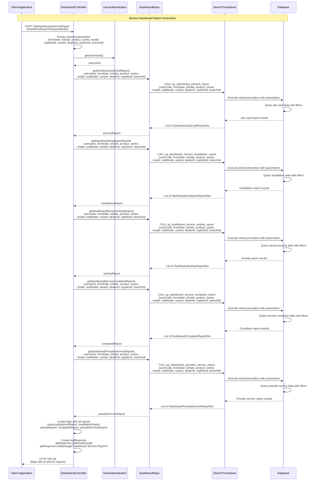
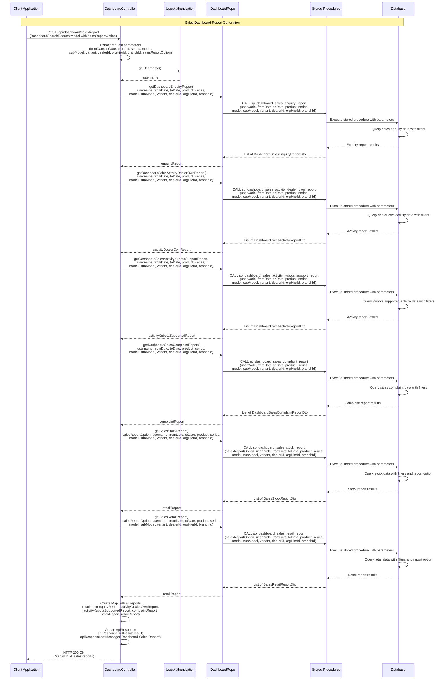
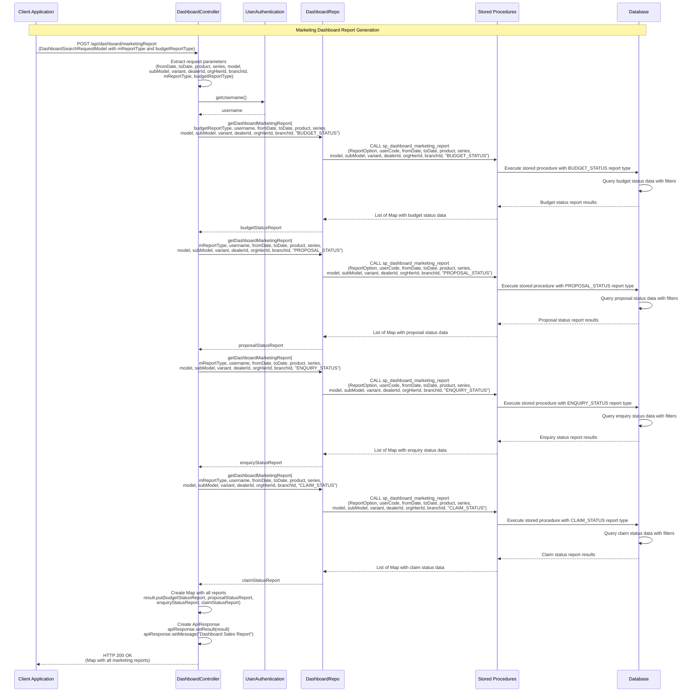
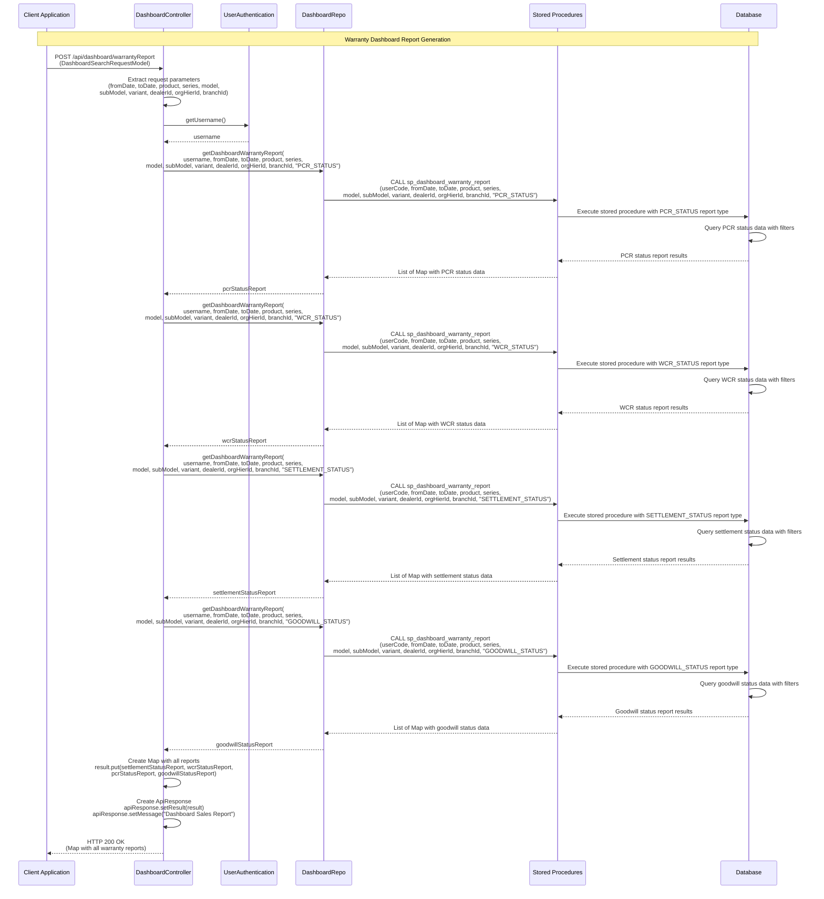
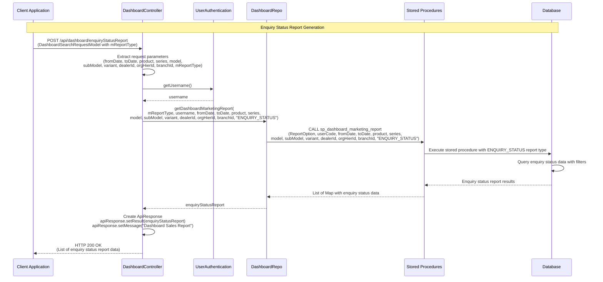

## Dashboard Module - Detailed Sequence Diagrams

This document describes the **key technical flows** implemented in the `com.i4o.dms.kubota.dashboard` module:

- **Service Report Generation** (Job cards, installations, activities, complaints, presale services).
- **Sales Report Generation** (Enquiries, activities, complaints, stock, retail reports).
- **Marketing Report Generation** (Budget status, proposal status, enquiry status, claim status).
- **Warranty Report Generation** (PCR status, WCR status, settlement status, goodwill status).

All diagrams use Mermaid sequence diagrams and reflect the current implementation of the dashboard module.

---

## 1. Service Report Generation Flow

This flow shows how **service dashboard reports** are generated, including job card reports, installation reports, activity reports, complaint reports, and presale service reports.

---

## 2. Sales Report Generation Flow

This flow shows how **sales dashboard reports** are generated, including enquiry reports, activity reports (dealer own and Kubota supported), complaint reports, stock reports, and retail reports.

---

## 3. Marketing Report Generation Flow

This flow shows how **marketing dashboard reports** are generated, including budget status, proposal status, enquiry status, and claim status reports.

---

## 4. Warranty Report Generation Flow

This flow shows how **warranty dashboard reports** are generated, including PCR status, WCR status, settlement status, and goodwill status reports.

---

## 5. Enquiry Status Report Flow (Standalone)

This flow shows how a **standalone enquiry status report** is generated for marketing activities.

---

## Summary

The **dashboard** module provides comprehensive **reporting and analytics** functionality for the KUBOTA DMS:

- **Service Reports**:
  - Job card reports, installation reports, service activity reports
  - Service complaint reports, presale service reports
  - All reports use stored procedures with common filtering parameters

- **Sales Reports**:
  - Sales enquiry reports, sales activity reports (dealer own and Kubota supported)
  - Sales complaint reports, stock reports, retail reports
  - Stock and retail reports support different report options

- **Marketing Reports**:
  - Budget status reports, proposal status reports
  - Enquiry status reports, claim status reports
  - All use a single stored procedure with different report type parameters

- **Warranty Reports**:
  - PCR (Product Complaint Report) status reports
  - WCR (Warranty Claim Report) status reports
  - Settlement status reports, goodwill status reports
  - All use a single stored procedure with different report type parameters

- **Common Features**:
  - All reports support filtering by date range, product hierarchy (product, series, model, subModel, variant)
  - Dealer, organization hierarchy, and branch filtering
  - User-based access control through username parameter
  - Stored procedure-based data retrieval for performance
  - Aggregated results returned as Maps with multiple report types

The dashboard module integrates with multiple other modules (Service, Sales, Marketing, Warranty) to provide unified reporting capabilities, enabling dealers and headquarters to analyze performance, track activities, and monitor key metrics across all business areas.

