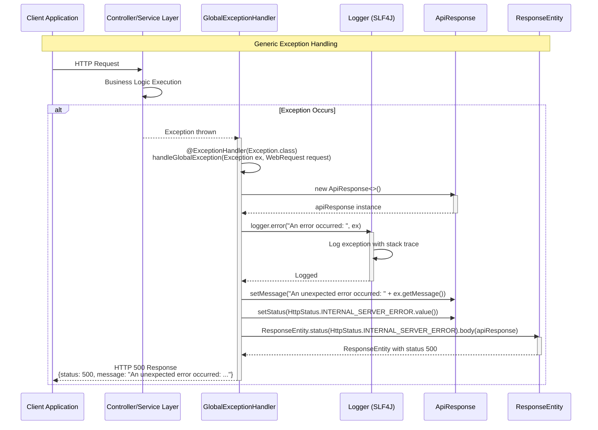
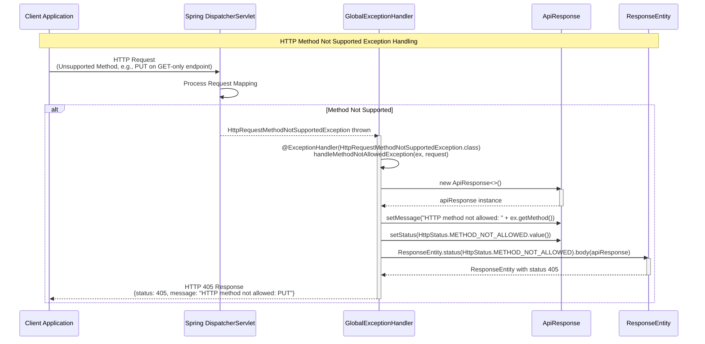
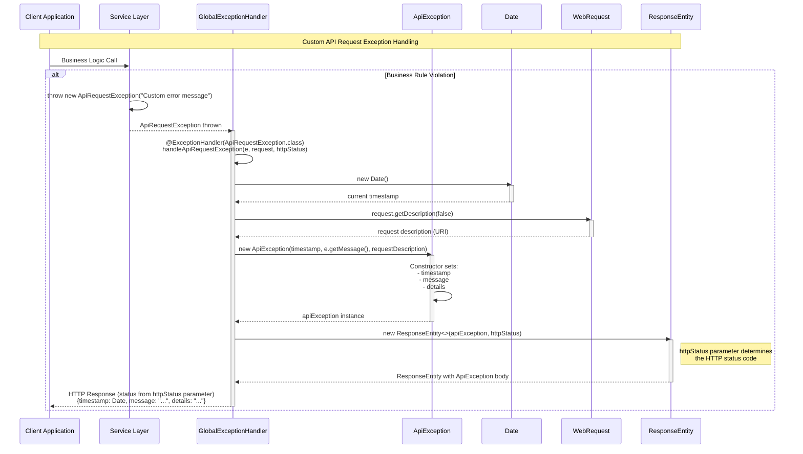
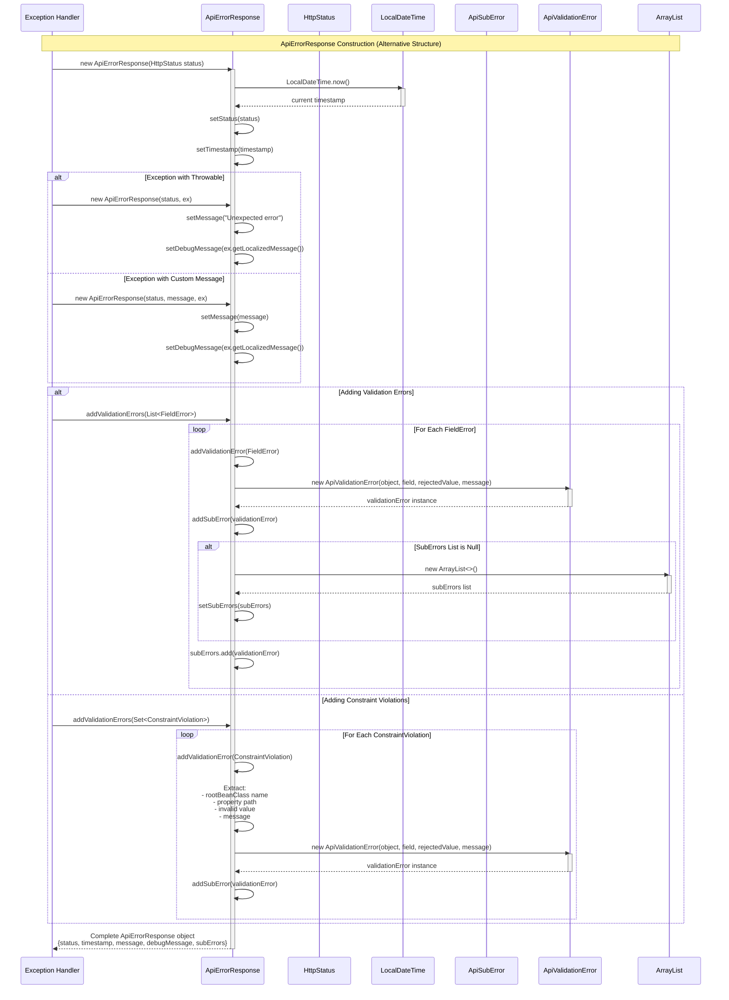
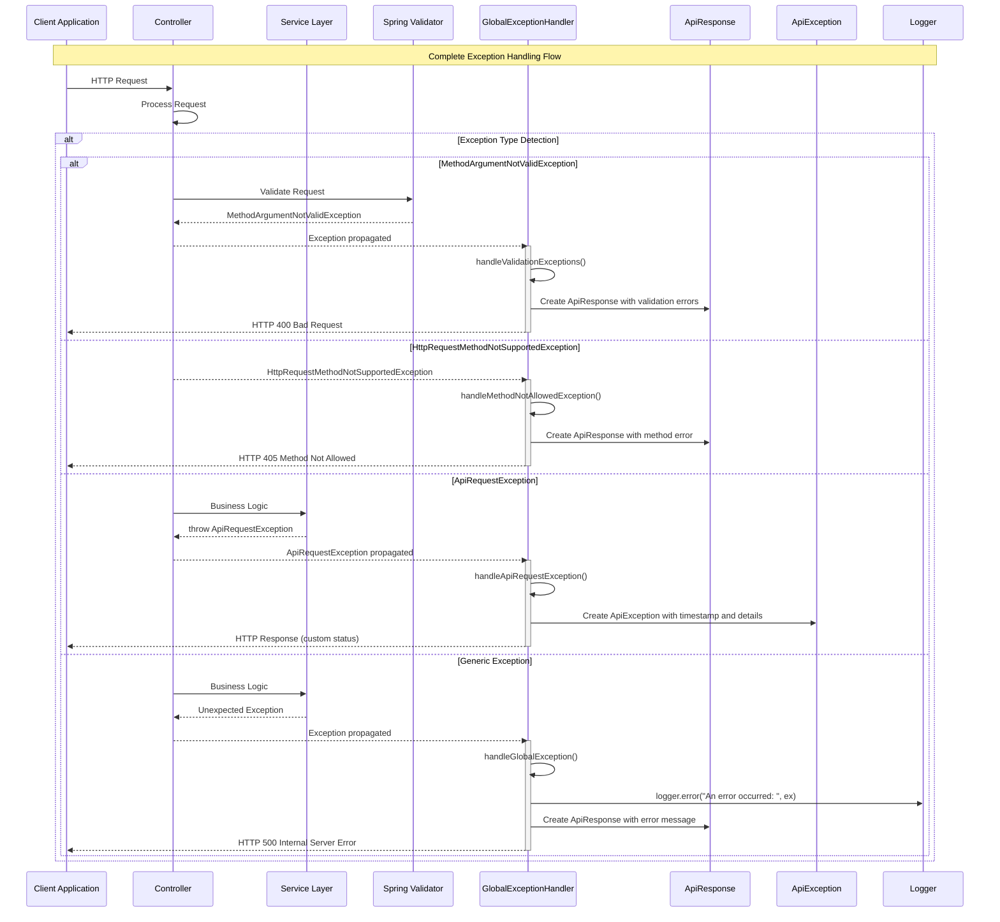

## Exception Module - Detailed Sequence Diagrams

This document describes the **exception handling flows** implemented in the `com.i4o.dms.kubota.exception` module:

- **Global Exception Handling** (Generic exceptions, HTTP method errors, validation errors, and custom API exceptions).
- **Error Response Construction** (ApiErrorResponse and ApiResponse structures).
- **Validation Error Processing** (Field errors, object errors, and constraint violations).

All diagrams use Mermaid sequence diagrams and reflect the current implementation of the Exception module.

---

## 1. Generic Exception Handling Flow

This flow shows how **unexpected exceptions** are caught and handled by the GlobalExceptionHandler.



---

## 2. HTTP Method Not Supported Exception Flow

This flow shows how **HTTP method not allowed exceptions** are handled when an unsupported HTTP method is used.



---

## 3. Validation Exception Handling Flow

This flow shows how **method argument validation errors** are processed and returned to the client.

```mermaid
sequenceDiagram
    %% Participants
    participant Client as Client Application
    participant Controller as Controller
    participant Validator as Spring Validator
    participant GExHandler as GlobalExceptionHandler
    participant ApiResponse as ApiResponse
    participant HashMap as HashMap<String, String>
    participant ResponseEntity as ResponseEntity

    %% Validation Exception Flow
    Note over Client,ResponseEntity: Method Argument Validation Exception Handling
    
    Client->>Controller: POST/PUT Request<br/>(Request Body with @Valid annotation)
    
    Controller->>Validator: Validate Request Body
    activate Validator
    
    alt Validation Fails
        Validator-->>Controller: MethodArgumentNotValidException thrown
        deactivate Validator
        Controller-->>GExHandler: Exception propagated
        activate GExHandler
        
        GExHandler->>GExHandler: @ExceptionHandler(MethodArgumentNotValidException.class)<br/>handleValidationExceptions(ex)
        
        GExHandler->>ApiResponse: new ApiResponse<>()
        activate ApiResponse
        ApiResponse-->>GExHandler: apiResponse instance
        deactivate ApiResponse
        
        GExHandler->>HashMap: new HashMap<String, String>()
        activate HashMap
        HashMap-->>GExHandler: errors map instance
        deactivate HashMap
        
        GExHandler->>GExHandler: ex.getBindingResult().getAllErrors()
        GExHandler->>GExHandler: forEach((error) -> {<br/>  fieldName = ((FieldError) error).getField()<br/>  errorMessage = error.getDefaultMessage()<br/>  errors.put(fieldName, errorMessage)<br/>})
        
        loop For Each Field Error
            GExHandler->>HashMap: put(fieldName, errorMessage)
            Note right of HashMap: e.g., "email": "must be a valid email",<br/>"age": "must be greater than 0"
        end
        
        GExHandler->>ApiResponse: setMessage("Validation Failed" + ex.getMessage())
        GExHandler->>ApiResponse: setStatus(HttpStatus.BAD_REQUEST.value())
        
        GExHandler->>ResponseEntity: ResponseEntity.status(HttpStatus.BAD_REQUEST).body(apiResponse)
        activate ResponseEntity
        ResponseEntity-->>GExHandler: ResponseEntity with status 400
        deactivate ResponseEntity
        
        GExHandler-->>Client: HTTP 400 Response<br/>{status: 400, message: "Validation Failed ..."}
        deactivate GExHandler
    else Validation Passes
        Validator-->>Controller: Validation successful
        deactivate Validator
        Controller->>Controller: Process request normally
    end
```

---

## 4. Custom API Request Exception Handling Flow

This flow shows how **custom ApiRequestException** instances are handled and converted to ApiException responses.



---

## 5. ApiErrorResponse Construction Flow (Alternative Error Response Structure)

This flow shows how **ApiErrorResponse** objects are constructed with detailed error information, including sub-errors for validation failures. Note: This class exists but is not currently used in GlobalExceptionHandler (which uses ApiResponse instead).



---

## 6. Complete Exception Handling Flow with Multiple Exception Types

This comprehensive flow shows how different exception types are routed to appropriate handlers in the GlobalExceptionHandler.



---

## Class Structure Overview

### GlobalExceptionHandler
- **Purpose**: Central exception handler using Spring's `@ControllerAdvice`
- **Exception Handlers**:
  1. `handleGlobalException()` - Catches all unhandled exceptions
  2. `handleMethodNotAllowedException()` - Handles HTTP method errors
  3. `handleValidationExceptions()` - Handles validation errors
  4. `handleApiRequestException()` - Handles custom API exceptions

### ApiErrorResponse
- **Purpose**: Structured error response with detailed error information
- **Features**:
  - HTTP status code
  - Timestamp (formatted as "dd-MM-yyyy hh:mm:ss")
  - Error message and debug message
  - Sub-errors for validation failures
  - Support for FieldError, ObjectError, and ConstraintViolation

### ApiResponse
- **Purpose**: Standard API response wrapper used by GlobalExceptionHandler
- **Fields**: status, message, result, count, id, token

### ApiException
- **Purpose**: Exception response structure for ApiRequestException
- **Fields**: timestamp (Date), message, details

### ApiRequestException
- **Purpose**: Custom runtime exception for API-specific errors
- **Extends**: RuntimeException

---

## Notes

1. **Current Implementation**: The `GlobalExceptionHandler` uses `ApiResponse` for most exceptions, while `ApiErrorResponse` exists but is not currently integrated into the handler methods.

2. **Exception Priority**: Spring's exception handling follows a priority order - more specific exception handlers are matched before generic ones.

3. **Logging**: Generic exceptions are logged with full stack traces using SLF4J Logger.

4. **Validation Errors**: The validation exception handler extracts field-level errors from Spring's BindingResult and maps them to a HashMap structure.

5. **Custom Exceptions**: `ApiRequestException` allows custom error messages and can be thrown with different HTTP status codes via the handler method parameter.

