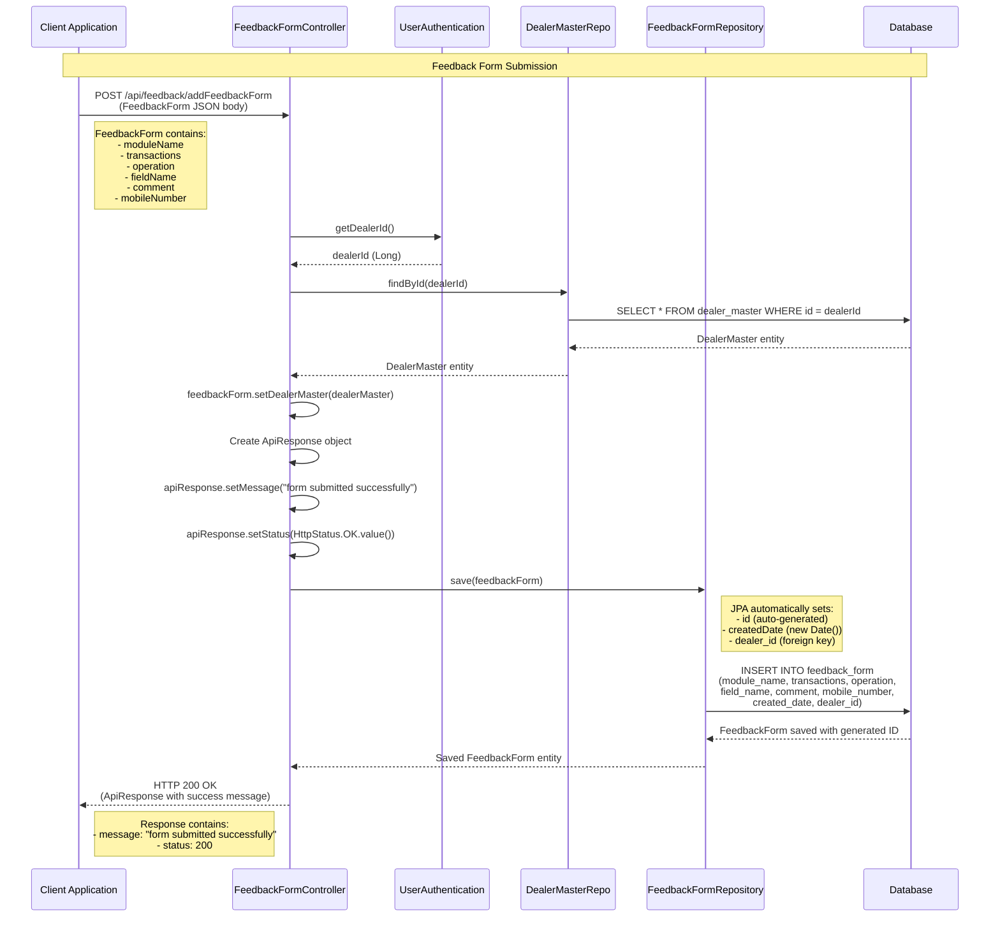
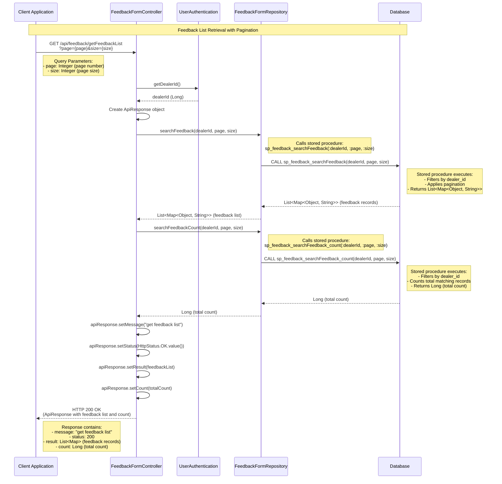

## Feedback Module - Detailed Sequence Diagrams

This document describes the **key technical flows** implemented in the `com.i4o.dms.kubota.feedback` module:

- **Feedback Form Submission** (Add feedback form with dealer association).
- **Feedback List Retrieval** (Search and retrieve feedback list with pagination).

All diagrams use Mermaid sequence diagrams and reflect the current implementation of the Feedback module.

---

## 1. Feedback Form Submission Flow

This flow shows how **feedback forms** are submitted by users. The system automatically associates the feedback with the dealer based on the authenticated user's dealer ID.

---

## 2. Feedback List Retrieval Flow

This flow shows how **feedback lists** are retrieved with pagination support. The system uses stored procedures to search and count feedback records filtered by dealer ID.

---

## Module Architecture Overview

### Components

1. **FeedbackFormController** (`/api/feedback`)
   - REST controller handling HTTP requests
   - Endpoints:
     - `POST /addFeedbackForm` - Submit feedback form
     - `GET /getFeedbackList` - Retrieve paginated feedback list

2. **FeedbackForm** (Domain Entity)
   - JPA entity representing feedback form
   - Fields:
     - `id` (Long, auto-generated)
     - `moduleName` (String)
     - `transactions` (String)
     - `operation` (String)
     - `fieldName` (String)
     - `comment` (String)
     - `mobileNumber` (String)
     - `createdDate` (Date, auto-set)
     - `dealerMaster` (DealerMaster, ManyToOne relationship)

3. **FeedbackFormRepository**
   - JPA repository extending `JpaRepository<FeedbackForm, Long>`
   - Custom queries using stored procedures:
     - `searchFeedback()` - Calls `sp_feedback_searchFeedback`
     - `searchFeedbackCount()` - Calls `sp_feedback_searchFeedback_count`

### Dependencies

- **UserAuthentication** - Provides authenticated user's dealer ID
- **DealerMasterRepo** - Repository for dealer master data
- **ApiResponse** - Standardized API response wrapper

### Database Operations

- **Direct JPA Operations**: Save feedback form using `save()` method
- **Stored Procedures**: 
  - `sp_feedback_searchFeedback` - Search feedback with pagination
  - `sp_feedback_searchFeedback_count` - Count total feedback records

### Security & Authorization

- All endpoints require authentication (via `UserAuthentication`)
- Feedback is automatically filtered by dealer ID
- Dealer association is enforced at the controller level

