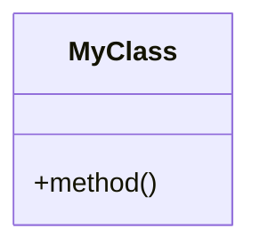

# How to Convert Markdown File (with Mermaid Diagram) to JPEG

## Overview

This guide explains how to convert a markdown file containing a Mermaid diagram into a high-resolution JPEG image.

## Prerequisites

1. **Python 3.x** installed
2. **Required Python packages**:
   ```bash
   pip install playwright pillow
   ```
3. **Playwright browsers** installed:
   ```bash
   playwright install chromium
   ```

## Step-by-Step Process

### Step 1: Extract Mermaid Diagram from Markdown

The markdown file should contain a Mermaid diagram in a code block:

```markdown
# My Diagram


```

### Step 2: Create Conversion Script

Create a Python script that:
1. Reads the markdown file
2. Extracts the Mermaid diagram code
3. Renders it using Playwright (headless browser)
4. Takes a screenshot
5. Converts to JPEG

### Step 3: Basic Conversion Script Template

```python
#!/usr/bin/env python3
import re
import os
from pathlib import Path
from playwright.sync_api import sync_playwright
from PIL import Image

def extract_mermaid_diagram(markdown_file):
    """Extract Mermaid diagram from markdown file"""
    with open(markdown_file, 'r', encoding='utf-8') as f:
        content = f.read()
    
    # Find mermaid code block
    pattern = r'```mermaid\n(.*?)\n```'
    match = re.search(pattern, content, re.DOTALL)
    
    if match:
        return match.group(1)
    else:
        raise Exception("No Mermaid diagram found in markdown file")

def mermaid_to_jpeg(mermaid_code, output_path):
    """Convert Mermaid diagram to JPEG"""
    
    # Create HTML with Mermaid
    html_content = f"""<!DOCTYPE html>
<html>
<head>
    <meta charset="UTF-8">
    <script src="https://cdn.jsdelivr.net/npm/mermaid@10/dist/mermaid.min.js"></script>
    <style>
        body {{
            margin: 0;
            padding: 100px;
            background: white;
        }}
        .mermaid {{
            display: block;
        }}
    </style>
</head>
<body>
    <div class="mermaid">
{mermaid_code}
    </div>
    <script>
        mermaid.initialize({{
            startOnLoad: true,
            theme: 'default'
        }});
    </script>
</body>
</html>"""
    
    # Use Playwright to render and screenshot
    with sync_playwright() as p:
        browser = p.chromium.launch(headless=True)
        context = browser.new_context(
            viewport={'width': 16000, 'height': 12000},
            device_scale_factor=2.0
        )
        page = context.new_page()
        page.set_content(html_content, wait_until='domcontentloaded', timeout=120000)
        
        # Wait for SVG to render
        page.wait_for_selector('svg', timeout=90000)
        page.wait_for_timeout(5000)
        
        # Take screenshot
        screenshot_bytes = page.screenshot(
            full_page=True,
            type='png',
            timeout=120000
        )
        
        browser.close()
    
    # Save as PNG first
    png_path = str(output_path).replace('.jpg', '.png').replace('.jpeg', '.png')
    with open(png_path, 'wb') as f:
        f.write(screenshot_bytes)
    
    # Convert PNG to JPEG
    Image.MAX_IMAGE_PIXELS = None
    png = Image.open(png_path)
    jpg = png.convert('RGB')
    jpg.save(output_path, 'JPEG', quality=95, optimize=True)
    
    print(f"Created: {output_path}")

# Main function
if __name__ == "__main__":
    markdown_file = "your-diagram.md"
    output_file = "your-diagram.jpg"
    
    diagram = extract_mermaid_diagram(markdown_file)
    mermaid_to_jpeg(diagram, output_file)
```

## Complete Example Script

See `convert_accpac_module_uml_to_jpeg.py` for a complete, production-ready example that includes:
- Error handling
- High-resolution rendering
- Full diagram capture
- Proper viewport management

## Usage

1. **Prepare your markdown file** with Mermaid diagram
2. **Run the conversion script**:
   ```bash
   python convert_accpac_module_uml_to_jpeg.py
   ```
3. **Output**: JPEG file will be created in the same directory

## Key Points

### 1. Mermaid Diagram Format
- Must be in a code block: ` ```mermaid ... ``` `
- Supports class diagrams, sequence diagrams, flowcharts, etc.

### 2. Rendering Process
- Uses Playwright (headless Chromium) to render the diagram
- Mermaid.js library converts diagram code to SVG
- Screenshot captures the rendered SVG

### 3. Image Quality
- High viewport size (16000x12000) for detail
- Device scale factor (2.0) for sharp rendering
- Large font sizes (28px) for readability
- JPEG quality 95% for good compression

### 4. Conversion Steps
1. Extract Mermaid code from markdown
2. Create HTML page with Mermaid.js
3. Render in headless browser
4. Capture screenshot as PNG
5. Convert PNG to JPEG using Pillow

## Troubleshooting

### Issue: Timeout errors
- Increase timeout values (120000ms)
- Ensure stable internet connection (Mermaid CDN)

### Issue: Partial images
- Use `full_page=True` for screenshots
- Increase viewport size
- Use SVG element screenshot method

### Issue: Low quality
- Increase device_scale_factor
- Use larger viewport
- Increase font sizes in CSS

### Issue: Large file sizes
- Adjust JPEG quality (95% recommended)
- Use PNG for lossless quality
- Optimize with `optimize=True`

## Example: Converting ACCPAC Module Diagram

```bash
cd C:\MyProjectITLDIS\KUBOTA\KUBOTA-BACKENED
python convert_accpac_module_uml_to_jpeg.py
```

This creates:
- `ACCPAC-Module-UML-Class-Diagram.png` (lossless)
- `ACCPAC-Module-UML-Class-Diagram.jpg` (compressed)

## Advanced Features

The production script includes:
- Dynamic viewport sizing based on SVG dimensions
- Multiple fallback screenshot methods
- Error handling and retries
- Progress logging
- File size verification

## References

- **Mermaid Documentation**: https://mermaid.js.org/
- **Playwright Documentation**: https://playwright.dev/python/
- **Pillow Documentation**: https://pillow.readthedocs.io/

