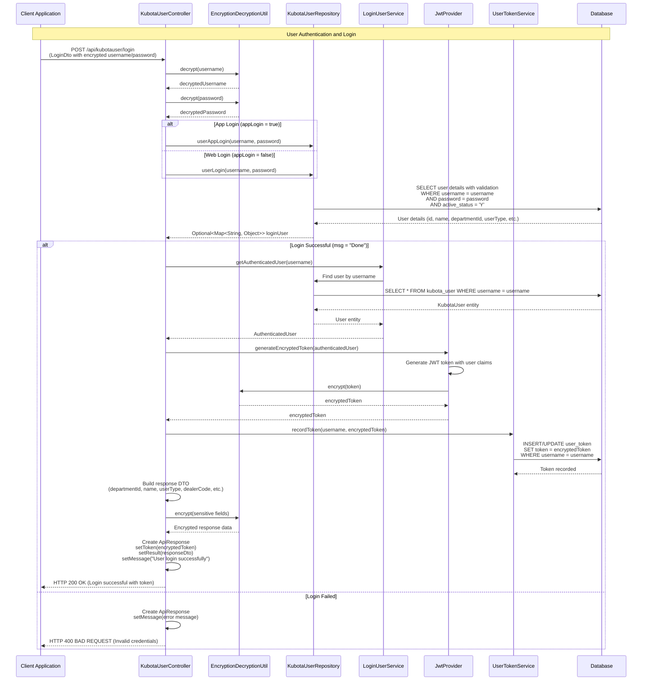
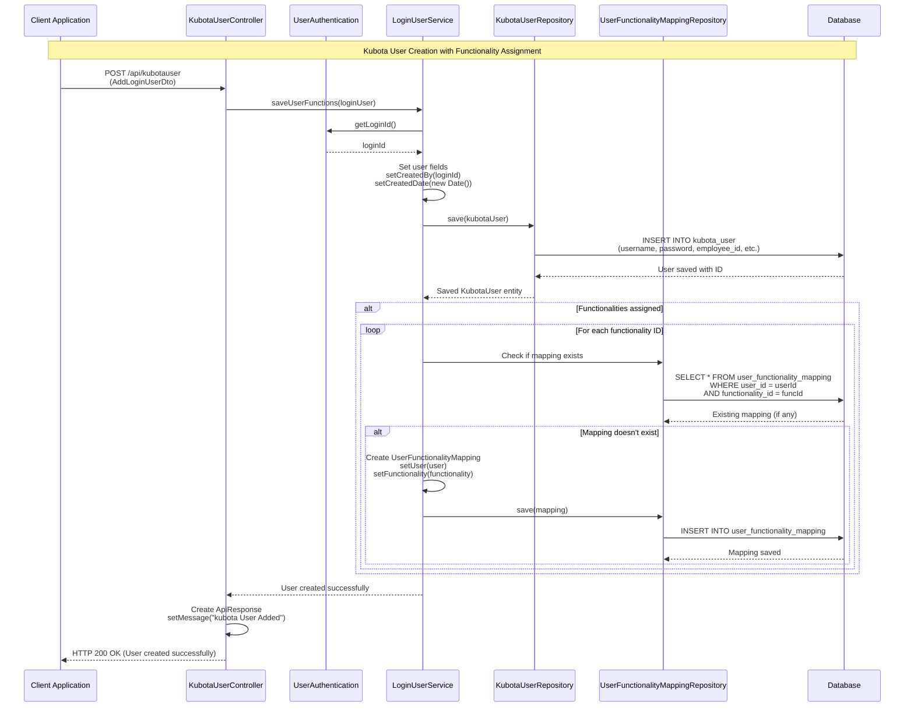
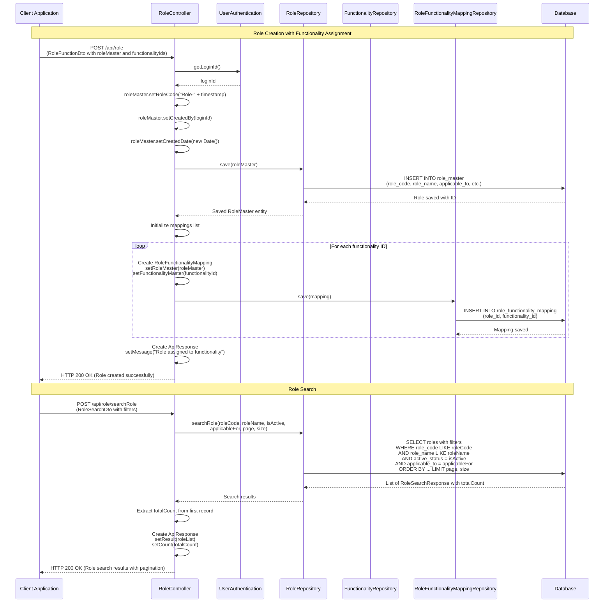
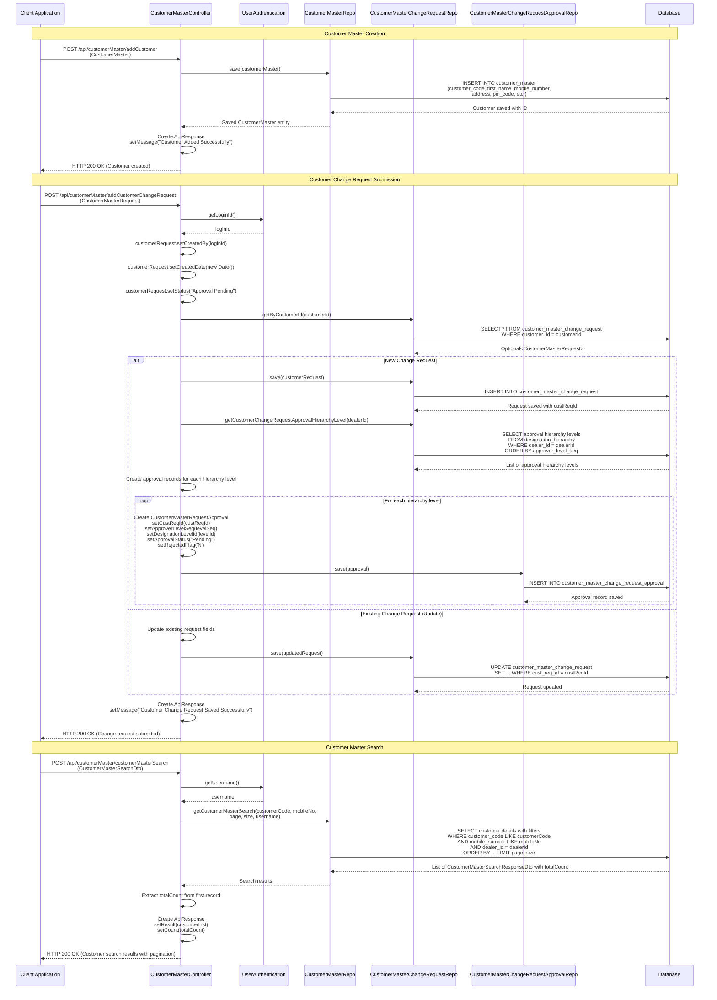
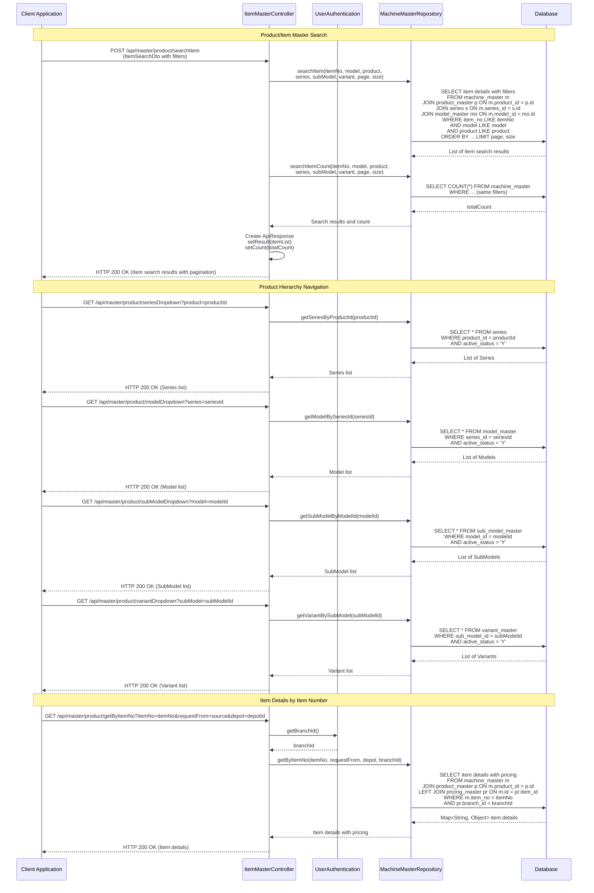
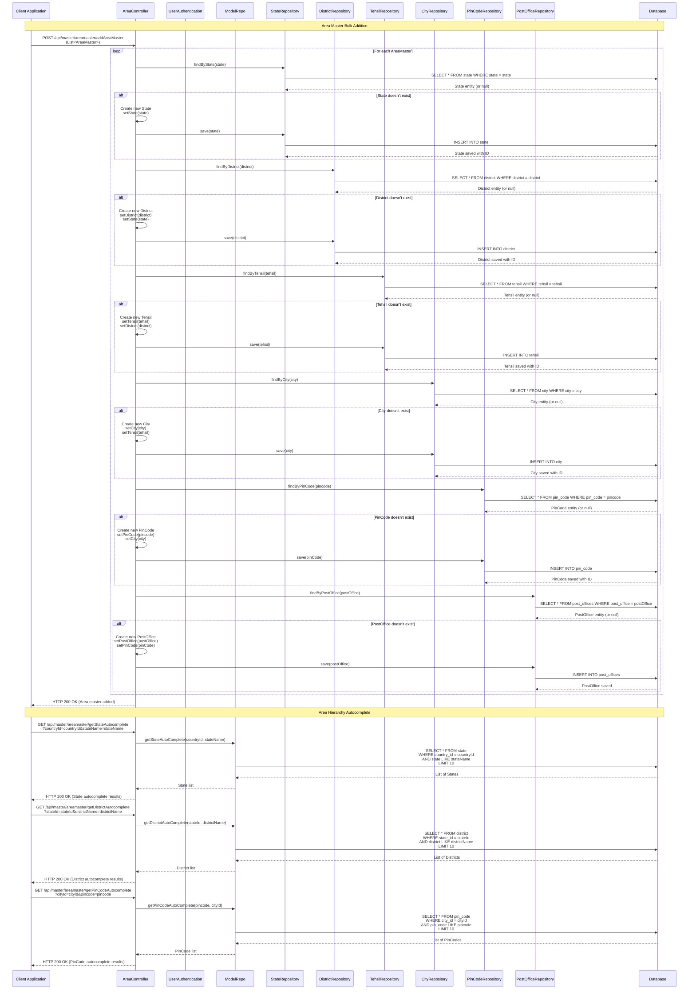
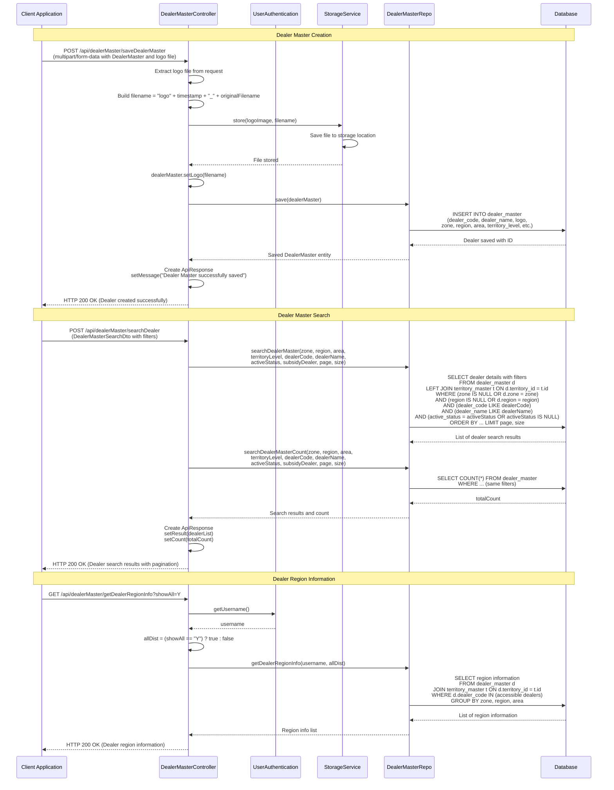
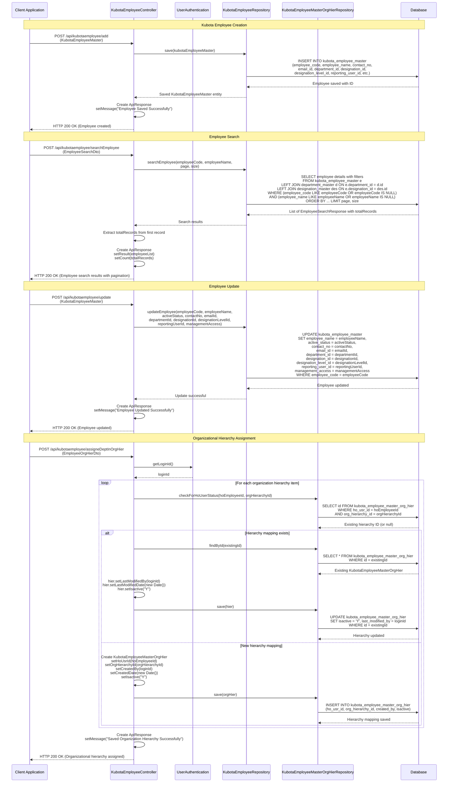
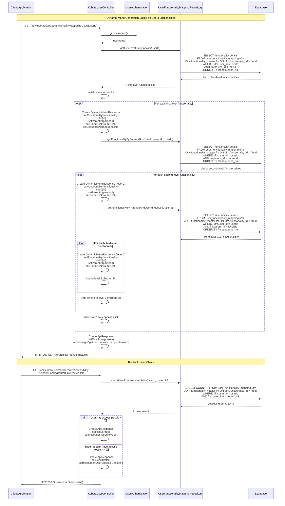

## Masters Module - Detailed Sequence Diagrams

This document describes the **key technical flows** implemented in the `com.i4o.dms.kubota.masters` module:

- **User Authentication and Login** (Kubota user login with JWT token generation).
- **User Management** (Kubota user creation, role assignment, functionality mapping).
- **Customer Master Management** (Customer creation, search, change request with approval workflow).
- **Product Master Management** (Item/Machine master search, product hierarchy navigation).
- **Area Master Management** (Geographic hierarchy management: State, District, Tehsil, City, PinCode).
- **Dealer Master Management** (Dealer creation, search, territory management).
- **Employee Management** (Kubota employee and dealer employee management with organizational hierarchy).

All diagrams use Mermaid sequence diagrams and reflect the current implementation of the Masters module.

---

## 1. User Authentication and Login Flow

This flow shows how **Kubota users** authenticate and receive JWT tokens for accessing the system.

---

## 2. User Creation and Functionality Assignment Flow

This flow shows how **new Kubota users** are created and assigned roles and functionalities.

---

## 3. Role Creation and Functionality Assignment Flow

This flow shows how **roles** are created and assigned functionalities in a hierarchical structure.

---

## 4. Customer Master Creation and Search Flow

This flow shows how **customers** are created, searched, and change requests are submitted with approval workflow.

---

## 5. Product Master Search and Hierarchy Navigation Flow

This flow shows how **product/item masters** are searched and product hierarchies (Series, Model, SubModel, Variant) are navigated.

---

## 6. Area Master Management Flow

This flow shows how **geographic hierarchies** (State, District, Tehsil, City, PinCode, PostOffice) are managed and queried.

---

## 7. Dealer Master Management Flow

This flow shows how **dealers** are created, searched, and managed with territory and region information.

---

## 8. Employee Management Flow

This flow shows how **Kubota employees** are created, updated, searched, and organizational hierarchy is managed.

---

## 9. Dynamic Menu Generation Flow

This flow shows how **dynamic menus** are generated based on user functionality mappings and role assignments.

---

## Summary

The **Masters module** provides comprehensive **master data management** functionality for the KUBOTA DMS:

- **User Management**:
  - User authentication with JWT token generation and encryption
  - User creation with role and functionality assignment
  - Dynamic menu generation based on user permissions
  - Router access control and validation
  - Password reset and forgot password functionality

- **Role and Functionality Management**:
  - Role creation with hierarchical functionality assignment
  - Role search with filters (role code, name, active status, applicable to)
  - Functionality tree generation for role assignment
  - Role update with functionality remapping

- **Customer Master**:
  - Customer creation and search with multiple filters
  - Customer change request workflow with multi-level approval hierarchy
  - Customer validation (mobile number, customer code)
  - Vehicle details and chassis number tracking
  - Customer autocomplete functionality

- **Product Master**:
  - Product/item search with filters (item number, model, product, series, submodel, variant)
  - Product hierarchy navigation (Product → Series → Model → SubModel → Variant)
  - Item details retrieval with pricing information
  - Product autocomplete and dropdown population

- **Area Master**:
  - Geographic hierarchy management (Country → State → District → Tehsil → City → PinCode → PostOffice)
  - Bulk area master addition with automatic parent entity creation
  - Area hierarchy autocomplete for all levels
  - PinCode and locality lookup

- **Dealer Master**:
  - Dealer creation with logo upload
  - Dealer search with multiple filters (zone, region, area, territory, dealer code/name, status)
  - Dealer region information retrieval
  - Territory and area level management

- **Employee Management**:
  - Kubota employee creation, update, and search
  - Organizational hierarchy assignment
  - Employee status management (active/inactive)
  - Reporting hierarchy management
  - Department and designation management

- **Spares Master**:
  - Spare part master search and autocomplete
  - Spare part details retrieval for MRC and quotation
  - Item number validation and lookup

The Masters module serves as the foundation for all other modules in the KUBOTA DMS, providing essential master data that is referenced throughout the system for sales, service, warranty, CRM, and other business processes. All master data operations include proper authentication, authorization checks, and audit trail maintenance (created by, created date, last modified by, last modified date).

