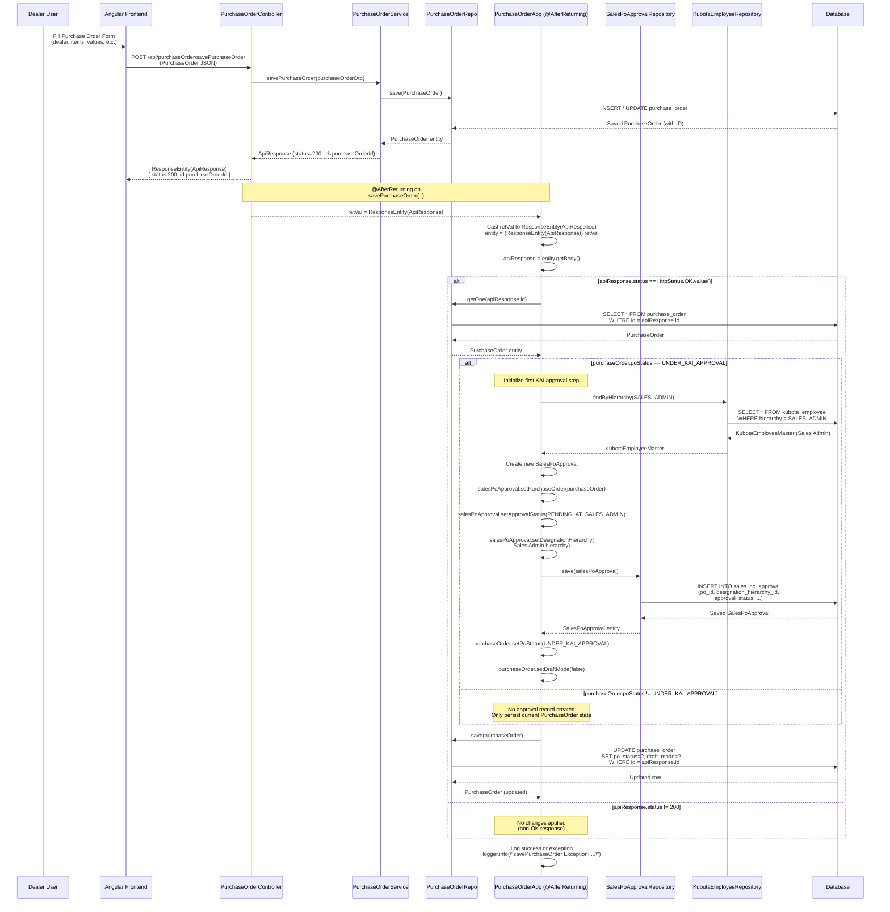
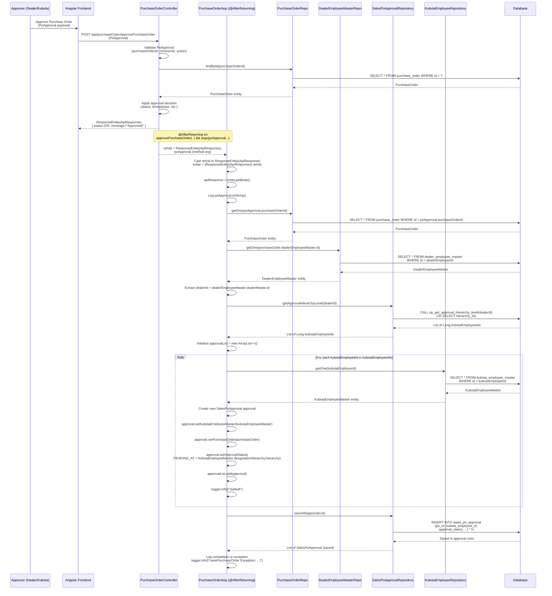

## Purchase Order AOP - Detailed Sequence Diagrams

This document describes the **AOP-based post-processing flows** around Purchase Orders in the KUBOTA DMS.  
The `PurchaseOrderAop` aspect hooks into controller methods to:

- Initialize KAI approval workflow when a purchase order is saved.
- Generate multi-level approval chains when a purchase order is approved.

Although the methods are currently commented in the source, these diagrams capture the intended behavior.

---

## 1. Save Purchase Order – Initialize KAI Approval Flow

This flow is triggered **after** `PurchaseOrderController.savePurchaseOrder(..)` successfully returns an HTTP 200 response.  
The aspect inspects the `ApiResponse`, loads the `PurchaseOrder`, and sets up the initial KAI approval state.

---

## 2. Approve Purchase Order – Build Multi-level Approval Chain

This flow is triggered **after** `PurchaseOrderController.approvePurchaseOrder(..)` completes successfully.  
The aspect reads the `PoApproval` argument, loads the `PurchaseOrder` and its dealer, then builds a **multi-level KAI approval hierarchy**.

> Note: In the current source, this block is commented and the `dealerEmployeeMasterRepo` field would need to be autowired for a working implementation. The diagram reflects the intended design.

---

## Summary

- The **Save Purchase Order** advice initializes the **first KAI approval step** when a PO enters `UNDER_KAI_APPROVAL`, ensuring:
  - A `SalesPoApproval` is created for **Sales Admin**.
  - The `PurchaseOrder`’s status and `draftMode` flags are updated.

- The **Approve Purchase Order** advice (conceptual design) builds a **multi-level KAI approval chain** based on:
  - Dealer-specific approval hierarchy from `SalesPoApprovalRepository`.
  - Corresponding `KubotaEmployeeMaster` records for each hierarchy level.
  - A batch `saveAll` of `SalesPoApproval` entities representing each approval step.

These AOP flows decouple approval initialization logic from the controllers/services and ensure that **approval metadata is consistently created and maintained** whenever purchase orders are saved or approved.

