# Sales and Presales Module - Detailed Sequence Diagrams

This document contains comprehensive sequence diagrams for all major flows in the Sales and Presales module of the KUBOTA DMS system.

## Table of Contents

1. [Enquiry Management Flow](#1-enquiry-management-flow)
2. [Purchase Order Flow](#2-purchase-order-flow)
3. [GRN (Goods Receipt Note) Flow](#3-grn-goods-receipt-note-flow)
4. [Delivery Challan Flow](#4-delivery-challan-flow)
5. [Sales Invoice Flow](#5-sales-invoice-flow)
6. [Marketing Activity Proposal Flow](#6-marketing-activity-proposal-flow)
7. [Market Intelligence Flow](#7-market-intelligence-flow)
8. [Branch Transfer Flow](#8-branch-transfer-flow)

---

## 1. Enquiry Management Flow

### 1.1 Create Enquiry Flow

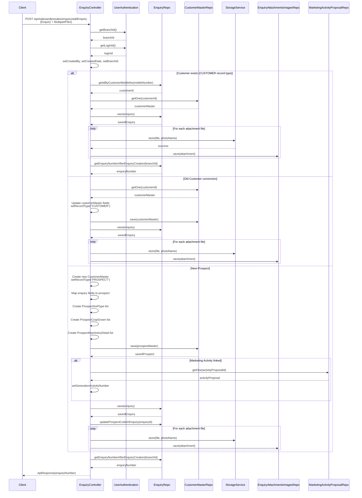
```mermaid
sequenceDiagram
    participant Client
    participant EnquiryController
    participant UserAuthentication
    participant EnquiryRepo
    participant CustomerMasterRepo
    participant StorageService
    participant EnquiryAttachmentsImagesRepo
    participant MarketingActivityProposalRepo

    Client->>EnquiryController: POST /api/salesandpresales/enquiry/addEnquiry<br/>(Enquiry + MultipartFiles)
    EnquiryController->>UserAuthentication: getBranchId()
    UserAuthentication-->>EnquiryController: branchId
    EnquiryController->>UserAuthentication: getLoginId()
    UserAuthentication-->>EnquiryController: loginId
    EnquiryController->>EnquiryController: setCreatedBy, setCreatedDate, setBranchId
    
    alt Customer exists (CUSTOMER record type)
        EnquiryController->>EnquiryRepo: getIdByCustomerMobileNo(mobileNumber)
        EnquiryRepo-->>EnquiryController: customerId
        EnquiryController->>CustomerMasterRepo: getOne(customerId)
        CustomerMasterRepo-->>EnquiryController: customerMaster
        EnquiryController->>EnquiryRepo: save(enquiry)
        EnquiryRepo-->>EnquiryController: savedEnquiry
        
        loop For each attachment file
            EnquiryController->>StorageService: store(file, photoName)
            StorageService-->>EnquiryController: success
            EnquiryController->>EnquiryAttachmentsImagesRepo: save(attachment)
        end
        
        EnquiryController->>EnquiryRepo: getEnquiryNumberAfterEnquiryCreation(branchId)
        EnquiryRepo-->>EnquiryController: enquiryNumber
        
    else Old Customer conversion
        EnquiryController->>CustomerMasterRepo: getOne(customerId)
        CustomerMasterRepo-->>EnquiryController: customerMaster
        EnquiryController->>EnquiryController: Update customerMaster fields<br/>setRecordType("CUSTOMER")
        EnquiryController->>CustomerMasterRepo: save(customerMaster)
        EnquiryController->>EnquiryRepo: save(enquiry)
        EnquiryRepo-->>EnquiryController: savedEnquiry
        
        loop For each attachment file
            EnquiryController->>StorageService: store(file, photoName)
            EnquiryController->>EnquiryAttachmentsImagesRepo: save(attachment)
        end
        
    else New Prospect
        EnquiryController->>EnquiryController: Create new CustomerMaster<br/>setRecordType("PROSPECT")
        EnquiryController->>EnquiryController: Map enquiry fields to prospect
        EnquiryController->>EnquiryController: Create ProspectSoilType list
        EnquiryController->>EnquiryController: Create ProspectCropGrown list
        EnquiryController->>EnquiryController: Create ProspectMachineryDetail list
        EnquiryController->>CustomerMasterRepo: save(prospectMaster)
        CustomerMasterRepo-->>EnquiryController: savedProspect
        
        alt Marketing Activity linked
            EnquiryController->>MarketingActivityProposalRepo: getOne(activityProposalId)
            MarketingActivityProposalRepo-->>EnquiryController: activityProposal
            EnquiryController->>EnquiryController: setGenerationActivityNumber
        end
        
        EnquiryController->>EnquiryRepo: save(enquiry)
        EnquiryRepo-->>EnquiryController: savedEnquiry
        EnquiryController->>EnquiryRepo: updateProspectCodeInEnquiry(enquiryId)
        
        loop For each attachment file
            EnquiryController->>StorageService: store(file, photoName)
            EnquiryController->>EnquiryAttachmentsImagesRepo: save(attachment)
        end
    end
    
    EnquiryController->>EnquiryRepo: getEnquiryNumberAfterEnquiryCreation(branchId)
    EnquiryRepo-->>EnquiryController: enquiryNumber
    EnquiryController-->>Client: ApiResponse(enquiryNumber)
```

### 1.2 Search Enquiry Flow

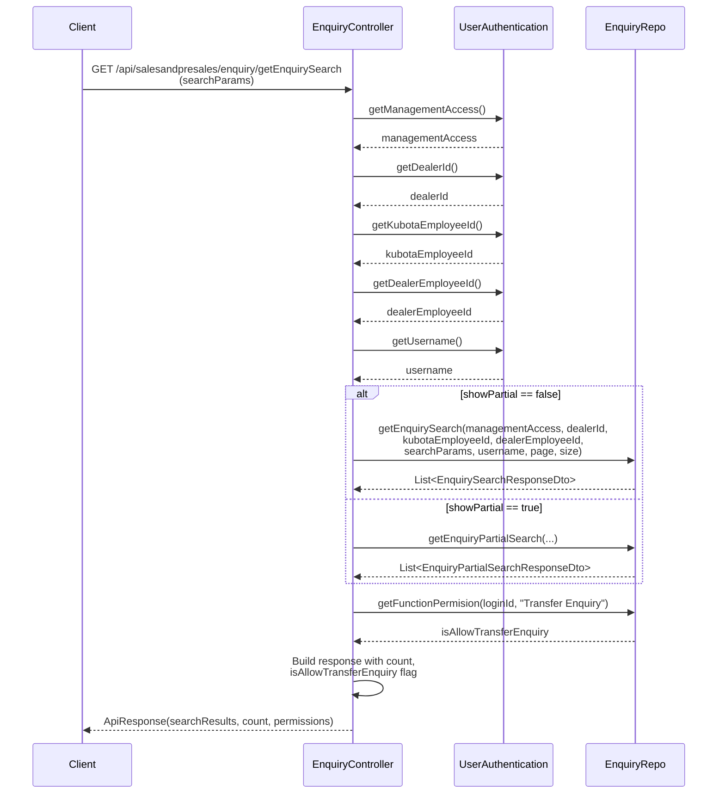
```mermaid
sequenceDiagram
    participant Client
    participant EnquiryController
    participant UserAuthentication
    participant EnquiryRepo

    Client->>EnquiryController: GET /api/salesandpresales/enquiry/getEnquirySearch<br/>(searchParams)
    EnquiryController->>UserAuthentication: getManagementAccess()
    UserAuthentication-->>EnquiryController: managementAccess
    EnquiryController->>UserAuthentication: getDealerId()
    UserAuthentication-->>EnquiryController: dealerId
    EnquiryController->>UserAuthentication: getKubotaEmployeeId()
    UserAuthentication-->>EnquiryController: kubotaEmployeeId
    EnquiryController->>UserAuthentication: getDealerEmployeeId()
    UserAuthentication-->>EnquiryController: dealerEmployeeId
    EnquiryController->>UserAuthentication: getUsername()
    UserAuthentication-->>EnquiryController: username
    
    alt showPartial == false
        EnquiryController->>EnquiryRepo: getEnquirySearch(managementAccess, dealerId,<br/>kubotaEmployeeId, dealerEmployeeId,<br/>searchParams, username, page, size)
        EnquiryRepo-->>EnquiryController: List<EnquirySearchResponseDto>
    else showPartial == true
        EnquiryController->>EnquiryRepo: getEnquiryPartialSearch(...)
        EnquiryRepo-->>EnquiryController: List<EnquiryPartialSearchResponseDto>
    end
    
    EnquiryController->>EnquiryRepo: getFunctionPermision(loginId, "Transfer Enquiry")
    EnquiryRepo-->>EnquiryController: isAllowTransferEnquiry
    
    EnquiryController->>EnquiryController: Build response with count,<br/>isAllowTransferEnquiry flag
    EnquiryController-->>Client: ApiResponse(searchResults, count, permissions)
```

### 1.3 Update Enquiry Flow

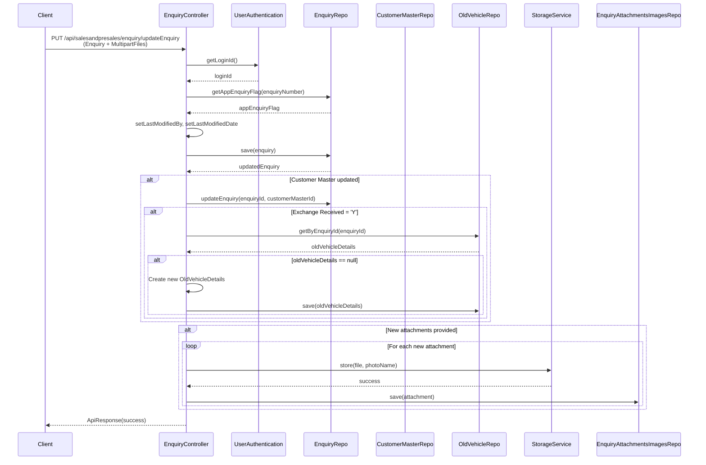
```mermaid
sequenceDiagram
    participant Client
    participant EnquiryController
    participant UserAuthentication
    participant EnquiryRepo
    participant CustomerMasterRepo
    participant OldVehicleRepo
    participant StorageService
    participant EnquiryAttachmentsImagesRepo

    Client->>EnquiryController: PUT /api/salesandpresales/enquiry/updateEnquiry<br/>(Enquiry + MultipartFiles)
    EnquiryController->>UserAuthentication: getLoginId()
    UserAuthentication-->>EnquiryController: loginId
    EnquiryController->>EnquiryRepo: getAppEnquiryFlag(enquiryNumber)
    EnquiryRepo-->>EnquiryController: appEnquiryFlag
    EnquiryController->>EnquiryController: setLastModifiedBy, setLastModifiedDate
    EnquiryController->>EnquiryRepo: save(enquiry)
    EnquiryRepo-->>EnquiryController: updatedEnquiry
    
    alt Customer Master updated
        EnquiryController->>EnquiryRepo: updateEnquiry(enquiryId, customerMasterId)
        
        alt Exchange Received = 'Y'
            EnquiryController->>OldVehicleRepo: getByEnquiryId(enquiryId)
            OldVehicleRepo-->>EnquiryController: oldVehicleDetails
            
            alt oldVehicleDetails == null
                EnquiryController->>EnquiryController: Create new OldVehicleDetails
                EnquiryController->>OldVehicleRepo: save(oldVehicleDetails)
            end
        end
    end
    
    alt New attachments provided
        loop For each new attachment
            EnquiryController->>StorageService: store(file, photoName)
            StorageService-->>EnquiryController: success
            EnquiryController->>EnquiryAttachmentsImagesRepo: save(attachment)
        end
    end
    
    EnquiryController-->>Client: ApiResponse(success)
```

---

## 2. Purchase Order Flow

### 2.1 Create Purchase Order Flow

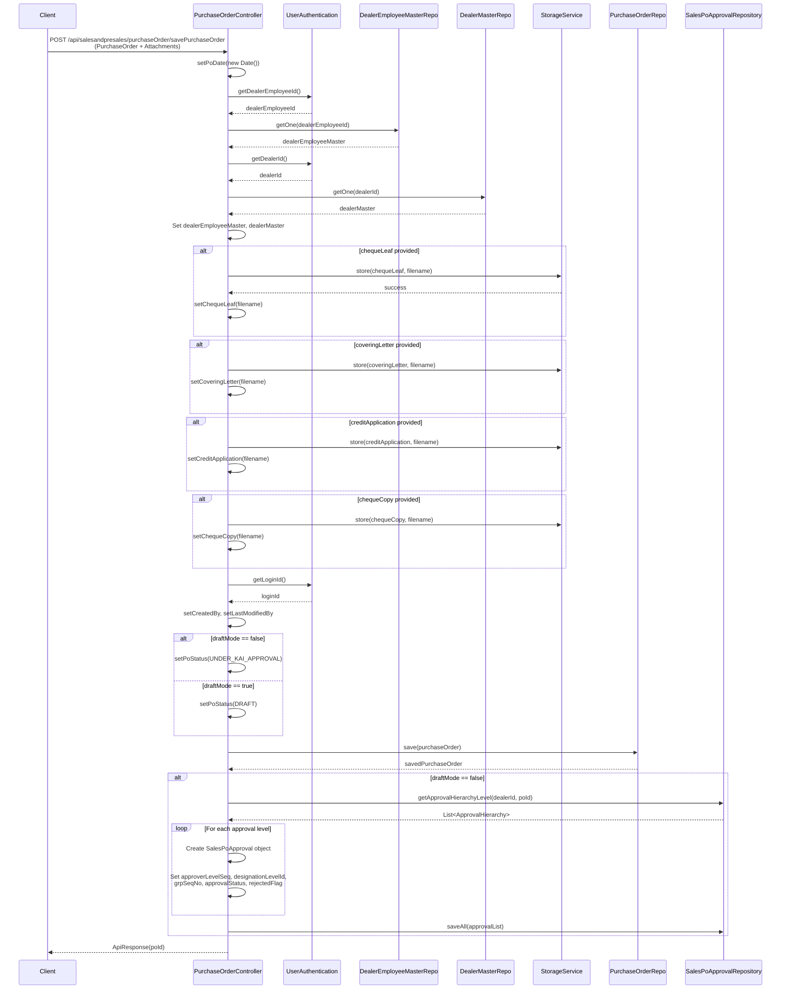
```mermaid
sequenceDiagram
    participant Client
    participant PurchaseOrderController
    participant UserAuthentication
    participant DealerEmployeeMasterRepo
    participant DealerMasterRepo
    participant StorageService
    participant PurchaseOrderRepo
    participant SalesPoApprovalRepository

    Client->>PurchaseOrderController: POST /api/salesandpresales/purchaseOrder/savePurchaseOrder<br/>(PurchaseOrder + Attachments)
    PurchaseOrderController->>PurchaseOrderController: setPoDate(new Date())
    PurchaseOrderController->>UserAuthentication: getDealerEmployeeId()
    UserAuthentication-->>PurchaseOrderController: dealerEmployeeId
    PurchaseOrderController->>DealerEmployeeMasterRepo: getOne(dealerEmployeeId)
    DealerEmployeeMasterRepo-->>PurchaseOrderController: dealerEmployeeMaster
    PurchaseOrderController->>UserAuthentication: getDealerId()
    UserAuthentication-->>PurchaseOrderController: dealerId
    PurchaseOrderController->>DealerMasterRepo: getOne(dealerId)
    DealerMasterRepo-->>PurchaseOrderController: dealerMaster
    
    PurchaseOrderController->>PurchaseOrderController: Set dealerEmployeeMaster, dealerMaster
    
    alt chequeLeaf provided
        PurchaseOrderController->>StorageService: store(chequeLeaf, filename)
        StorageService-->>PurchaseOrderController: success
        PurchaseOrderController->>PurchaseOrderController: setChequeLeaf(filename)
    end
    
    alt coveringLetter provided
        PurchaseOrderController->>StorageService: store(coveringLetter, filename)
        PurchaseOrderController->>PurchaseOrderController: setCoveringLetter(filename)
    end
    
    alt creditApplication provided
        PurchaseOrderController->>StorageService: store(creditApplication, filename)
        PurchaseOrderController->>PurchaseOrderController: setCreditApplication(filename)
    end
    
    alt chequeCopy provided
        PurchaseOrderController->>StorageService: store(chequeCopy, filename)
        PurchaseOrderController->>PurchaseOrderController: setChequeCopy(filename)
    end
    
    PurchaseOrderController->>UserAuthentication: getLoginId()
    UserAuthentication-->>PurchaseOrderController: loginId
    PurchaseOrderController->>PurchaseOrderController: setCreatedBy, setLastModifiedBy
    
    alt draftMode == false
        PurchaseOrderController->>PurchaseOrderController: setPoStatus(UNDER_KAI_APPROVAL)
    else draftMode == true
        PurchaseOrderController->>PurchaseOrderController: setPoStatus(DRAFT)
    end
    
    PurchaseOrderController->>PurchaseOrderRepo: save(purchaseOrder)
    PurchaseOrderRepo-->>PurchaseOrderController: savedPurchaseOrder
    
    alt draftMode == false
        PurchaseOrderController->>SalesPoApprovalRepository: getApprovalHierarchyLevel(dealerId, poId)
        SalesPoApprovalRepository-->>PurchaseOrderController: List<ApprovalHierarchy>
        
        loop For each approval level
            PurchaseOrderController->>PurchaseOrderController: Create SalesPoApproval object
            PurchaseOrderController->>PurchaseOrderController: Set approverLevelSeq, designationLevelId,<br/>grpSeqNo, approvalStatus, rejectedFlag
        end
        
        PurchaseOrderController->>SalesPoApprovalRepository: saveAll(approvalList)
    end
    
    PurchaseOrderController-->>Client: ApiResponse(poId)
```

### 2.2 Search Purchase Order Flow

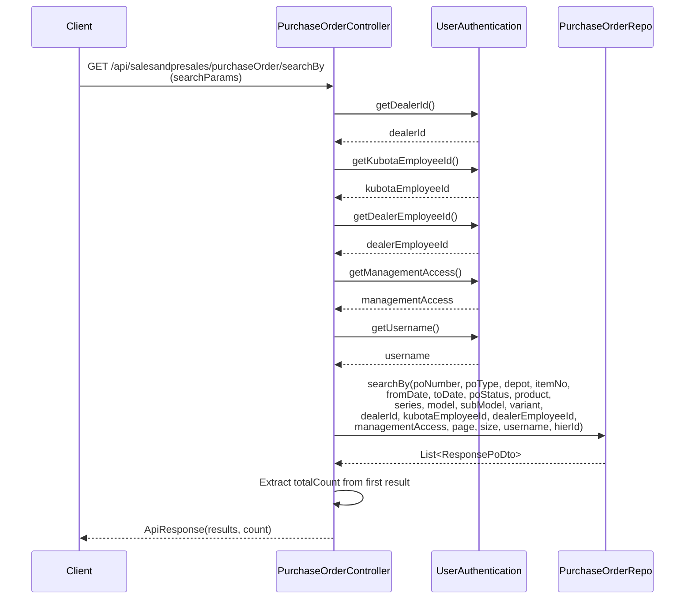
```mermaid
sequenceDiagram
    participant Client
    participant PurchaseOrderController
    participant UserAuthentication
    participant PurchaseOrderRepo

    Client->>PurchaseOrderController: GET /api/salesandpresales/purchaseOrder/searchBy<br/>(searchParams)
    PurchaseOrderController->>UserAuthentication: getDealerId()
    UserAuthentication-->>PurchaseOrderController: dealerId
    PurchaseOrderController->>UserAuthentication: getKubotaEmployeeId()
    UserAuthentication-->>PurchaseOrderController: kubotaEmployeeId
    PurchaseOrderController->>UserAuthentication: getDealerEmployeeId()
    UserAuthentication-->>PurchaseOrderController: dealerEmployeeId
    PurchaseOrderController->>UserAuthentication: getManagementAccess()
    UserAuthentication-->>PurchaseOrderController: managementAccess
    PurchaseOrderController->>UserAuthentication: getUsername()
    UserAuthentication-->>PurchaseOrderController: username
    
    PurchaseOrderController->>PurchaseOrderRepo: searchBy(poNumber, poType, depot, itemNo,<br/>fromDate, toDate, poStatus, product,<br/>series, model, subModel, variant,<br/>dealerId, kubotaEmployeeId, dealerEmployeeId,<br/>managementAccess, page, size, username, hierId)
    PurchaseOrderRepo-->>PurchaseOrderController: List<ResponsePoDto>
    
    PurchaseOrderController->>PurchaseOrderController: Extract totalCount from first result
    PurchaseOrderController-->>Client: ApiResponse(results, count)
```

### 2.3 Approve Purchase Order Flow

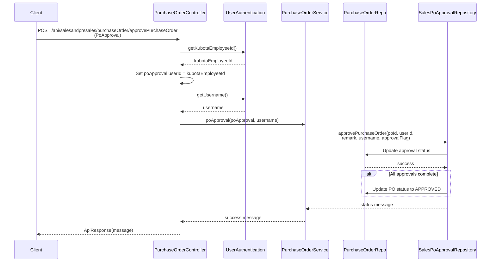
```mermaid
sequenceDiagram
    participant Client
    participant PurchaseOrderController
    participant UserAuthentication
    participant PurchaseOrderService
    participant PurchaseOrderRepo
    participant SalesPoApprovalRepository

    Client->>PurchaseOrderController: POST /api/salesandpresales/purchaseOrder/approvePurchaseOrder<br/>(PoApproval)
    PurchaseOrderController->>UserAuthentication: getKubotaEmployeeId()
    UserAuthentication-->>PurchaseOrderController: kubotaEmployeeId
    PurchaseOrderController->>PurchaseOrderController: Set poApproval.userId = kubotaEmployeeId
    PurchaseOrderController->>UserAuthentication: getUsername()
    UserAuthentication-->>PurchaseOrderController: username
    PurchaseOrderController->>PurchaseOrderService: poApproval(poApproval, username)
    
    PurchaseOrderService->>SalesPoApprovalRepository: approvePurchaseOrder(poId, userId,<br/>remark, username, approvalFlag)
    SalesPoApprovalRepository->>PurchaseOrderRepo: Update approval status
    PurchaseOrderRepo-->>SalesPoApprovalRepository: success
    
    alt All approvals complete
        SalesPoApprovalRepository->>PurchaseOrderRepo: Update PO status to APPROVED
    end
    
    SalesPoApprovalRepository-->>PurchaseOrderService: status message
    PurchaseOrderService-->>PurchaseOrderController: success message
    
    PurchaseOrderController-->>Client: ApiResponse(message)
```

---

## 3. GRN (Goods Receipt Note) Flow

### 3.1 Create GRN Flow

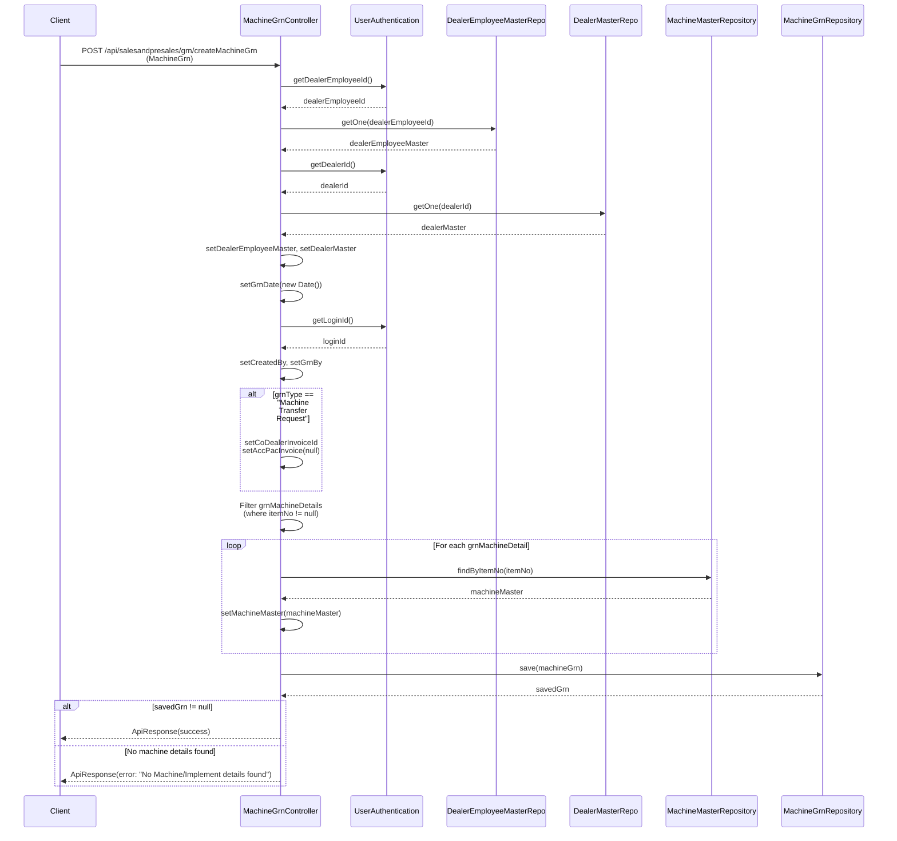
```mermaid
sequenceDiagram
    participant Client
    participant MachineGrnController
    participant UserAuthentication
    participant DealerEmployeeMasterRepo
    participant DealerMasterRepo
    participant MachineMasterRepository
    participant MachineGrnRepository

    Client->>MachineGrnController: POST /api/salesandpresales/grn/createMachineGrn<br/>(MachineGrn)
    MachineGrnController->>UserAuthentication: getDealerEmployeeId()
    UserAuthentication-->>MachineGrnController: dealerEmployeeId
    MachineGrnController->>DealerEmployeeMasterRepo: getOne(dealerEmployeeId)
    DealerEmployeeMasterRepo-->>MachineGrnController: dealerEmployeeMaster
    MachineGrnController->>UserAuthentication: getDealerId()
    UserAuthentication-->>MachineGrnController: dealerId
    MachineGrnController->>DealerMasterRepo: getOne(dealerId)
    DealerMasterRepo-->>MachineGrnController: dealerMaster
    
    MachineGrnController->>MachineGrnController: setDealerEmployeeMaster, setDealerMaster
    MachineGrnController->>MachineGrnController: setGrnDate(new Date())
    MachineGrnController->>UserAuthentication: getLoginId()
    UserAuthentication-->>MachineGrnController: loginId
    MachineGrnController->>MachineGrnController: setCreatedBy, setGrnBy
    
    alt grnType == "Machine Transfer Request"
        MachineGrnController->>MachineGrnController: setCoDealerInvoiceId<br/>setAccPacInvoice(null)
    end
    
    MachineGrnController->>MachineGrnController: Filter grnMachineDetails<br/>(where itemNo != null)
    
    loop For each grnMachineDetail
        MachineGrnController->>MachineMasterRepository: findByItemNo(itemNo)
        MachineMasterRepository-->>MachineGrnController: machineMaster
        MachineGrnController->>MachineGrnController: setMachineMaster(machineMaster)
    end
    
    MachineGrnController->>MachineGrnRepository: save(machineGrn)
    MachineGrnRepository-->>MachineGrnController: savedGrn
    
    alt savedGrn != null
        MachineGrnController-->>Client: ApiResponse(success)
    else No machine details found
        MachineGrnController-->>Client: ApiResponse(error: "No Machine/Implement details found")
    end
```

### 3.2 Search GRN Flow

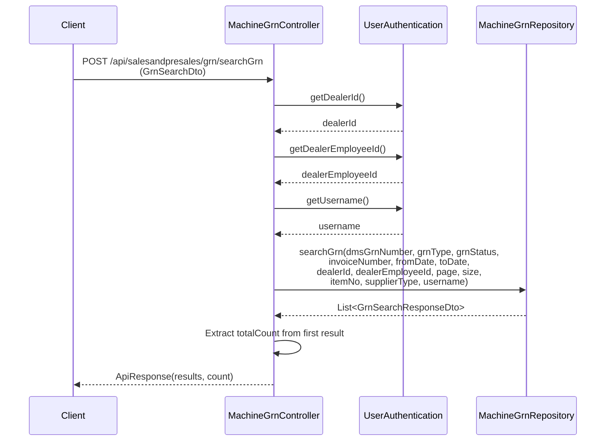
```mermaid
sequenceDiagram
    participant Client
    participant MachineGrnController
    participant UserAuthentication
    participant MachineGrnRepository

    Client->>MachineGrnController: POST /api/salesandpresales/grn/searchGrn<br/>(GrnSearchDto)
    MachineGrnController->>UserAuthentication: getDealerId()
    UserAuthentication-->>MachineGrnController: dealerId
    MachineGrnController->>UserAuthentication: getDealerEmployeeId()
    UserAuthentication-->>MachineGrnController: dealerEmployeeId
    MachineGrnController->>UserAuthentication: getUsername()
    UserAuthentication-->>MachineGrnController: username
    
    MachineGrnController->>MachineGrnRepository: searchGrn(dmsGrnNumber, grnType, grnStatus,<br/>invoiceNumber, fromDate, toDate,<br/>dealerId, dealerEmployeeId, page, size,<br/>itemNo, supplierType, username)
    MachineGrnRepository-->>MachineGrnController: List<GrnSearchResponseDto>
    
    MachineGrnController->>MachineGrnController: Extract totalCount from first result
    MachineGrnController-->>Client: ApiResponse(results, count)
```

### 3.3 Get GRN Details Flow

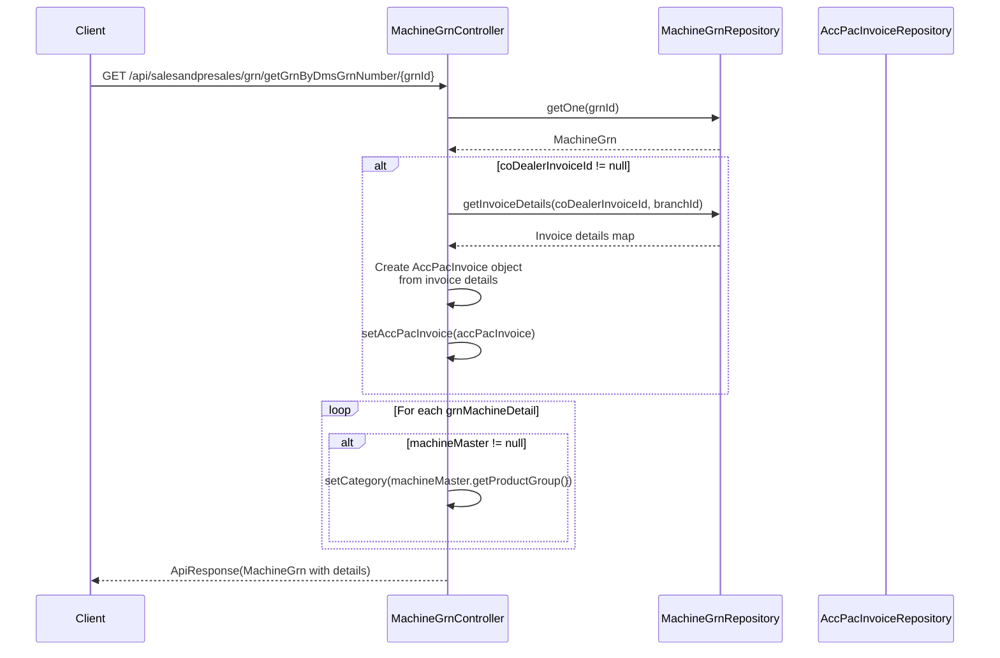
```mermaid
sequenceDiagram
    participant Client
    participant MachineGrnController
    participant MachineGrnRepository
    participant AccPacInvoiceRepository

    Client->>MachineGrnController: GET /api/salesandpresales/grn/getGrnByDmsGrnNumber/{grnId}
    MachineGrnController->>MachineGrnRepository: getOne(grnId)
    MachineGrnRepository-->>MachineGrnController: MachineGrn
    
    alt coDealerInvoiceId != null
        MachineGrnController->>MachineGrnRepository: getInvoiceDetails(coDealerInvoiceId, branchId)
        MachineGrnRepository-->>MachineGrnController: Invoice details map
        MachineGrnController->>MachineGrnController: Create AccPacInvoice object<br/>from invoice details
        MachineGrnController->>MachineGrnController: setAccPacInvoice(accPacInvoice)
    end
    
    loop For each grnMachineDetail
        alt machineMaster != null
            MachineGrnController->>MachineGrnController: setCategory(machineMaster.getProductGroup())
        end
    end
    
    MachineGrnController-->>Client: ApiResponse(MachineGrn with details)
```

---

## 4. Delivery Challan Flow

### 4.1 Create Delivery Challan Flow

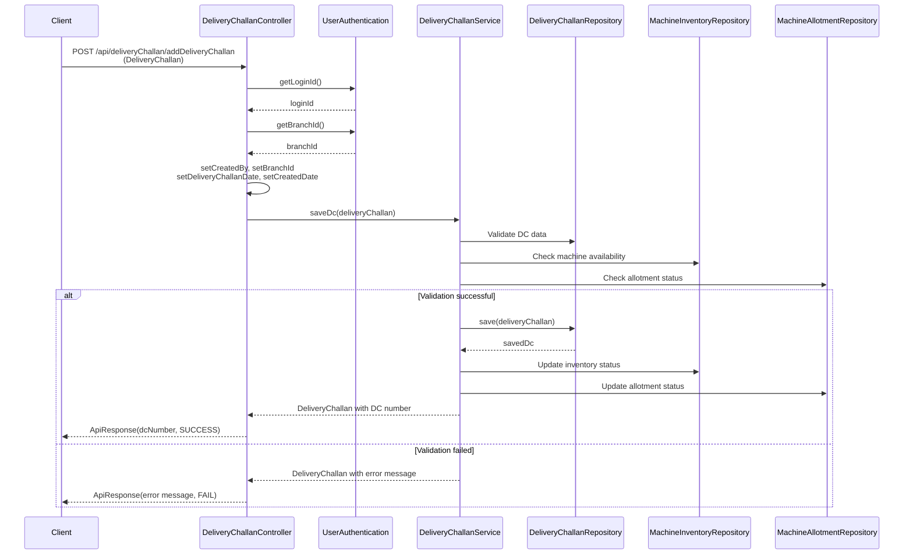
```mermaid
sequenceDiagram
    participant Client
    participant DeliveryChallanController
    participant UserAuthentication
    participant DeliveryChallanService
    participant DeliveryChallanRepository
    participant MachineInventoryRepository
    participant MachineAllotmentRepository

    Client->>DeliveryChallanController: POST /api/deliveryChallan/addDeliveryChallan<br/>(DeliveryChallan)
    DeliveryChallanController->>UserAuthentication: getLoginId()
    UserAuthentication-->>DeliveryChallanController: loginId
    DeliveryChallanController->>UserAuthentication: getBranchId()
    UserAuthentication-->>DeliveryChallanController: branchId
    
    DeliveryChallanController->>DeliveryChallanController: setCreatedBy, setBranchId<br/>setDeliveryChallanDate, setCreatedDate
    
    DeliveryChallanController->>DeliveryChallanService: saveDc(deliveryChallan)
    
    DeliveryChallanService->>DeliveryChallanRepository: Validate DC data
    DeliveryChallanService->>MachineInventoryRepository: Check machine availability
    DeliveryChallanService->>MachineAllotmentRepository: Check allotment status
    
    alt Validation successful
        DeliveryChallanService->>DeliveryChallanRepository: save(deliveryChallan)
        DeliveryChallanRepository-->>DeliveryChallanService: savedDc
        
        DeliveryChallanService->>MachineInventoryRepository: Update inventory status
        DeliveryChallanService->>MachineAllotmentRepository: Update allotment status
        
        DeliveryChallanService-->>DeliveryChallanController: DeliveryChallan with DC number
        DeliveryChallanController-->>Client: ApiResponse(dcNumber, SUCCESS)
    else Validation failed
        DeliveryChallanService-->>DeliveryChallanController: DeliveryChallan with error message
        DeliveryChallanController-->>Client: ApiResponse(error message, FAIL)
    end
```

### 4.2 Search Delivery Challan Flow

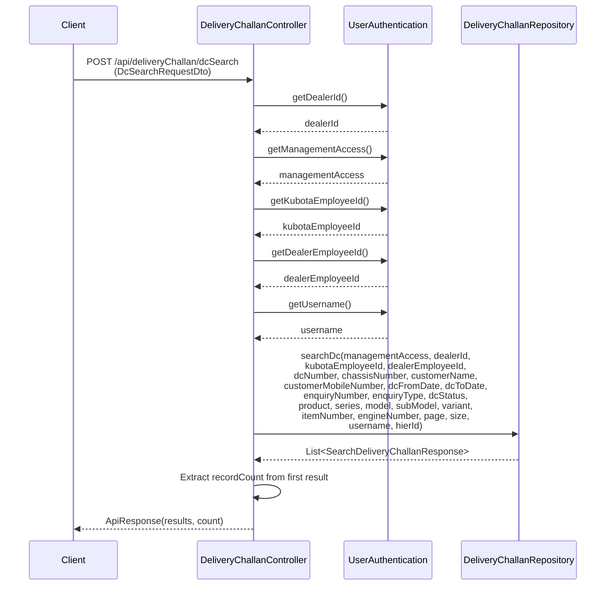
```mermaid
sequenceDiagram
    participant Client
    participant DeliveryChallanController
    participant UserAuthentication
    participant DeliveryChallanRepository

    Client->>DeliveryChallanController: POST /api/deliveryChallan/dcSearch<br/>(DcSearchRequestDto)
    DeliveryChallanController->>UserAuthentication: getDealerId()
    UserAuthentication-->>DeliveryChallanController: dealerId
    DeliveryChallanController->>UserAuthentication: getManagementAccess()
    UserAuthentication-->>DeliveryChallanController: managementAccess
    DeliveryChallanController->>UserAuthentication: getKubotaEmployeeId()
    UserAuthentication-->>DeliveryChallanController: kubotaEmployeeId
    DeliveryChallanController->>UserAuthentication: getDealerEmployeeId()
    UserAuthentication-->>DeliveryChallanController: dealerEmployeeId
    DeliveryChallanController->>UserAuthentication: getUsername()
    UserAuthentication-->>DeliveryChallanController: username
    
    DeliveryChallanController->>DeliveryChallanRepository: searchDc(managementAccess, dealerId,<br/>kubotaEmployeeId, dealerEmployeeId,<br/>dcNumber, chassisNumber, customerName,<br/>customerMobileNumber, dcFromDate, dcToDate,<br/>enquiryNumber, enquiryType, dcStatus,<br/>product, series, model, subModel, variant,<br/>itemNumber, engineNumber, page, size,<br/>username, hierId)
    DeliveryChallanRepository-->>DeliveryChallanController: List<SearchDeliveryChallanResponse>
    
    DeliveryChallanController->>DeliveryChallanController: Extract recordCount from first result
    DeliveryChallanController-->>Client: ApiResponse(results, count)
```

### 4.3 Cancel Delivery Challan Flow

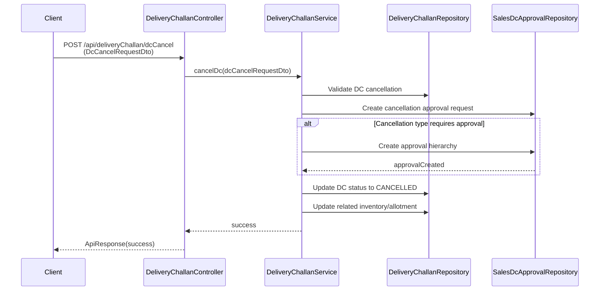
```mermaid
sequenceDiagram
    participant Client
    participant DeliveryChallanController
    participant DeliveryChallanService
    participant DeliveryChallanRepository
    participant SalesDcApprovalRepository

    Client->>DeliveryChallanController: POST /api/deliveryChallan/dcCancel<br/>(DcCancelRequestDto)
    DeliveryChallanController->>DeliveryChallanService: cancelDc(dcCancelRequestDto)
    
    DeliveryChallanService->>DeliveryChallanRepository: Validate DC cancellation
    DeliveryChallanService->>SalesDcApprovalRepository: Create cancellation approval request
    
    alt Cancellation type requires approval
        DeliveryChallanService->>SalesDcApprovalRepository: Create approval hierarchy
        SalesDcApprovalRepository-->>DeliveryChallanService: approvalCreated
    end
    
    DeliveryChallanService->>DeliveryChallanRepository: Update DC status to CANCELLED
    DeliveryChallanService->>DeliveryChallanRepository: Update related inventory/allotment
    
    DeliveryChallanService-->>DeliveryChallanController: success
    DeliveryChallanController-->>Client: ApiResponse(success)
```

### 4.4 Approve DC Cancellation Flow

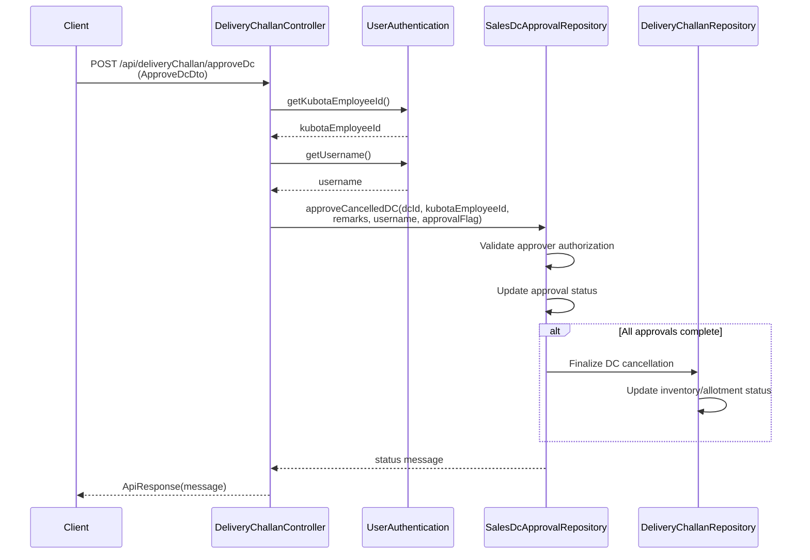
```mermaid
sequenceDiagram
    participant Client
    participant DeliveryChallanController
    participant UserAuthentication
    participant SalesDcApprovalRepository
    participant DeliveryChallanRepository

    Client->>DeliveryChallanController: POST /api/deliveryChallan/approveDc<br/>(ApproveDcDto)
    DeliveryChallanController->>UserAuthentication: getKubotaEmployeeId()
    UserAuthentication-->>DeliveryChallanController: kubotaEmployeeId
    DeliveryChallanController->>UserAuthentication: getUsername()
    UserAuthentication-->>DeliveryChallanController: username
    
    DeliveryChallanController->>SalesDcApprovalRepository: approveCancelledDC(dcId, kubotaEmployeeId,<br/>remarks, username, approvalFlag)
    
    SalesDcApprovalRepository->>SalesDcApprovalRepository: Validate approver authorization
    SalesDcApprovalRepository->>SalesDcApprovalRepository: Update approval status
    
    alt All approvals complete
        SalesDcApprovalRepository->>DeliveryChallanRepository: Finalize DC cancellation
        DeliveryChallanRepository->>DeliveryChallanRepository: Update inventory/allotment status
    end
    
    SalesDcApprovalRepository-->>DeliveryChallanController: status message
    DeliveryChallanController-->>Client: ApiResponse(message)
```

---

## 5. Sales Invoice Flow

### 5.1 Create Sales Invoice Flow

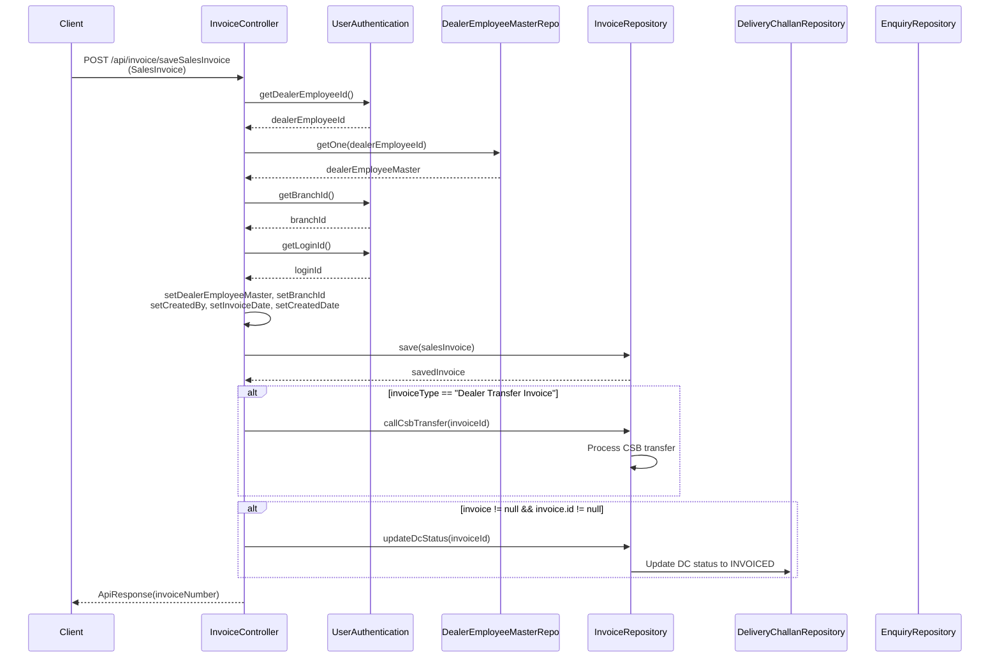
```mermaid
sequenceDiagram
    participant Client
    participant InvoiceController
    participant UserAuthentication
    participant DealerEmployeeMasterRepo
    participant InvoiceRepository
    participant DeliveryChallanRepository
    participant EnquiryRepository

    Client->>InvoiceController: POST /api/invoice/saveSalesInvoice<br/>(SalesInvoice)
    InvoiceController->>UserAuthentication: getDealerEmployeeId()
    UserAuthentication-->>InvoiceController: dealerEmployeeId
    InvoiceController->>DealerEmployeeMasterRepo: getOne(dealerEmployeeId)
    DealerEmployeeMasterRepo-->>InvoiceController: dealerEmployeeMaster
    InvoiceController->>UserAuthentication: getBranchId()
    UserAuthentication-->>InvoiceController: branchId
    InvoiceController->>UserAuthentication: getLoginId()
    UserAuthentication-->>InvoiceController: loginId
    
    InvoiceController->>InvoiceController: setDealerEmployeeMaster, setBranchId<br/>setCreatedBy, setInvoiceDate, setCreatedDate
    
    InvoiceController->>InvoiceRepository: save(salesInvoice)
    InvoiceRepository-->>InvoiceController: savedInvoice
    
    alt invoiceType == "Dealer Transfer Invoice"
        InvoiceController->>InvoiceRepository: callCsbTransfer(invoiceId)
        InvoiceRepository->>InvoiceRepository: Process CSB transfer
    end
    
    alt invoice != null && invoice.id != null
        InvoiceController->>InvoiceRepository: updateDcStatus(invoiceId)
        InvoiceRepository->>DeliveryChallanRepository: Update DC status to INVOICED
    end
    
    InvoiceController-->>Client: ApiResponse(invoiceNumber)
```

### 5.2 Search Invoice Flow

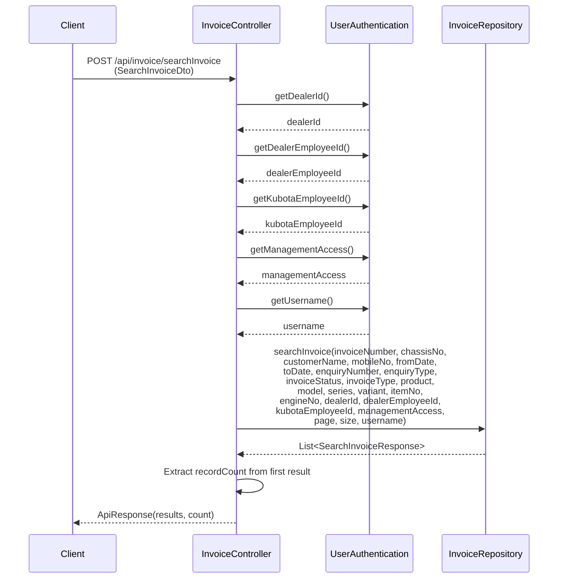
```mermaid
sequenceDiagram
    participant Client
    participant InvoiceController
    participant UserAuthentication
    participant InvoiceRepository

    Client->>InvoiceController: POST /api/invoice/searchInvoice<br/>(SearchInvoiceDto)
    InvoiceController->>UserAuthentication: getDealerId()
    UserAuthentication-->>InvoiceController: dealerId
    InvoiceController->>UserAuthentication: getDealerEmployeeId()
    UserAuthentication-->>InvoiceController: dealerEmployeeId
    InvoiceController->>UserAuthentication: getKubotaEmployeeId()
    UserAuthentication-->>InvoiceController: kubotaEmployeeId
    InvoiceController->>UserAuthentication: getManagementAccess()
    UserAuthentication-->>InvoiceController: managementAccess
    InvoiceController->>UserAuthentication: getUsername()
    UserAuthentication-->>InvoiceController: username
    
    InvoiceController->>InvoiceRepository: searchInvoice(invoiceNumber, chassisNo,<br/>customerName, mobileNo, fromDate,<br/>toDate, enquiryNumber, enquiryType,<br/>invoiceStatus, invoiceType, product,<br/>model, series, variant, itemNo,<br/>engineNo, dealerId, dealerEmployeeId,<br/>kubotaEmployeeId, managementAccess,<br/>page, size, username)
    InvoiceRepository-->>InvoiceController: List<SearchInvoiceResponse>
    
    InvoiceController->>InvoiceController: Extract recordCount from first result
    InvoiceController-->>Client: ApiResponse(results, count)
```

### 5.3 Cancel Invoice Flow

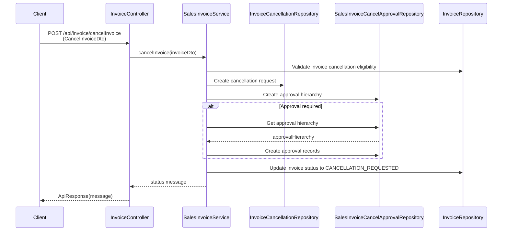
```mermaid
sequenceDiagram
    participant Client
    participant InvoiceController
    participant SalesInvoiceService
    participant InvoiceCancellationRepository
    participant SalesInvoiceCancelApprovalRepository
    participant InvoiceRepository

    Client->>InvoiceController: POST /api/invoice/cancelInvoice<br/>(CancelInvoiceDto)
    InvoiceController->>SalesInvoiceService: cancelInvoice(invoiceDto)
    
    SalesInvoiceService->>InvoiceRepository: Validate invoice cancellation eligibility
    SalesInvoiceService->>InvoiceCancellationRepository: Create cancellation request
    SalesInvoiceService->>SalesInvoiceCancelApprovalRepository: Create approval hierarchy
    
    alt Approval required
        SalesInvoiceService->>SalesInvoiceCancelApprovalRepository: Get approval hierarchy
        SalesInvoiceCancelApprovalRepository-->>SalesInvoiceService: approvalHierarchy
        SalesInvoiceService->>SalesInvoiceCancelApprovalRepository: Create approval records
    end
    
    SalesInvoiceService->>InvoiceRepository: Update invoice status to CANCELLATION_REQUESTED
    SalesInvoiceService-->>InvoiceController: status message
    InvoiceController-->>Client: ApiResponse(message)
```

### 5.4 Approve Invoice Cancellation Flow

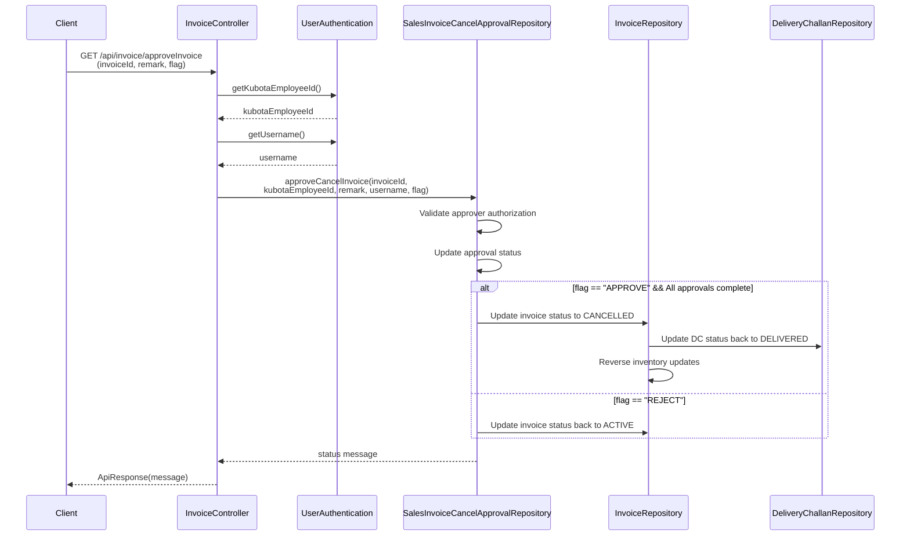
```mermaid
sequenceDiagram
    participant Client
    participant InvoiceController
    participant UserAuthentication
    participant SalesInvoiceCancelApprovalRepository
    participant InvoiceRepository
    participant DeliveryChallanRepository

    Client->>InvoiceController: GET /api/invoice/approveInvoice<br/>(invoiceId, remark, flag)
    InvoiceController->>UserAuthentication: getKubotaEmployeeId()
    UserAuthentication-->>InvoiceController: kubotaEmployeeId
    InvoiceController->>UserAuthentication: getUsername()
    UserAuthentication-->>InvoiceController: username
    
    InvoiceController->>SalesInvoiceCancelApprovalRepository: approveCancelInvoice(invoiceId,<br/>kubotaEmployeeId, remark, username, flag)
    
    SalesInvoiceCancelApprovalRepository->>SalesInvoiceCancelApprovalRepository: Validate approver authorization
    SalesInvoiceCancelApprovalRepository->>SalesInvoiceCancelApprovalRepository: Update approval status
    
    alt flag == "APPROVE" && All approvals complete
        SalesInvoiceCancelApprovalRepository->>InvoiceRepository: Update invoice status to CANCELLED
        InvoiceRepository->>DeliveryChallanRepository: Update DC status back to DELIVERED
        InvoiceRepository->>InvoiceRepository: Reverse inventory updates
    else flag == "REJECT"
        SalesInvoiceCancelApprovalRepository->>InvoiceRepository: Update invoice status back to ACTIVE
    end
    
    SalesInvoiceCancelApprovalRepository-->>InvoiceController: status message
    InvoiceController-->>Client: ApiResponse(message)
```

---

## 6. Marketing Activity Proposal Flow

### 6.1 Create Marketing Activity Proposal Flow

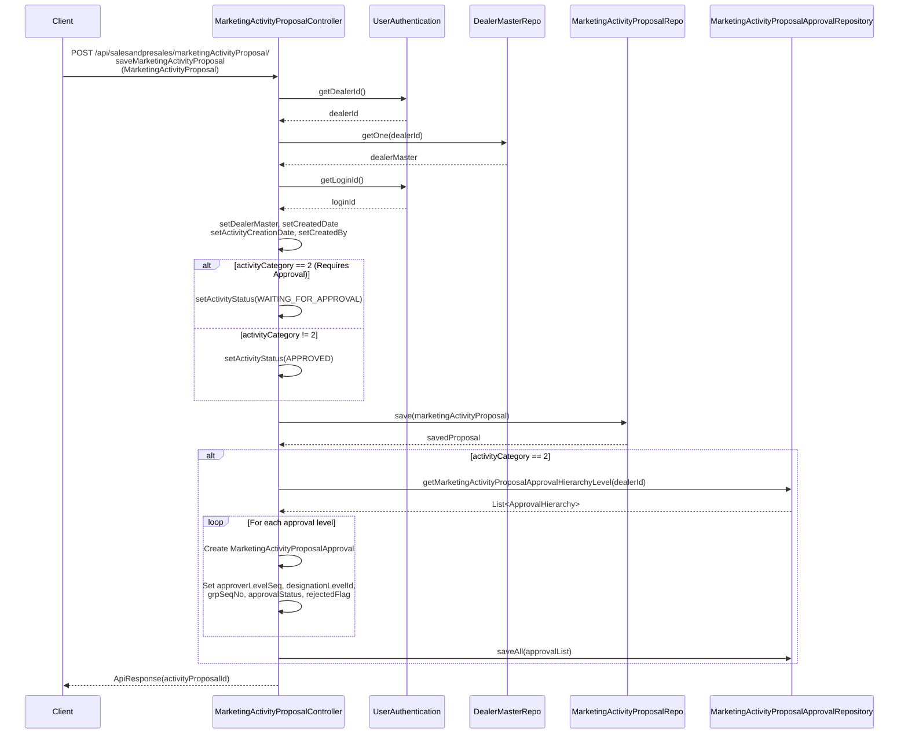
```mermaid
sequenceDiagram
    participant Client
    participant MarketingActivityProposalController
    participant UserAuthentication
    participant DealerMasterRepo
    participant MarketingActivityProposalRepo
    participant MarketingActivityProposalApprovalRepository

    Client->>MarketingActivityProposalController: POST /api/salesandpresales/marketingActivityProposal/<br/>saveMarketingActivityProposal<br/>(MarketingActivityProposal)
    MarketingActivityProposalController->>UserAuthentication: getDealerId()
    UserAuthentication-->>MarketingActivityProposalController: dealerId
    MarketingActivityProposalController->>DealerMasterRepo: getOne(dealerId)
    DealerMasterRepo-->>MarketingActivityProposalController: dealerMaster
    MarketingActivityProposalController->>UserAuthentication: getLoginId()
    UserAuthentication-->>MarketingActivityProposalController: loginId
    
    MarketingActivityProposalController->>MarketingActivityProposalController: setDealerMaster, setCreatedDate<br/>setActivityCreationDate, setCreatedBy
    
    alt activityCategory == 2 (Requires Approval)
        MarketingActivityProposalController->>MarketingActivityProposalController: setActivityStatus(WAITING_FOR_APPROVAL)
    else activityCategory != 2
        MarketingActivityProposalController->>MarketingActivityProposalController: setActivityStatus(APPROVED)
    end
    
    MarketingActivityProposalController->>MarketingActivityProposalRepo: save(marketingActivityProposal)
    MarketingActivityProposalRepo-->>MarketingActivityProposalController: savedProposal
    
    alt activityCategory == 2
        MarketingActivityProposalController->>MarketingActivityProposalApprovalRepository: getMarketingActivityProposalApprovalHierarchyLevel(dealerId)
        MarketingActivityProposalApprovalRepository-->>MarketingActivityProposalController: List<ApprovalHierarchy>
        
        loop For each approval level
            MarketingActivityProposalController->>MarketingActivityProposalController: Create MarketingActivityProposalApproval
            MarketingActivityProposalController->>MarketingActivityProposalController: Set approverLevelSeq, designationLevelId,<br/>grpSeqNo, approvalStatus, rejectedFlag
        end
        
        MarketingActivityProposalController->>MarketingActivityProposalApprovalRepository: saveAll(approvalList)
    end
    
    MarketingActivityProposalController-->>Client: ApiResponse(activityProposalId)
```

### 6.2 Search Marketing Activity Proposal Flow

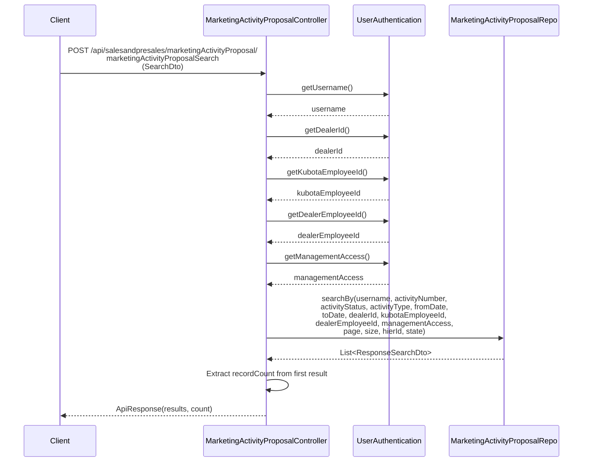
```mermaid
sequenceDiagram
    participant Client
    participant MarketingActivityProposalController
    participant UserAuthentication
    participant MarketingActivityProposalRepo

    Client->>MarketingActivityProposalController: POST /api/salesandpresales/marketingActivityProposal/<br/>marketingActivityProposalSearch<br/>(SearchDto)
    MarketingActivityProposalController->>UserAuthentication: getUsername()
    UserAuthentication-->>MarketingActivityProposalController: username
    MarketingActivityProposalController->>UserAuthentication: getDealerId()
    UserAuthentication-->>MarketingActivityProposalController: dealerId
    MarketingActivityProposalController->>UserAuthentication: getKubotaEmployeeId()
    UserAuthentication-->>MarketingActivityProposalController: kubotaEmployeeId
    MarketingActivityProposalController->>UserAuthentication: getDealerEmployeeId()
    UserAuthentication-->>MarketingActivityProposalController: dealerEmployeeId
    MarketingActivityProposalController->>UserAuthentication: getManagementAccess()
    UserAuthentication-->>MarketingActivityProposalController: managementAccess
    
    MarketingActivityProposalController->>MarketingActivityProposalRepo: searchBy(username, activityNumber,<br/>activityStatus, activityType, fromDate,<br/>toDate, dealerId, kubotaEmployeeId,<br/>dealerEmployeeId, managementAccess,<br/>page, size, hierId, state)
    MarketingActivityProposalRepo-->>MarketingActivityProposalController: List<ResponseSearchDto>
    
    MarketingActivityProposalController->>MarketingActivityProposalController: Extract recordCount from first result
    MarketingActivityProposalController-->>Client: ApiResponse(results, count)
```

### 6.3 Approve Marketing Activity Proposal Flow

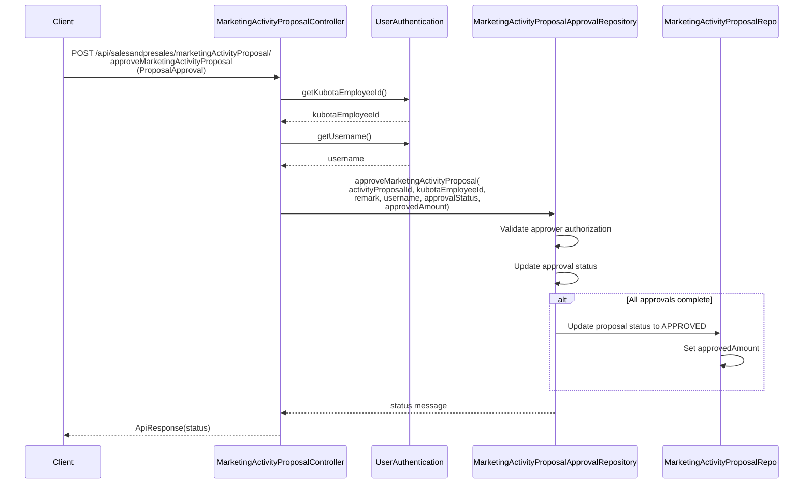
```mermaid
sequenceDiagram
    participant Client
    participant MarketingActivityProposalController
    participant UserAuthentication
    participant MarketingActivityProposalApprovalRepository
    participant MarketingActivityProposalRepo

    Client->>MarketingActivityProposalController: POST /api/salesandpresales/marketingActivityProposal/<br/>approveMarketingActivityProposal<br/>(ProposalApproval)
    MarketingActivityProposalController->>UserAuthentication: getKubotaEmployeeId()
    UserAuthentication-->>MarketingActivityProposalController: kubotaEmployeeId
    MarketingActivityProposalController->>UserAuthentication: getUsername()
    UserAuthentication-->>MarketingActivityProposalController: username
    
    MarketingActivityProposalController->>MarketingActivityProposalApprovalRepository: approveMarketingActivityProposal(<br/>activityProposalId, kubotaEmployeeId,<br/>remark, username, approvalStatus,<br/>approvedAmount)
    
    MarketingActivityProposalApprovalRepository->>MarketingActivityProposalApprovalRepository: Validate approver authorization
    MarketingActivityProposalApprovalRepository->>MarketingActivityProposalApprovalRepository: Update approval status
    
    alt All approvals complete
        MarketingActivityProposalApprovalRepository->>MarketingActivityProposalRepo: Update proposal status to APPROVED
        MarketingActivityProposalRepo->>MarketingActivityProposalRepo: Set approvedAmount
    end
    
    MarketingActivityProposalApprovalRepository-->>MarketingActivityProposalController: status message
    MarketingActivityProposalController-->>Client: ApiResponse(status)
```

---

## 7. Market Intelligence Flow

### 7.1 Create Market Intelligence Flow

```mermaid
sequenceDiagram
    participant Client
    participant MarketIntelligenceController
    participant UserAuthentication
    participant MarketIntelligenceRepo

    Client->>MarketIntelligenceController: POST /api/salesandpresales/marketIntelligence/create<br/>(MarketIntelligence)
    MarketIntelligenceController->>UserAuthentication: getLoginId()
    UserAuthentication-->>MarketIntelligenceController: loginId
    MarketIntelligenceController->>UserAuthentication: getDealerEmployeeId()
    UserAuthentication-->>MarketIntelligenceController: dealerEmployeeId
    
    MarketIntelligenceController->>MarketIntelligenceController: setCreatedBy, setDealerEmpId
    MarketIntelligenceController->>MarketIntelligenceRepo: save(marketIntelligence)
    MarketIntelligenceRepo-->>MarketIntelligenceController: savedMarketIntelligence
    
    MarketIntelligenceController-->>Client: ApiResponse(success)
```

### 7.2 Search Market Intelligence Flow

```mermaid
sequenceDiagram
    participant Client
    participant MarketIntelligenceController
    participant UserAuthentication
    participant MarketIntelligenceRepo

    Client->>MarketIntelligenceController: POST /api/salesandpresales/marketIntelligence<br/>(SearchRequest)
    MarketIntelligenceController->>UserAuthentication: getDealerId()
    UserAuthentication-->>MarketIntelligenceController: dealerId
    MarketIntelligenceController->>UserAuthentication: getUsername()
    UserAuthentication-->>MarketIntelligenceController: username
    
    alt userAuthentication.getDealerId() == null
        MarketIntelligenceController->>MarketIntelligenceController: dealerId = searchRequest.getDealerId()
    end
    
    MarketIntelligenceController->>MarketIntelligenceRepo: getSearchResult(username, feedbackCategory,<br/>fromDate, toDate, orgHierId, dealerId,<br/>page, size)
    MarketIntelligenceRepo-->>MarketIntelligenceController: List<MarketIntelligenceSearchResponse>
    
    MarketIntelligenceController->>MarketIntelligenceController: Extract totalCount from first result
    MarketIntelligenceController-->>Client: ApiResponse(results, count)
```

---

## 8. Branch Transfer Flow

### 8.1 Branch Transfer Request Flow

```mermaid
sequenceDiagram
    participant Client
    participant BranchTransferRequestController
    participant BranchTransferRequestRepo
    participant BranchTransferRequestService

    Client->>BranchTransferRequestController: GET /api/branchTransferRequest/<br/>getReqToBranchDeatilsById
    BranchTransferRequestController->>BranchTransferRequestService: getReqToBranchDeatilsById()
    
    BranchTransferRequestService->>BranchTransferRequestRepo: Get branch transfer request details
    BranchTransferRequestRepo-->>BranchTransferRequestService: BranchTransferRequest details
    
    BranchTransferRequestService->>BranchTransferRequestService: Process and format response
    BranchTransferRequestService-->>BranchTransferRequestController: ApiResponse(branchTransferDetails)
    
    BranchTransferRequestController-->>Client: ApiResponse(success)
```

---

## Common Patterns Across All Flows

### Authentication and Authorization Pattern

```mermaid
sequenceDiagram
    participant Controller
    participant UserAuthentication
    participant Repository
    participant Database

    Controller->>UserAuthentication: getDealerId()
    UserAuthentication-->>Controller: dealerId
    Controller->>UserAuthentication: getBranchId()
    UserAuthentication-->>Controller: branchId
    Controller->>UserAuthentication: getLoginId()
    UserAuthentication-->>Controller: loginId
    Controller->>UserAuthentication: getKubotaEmployeeId()
    UserAuthentication-->>Controller: kubotaEmployeeId
    Controller->>UserAuthentication: getDealerEmployeeId()
    UserAuthentication-->>Controller: dealerEmployeeId
    Controller->>UserAuthentication: getManagementAccess()
    UserAuthentication-->>Controller: managementAccess
    Controller->>UserAuthentication: getUsername()
    UserAuthentication-->>Controller: username
    
    Controller->>Repository: Execute query with user context
    Repository->>Database: Execute SQL with user filters
    Database-->>Repository: Results
    Repository-->>Controller: Filtered results
```

### Approval Workflow Pattern

```mermaid
sequenceDiagram
    participant Controller
    participant Service
    participant ApprovalRepository
    participant EntityRepository

    Controller->>Service: Create/Update entity
    Service->>EntityRepository: save(entity)
    EntityRepository-->>Service: savedEntity
    
    alt Requires Approval
        Service->>ApprovalRepository: getApprovalHierarchyLevel(dealerId, entityId)
        ApprovalRepository-->>Service: List<ApprovalHierarchy>
        
        loop For each approval level
            Service->>Service: Create Approval object
            Service->>ApprovalRepository: save(approval)
        end
        
        Service->>EntityRepository: Update status to WAITING_FOR_APPROVAL
    end
    
    Service-->>Controller: Entity with approval status
```

### Search Pattern with Pagination

```mermaid
sequenceDiagram
    participant Client
    participant Controller
    participant UserAuthentication
    participant Repository

    Client->>Controller: Search request with pagination params
    Controller->>UserAuthentication: Get user context
    UserAuthentication-->>Controller: User context
    
    Controller->>Repository: search(criteria, userContext, page, size)
    Repository->>Repository: Execute search query with filters
    Repository->>Repository: Get total count
    Repository-->>Controller: List<Results> with totalCount in first item
    
    Controller->>Controller: Extract count from results
    Controller-->>Client: ApiResponse(results, count)
```

---

## Notes

1. **User Authentication**: All flows use `UserAuthentication` service to get user context (dealerId, branchId, loginId, etc.)

2. **Approval Workflows**: Purchase Orders, Marketing Activity Proposals, Invoice Cancellations, and DC Cancellations follow similar approval patterns with hierarchy-based approvals.

3. **File Storage**: Enquiry attachments and Purchase Order documents are stored using `StorageService`.

4. **Inventory Management**: GRN, Delivery Challan, and Invoice operations update machine inventory status.

5. **Search Operations**: All search operations support pagination and user-based filtering for data security.

6. **Status Management**: Entities transition through various statuses (DRAFT, WAITING_FOR_APPROVAL, APPROVED, CANCELLED, etc.)

7. **Transaction Management**: Critical operations use `@Transactional` to ensure data consistency.

