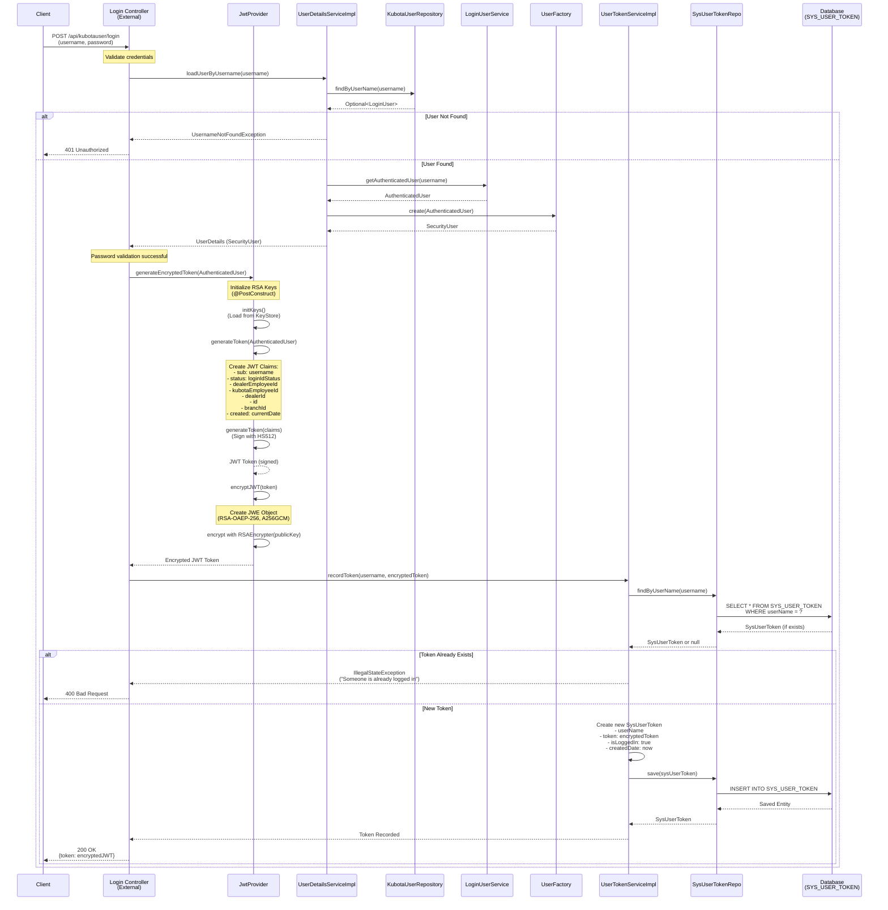
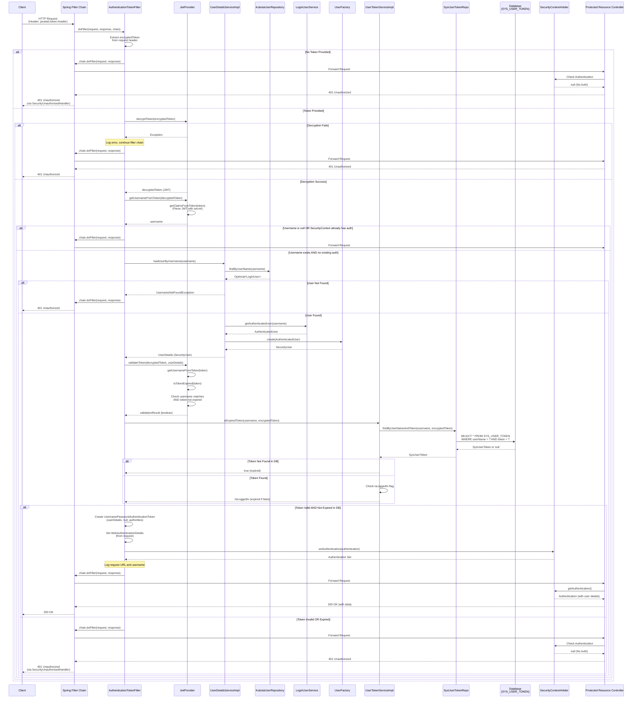
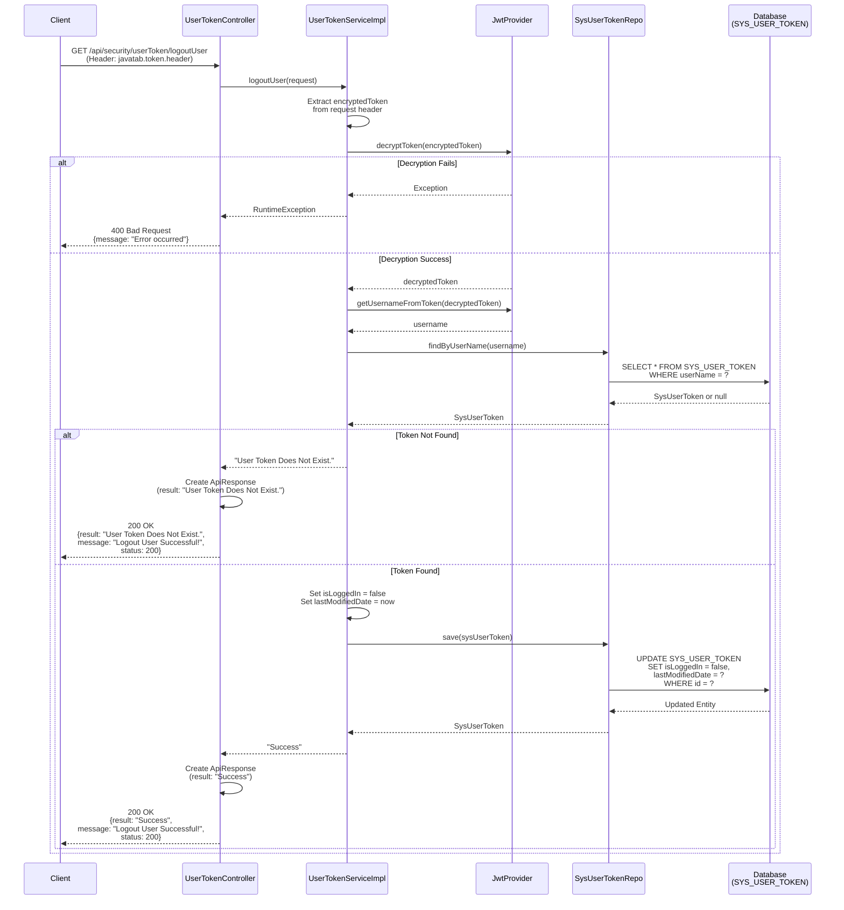
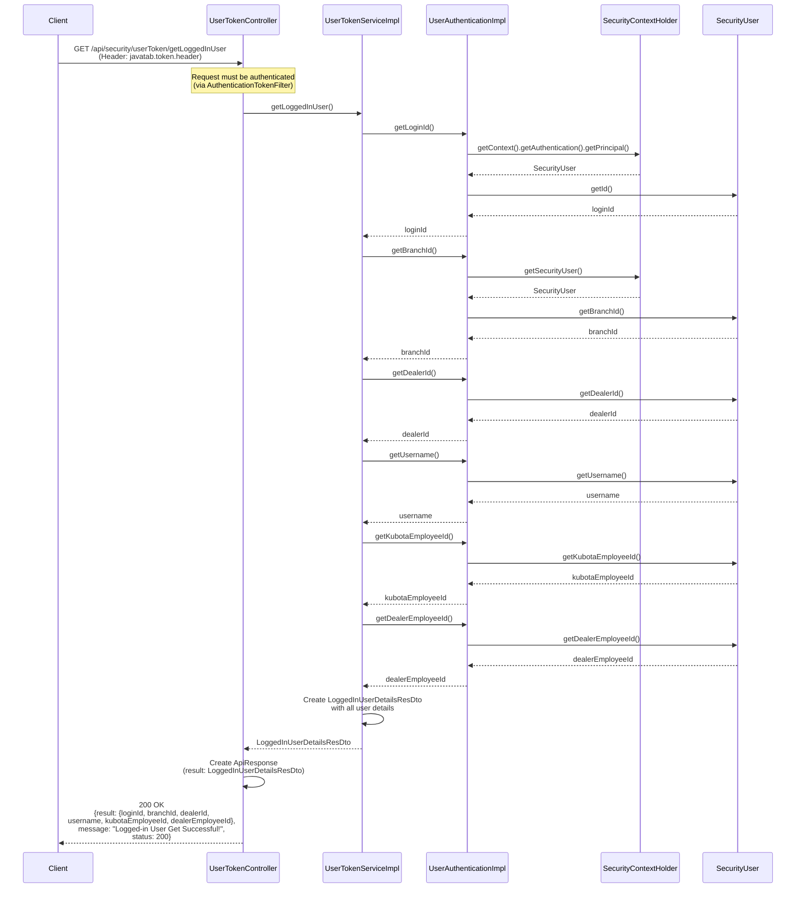
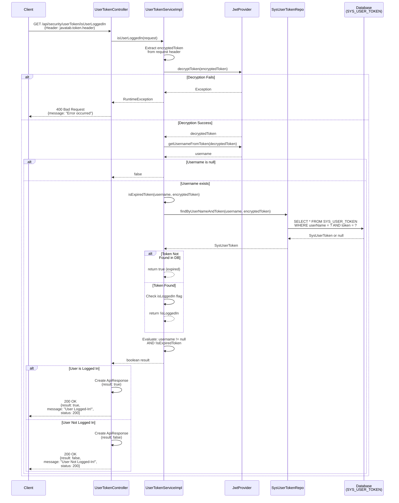
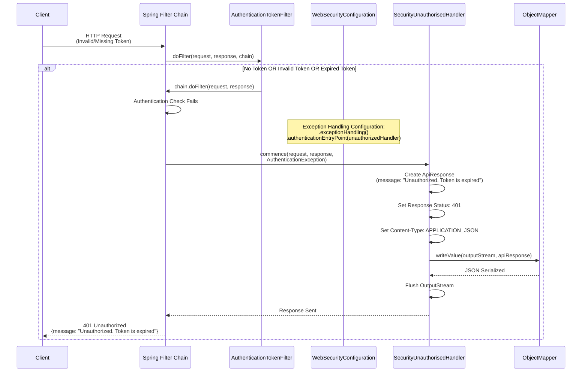
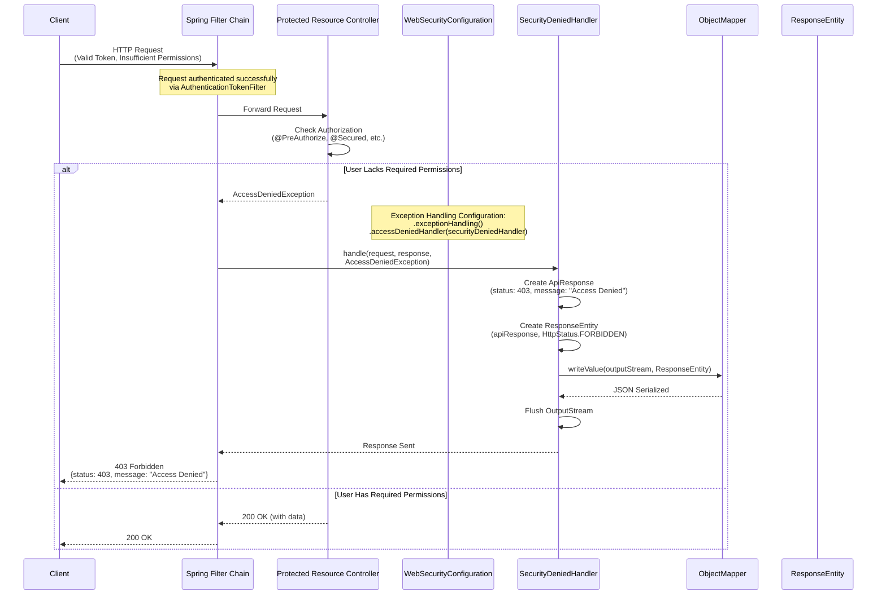

# Security Module - Detailed Sequence Diagrams

This document contains comprehensive sequence diagrams for the KUBOTA Security Module, covering authentication, authorization, token management, and error handling flows.

## Table of Contents
1. [Token Generation and Login Flow](#1-token-generation-and-login-flow)
2. [Request Authentication Filter Flow](#2-request-authentication-filter-flow)
3. [User Logout Flow](#3-user-logout-flow)
4. [Get Logged In User Flow](#4-get-logged-in-user-flow)
5. [Check User Login Status Flow](#5-check-user-login-status-flow)
6. [Unauthorized Access Handling Flow](#6-unauthorized-access-handling-flow)
7. [Access Denied Handling Flow](#7-access-denied-handling-flow)

---

## 1. Token Generation and Login Flow

This flow shows how a JWT token is generated, encrypted, and stored when a user successfully logs in.

---

## 2. Request Authentication Filter Flow

This flow shows how every incoming request is authenticated through the filter chain.

---

## 3. User Logout Flow

This flow shows how a user logs out and their token is invalidated.

---

## 4. Get Logged In User Flow

This flow shows how the current logged-in user details are retrieved.

---

## 5. Check User Login Status Flow

This flow shows how the system checks if a user is currently logged in.

---

## 6. Unauthorized Access Handling Flow

This flow shows how unauthorized access (401) is handled.

---

## 7. Access Denied Handling Flow

This flow shows how access denied (403) is handled when a user lacks required permissions.

---

## Component Overview

### Key Components

1. **WebSecurityConfiguration**: Configures Spring Security, sets up authentication filter, and defines security rules
2. **AuthenticationTokenFilter**: Intercepts all requests, validates JWT tokens, and sets security context
3. **JwtProvider**: Generates, validates, encrypts, and decrypts JWT tokens
4. **UserDetailsServiceImpl**: Loads user details from database for authentication
5. **UserTokenService**: Manages token lifecycle (record, validate, expire) in database
6. **UserTokenController**: REST endpoints for token management (logout, get user, check status)
7. **SecurityUnauthorisedHandler**: Handles 401 Unauthorized responses
8. **SecurityDeniedHandler**: Handles 403 Forbidden responses

### Security Features

- **JWT Token Authentication**: Stateless authentication using JWT tokens
- **Token Encryption**: JWT tokens are encrypted using RSA-OAEP-256 and AES-GCM
- **Token Expiration Tracking**: Database-backed token expiration to prevent reuse after logout
- **Session Management**: Stateless sessions (no server-side session storage)
- **Role-Based Access Control**: Spring Security method-level security with @PreAuthorize
- **CORS Support**: Cross-origin resource sharing enabled
- **CSRF Protection**: Disabled for stateless API (can be enabled if needed)

### Database Schema

**SYS_USER_TOKEN Table:**
- `id`: Primary key
- `userName`: Username (varchar(30), not null)
- `token`: Encrypted JWT token (varchar(max), not null)
- `isLoggedIn`: Boolean flag indicating if token is active (not null)
- `createdDate`: Token creation timestamp
- `lastModifiedDate`: Last modification timestamp

---

## Notes

- All tokens are encrypted before being sent to clients
- Tokens are validated both cryptographically (JWT signature) and against database (logout status)
- The system prevents multiple simultaneous logins for the same user
- Token expiration is checked both in JWT claims and database status
- Security context is set per request and cleared after request processing (stateless)

