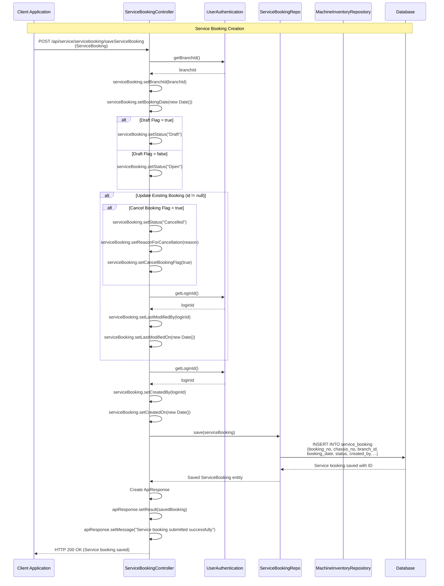
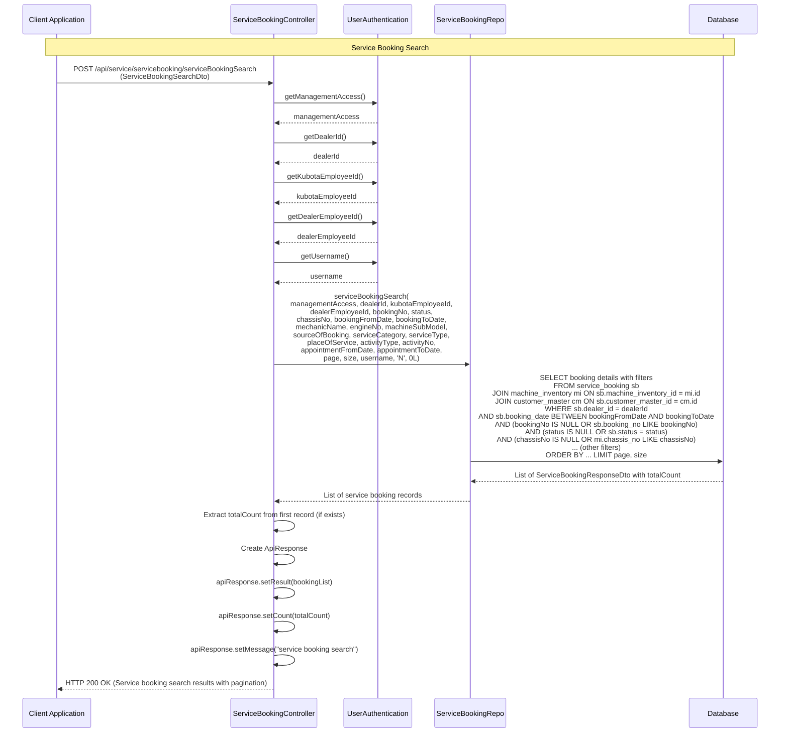
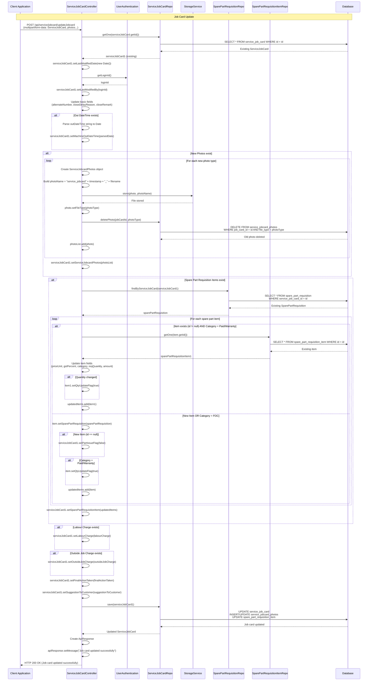
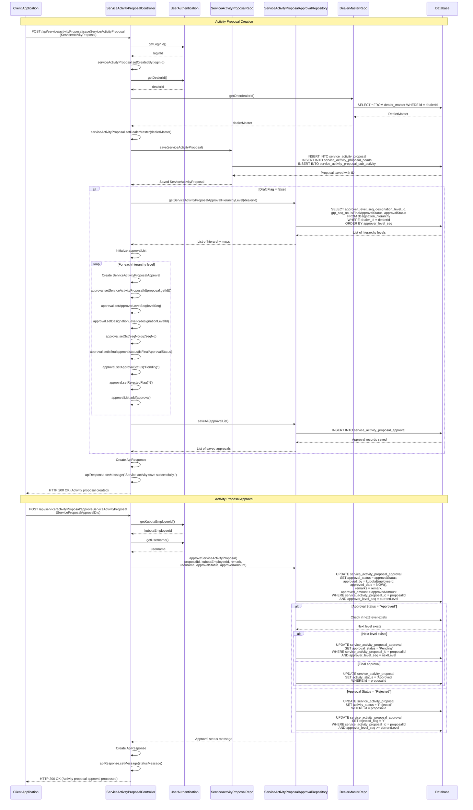
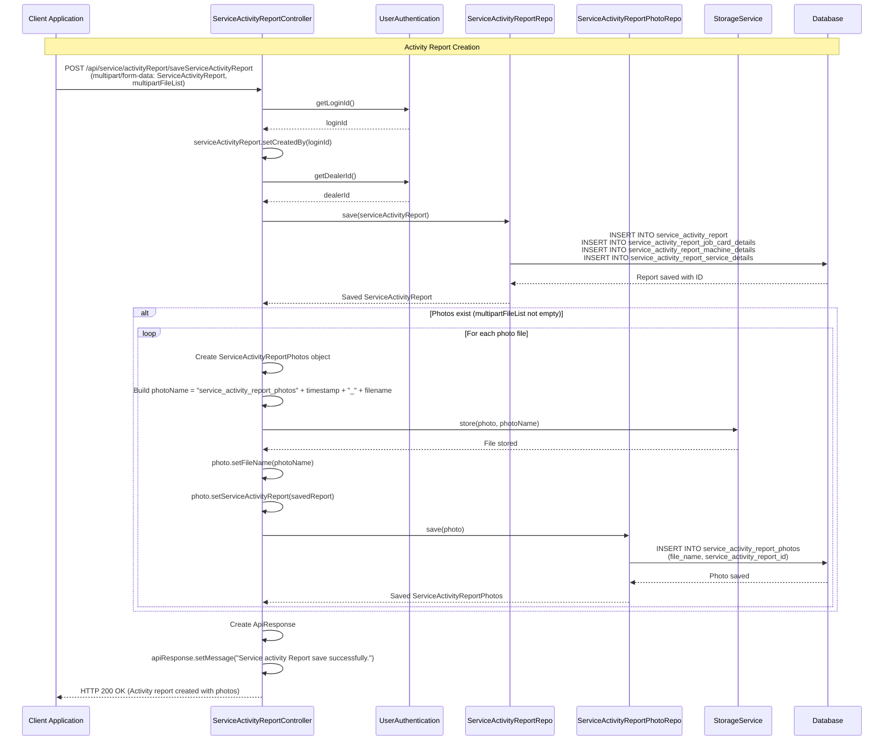
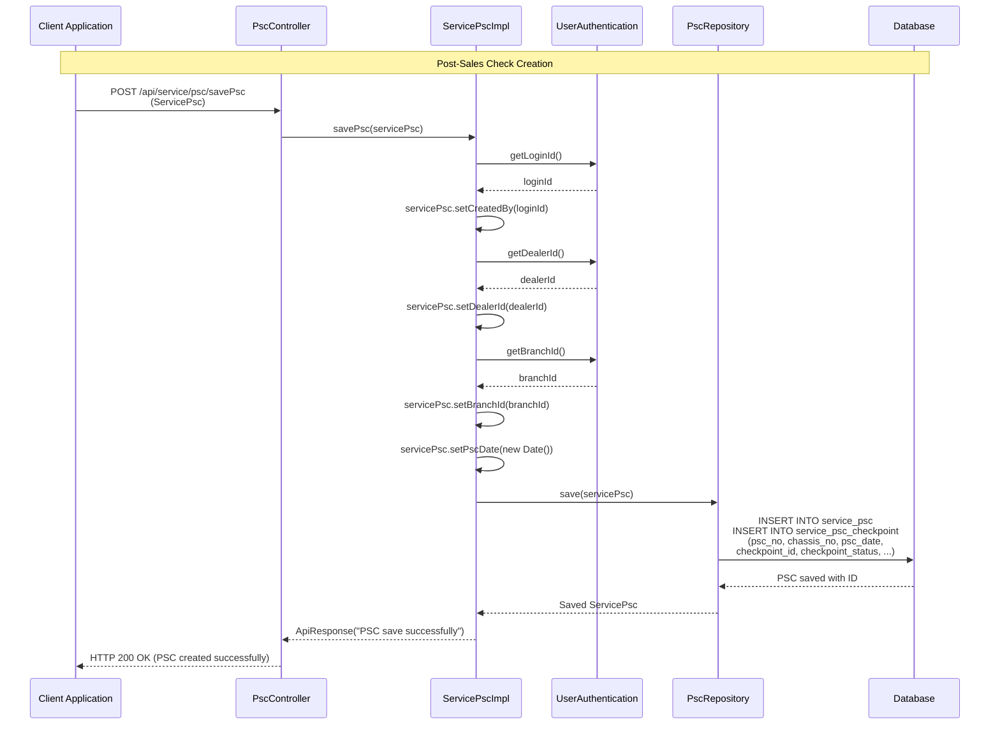
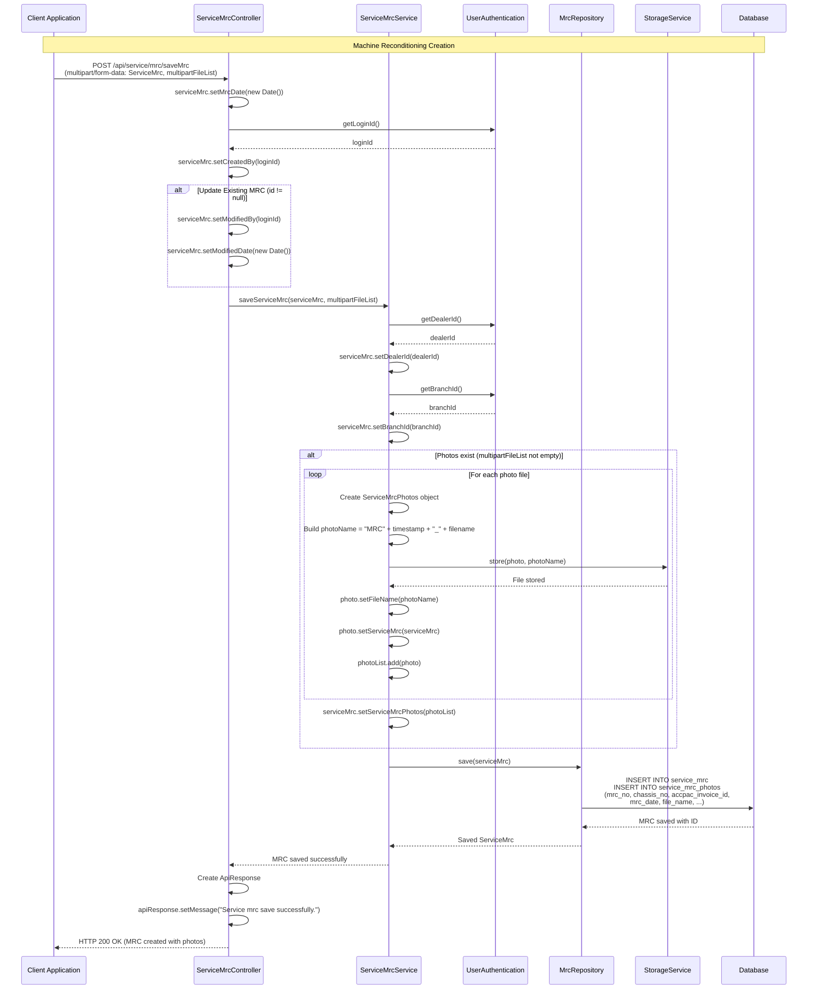

## Service Module - Detailed Sequence Diagrams

This document describes the **key technical flows** implemented in the `com.i4o.dms.kubota.service` module:

- **Service Booking** (Create, search, cancel service bookings).
- **Job Card Management** (Create, update, search, close, reopen job cards with photos and spare parts).
- **Service Claim** (Create, search, approve service claims with approval hierarchy).
- **Activity Proposal** (Create, search, approve service activity proposals).
- **Activity Claim** (Create, search, approve service activity claims with photos and vendor details).
- **Activity Report** (Create, search service activity reports with photos and PDF generation).
- **PSC/PDI/PDC** (Post-Sales Check, Pre-Delivery Inspection, Pre-Delivery Check).
- **MRC** (Machine Reconditioning with photos and invoice integration).

All diagrams use Mermaid sequence diagrams and reflect the current implementation of the Service module.

---

## 1. Service Booking Creation Flow

This flow shows how **service bookings** are created with machine details, customer information, and service requirements.

---

## 2. Service Booking Search Flow

This flow shows how **service bookings** are searched with various filters including booking number, chassis number, status, date range, and service details.

---

## 3. Job Card Creation Flow

This flow shows how **job cards** are created with machine details, service information, photos, spare parts, and retrofitment mappings.

```mermaid
sequenceDiagram
    %% Participants
    participant Client as Client Application
    participant Controller as ServiceJobCardController
    participant ServiceImpl as ServiceJobcardImpl
    participant UserAuth as UserAuthentication
    participant JobCardRepo as ServiceJobCardRepo
    participant StorageService as StorageService
    participant SparePartReqRepo as SparePartRequisitionRepo
    participant DB as Database

    %% Job Card Creation Flow
    Note over Client,DB: Job Card Creation
    
    Client->>Controller: POST /api/service/jobcard/saveJobcard<br/>(multipart/form-data: ServiceJobCard,<br/>fsCouponPage1, fsCouponPage2,<br/>hourMeterPhoto, chassisPhoto,<br/>signedJobcard, retroAcknowledgementForm)
    
    Controller->>ServiceImpl: saveJobCard(serviceJobCard, photos...)
    
    ServiceImpl->>JobCardRepo: isJobCardCreated(0L)
    JobCardRepo->>DB: SELECT COUNT(*) FROM service_job_card WHERE ...
    DB-->>JobCardRepo: count
    JobCardRepo-->>ServiceImpl: false (if not created)
    
    ServiceImpl->>UserAuth: getBranchId()
    UserAuth-->>ServiceImpl: branchId
    ServiceImpl->>ServiceImpl: serviceJobCard.setBranchId(branchId)
    
    ServiceImpl->>UserAuth: getLoginId()
    UserAuth-->>ServiceImpl: loginId
    ServiceImpl->>ServiceImpl: serviceJobCard.setCreatedBy(loginId)
    
    alt Job Card Date is null
        ServiceImpl->>ServiceImpl: serviceJobCard.setJobCardDate(new Date())
    end
    
    alt Retrofitment Mappings exist
        loop For each retrofitment mapping
            ServiceImpl->>ServiceImpl: retroMapping.setCreatedBy(loginId)
            ServiceImpl->>ServiceImpl: retroMapping.setMachineInventory(serviceJobCard.getMachineInventory())
        end
        ServiceImpl->>ServiceImpl: serviceJobCard.setJobcardRetroMappings(retroMappings)
    end
    
    alt Photos exist
        alt Free Service Coupon Page 1 exists
            ServiceImpl->>ServiceImpl: Create ServiceJobcardPhotos object
            ServiceImpl->>ServiceImpl: Build photoName = "JC" + timestamp + "_" + filename
            ServiceImpl->>StorageService: store(fsCouponPage1, photoName)
            StorageService-->>ServiceImpl: File stored
            ServiceImpl->>ServiceImpl: photo.setFileType("free service coupon 1")
            ServiceImpl->>ServiceImpl: photoList.add(photo)
        end
        
        alt Free Service Coupon Page 2 exists
            ServiceImpl->>ServiceImpl: Create ServiceJobcardPhotos object
            ServiceImpl->>ServiceImpl: Build photoName = "JC" + timestamp + "_" + filename
            ServiceImpl->>StorageService: store(fsCouponPage2, photoName)
            StorageService-->>ServiceImpl: File stored
            ServiceImpl->>ServiceImpl: photo.setFileType("free service coupon 2")
            ServiceImpl->>ServiceImpl: photoList.add(photo)
        end
        
        alt Hour Meter Photo exists
            ServiceImpl->>ServiceImpl: Create ServiceJobcardPhotos object
            ServiceImpl->>ServiceImpl: Build photoName = "JC" + timestamp + "_" + filename
            ServiceImpl->>StorageService: store(hourMeterPhoto, photoName)
            StorageService-->>ServiceImpl: File stored
            ServiceImpl->>ServiceImpl: photo.setFileType("hour meter")
            ServiceImpl->>ServiceImpl: photoList.add(photo)
        end
        
        alt Chassis Photo exists
            ServiceImpl->>ServiceImpl: Create ServiceJobcardPhotos object
            ServiceImpl->>ServiceImpl: Build photoName = "JC" + timestamp + "_" + filename
            ServiceImpl->>StorageService: store(chassisPhoto, photoName)
            StorageService-->>ServiceImpl: File stored
            ServiceImpl->>ServiceImpl: photo.setFileType("chassis")
            ServiceImpl->>ServiceImpl: photoList.add(photo)
        end
        
        alt Signed Job Card exists
            ServiceImpl->>ServiceImpl: Create ServiceJobcardPhotos object
            ServiceImpl->>ServiceImpl: Build photoName = "JC" + timestamp + "_" + filename
            ServiceImpl->>StorageService: store(signedJobcard, photoName)
            StorageService-->>ServiceImpl: File stored
            ServiceImpl->>ServiceImpl: photo.setFileType("Signed Job Card")
            ServiceImpl->>ServiceImpl: photoList.add(photo)
        end
        
        alt Retrofitment Acknowledgement Form exists
            ServiceImpl->>ServiceImpl: Create ServiceJobcardPhotos object
            ServiceImpl->>ServiceImpl: Build photoName = "JC" + timestamp + "_" + filename
            ServiceImpl->>StorageService: store(retroAcknowledgementForm, photoName)
            StorageService-->>ServiceImpl: File stored
            ServiceImpl->>ServiceImpl: photo.setFileType("Retrofitment Acknowledgement Form")
            ServiceImpl->>ServiceImpl: photoList.add(photo)
        end
        
        ServiceImpl->>ServiceImpl: serviceJobCard.setServiceJobcardPhotos(photoList)
    end
    
    alt Draft Flag = true
        ServiceImpl->>ServiceImpl: serviceJobCard.setStatus("Draft")
        ServiceImpl->>JobCardRepo: save(serviceJobCard)
        JobCardRepo->>DB: INSERT INTO service_job_card<br/>INSERT INTO service_jobcard_photos<br/>INSERT INTO service_jobcard_retro_mapping
        DB-->>JobCardRepo: Job card saved
        JobCardRepo-->>ServiceImpl: Saved ServiceJobCard
        ServiceImpl-->>Controller: ApiResponse("job card save successfully")
    else Draft Flag = false
        ServiceImpl->>ServiceImpl: serviceJobCard.setStatus("Open")
        ServiceImpl->>JobCardRepo: save(serviceJobCard)
        JobCardRepo->>DB: INSERT INTO service_job_card<br/>INSERT INTO service_jobcard_photos<br/>INSERT INTO service_jobcard_retro_mapping
        DB-->>JobCardRepo: Job card saved with ID
        JobCardRepo-->>ServiceImpl: Saved ServiceJobCard
        
        ServiceImpl->>JobCardRepo: createSparePartRequistion(jobCardId)
        JobCardRepo->>SparePartReqRepo: Create SparePartRequisition
        SparePartReqRepo->>DB: INSERT INTO spare_part_requisition<br/>(requisition_purpose, service_job_card_id, ...)
        DB-->>SparePartReqRepo: Requisition saved
        SparePartReqRepo-->>JobCardRepo: Requisition created
        
        ServiceImpl-->>Controller: ApiResponse("Job card submitted successfully")
    end
    
    Controller-->>Client: HTTP 200 OK (Job card saved successfully)
```

---

## 4. Job Card Update Flow

This flow shows how **job cards** are updated with new photos, spare parts, labour charges, and machine out details.

---

## 5. Service Claim Creation and Approval Flow

This flow shows how **service claims** are created with product/service details, documents, and approval hierarchy setup.

```mermaid
sequenceDiagram
    %% Participants
    participant Client as Client Application
    participant Controller as ServiceClaimController
    participant UserAuth as UserAuthentication
    participant ClaimRepo as ServiceClaimRepo
    participant ApprovalRepo as ServiceClaimApprovalRepo
    participant DB as Database

    %% Service Claim Creation Flow
    Note over Client,DB: Service Claim Creation
    
    Client->>Controller: POST /api/service/claim/create<br/>(ServiceClaimHdrEntity)
    
    Controller->>Controller: claim.setClaimStatus("Claim Approval Pending")
    
    Controller->>UserAuth: getDealerId()
    UserAuth-->>Controller: dealerId
    Controller->>Controller: claim.setDealerId(dealerId)
    
    Controller->>UserAuth: getLoginId()
    UserAuth-->>Controller: loginId
    Controller->>Controller: claim.setCreatedBy(loginId)
    
    Controller->>ClaimRepo: save(claim)
    ClaimRepo->>DB: INSERT INTO service_claim_hdr<br/>INSERT INTO service_claim_dtl<br/>INSERT INTO service_claim_document
    DB-->>ClaimRepo: Claim saved with ID
    ClaimRepo-->>Controller: Saved ServiceClaimHdrEntity
    
    Controller->>ApprovalRepo: getClaimApprovalHierarchyLevel(dealerId)
    ApprovalRepo->>DB: SELECT approver_level_seq, designation_level_id,<br/>grp_seq_no, isFinalApprovalStatus, approvalStatus<br/>FROM designation_hierarchy<br/>WHERE dealer_id = dealerId<br/>ORDER BY approver_level_seq
    DB-->>ApprovalRepo: List of hierarchy levels
    ApprovalRepo-->>Controller: List of hierarchy maps
    
    Controller->>Controller: Initialize approvalList
    
    loop For each hierarchy level
        Controller->>Controller: Create ServiceClaimApprovalEntity
        Controller->>Controller: approval.setServiceClaimId(claim.getId())
        Controller->>Controller: approval.setApproverLevelSeq(levelSeq)
        Controller->>Controller: approval.setDesignationLevelId(designationLevelId)
        Controller->>Controller: approval.setGrpSeqNo(grpSeqNo)
        Controller->>Controller: approval.setIsfinalapprovalstatus(isFinalApprovalStatus)
        Controller->>Controller: approval.setApprovalStatus("Pending")
        Controller->>Controller: approval.setRejectedFlag('N')
        Controller->>Controller: approvalList.add(approval)
    end
    
    Controller->>ApprovalRepo: saveAll(approvalList)
    ApprovalRepo->>DB: INSERT INTO service_claim_approval<br/>(service_claim_id, approver_level_seq, ...)
    DB-->>ApprovalRepo: Approval records saved
    ApprovalRepo-->>Controller: List of saved approvals
    
    Controller->>Controller: Create ApiResponse
    Controller->>Controller: apiResponse.setMessage("Claim Generated Successfully")
    
    Controller-->>Client: HTTP 200 OK (Claim created with approval hierarchy)

    %% Service Claim Approval Flow
    Note over Client,DB: Service Claim Approval
    
    Client->>Controller: POST /api/service/claim/approval<br/>(ServiceClaimApprovalRequestModel)
    
    Controller->>UserAuth: getKubotaEmployeeId()
    UserAuth-->>Controller: kubotaEmployeeId
    
    Controller->>UserAuth: getUsername()
    UserAuth-->>Controller: username
    
    Controller->>ApprovalRepo: claimApproval(<br/>claimId, kubotaEmployeeId, remarks,<br/>username, approvalStatus)
    
    ApprovalRepo->>DB: UPDATE service_claim_approval<br/>SET approval_status = approvalStatus,<br/>approved_by = kubotaEmployeeId,<br/>approved_date = NOW(),<br/>remarks = remarks<br/>WHERE service_claim_id = claimId<br/>AND approver_level_seq = currentLevel
    
    alt Approval Status = "Approved"
        ApprovalRepo->>DB: Check if next level exists
        DB-->>ApprovalRepo: Next level exists
        
        alt Next level exists
            ApprovalRepo->>DB: UPDATE service_claim_approval<br/>SET approval_status = 'Pending'<br/>WHERE service_claim_id = claimId<br/>AND approver_level_seq = nextLevel
        else Final approval
            ApprovalRepo->>DB: UPDATE service_claim_hdr<br/>SET claim_status = 'Approved'<br/>WHERE id = claimId
        end
        
        alt Rejection Data exists
            loop For each rejection detail
                ApprovalRepo->>DB: UPDATE service_claim_dtl<br/>SET rejected = !selection,<br/>rejection_reason = rejectionReason,<br/>remark = remark<br/>WHERE id = detailId
            end
        end
    else Approval Status = "Rejected"
        ApprovalRepo->>DB: UPDATE service_claim_hdr<br/>SET claim_status = 'Rejected'<br/>WHERE id = claimId
        ApprovalRepo->>DB: UPDATE service_claim_approval<br/>SET rejected_flag = 'Y'<br/>WHERE service_claim_id = claimId<br/>AND approver_level_seq >= currentLevel
    end
    
    ApprovalRepo-->>Controller: Approval status message
    
    Controller->>Controller: Create ApiResponse
    Controller->>Controller: apiResponse.setMessage(statusMessage)
    
    Controller-->>Client: HTTP 200 OK (Claim approval processed)
```

---

## 6. Activity Proposal Creation and Approval Flow

This flow shows how **service activity proposals** are created with activity details, heads, sub-activities, and approval hierarchy setup.

---

## 7. Activity Claim Creation Flow

This flow shows how **service activity claims** are created with activity proposal details, heads, sub-activities, photos, and vendor information.

```mermaid
sequenceDiagram
    %% Participants
    participant Client as Client Application
    participant Controller as ServiceActivityClaimController
    participant UserAuth as UserAuthentication
    participant ClaimRepo as ServiceActivityClaimRepo
    participant ProposalRepo as ServiceActivityProposalRepo
    participant ProposalHeadRepo as ServiceActivityProposalHeadRepo
    participant ProposalSubActivityRepo as ServiceActivityProposalSubActivityRepo
    participant ApprovalRepo as ServiceActivityClaimApprovalRepository
    participant StorageService as StorageService
    participant DB as Database

    %% Activity Claim Creation Flow
    Note over Client,DB: Activity Claim Creation
    
    Client->>Controller: POST /api/service/activityClaim/saveServiceActivityClaim<br/>(multipart/form-data: ServiceActivityClaim,<br/>claimHeads with images, subActivities with images)
    
    Controller->>UserAuth: getLoginId()
    UserAuth-->>Controller: loginId
    Controller->>Controller: serviceActivityClaim.setCreatedBy(loginId)
    
    Controller->>UserAuth: getDealerId()
    UserAuth-->>Controller: dealerId
    
    Controller->>ProposalRepo: findById(serviceActivityClaim.getServiceActivityProposalId())
    ProposalRepo->>DB: SELECT * FROM service_activity_proposal WHERE id = proposalId
    DB-->>ProposalRepo: ServiceActivityProposal
    ProposalRepo-->>Controller: serviceActivityProposal
    
    Controller->>Controller: Extract claimHeads and subActivities from request
    
    loop For each claim head
        Controller->>ProposalHeadRepo: findById(head.getId())
        ProposalHeadRepo->>DB: SELECT * FROM service_activity_proposal_heads WHERE id = headId
        DB-->>ProposalHeadRepo: ServiceActivityProposalHeads
        ProposalHeadRepo-->>Controller: serviceActivityProposalHeads
        
        Controller->>Controller: serviceActivityProposalHeads.setActualClaimAmount(head.getActualClaimAmount())
        
        alt Head Image exists
            Controller->>Controller: Extract MultipartFile headImage
            Controller->>Controller: Build headImageName = "activity_claim_head_" + timestamp + "_" + filename
            Controller->>StorageService: store(headImage, headImageName)
            StorageService-->>Controller: File stored
            Controller->>Controller: serviceActivityProposalHeads.setHeadImage(headImageName)
        end
        
        Controller->>Controller: serviceActivityProposalHeads.setVendorName(head.getVendorName())
        Controller->>Controller: serviceActivityProposalHeads.setBillNo(head.getBillNo())
        
        alt Bill Date exists
            Controller->>Controller: Parse billDate string to Date
            Controller->>Controller: serviceActivityProposalHeads.setBillDate(parsedDate)
        end
        
        Controller->>Controller: serviceActivityProposalHeads.setServiceActivityProposal(serviceActivityProposal)
    end
    
    alt Activity Type = 4 (with sub-activities)
        loop For each sub-activity
            Controller->>ProposalSubActivityRepo: findById(subActivity.getId())
            ProposalSubActivityRepo->>DB: SELECT * FROM service_activity_proposal_sub_activity WHERE id = subActivityId
            DB-->>ProposalSubActivityRepo: ServiceActivityProposalSubActivity
            ProposalSubActivityRepo-->>Controller: serviceActivityProposalSubActivity
            
            Controller->>Controller: serviceActivityProposalSubActivity.setActualClaimAmount(subActivity.getActualClaimAmount())
            
            alt Sub-Activity Image exists
                Controller->>Controller: Extract MultipartFile subActivityImage
                Controller->>Controller: Build subActivityImageName = "activity_claim_sub_activity_" + timestamp + "_" + filename
                Controller->>StorageService: store(subActivityImage, subActivityImageName)
                StorageService-->>Controller: File stored
                Controller->>Controller: serviceActivityProposalSubActivity.setSubActivityImage(subActivityImageName)
            end
            
            Controller->>Controller: serviceActivityProposalSubActivity.setVendorName(subActivity.getVendorName())
            Controller->>Controller: serviceActivityProposalSubActivity.setBillNo(subActivity.getBillNo())
            
            alt Bill Date exists
                Controller->>Controller: Parse billDate string to Date
                Controller->>Controller: serviceActivityProposalSubActivity.setBillDate(parsedDate)
            end
            
            Controller->>Controller: serviceActivityProposalSubActivity.setServiceActivityProposal(serviceActivityProposal)
        end
    end
    
    Controller->>Controller: serviceActivityClaim.setServiceActivityProposal(serviceActivityProposal)
    
    Controller->>ClaimRepo: save(serviceActivityClaim)
    ClaimRepo->>DB: INSERT INTO service_activity_claim<br/>UPDATE service_activity_proposal_heads<br/>UPDATE service_activity_proposal_sub_activity
    DB-->>ClaimRepo: Claim saved with ID
    ClaimRepo-->>Controller: Saved ServiceActivityClaim
    
    Controller->>ApprovalRepo: getServiceActivityClaimApprovalHierarchyLevel(dealerId)
    ApprovalRepo->>DB: SELECT approver_level_seq, designation_level_id,<br/>grp_seq_no, isFinalApprovalStatus, approvalStatus<br/>FROM designation_hierarchy<br/>WHERE dealer_id = dealerId<br/>ORDER BY approver_level_seq
    DB-->>ApprovalRepo: List of hierarchy levels
    ApprovalRepo-->>Controller: List of hierarchy maps
    
    Controller->>Controller: Initialize approvals list
    
    loop For each hierarchy level
        Controller->>Controller: Create ServiceActivityClaimApproval
        Controller->>Controller: approval.setServiceActivityClaimId(claim.getId())
        Controller->>Controller: approval.setApproverLevelSeq(levelSeq)
        Controller->>Controller: approval.setDesignationLevelId(designationLevelId)
        Controller->>Controller: approval.setGrpSeqNo(grpSeqNo)
        Controller->>Controller: approval.setIsfinalapprovalstatus(isFinalApprovalStatus)
        Controller->>Controller: approval.setApprovalStatus("Pending")
        Controller->>Controller: approval.setRejectedFlag('N')
        Controller->>Controller: approvals.add(approval)
    end
    
    Controller->>ApprovalRepo: saveAll(approvals)
    ApprovalRepo->>DB: INSERT INTO service_activity_claim_approval
    DB-->>ApprovalRepo: Approval records saved
    ApprovalRepo-->>Controller: List of saved approvals
    
    Controller->>Controller: Create ApiResponse
    Controller->>Controller: apiResponse.setMessage("Service activity Claim save successfully.")
    
    Controller-->>Client: HTTP 200 OK (Activity claim created with approval hierarchy)
```

---

## 8. Activity Report Creation Flow

This flow shows how **service activity reports** are created with activity proposal details, job card details, machine details, service details, and photos.

---

## 9. PSC (Post-Sales Check) Creation Flow

This flow shows how **Post-Sales Check (PSC)** records are created with chassis details and checkpoint information.

---

## 10. MRC (Machine Reconditioning) Creation Flow

This flow shows how **Machine Reconditioning (MRC)** records are created with chassis details, invoice information, and photos.

---

## Summary

The **Service module** provides comprehensive **Service Management** functionality for the KUBOTA DMS:

- **Service Booking**:
  - Create service bookings with machine and customer details
  - Search bookings with multiple filters (booking number, chassis number, status, date range, service details)
  - Cancel service bookings with reason
  - Auto-complete chassis numbers and booking numbers
  - Support for draft and open status

- **Job Card Management**:
  - Create job cards with machine details, service information, and photos
  - Upload multiple photo types (free service coupons, hour meter, chassis, signed job card, retrofitment acknowledgement)
  - Manage spare part requisitions with categories (FOC, Paid, Warranty)
  - Update job cards with labour charges, outside job charges, and machine out details
  - Close and reopen job cards with approval workflow
  - Search job cards with extensive filters
  - Machine service history tracking
  - Excel report generation for job cards
  - Retrofitment campaign integration

- **Service Claim**:
  - Create service claims with product/service details and documents
  - Multi-level approval hierarchy setup
  - Claim search with filters (claim number, status, date range)
  - Claim approval workflow with rejection handling
  - Excel report generation (summary and detail)
  - Document approval amount tracking

- **Activity Proposal**:
  - Create service activity proposals with activity type, budget, and targets
  - Activity heads and sub-activities management
  - Budget calculation for activity types
  - Multi-level approval hierarchy
  - Activity proposal search with filters
  - Group approval support
  - Activity status tracking

- **Activity Claim**:
  - Create activity claims linked to approved proposals
  - Upload photos for heads and sub-activities
  - Vendor details and bill information (vendor name, bill number, bill date)
  - Actual claim amount tracking
  - Multi-level approval workflow
  - Head and sub-activity level approval
  - Claim search and view functionality
  - Edit capability for non-approved claims

- **Activity Report**:
  - Create activity reports with job card, machine, and service details
  - Upload multiple photos
  - Report search functionality
  - PDF report generation using Jasper Reports
  - View activity report details with all associated data

- **PSC/PDI/PDC**:
  - Post-Sales Check (PSC) with checkpoint management
  - Pre-Delivery Inspection (PDI) with inspection details
  - Pre-Delivery Check (PDC) with check details
  - Chassis number auto-complete
  - Search functionality for all check types

- **MRC (Machine Reconditioning)**:
  - Create MRC records with chassis and invoice details
  - Photo upload support
  - Integration with ACCPAC invoices
  - MRC search with filters
  - View MRC details with photos

- **Machine Installation/Reinstallation**:
  - Machine installation tracking
  - Machine reinstallation tracking
  - Installation details and status management

The Service module integrates with multiple other modules (Sales, Spares, Warranty, Masters) to provide a unified service management system, enabling dealers to efficiently manage service bookings, job cards, claims, activities, and machine maintenance operations.

