## Spares Module - Detailed Sequence Diagrams

This document describes the **key technical flows** implemented in the `com.i4o.dms.kubota.spares` module:

- **Sales Order Management** (Create, Search, View, Update Sales Orders)
- **Quotation Management** (Create, Search, View Quotations)
- **Invoice Management** (Create, Search, View, Cancel Invoices)
- **Part Requisition/Issue/Return** (Requisition creation, Issue processing, Return handling)
- **Pick List Management** (Pick list creation and management)
- **Purchase Order Management** (PO creation, approval, GRN processing)
- **Inventory Management** (Stock adjustments, Branch transfers, Bin transfers, Stock reports)
- **Reports** (Various inventory and sales reports)

All diagrams use Mermaid sequence diagrams and reflect the current implementation of the Spares module.

---

## 1. Sales Order Creation Flow

This flow shows how **Spare Parts Sales Orders** are created with part details, customer information, and pricing.

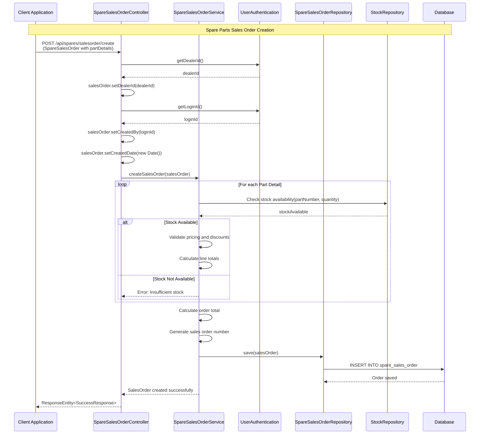

---

## 2. Quotation Creation Flow

This flow shows how **Spare Parts Quotations** are created for customers with part details and pricing.

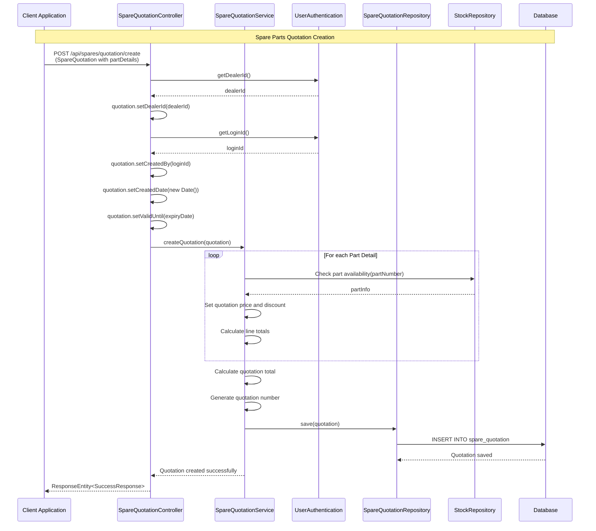

---

## 3. Invoice Creation Flow

This flow shows how **Spare Parts Invoices** are created from sales orders with part details, labour charges, and outside charges.

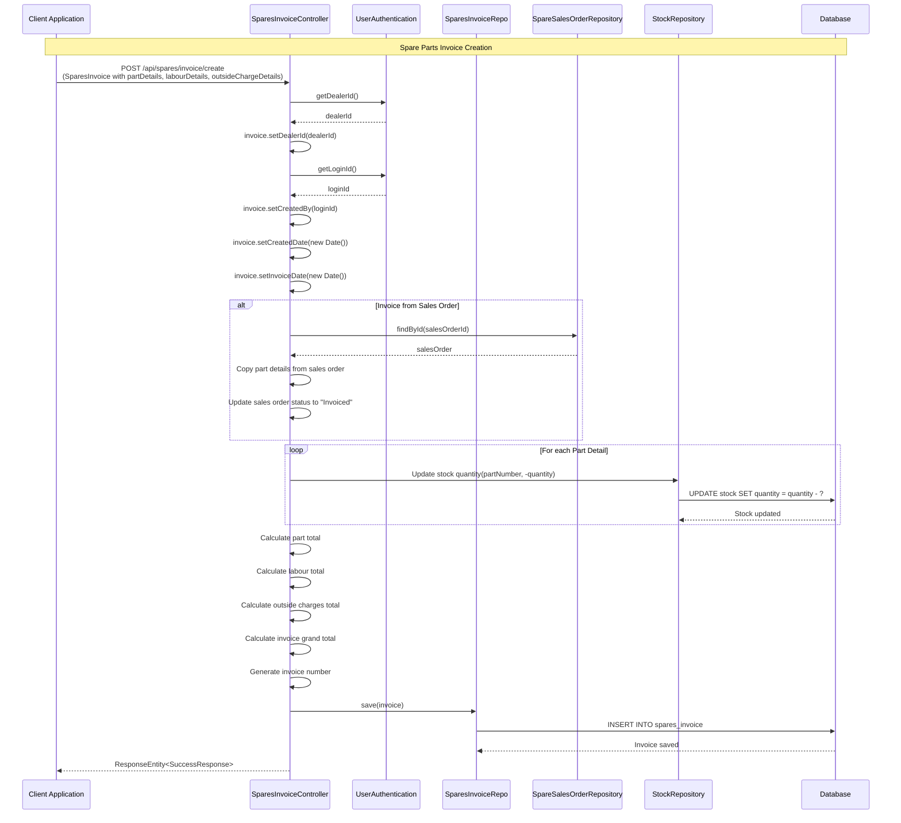

---

## 4. Part Requisition Flow

This flow shows how **Spare Part Requisitions** are created, issued, and returned.

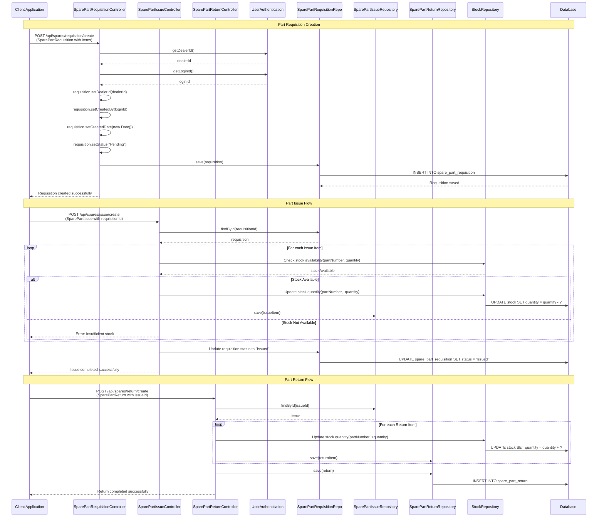

---

## 5. Pick List Creation Flow

This flow shows how **Pick Lists** are created from sales orders for warehouse picking operations.

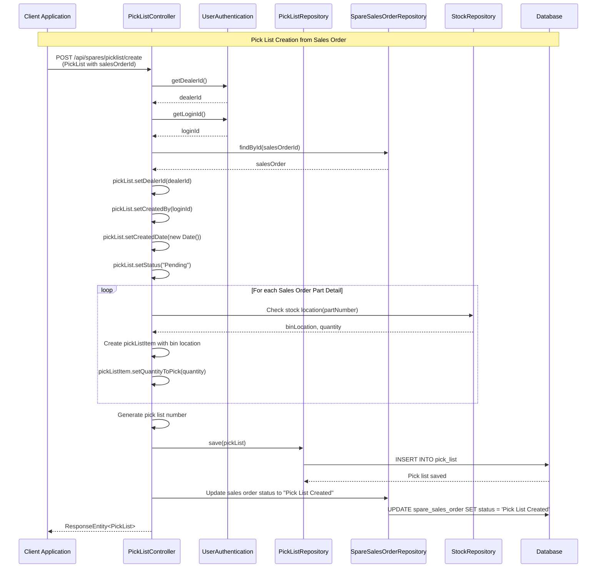

---

## 6. Purchase Order Creation and Approval Flow

This flow shows how **Spare Parts Purchase Orders** are created, submitted for approval, and processed.

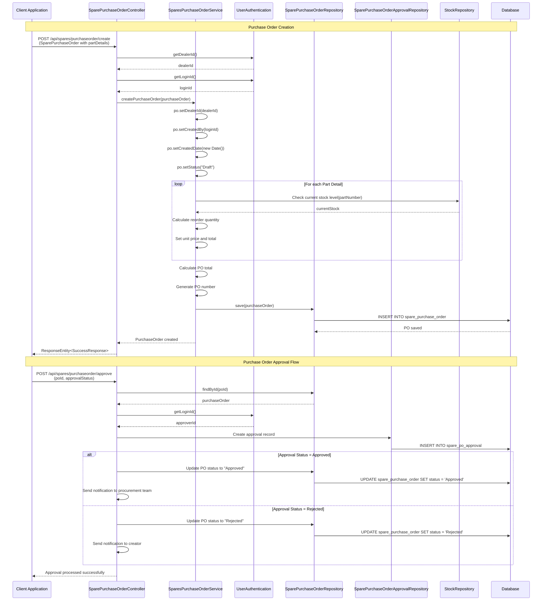

---

## 7. GRN (Goods Receipt Note) Processing Flow

This flow shows how **GRN** is processed when goods are received against a purchase order.

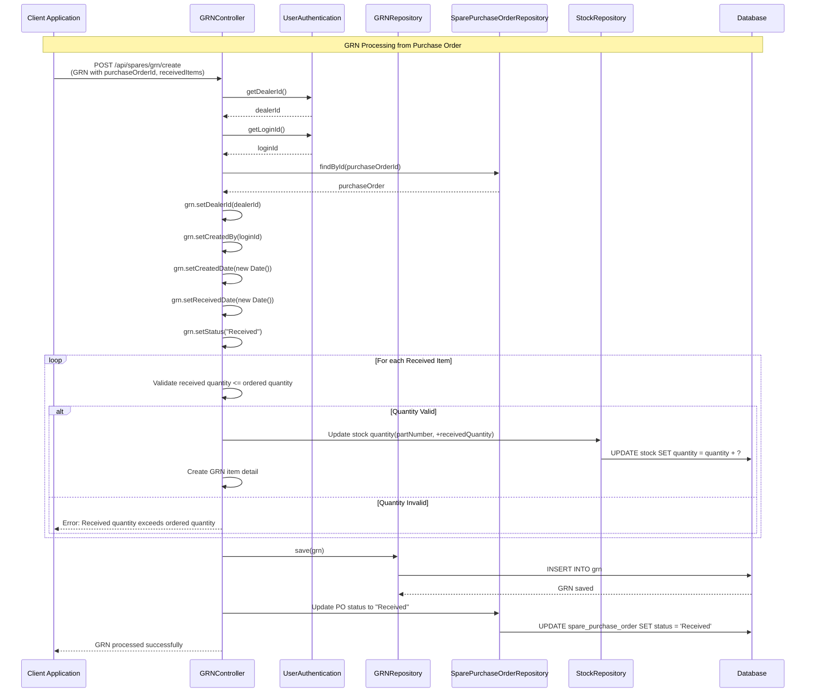

---

## 8. Stock Adjustment Flow

This flow shows how **Stock Adjustments** are made to correct inventory discrepancies.

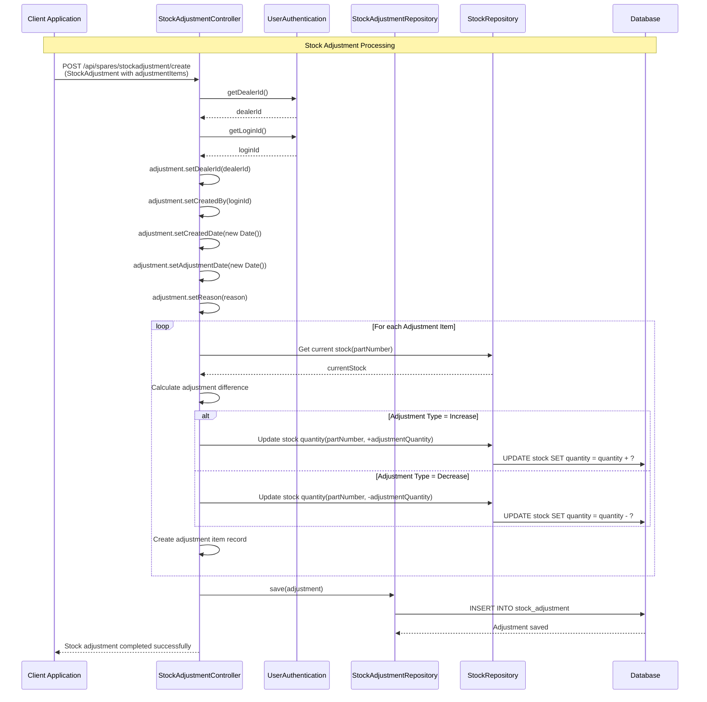

---

## 9. Branch Transfer Flow

This flow shows how **Branch Transfers** are processed (Indent → Issue → Receipt).

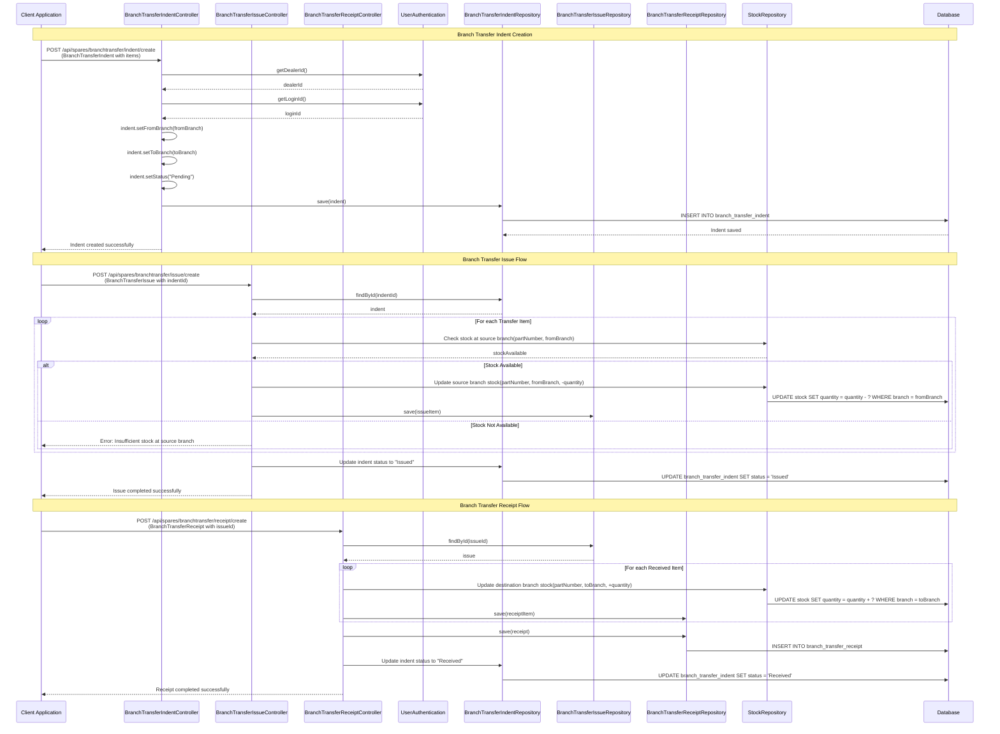

---

## 10. Invoice Cancellation Flow

This flow shows how **Spare Parts Invoices** are cancelled and stock is restored.

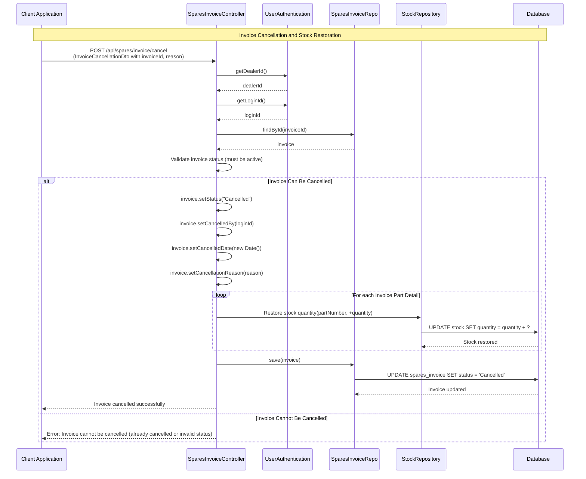

---

## 11. Sales Order Search Flow

This flow shows how **Spare Parts Sales Orders** are searched with various filters.

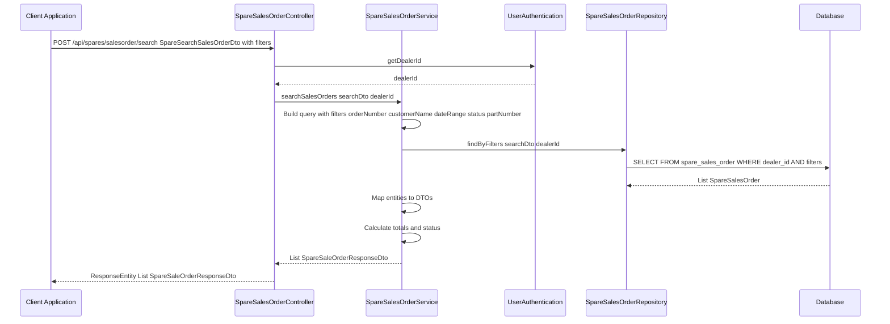

---

## 12. Reports Generation Flow

This flow shows how various **Spare Parts Reports** are generated (Inventory Movement, Closing Stock, Non-Moving Parts, etc.).

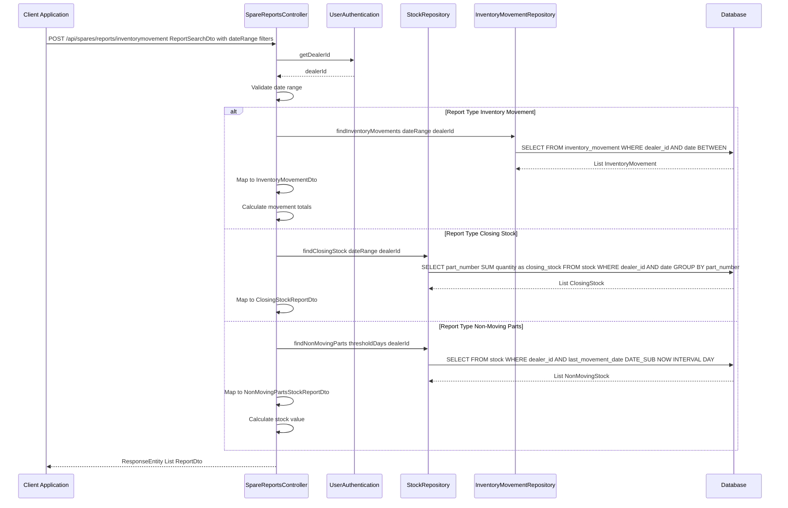

---

## Summary

The Spares module handles the complete lifecycle of spare parts management:

1. **Sales Process**: Quotation → Sales Order → Pick List → Invoice
2. **Procurement Process**: Purchase Order → Approval → GRN → Stock Update
3. **Inventory Management**: Stock Adjustments, Branch Transfers, Bin Transfers
4. **Part Management**: Requisition → Issue → Return
5. **Reporting**: Various inventory and sales reports

All flows follow a consistent pattern:
- Authentication and authorization (dealerId, loginId)
- Validation of business rules
- Database persistence
- Stock updates where applicable
- Status tracking throughout the lifecycle

