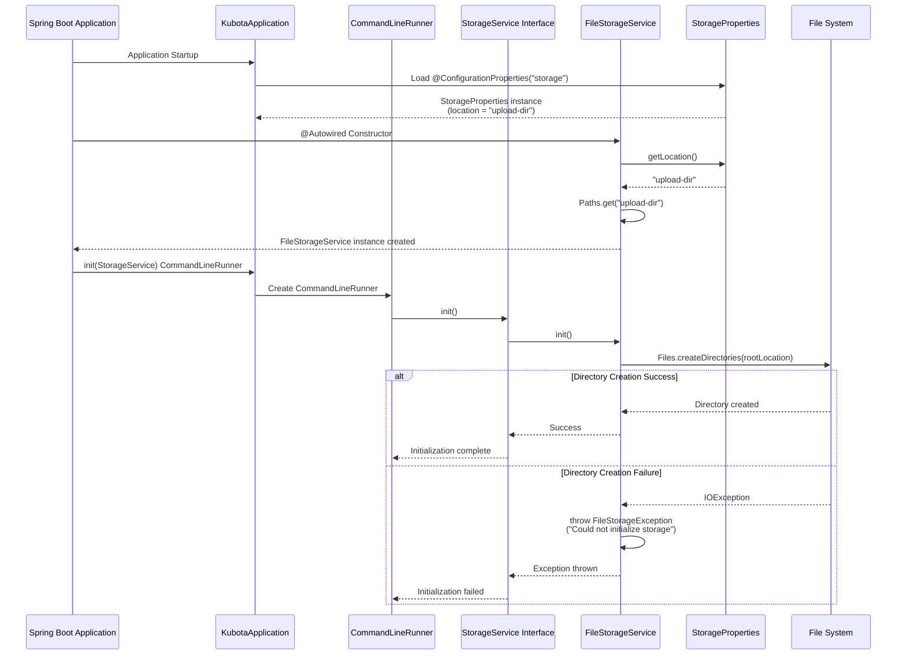
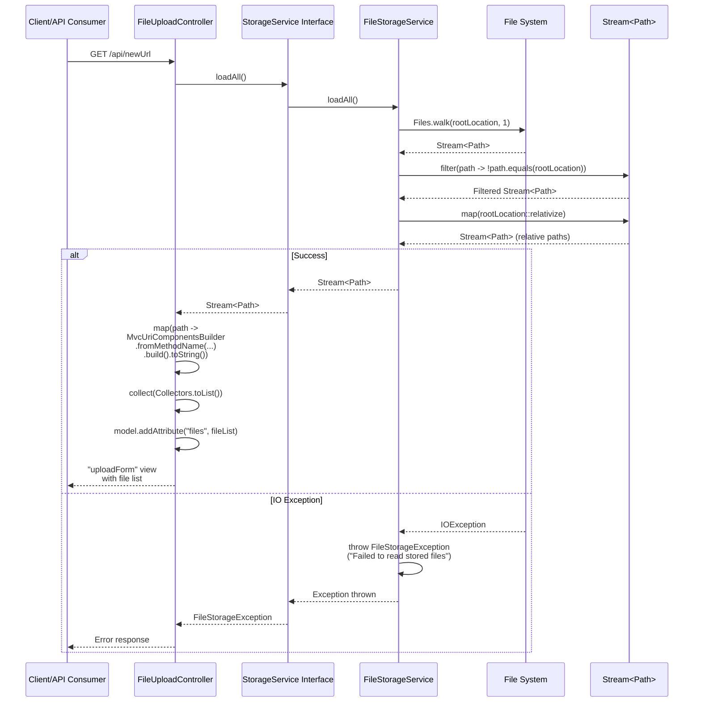
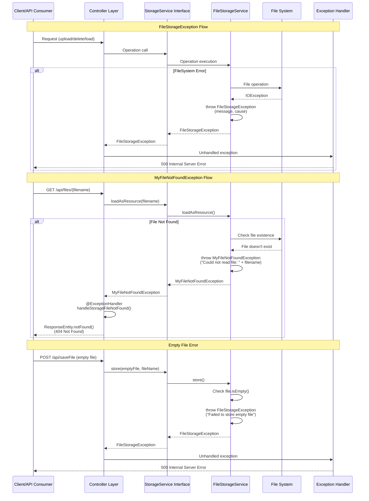

# Storage Module Sequence Diagrams

This document contains detailed sequence diagrams for the Storage Module of the KUBOTA Backend application.

## Table of Contents
1. [Module Initialization Flow](#1-module-initialization-flow)
2. [File Upload Flow (MultipartFile)](#2-file-upload-flow-multipartfile)
3. [Base64 Image Upload Flow](#3-base64-image-upload-flow)
4. [File Retrieval Flow](#4-file-retrieval-flow)
5. [File Listing Flow](#5-file-listing-flow)
6. [File Deletion Flow](#6-file-deletion-flow)
7. [Error Handling Flow](#7-error-handling-flow)

---

## 1. Module Initialization Flow

This diagram shows how the Storage Module is initialized when the application starts.



---

## 2. File Upload Flow (MultipartFile)

This diagram shows the complete flow when uploading a file via MultipartFile.


---

## 3. Base64 Image Upload Flow

This diagram shows the flow when uploading a Base64 encoded image.


---

## 4. File Retrieval Flow

This diagram shows how files are retrieved and served to clients.

```mermaid
sequenceDiagram
    participant Client as Client/API Consumer
    participant FileUploadController as FileUploadController
    participant StorageService as StorageService Interface
    participant FileStorageService as FileStorageService
    participant FileSystem as File System
    participant UrlResource as UrlResource

    Client->>FileUploadController: GET /api/files/{filename}
    FileUploadController->>FileUploadController: Extract filename from path
    FileUploadController->>StorageService: loadAsResource(filename)
    StorageService->>FileStorageService: loadAsResource(String)
    
    FileStorageService->>FileStorageService: load(filename)
    FileStorageService->>FileStorageService: rootLocation.resolve(filename)
    FileStorageService-->>FileStorageService: Path file
    
    FileStorageService->>FileSystem: file.toUri()
    FileSystem-->>FileStorageService: URI
    FileStorageService->>UrlResource: new UrlResource(file.toUri())
    UrlResource-->>FileStorageService: Resource instance
    
    FileStorageService->>UrlResource: resource.exists()
    UrlResource->>FileSystem: Check if file exists
    FileSystem-->>UrlResource: true/false
    
    alt File Exists and Readable
        UrlResource-->>FileStorageService: exists() = true<br/>isReadable() = true
        FileStorageService-->>StorageService: Resource
        StorageService-->>FileUploadController: Resource
        FileUploadController->>FileUploadController: Set HttpHeaders.CONTENT_DISPOSITION<br/>("attachment; filename=\"" + file.getFilename() + "\"")
        FileUploadController-->>Client: ResponseEntity.ok()<br/>with Resource body
    else File Not Found
        UrlResource-->>FileStorageService: exists() = false<br/>OR isReadable() = false
        FileStorageService->>FileStorageService: throw MyFileNotFoundException<br/>("Could not read file: " + filename)
        FileStorageService-->>StorageService: Exception thrown
        StorageService-->>FileUploadController: MyFileNotFoundException
        FileUploadController->>FileUploadController: @ExceptionHandler<br/>handleStorageFileNotFound()
        FileUploadController-->>Client: ResponseEntity.notFound()
    else Malformed URL
        FileSystem-->>FileStorageService: MalformedURLException
        FileStorageService->>FileStorageService: throw MyFileNotFoundException<br/>("Could not read file: " + filename, e)
        FileStorageService-->>StorageService: Exception thrown
        StorageService-->>FileUploadController: MyFileNotFoundException
        FileUploadController->>FileUploadController: @ExceptionHandler<br/>handleStorageFileNotFound()
        FileUploadController-->>Client: ResponseEntity.notFound()
    end
```

---

## 5. File Listing Flow

This diagram shows how all stored files are listed.



---

## 6. File Deletion Flow

This diagram shows how files are deleted from storage.


---

## 7. Error Handling Flow

This diagram shows how errors are handled throughout the storage module.



---

## Module Components Overview

### Classes and Interfaces

1. **StorageService** (Interface)
   - Defines the contract for storage operations
   - Methods: `init()`, `store()`, `loadAll()`, `load()`, `loadAsResource()`, `deleteAll()`, `deleteExistingFile()`

2. **FileStorageService** (Implementation)
   - Implements `StorageService` interface
   - Handles actual file system operations
   - Uses `StorageProperties` for configuration

3. **StorageProperties**
   - Configuration properties class
   - Annotated with `@ConfigurationProperties("storage")`
   - Default location: "upload-dir"

4. **FileStorageException**
   - Runtime exception for storage-related errors
   - Used for general storage failures

5. **MyFileNotFoundException**
   - Specialized exception for file not found scenarios
   - Annotated with `@ResponseStatus(HttpStatus.NOT_FOUND)`
   - Returns 404 status code

### Key Features

- **File Upload**: Supports both MultipartFile and Base64 image uploads
- **File Retrieval**: Load files as Spring Resource for serving
- **File Listing**: List all stored files with relative paths
- **File Deletion**: Delete single files or all files
- **Error Handling**: Comprehensive exception handling with appropriate HTTP status codes
- **Initialization**: Automatic directory creation on application startup

### Integration Points

The Storage Module is used by various controllers across the application:
- `FileUploadController` - Direct file upload/download operations
- Various service implementations for module-specific file operations (Warranty, Service, Sales, CRM, etc.)

