## Training Module - Detailed Sequence Diagrams

This document describes the **key technical flows** implemented in the `com.i4o.dms.kubota.training` module:

- **Training Program Calendar Management** (Create, Update, Search, Approve Nominees).
- **Training Nomination Management** (Create, Update, Search Nominations).
- **Attendance Sheet Management** (Create, Update, Search Attendance, Generate Certificates).
- **Training Program Report** (Search and Export Training Reports).

All diagrams use Mermaid sequence diagrams and reflect the current implementation of the Training module.

---

## 1. Training Program Calendar - Save Flow

This flow shows how **Training Program Calendar** is created with header, dealer details, and holiday details.

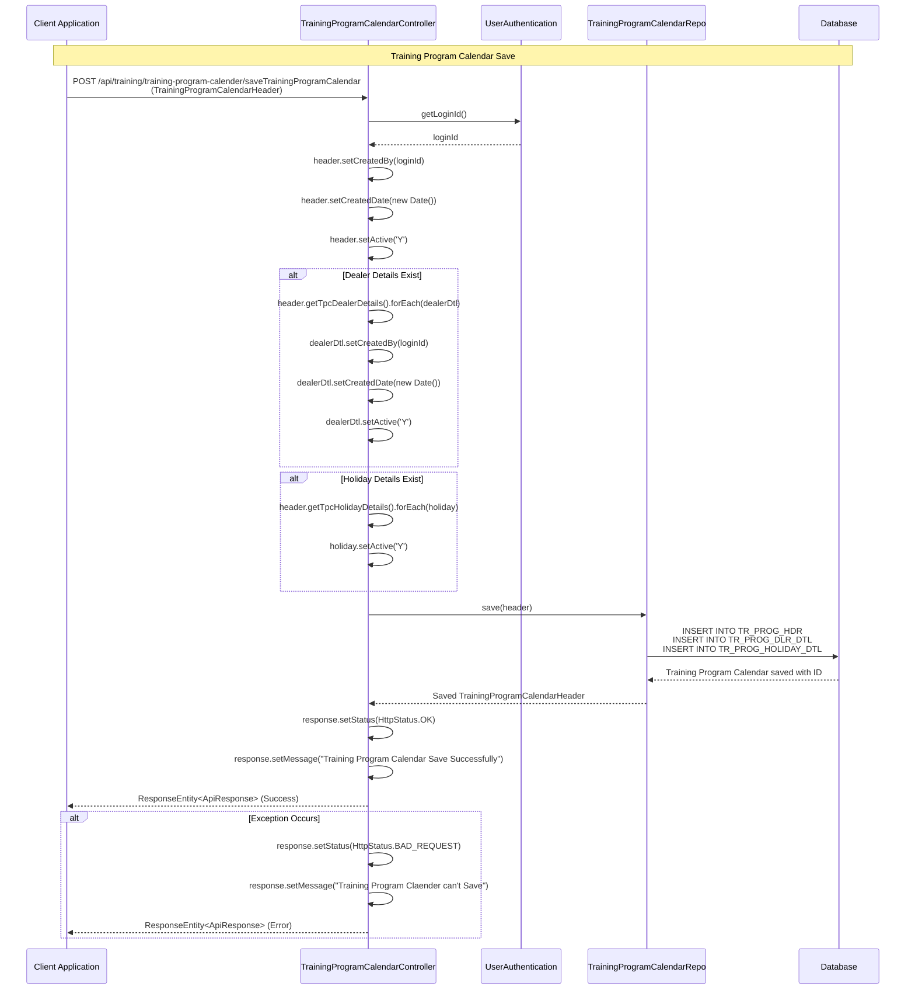

---

## 2. Training Program Calendar - Update Flow

This flow shows how **Training Program Calendar** is updated with new dealer and holiday details.

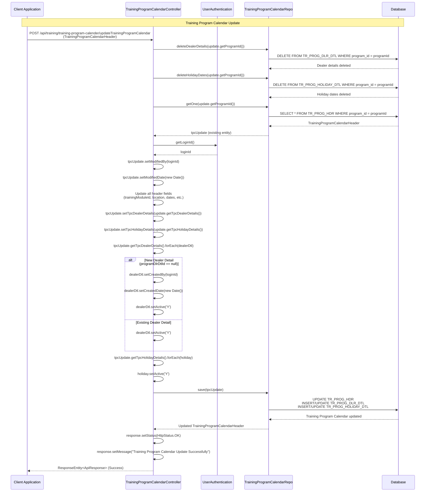

---

## 3. Training Program Calendar - Search Flow

This flow shows how **Training Program Calendar** records are searched with various filters.

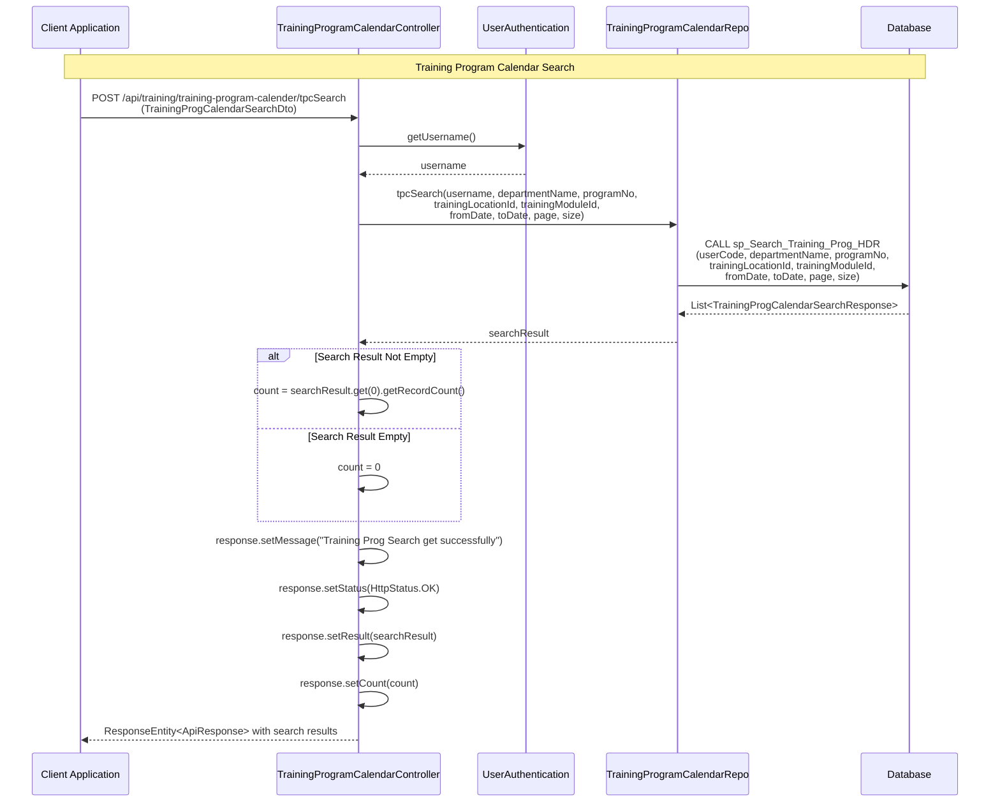

---

## 4. Training Program Calendar - Approve Nominees Flow

This flow shows how **Nominees** are approved or rejected for training programs.

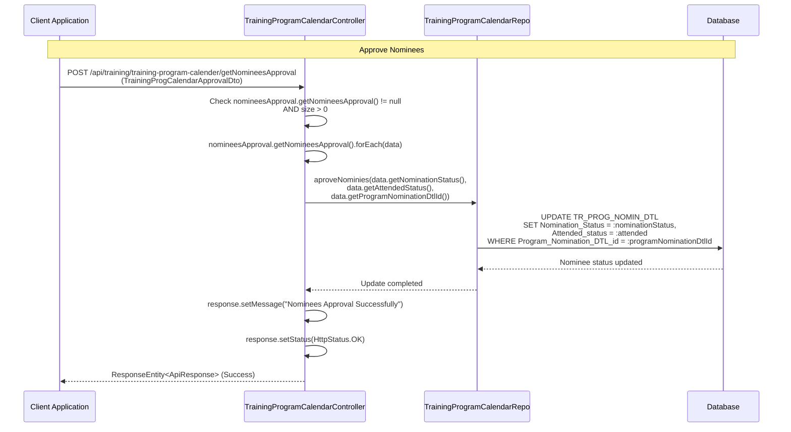

---

## 5. Training Nomination - Save Flow

This flow shows how **Training Nomination** is created with header and nomination details.

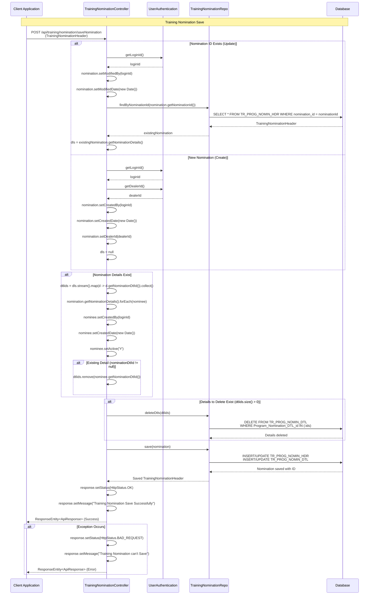

---

## 6. Training Nomination - Search Flow

This flow shows how **Training Nomination** records are searched with filters.

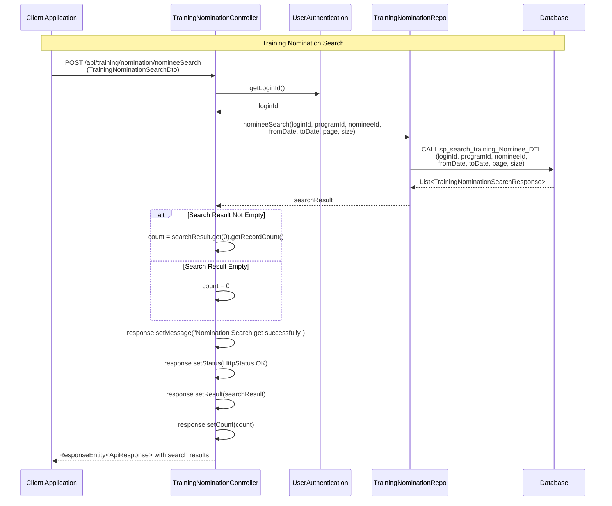

---

## 7. Training Nomination - Get Employee Details Flow

This flow shows how **Employee Details** are retrieved for nomination.

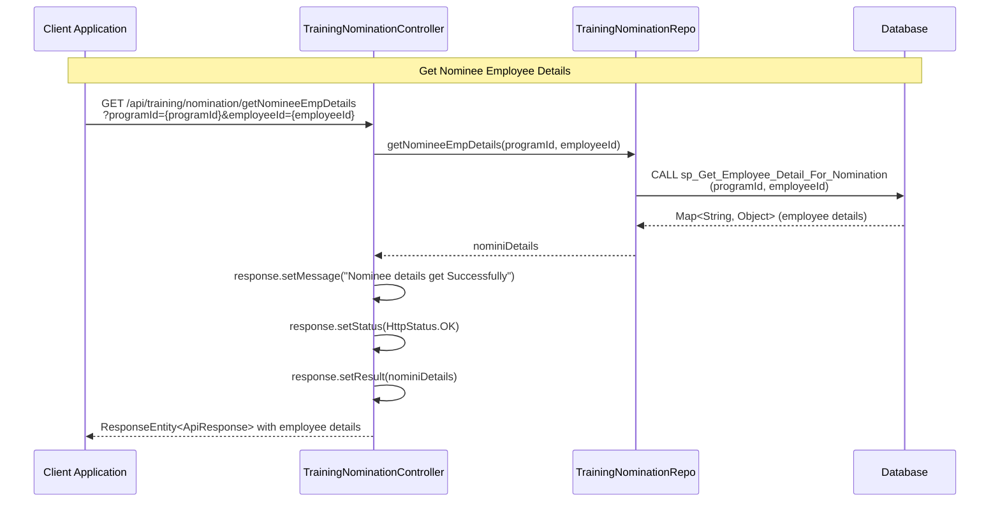

---

## 8. Attendance Sheet - Save Flow

This flow shows how **Attendance Sheet** is created with attendance details, employee indexes, trainers, and documents.

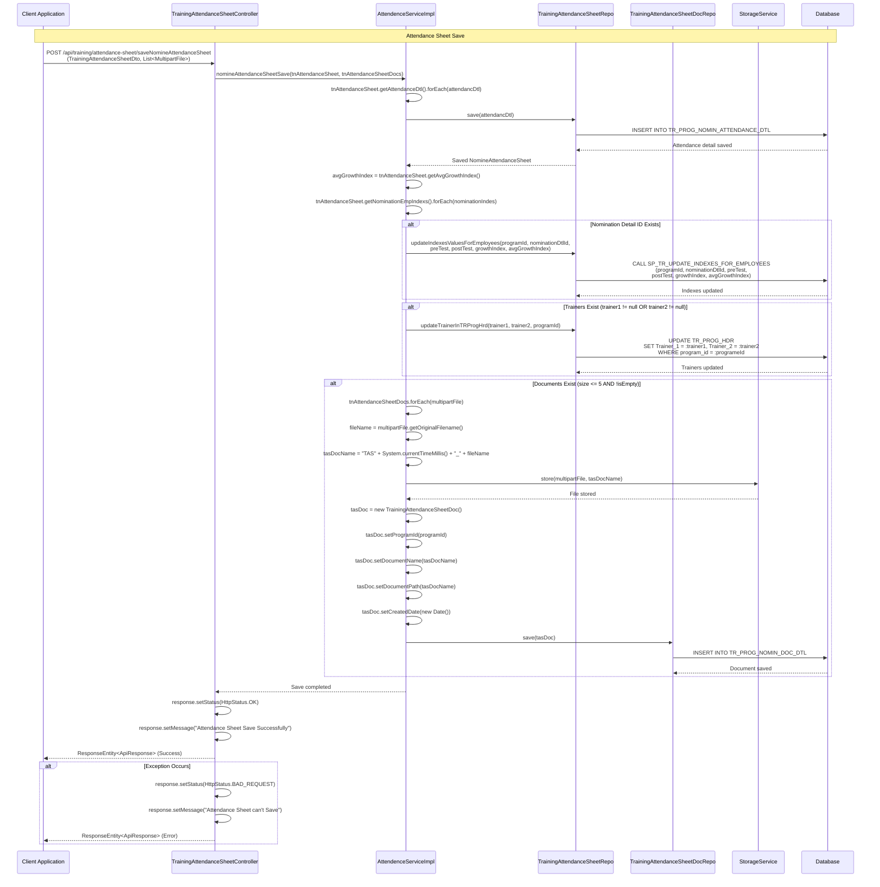

---

## 9. Attendance Sheet - Update Flow

This flow shows how **Attendance Sheet** is updated with new attendance details and indexes.

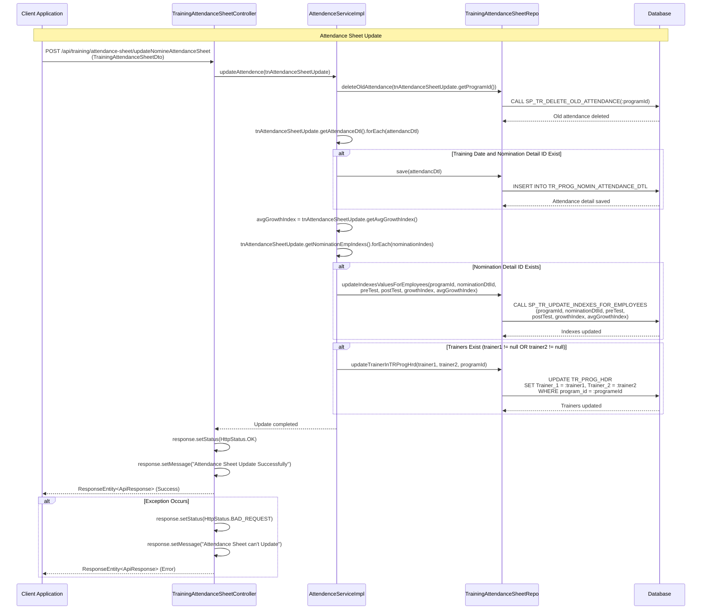

---

## 10. Attendance Sheet - Search Flow

This flow shows how **Attendance Sheet** records are searched with various filters.

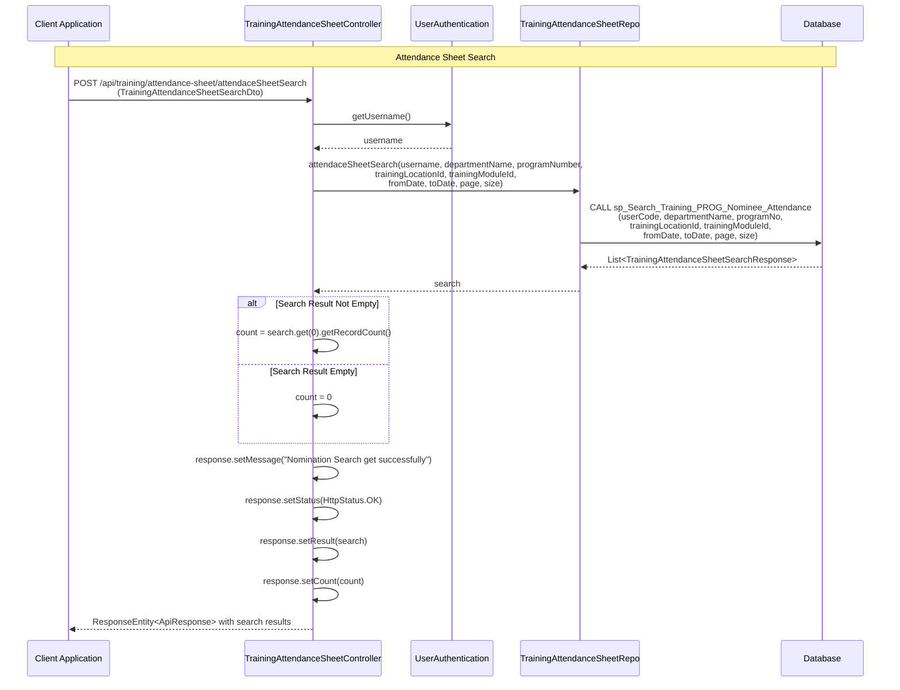

---

## 11. Attendance Sheet - View/Edit Data Flow

This flow shows how **Attendance Sheet** view/edit data is retrieved including header, trainers, attendance details, employee indexes, and documents.

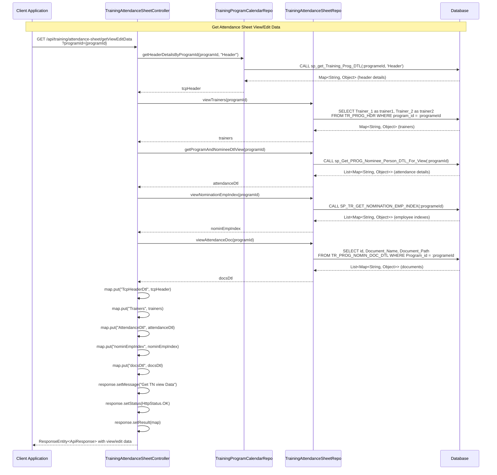

---

## 12. Attendance Sheet - Generate Training Certificate Flow

This flow shows how **Training Certificates** are generated as PDF using Jasper Reports.

```mermaid
sequenceDiagram
    %% Participants
    participant Client as Client Application
    participant Controller as TrainingAttendanceSheetController
    participant JasperPrintService as JasperPrintService
    participant DB as Database

    %% Generate Training Certificate Flow
    Note over Client,DB: Generate Training Certificate
    
    Client->>Controller: POST /api/training/attendance-sheet/generateTrainingCertificate<br/>(TrainingCertificateDto)
    
    Controller->>Controller: filePath = request.getServletContext().getRealPath("/WEB-INF/reports/")
    Controller->>Controller: outputStream = response.getOutputStream()
    Controller->>Controller: response.setContentType("application/pdf")
    Controller->>Controller: response.setHeader("Content-Disposition", "inline; filename=Training_Certificate-{random}-{timestamp}.pdf")
    
    Controller->>Controller: jasperfile = filePath + "printingtrainingprogramCertificate.jasper"
    Controller->>Controller: jasperParameter.put("programId", certificateDto.getProgramId())
    Controller->>Controller: jasperParameter.put("employeeId", certificateDto.getEmployeeId())
    Controller->>Controller: jasperParameter.put("dealerId", certificateDto.getDealerId())
    
    Controller->>JasperPrintService: getJasperPrint(jasperfile, jasperParameter)
    JasperPrintService->>DB: Query data using jasperParameter
    DB-->>JasperPrintService: Certificate data
    JasperPrintService->>JasperPrintService: Compile and fill Jasper report
    JasperPrintService-->>Controller: JasperPrint object
    
    Controller->>JasperPrintService: printPdfReport(jasperPrint, printStatus, outputStream)
    JasperPrintService->>JasperPrintService: Export JasperPrint to PDF
    JasperPrintService-->>Controller: PDF generated
    
    Controller->>Controller: outputStream.flush()
    Controller->>Controller: outputStream.close()
    Controller-->>Client: PDF certificate stream
    
    alt Exception Occurs
        Controller->>Controller: Handle IOException/Exception
        Controller-->>Client: Error response
    end
```

---

## 13. Training Program Report - Search Flow

This flow shows how **Training Program Reports** are searched with various filters.

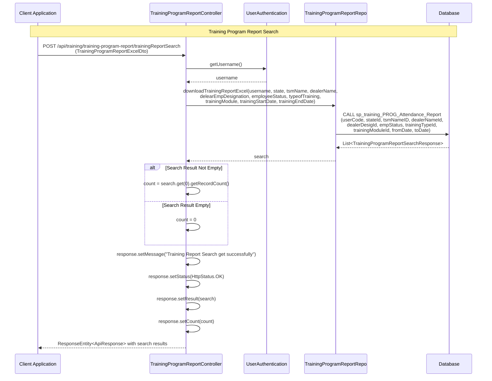

---

## 14. Training Program Report - Download Excel Flow

This flow shows how **Training Program Reports** are exported to Excel format.

```mermaid
sequenceDiagram
    %% Participants
    participant Client as Client Application
    participant Controller as TrainingProgramReportController
    participant UserAuth as UserAuthentication
    participant TprRepo as TrainingProgramReportRepo
    participant ExcelGenerator as ExcelCellGenerator
    participant DB as Database

    %% Training Program Report Excel Download Flow
    Note over Client,DB: Download Training Program Report Excel
    
    Client->>Controller: POST /api/training/training-program-report/downloadTrainingReportExcel<br/>(TrainingProgramReportExcelDto)
    
    Controller->>UserAuth: getUsername()
    UserAuth-->>Controller: username
    
    Controller->>Controller: size = Integer.MAX_VALUE - 1
    
    Controller->>TprRepo: downloadTrainingReportExcel(username, state, tsmName, dealerName,<br/>delearEmpDesignation, employeeStatus, typeofTraining,<br/>trainingModule, trainingStartDate, trainingEndDate)
    TprRepo->>DB: CALL sp_training_PROG_Attendance_Report<br/>(userCode, stateId, tsmNameID, dealerNameId,<br/>dealerDesigId, empStatus, trainingTypeId,<br/>trainingModuleId, fromDate, toDate)
    DB-->>TprRepo: List<TrainingProgramReportSearchResponse>
    TprRepo-->>Controller: list
    
    Controller->>ExcelGenerator: trainingProgramExcelReport(list)
    ExcelGenerator->>ExcelGenerator: Create Excel workbook
    ExcelGenerator->>ExcelGenerator: Add headers and data rows
    ExcelGenerator->>ExcelGenerator: Format cells and styles
    ExcelGenerator-->>Controller: ByteArrayInputStream (Excel file)
    
    Controller->>Controller: response.setContentType("application/vnd.ms-excel")
    Controller->>Controller: filename = "TrainingProgramReport_" + timestamp + ".xlsx"
    Controller->>Controller: headers.add("Content-Disposition", "attachment; filename=" + filename)
    Controller->>Controller: headers.add("Access-Control-Expose-Headers", "Content-Disposition")
    
    Controller-->>Client: ResponseEntity<InputStreamResource> with Excel file stream
```

---

## 15. Training Program Calendar - Get Master Data Flows

This flow shows how various **Master Data** is retrieved for Training Program Calendar (locations, types, modules, dealers).

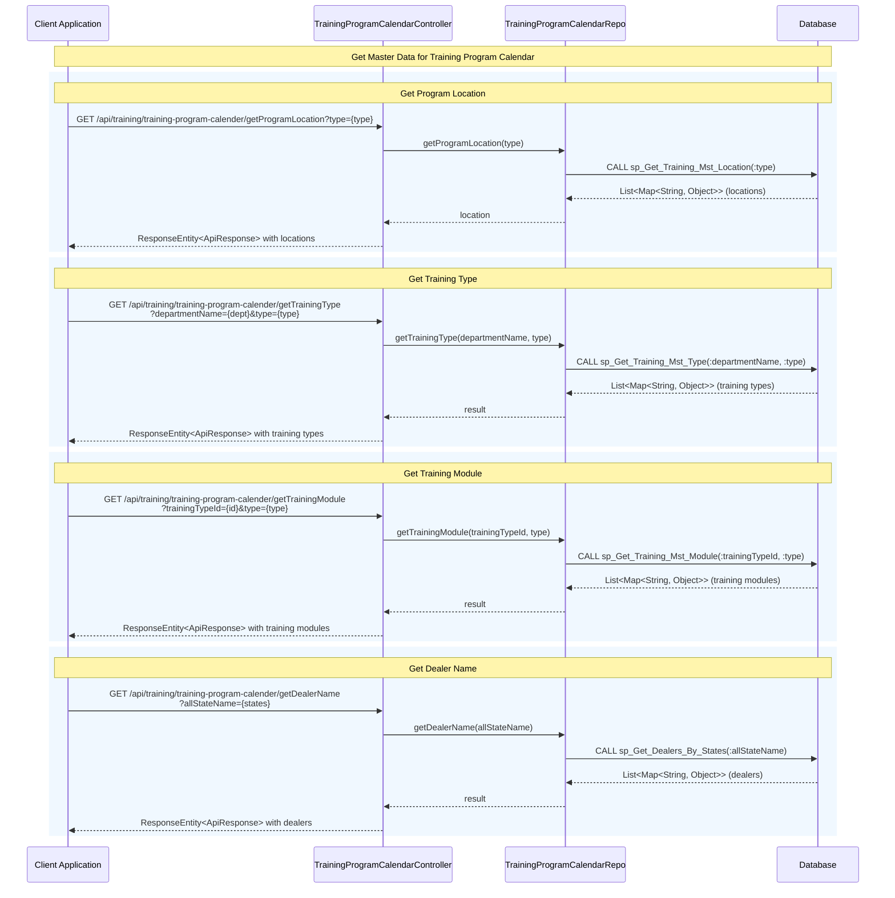

---

## Summary

The Training Module consists of four main sub-modules:

1. **Training Program Calendar** (`trainingProgrammeCalendar`): Manages training program schedules, dealer assignments, holidays, and nominee approvals.

2. **Training Nomination** (`trainingNomination`): Handles employee nominations for training programs with search and CRUD operations.

3. **Attendance Sheet** (`attendanceSheet`): Manages attendance tracking, employee performance indexes (pre-test, post-test, growth index), trainer assignments, document uploads, and certificate generation.

4. **Training Program Report** (`trainingProgramReport`): Provides search and export functionality for training program reports with various filters.

All flows follow a consistent pattern:
- Controllers handle HTTP requests/responses
- UserAuthentication service provides user context (loginId, dealerId, username)
- Repositories interact with database via stored procedures and native queries
- Services handle complex business logic and transactions
- Database operations use stored procedures for complex queries

The module uses Spring Boot with JPA repositories and follows RESTful API design principles.

