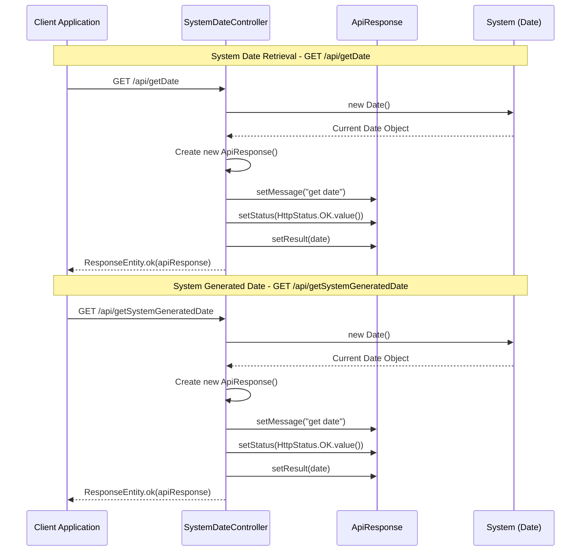
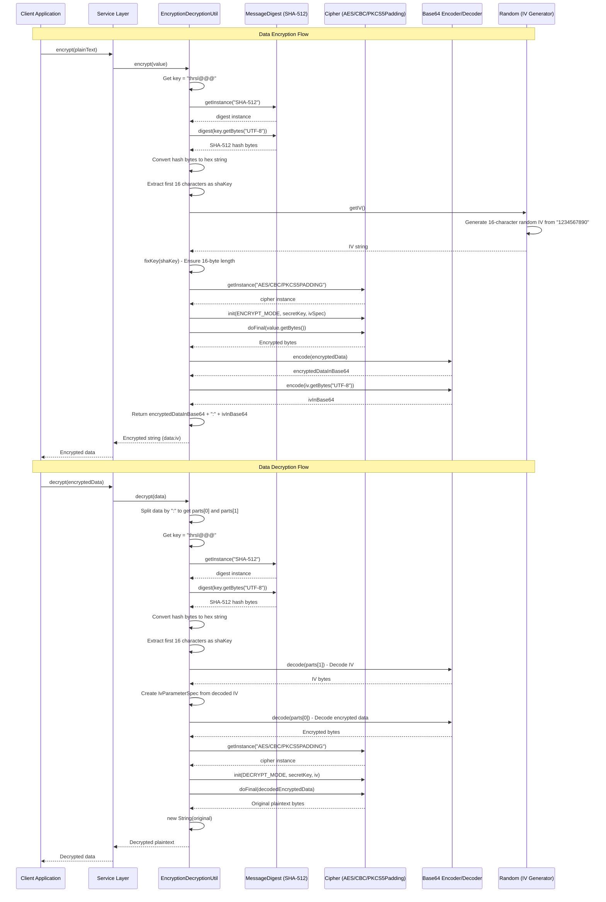
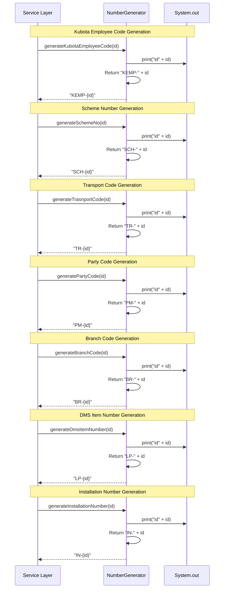
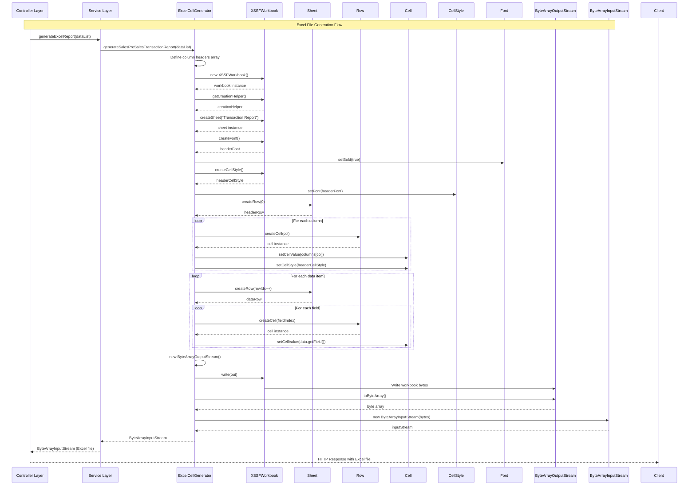
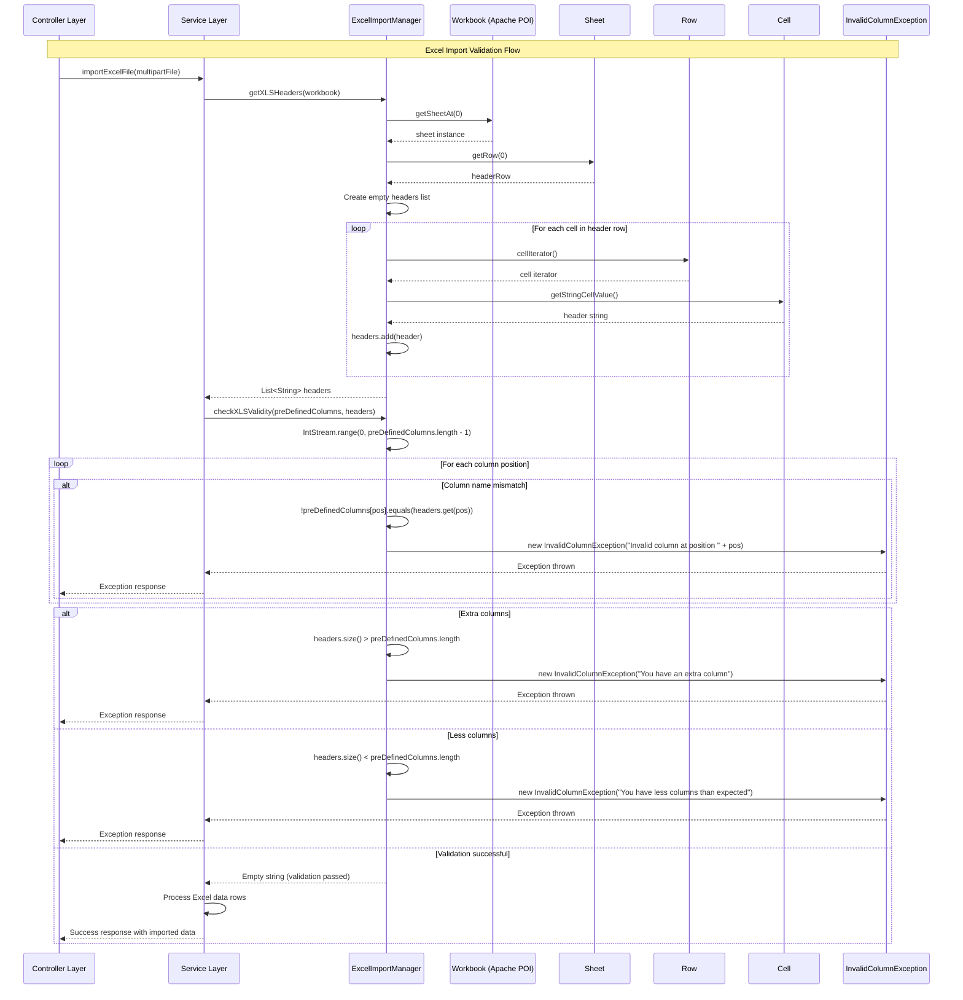
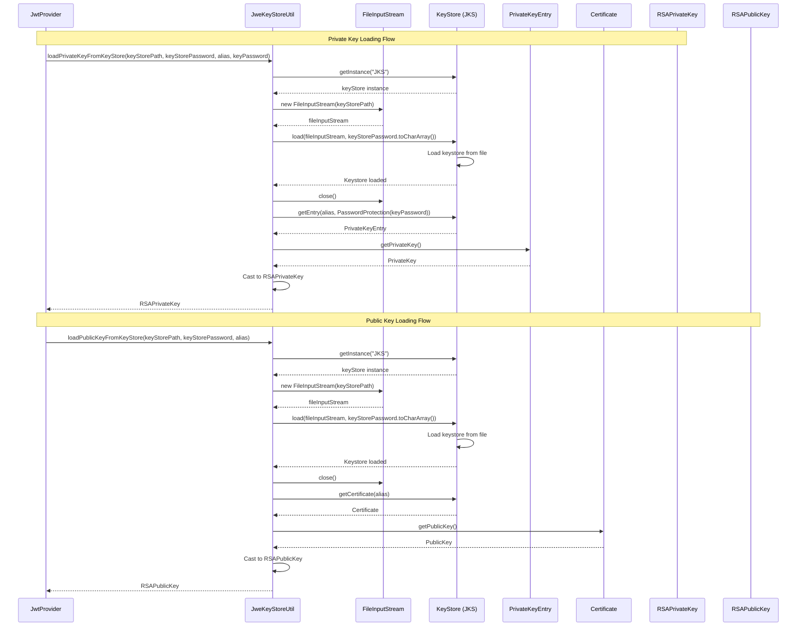
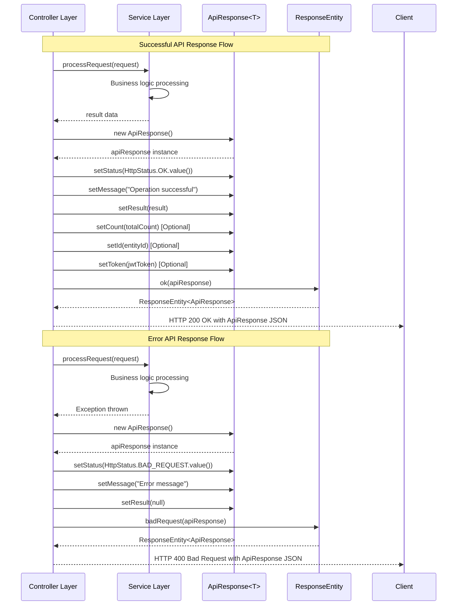
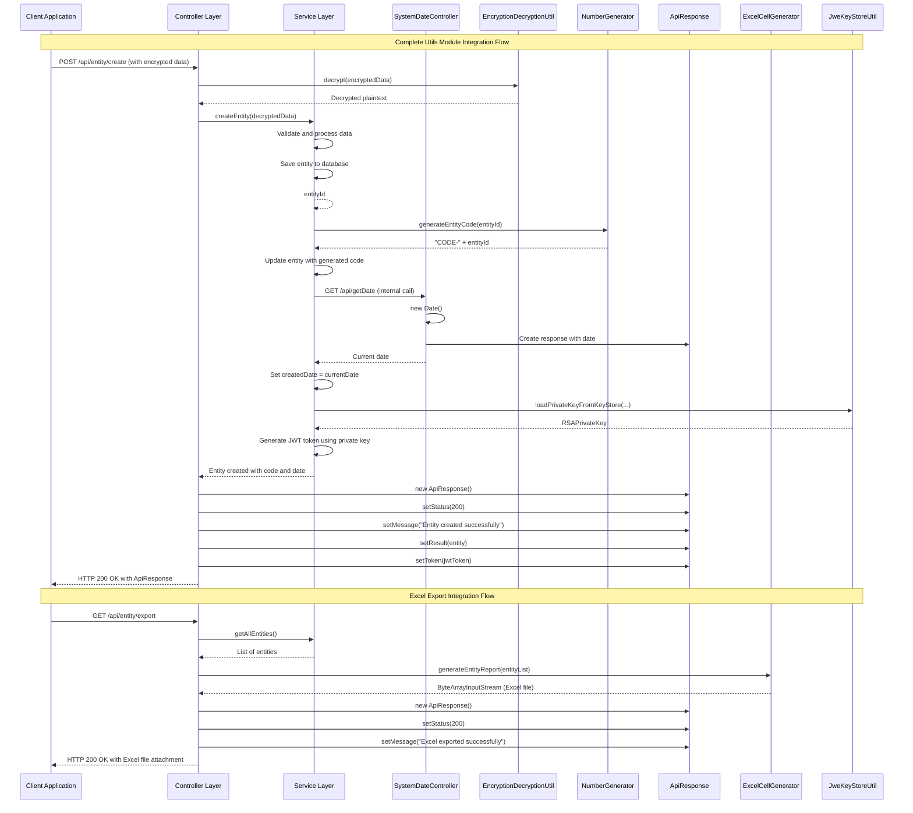

## Utils Module - Detailed Sequence Diagrams

This document describes the **key technical flows** implemented in the `com.i4o.dms.kubota.utils` module:

- **System Date Retrieval** (REST endpoints for getting system dates).
- **Encryption/Decryption** (AES encryption and decryption utilities).
- **Number Generation** (Code generation for various entities).
- **Excel Generation** (Excel file generation for reports).
- **Excel Import** (Excel file validation and import).
- **JWT Key Management** (Loading RSA keys from keystore).
- **API Response Wrapper** (Standardized API response structure).

All diagrams use Mermaid sequence diagrams and reflect the current implementation of the Utils module.

---

## 1. System Date Retrieval Flow

This flow shows how **system dates** are retrieved via REST endpoints. The `SystemDateController` provides two endpoints for getting the current system date.

---

## 2. Encryption/Decryption Flow

This flow shows how **data encryption and decryption** works using AES/CBC/PKCS5Padding algorithm with SHA-512 key derivation.

---

## 3. Number Generation Flow

This flow shows how **various entity codes** are generated using the `NumberGenerator` utility class.

---

## 4. Excel Generation Flow

This flow shows how **Excel files** are generated using the `ExcelCellGenerator` utility class. This is a comprehensive utility that generates Excel files for various reports across the system.

---

## 5. Excel Import Validation Flow

This flow shows how **Excel files are validated** during import using the `ExcelImportManager` utility class.

---

## 6. JWT Key Loading Flow

This flow shows how **RSA keys are loaded** from a Java KeyStore (JKS) for JWT token generation and validation.

---

## 7. API Response Wrapper Flow

This flow shows how the **standardized API response** structure is used throughout the application.

---

## 8. Complete Utils Module Integration Flow

This flow shows how **multiple utilities work together** in a typical request processing scenario.

---

## Summary

The Utils module provides essential cross-cutting utilities for the KUBOTA DMS application:

1. **SystemDateController**: REST endpoints for date retrieval
2. **EncryptionDecryptionUtil**: AES encryption/decryption with SHA-512 key derivation
3. **NumberGenerator**: Code generation for various entities (Employee, Scheme, Transport, Party, Branch, Item, Installation)
4. **ExcelCellGenerator**: Comprehensive Excel file generation for reports
5. **ExcelImportManager**: Excel file validation and header checking
6. **JweKeyStoreUtil**: RSA key loading from Java KeyStore for JWT operations
7. **ApiResponse**: Standardized response wrapper for all API endpoints
8. **Base64Util**: Base64 encoding/decoding utilities (currently commented out)
9. **Exception Classes**: Custom exception handling (ApiException, ApiRequestException, InvalidColumnException)

These utilities are used across all modules of the application, providing consistent functionality for encryption, code generation, Excel operations, and API responses.

