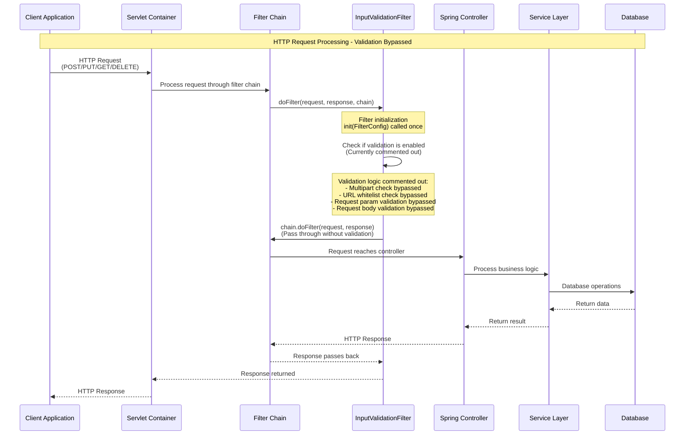
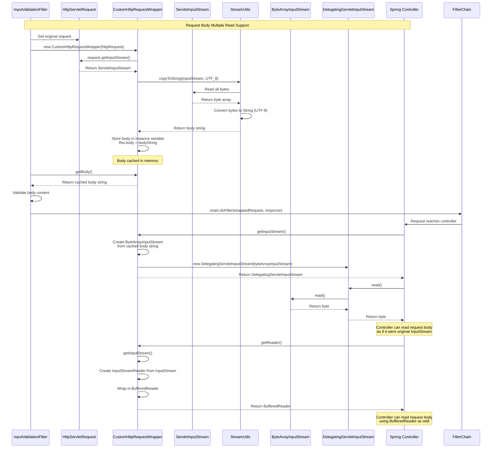
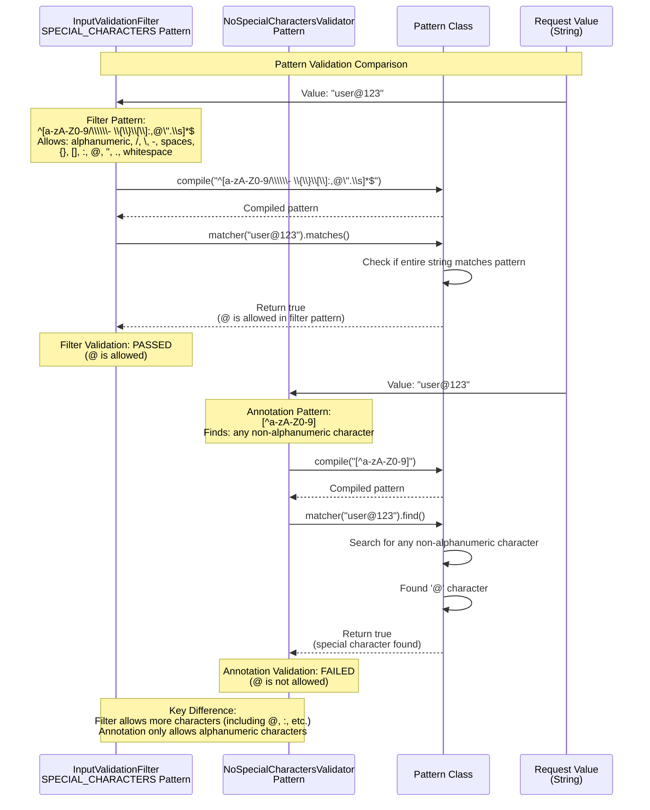

## Validation Module - Detailed Sequence Diagrams

This document describes the **key technical flows** implemented in the `com.i4o.dms.kubota.validation` module:

- **InputValidationFilter Flow** (Servlet filter for HTTP request validation - currently bypassed).
- **NoSpecialCharacters Annotation Validation Flow** (Custom Bean Validation annotation for field/parameter validation).
- **Request Validation Integration Flow** (How validation components work together in Spring Boot application).

All diagrams use Mermaid sequence diagrams and reflect the current implementation of the validation module.

---

## 1. InputValidationFilter - Current Active Flow (Bypassed)

This flow shows how **InputValidationFilter** currently processes HTTP requests. Most validation logic is commented out, so requests pass through without validation.



---

## 2. InputValidationFilter - Full Validation Flow (Commented Out)

This flow shows how **InputValidationFilter** would process HTTP requests if the validation logic were enabled. This demonstrates the intended validation behavior.

```mermaid
sequenceDiagram
    %% Participants
    participant Client as Client Application
    participant ServletContainer as Servlet Container
    participant FilterChain as Filter Chain
    participant InputValidationFilter as InputValidationFilter
    participant CustomWrapper as CustomHttpRequestWrapper
    participant Constants as Constants Class
    participant Controller as Spring Controller
    participant Service as Service Layer
    participant DB as Database

    %% Full Validation Flow (Commented Out)
    Note over Client,DB: HTTP Request Processing - Full Validation Flow
    
    Client->>ServletContainer: HTTP Request<br/>(POST/PUT with parameters/body)
    ServletContainer->>FilterChain: Process request through filter chain
    
    FilterChain->>InputValidationFilter: doFilter(request, response, chain)
    
    InputValidationFilter->>InputValidationFilter: Cast to HttpServletRequest
    
    %% Multipart Check
    InputValidationFilter->>InputValidationFilter: Check if multipart content<br/>ServletFileUpload.isMultipartContent(httpRequest)
    
    alt Multipart Request (File Upload)
        Note over InputValidationFilter: Bypass validation for file uploads
        InputValidationFilter->>FilterChain: chain.doFilter(request, response)
        FilterChain->>Controller: Request reaches controller
    else Non-Multipart Request
        %% URL Whitelist Check
        InputValidationFilter->>InputValidationFilter: Get request URL<br/>httpRequest.getRequestURL()
        InputValidationFilter->>Constants: Access Constants.ALLOWED_URL array
        
        loop For each allowed URL pattern
            InputValidationFilter->>InputValidationFilter: Check if URL contains allowed pattern
        end
        
        alt URL in Whitelist
            Note over InputValidationFilter: Bypass validation for whitelisted URLs
            InputValidationFilter->>FilterChain: chain.doFilter(request, response)
            FilterChain->>Controller: Request reaches controller
        else URL Not Whitelisted
            %% Request Wrapping
            InputValidationFilter->>CustomWrapper: new CustomHttpRequestWrapper(httpRequest)
            CustomWrapper->>CustomWrapper: Read InputStream from request
            CustomWrapper->>CustomWrapper: StreamUtils.copyToString(inputStream, UTF_8)
            CustomWrapper->>CustomWrapper: Store body as String
            CustomWrapper-->>InputValidationFilter: Wrapped request created
            
            %% Request Parameter Validation
            InputValidationFilter->>InputValidationFilter: validateRequestParams(httpRequest)
            InputValidationFilter->>InputValidationFilter: Get parameter map<br/>request.getParameterMap()
            
            loop For each parameter in map
                InputValidationFilter->>InputValidationFilter: Get parameter values array
                loop For each value in array
                    InputValidationFilter->>InputValidationFilter: Apply regex pattern<br/>SPECIAL_CHARACTERS.matcher(value).matches()<br/>Pattern: ^[a-zA-Z0-9/\\\\\\- \\{\\}\\[\\]:,@\".\\s]*$
                    
                    alt Invalid Characters Found
                        InputValidationFilter->>InputValidationFilter: Throw ServletException<br/>"Invalid characters found in input: " + param
                        InputValidationFilter->>InputValidationFilter: Set HTTP 400 status
                        InputValidationFilter->>InputValidationFilter: Write error message to response
                        InputValidationFilter-->>Client: HTTP 400 Bad Request<br/>"Invalid request: Invalid characters..."
                        Note over Client: Request rejected
                    end
                end
            end
            
            %% Request Body Validation
            InputValidationFilter->>CustomWrapper: wrappedRequest.getBody()
            CustomWrapper-->>InputValidationFilter: Return body string
            
            alt Request Body Exists
                InputValidationFilter->>InputValidationFilter: validateRequestBody(body)
                InputValidationFilter->>InputValidationFilter: Apply regex pattern<br/>SPECIAL_CHARACTERS.matcher(body).matches()
                
                alt Invalid Characters in Body
                    InputValidationFilter->>InputValidationFilter: Throw ServletException<br/>"Invalid characters found in the provided input."
                    InputValidationFilter->>InputValidationFilter: Set HTTP 400 status
                    InputValidationFilter->>InputValidationFilter: Write error message to response
                    InputValidationFilter-->>Client: HTTP 400 Bad Request<br/>"Invalid request: Invalid characters..."
                    Note over Client: Request rejected
                else Valid Body
                    InputValidationFilter->>FilterChain: chain.doFilter(wrappedRequest, response)
                    FilterChain->>Controller: Request reaches controller
                    Controller->>Service: Process business logic
                    Service->>DB: Database operations
                    DB-->>Service: Return data
                    Service-->>Controller: Return result
                    Controller-->>FilterChain: HTTP Response
                    FilterChain-->>InputValidationFilter: Response passes back
                    InputValidationFilter-->>Client: HTTP 200 OK
                end
            else No Request Body
                InputValidationFilter->>FilterChain: chain.doFilter(wrappedRequest, response)
                FilterChain->>Controller: Request reaches controller
                Controller->>Service: Process business logic
                Service->>DB: Database operations
                DB-->>Service: Return data
                Service-->>Controller: Return result
                Controller-->>FilterChain: HTTP Response
                FilterChain-->>InputValidationFilter: Response passes back
                InputValidationFilter-->>Client: HTTP 200 OK
            end
        end
    end
```



---

## 3. CustomHttpRequestWrapper - Request Body Caching Flow

This flow shows how **CustomHttpRequestWrapper** enables reading the request body multiple times by caching it in memory.



---

## 4. NoSpecialCharacters Annotation Validation Flow

This flow shows how the **@NoSpecialCharacters** annotation validates fields and parameters using Bean Validation framework.

```mermaid
sequenceDiagram
    %% Participants
    participant Client as Client Application
    participant Controller as Spring Controller<br/>(with @Valid annotation)
    participant BeanValidation as Bean Validation Framework
    participant NoSpecialCharacters as @NoSpecialCharacters Annotation
    participant NoSpecialCharactersValidator as NoSpecialCharactersValidator
    participant Pattern as Pattern Class
    participant Service as Service Layer
    participant DB as Database

    %% Annotation Validation Flow
    Note over Client,DB: Bean Validation - @NoSpecialCharacters Annotation
    
    Client->>Controller: POST /api/endpoint<br/>(Request with @NoSpecialCharacters field)
    
    Note over Controller: Example DTO:<br/>public class UserDto {<br/>  @NoSpecialCharacters<br/>  private String username;<br/>}
    
    Controller->>Controller: Receive request DTO<br/>(with @Valid annotation on parameter)
    
    Controller->>BeanValidation: Trigger validation<br/>(@Valid annotation detected)
    
    BeanValidation->>BeanValidation: Scan DTO fields for validation annotations
    
    BeanValidation->>NoSpecialCharacters: Detect @NoSpecialCharacters annotation<br/>on field/parameter
    
    BeanValidation->>NoSpecialCharacters: Get annotation metadata<br/>message(), groups(), payload()
    
    BeanValidation->>NoSpecialCharacters: Get validatedBy() class<br/>NoSpecialCharactersValidator.class
    
    BeanValidation->>NoSpecialCharactersValidator: Create validator instance<br/>new NoSpecialCharactersValidator()
    
    BeanValidation->>NoSpecialCharactersValidator: initialize(annotation)
    NoSpecialCharactersValidator->>NoSpecialCharactersValidator: Store annotation metadata<br/>(if needed)
    
    BeanValidation->>NoSpecialCharactersValidator: isValid(value, context)<br/>value = field value from DTO
    
    NoSpecialCharactersValidator->>NoSpecialCharactersValidator: Check if value is null
    
    alt Value is Null
        NoSpecialCharactersValidator-->>BeanValidation: Return false<br/>(null values invalid)
    else Value is Not Null
        NoSpecialCharactersValidator->>Pattern: Pattern.compile("[^a-zA-Z0-9]")
        Pattern-->>NoSpecialCharactersValidator: Return compiled Pattern
        
        NoSpecialCharactersValidator->>Pattern: matcher(value).find()
        Pattern->>Pattern: Search for non-alphanumeric characters
        
        alt Special Characters Found
            Pattern-->>NoSpecialCharactersValidator: Return true (match found)
            NoSpecialCharactersValidator-->>BeanValidation: Return false<br/>(validation failed)
        else Only Alphanumeric Characters
            Pattern-->>NoSpecialCharactersValidator: Return false (no match)
            NoSpecialCharactersValidator-->>BeanValidation: Return true<br/>(validation passed)
        end
    end
    
    alt Validation Failed
        BeanValidation->>BeanValidation: Create ConstraintViolation<br/>with message: "Special characters are not allowed"
        BeanValidation->>BeanValidation: Collect all violations
        BeanValidation-->>Controller: Throw MethodArgumentNotValidException<br/>(or ConstraintViolationException)
        
        Controller->>Controller: Handle validation exception<br/>(@ExceptionHandler)
        Controller-->>Client: HTTP 400 Bad Request<br/>Validation error response
        Note over Client: Request rejected with validation errors
    else Validation Passed
        BeanValidation-->>Controller: Validation successful
        Controller->>Service: Process validated DTO
        Service->>DB: Database operations
        DB-->>Service: Return data
        Service-->>Controller: Return result
        Controller-->>Client: HTTP 200 OK<br/>Success response
    end
```

---

## 5. Validation Module Integration Flow

This flow shows how both **InputValidationFilter** and **@NoSpecialCharacters** annotation work together in a Spring Boot application, demonstrating the complete validation pipeline.

```mermaid
sequenceDiagram
    %% Participants
    participant Client as Client Application
    participant ServletContainer as Servlet Container
    participant InputValidationFilter as InputValidationFilter<br/>(Currently Bypassed)
    participant Controller as Spring Controller
    participant BeanValidation as Bean Validation Framework
    participant NoSpecialCharactersValidator as NoSpecialCharactersValidator
    participant Service as Service Layer
    participant DB as Database

    %% Complete Validation Pipeline
    Note over Client,DB: Complete Validation Pipeline Integration
    
    Client->>ServletContainer: HTTP POST Request<br/>(with JSON body and query params)
    
    ServletContainer->>InputValidationFilter: doFilter(request, response, chain)
    
    Note over InputValidationFilter: Filter Level Validation<br/>(Currently bypassed - commented out)
    
    alt Filter Validation Enabled (Commented Out)
        InputValidationFilter->>InputValidationFilter: Validate request params<br/>using SPECIAL_CHARACTERS pattern<br/>^[a-zA-Z0-9/\\\\\\- \\{\\}\\[\\]:,@\".\\s]*$
        InputValidationFilter->>InputValidationFilter: Validate request body<br/>using SPECIAL_CHARACTERS pattern
        
        alt Filter Validation Failed
            InputValidationFilter-->>Client: HTTP 400 Bad Request
            Note over Client: Request rejected at filter level
        else Filter Validation Passed
            InputValidationFilter->>Controller: Pass request to controller
        end
    else Filter Validation Disabled (Current State)
        InputValidationFilter->>Controller: Pass request to controller<br/>(no filter-level validation)
    end
    
    Controller->>Controller: Receive request<br/>@RequestBody @Valid UserDto dto
    
    Note over Controller: DTO Example:<br/>public class UserDto {<br/>  @NoSpecialCharacters<br/>  private String username;<br/>  private String email;<br/>}
    
    Controller->>BeanValidation: Trigger validation<br/>(@Valid annotation)
    
    BeanValidation->>BeanValidation: Scan DTO for validation annotations
    
    BeanValidation->>NoSpecialCharactersValidator: Validate @NoSpecialCharacters fields
    
    NoSpecialCharactersValidator->>NoSpecialCharactersValidator: Check pattern<br/>[^a-zA-Z0-9]
    
    alt Annotation Validation Failed
        NoSpecialCharactersValidator-->>BeanValidation: Return false
        BeanValidation-->>Controller: Throw MethodArgumentNotValidException
        Controller->>Controller: Handle exception<br/>(@ExceptionHandler)
        Controller-->>Client: HTTP 400 Bad Request<br/>Validation errors
        Note over Client: Request rejected at annotation level
    else Annotation Validation Passed
        NoSpecialCharactersValidator-->>BeanValidation: Return true
        BeanValidation-->>Controller: Validation successful
        
        Controller->>Service: Process validated DTO<br/>createUser(userDto)
        
        Service->>Service: Business logic processing
        Service->>DB: INSERT INTO users<br/>(username, email, ...)
        DB-->>Service: User created successfully
        Service-->>Controller: Return User entity
        Controller-->>InputValidationFilter: HTTP 200 OK<br/>Success response
        InputValidationFilter-->>ServletContainer: Response passes back
        ServletContainer-->>Client: HTTP 200 OK<br/>User created successfully
    end
```

---

## 6. Pattern Comparison - Filter vs Annotation

This flow highlights the difference between the two validation patterns used in the module.



---

## Summary

### Validation Components

1. **InputValidationFilter**
   - Servlet filter for HTTP request validation
   - Validates request parameters and body using regex pattern
   - Currently bypassed (validation logic commented out)
   - Pattern: `^[a-zA-Z0-9/\\\\\\- \\{\\}\\[\\]:,@\".\\s]*$` (allows more characters)

2. **@NoSpecialCharacters Annotation**
   - Bean Validation annotation for field/parameter validation
   - Validates individual DTO fields
   - Pattern: `[^a-zA-Z0-9]` (only allows alphanumeric characters)
   - Integrated with Spring's validation framework

3. **CustomHttpRequestWrapper**
   - Enables multiple reads of request body
   - Caches body in memory as String
   - Provides InputStream and Reader access to cached body

### Validation Flow

- **Filter Level** (Currently Disabled): Validates all incoming HTTP requests at the servlet filter level
- **Annotation Level** (Active): Validates specific DTO fields using Bean Validation framework
- **Pattern Difference**: Filter allows more characters (including @, :, etc.), while annotation only allows alphanumeric characters

### Current State

- InputValidationFilter validation logic is commented out - requests pass through without filter-level validation
- @NoSpecialCharacters annotation is active and can be used on DTO fields/parameters
- Both validation mechanisms can work together when filter validation is enabled

