## Warranty Module - Detailed Sequence Diagrams

This document describes the **key technical flows** implemented in the `com.i4o.dms.kubota.warranty` module:

- **PCR (Product Concern Report) Creation and Approval Flow** - PCR submission with approval hierarchy
- **WCR (Warranty Claim Request) Creation Flow** - Warranty claim request from PCR/Goodwill
- **Goodwill Request Flow** - Goodwill request creation and approval
- **Logsheet Creation Flow** - Warranty logsheet creation and management
- **Delivery Challan Creation Flow** - Warranty parts delivery challan creation
- **Hotline Report Submission Flow** - Hotline report creation with attachments
- **KAI Inspection Sheet Flow** - KAI inspection sheet creation
- **Retrofitment Campaign Flow** - Retrofitment campaign management

All diagrams use Mermaid sequence diagrams and reflect the current implementation of the Warranty module.

---

## 1. PCR (Product Concern Report) Creation and Submission Flow

This flow shows how **PCR (Product Concern Report)** is created from a Service Job Card, with photo/video attachments, and approval hierarchy setup.

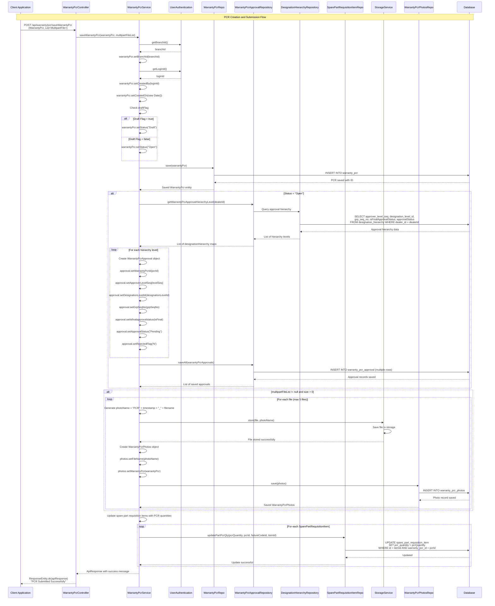

---

## 2. PCR Approval Flow

This flow shows how **PCR approvals** are processed through the approval hierarchy.

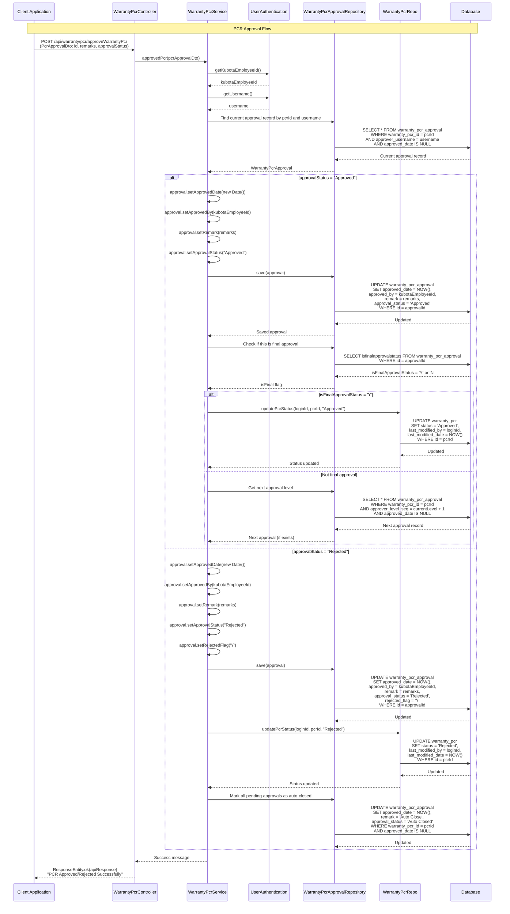

---

## 3. WCR (Warranty Claim Request) Creation Flow

This flow shows how **WCR (Warranty Claim Request)** is created from PCR or Goodwill, with approval hierarchy setup.

```mermaid
sequenceDiagram
    participant Client as Client Application
    participant Controller as WarrantyWcrController
    participant UserAuth as UserAuthentication
    participant WcrRepo as WarrantyWcrRepo
    participant ApprovalRepo as WarrantyWcrApprovalRepo
    participant SparePartRepo as SparePartRequisitionItemRepo
    participant PcrRepo as WarrantyPcrRepo
    participant GoodwillRepo as WarrantyGoodwillRepo
    participant DB as Database

    Note over Client,DB: WCR Creation Flow
    
    Client->>Controller: POST /api/warranty/Wcr/saveWcr<br/>(WarrantyWcr)
    
    Controller->>UserAuth: getBranchId()
    UserAuth-->>Controller: branchId
    Controller->>Controller: warrantyWcr.setBranchId(branchId)
    
    Controller->>UserAuth: getLoginId()
    UserAuth-->>Controller: loginId
    Controller->>Controller: warrantyWcr.setCreatedBy(loginId)
    Controller->>Controller: warrantyWcr.setCreatedOn(new Date())
    Controller->>Controller: warrantyWcr.setWcrDate(new Date())
    
    alt warrantyWcr.getId() != null (Update)
        Controller->>Controller: warrantyWcr.setModifiedBy(loginId)
        Controller->>Controller: warrantyWcr.setModifiedOn(new Date())
    end
    
    Controller->>Controller: warrantyWcr.setWcrStatus("Submitted")
    
    alt warrantyWcr.getWarrantyPcr() == null
        Controller->>Controller: warrantyWcr.setWcrType("GOODWILL")
    else warrantyWcr.getWarrantyPcr() != null
        Controller->>Controller: warrantyWcr.setWcrType("PCR")
    end
    
    Controller->>WcrRepo: save(warrantyWcr)
    WcrRepo->>DB: INSERT INTO warranty_wcr
    DB-->>WcrRepo: WCR saved with ID
    WcrRepo-->>Controller: Saved WarrantyWcr entity
    
    alt WCR Type = "GOODWILL"
        alt SparePartRequisitionItem exists
            loop For each sparePartRequisitionItem
                Controller->>SparePartRepo: updateWarrantyClaimPartGoodwill(wcrId, claimApprovedAmount,<br/>claimApprovedQuantity, itemId)
                SparePartRepo->>DB: UPDATE spare_part_requisition_item<br/>SET warranty_claim_id = wcrId,<br/>claim_approved_amount = amount,<br/>claim_approved_quantity = qty<br/>WHERE id = itemId AND type = 'GOODWILL'
                DB-->>SparePartRepo: Updated
            end
        end
        
        alt LabourCharge exists
            loop For each labourItem
                Controller->>SparePartRepo: updateWarrantyClaimLabourGoodwill(wcrId, claimApprovedAmount, itemId)
                SparePartRepo->>DB: UPDATE labour_charge<br/>SET warranty_claim_id = wcrId,<br/>claim_approved_amount = amount<br/>WHERE id = itemId AND type = 'GOODWILL'
                DB-->>SparePartRepo: Updated
            end
        end
        
        alt OutsideJobCharge exists
            loop For each outsideChargeItem
                Controller->>SparePartRepo: updateWarrantyClaimOutsideChargeGoodwill(wcrId, claimApprovedAmount, itemId)
                SparePartRepo->>DB: UPDATE outside_job_charge<br/>SET warranty_claim_id = wcrId,<br/>claim_approved_amount = amount<br/>WHERE id = itemId AND type = 'GOODWILL'
                DB-->>SparePartRepo: Updated
            end
        end
        
    else WCR Type = "PCR"
        alt SparePartRequisitionItem exists
            loop For each sparePartRequisitionItem
                Controller->>SparePartRepo: updateWarrantyClaimPartPcr(wcrId, claimApprovedAmount,<br/>claimApprovedQuantity, itemId)
                SparePartRepo->>DB: UPDATE spare_part_requisition_item<br/>SET warranty_claim_id = wcrId,<br/>claim_approved_amount = amount,<br/>claim_approved_quantity = qty<br/>WHERE id = itemId AND type = 'PCR'
                DB-->>SparePartRepo: Updated
            end
        end
        
        alt LabourCharge exists
            loop For each labourItem
                Controller->>SparePartRepo: updateWarrantyClaimLabourPcr(wcrId, claimApprovedAmount, itemId)
                SparePartRepo->>DB: UPDATE labour_charge<br/>SET warranty_claim_id = wcrId,<br/>claim_approved_amount = amount<br/>WHERE id = itemId AND type = 'PCR'
                DB-->>SparePartRepo: Updated
            end
        end
        
        alt OutsideJobCharge exists
            loop For each outsideChargeItem
                Controller->>SparePartRepo: updateWarrantyClaimOutsideChargePcr(wcrId, claimApprovedAmount, itemId)
                SparePartRepo->>DB: UPDATE outside_job_charge<br/>SET warranty_claim_id = wcrId,<br/>claim_approved_amount = amount<br/>WHERE id = itemId AND type = 'PCR'
                DB-->>SparePartRepo: Updated
            end
        end
    end
    
    Controller->>UserAuth: getDealerId()
    UserAuth-->>Controller: dealerId
    
    Controller->>ApprovalRepo: getWarrantyWcrApprovalHierarchyLevel(dealerId)
    ApprovalRepo->>DB: SELECT approver_level_seq, designation_level_id,<br/>grp_seq_no, isFinalApprovalStatus, approvalStatus<br/>FROM designation_hierarchy WHERE dealer_id = dealerId
    DB-->>ApprovalRepo: Approval hierarchy data
    ApprovalRepo-->>Controller: List of hierarchy levels
    
    loop For each hierarchy level
        Controller->>Controller: Create WarrantyWcrApproval object
        Controller->>Controller: approval.setWarrantyWcrId(wcrId)
        Controller->>Controller: approval.setApproverLevelSeq(levelSeq)
        Controller->>Controller: approval.setDesignationLevelId(designationLevelId)
        Controller->>Controller: approval.setGrpSeqNo(grpSeqNo)
        Controller->>Controller: approval.setIsfinalapprovalstatus(isFinal)
        Controller->>Controller: approval.setApprovalStatus("Pending")
        Controller->>Controller: approval.setRejectedFlag('N')
    end
    
    Controller->>ApprovalRepo: saveAll(warrantyWcrApprovals)
    ApprovalRepo->>DB: INSERT INTO warranty_wcr_approval (multiple rows)
    DB-->>ApprovalRepo: Approval records saved
    ApprovalRepo-->>Controller: List of saved approvals
    
    Controller-->>Client: ResponseEntity.ok(apiResponse)<br/>"WCR submitted successfully"
```

---

## 4. WCR from PCR/Goodwill Claim Flow

This flow shows how **WCR claim data** is retrieved from PCR or Goodwill for claim creation.

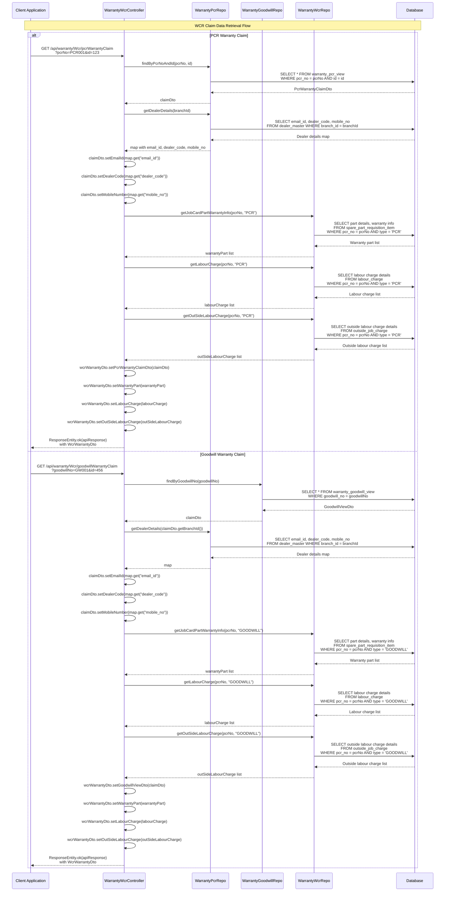

---

## 5. Goodwill Request Creation Flow

This flow shows how **Goodwill requests** are created from PCR with approval hierarchy setup.

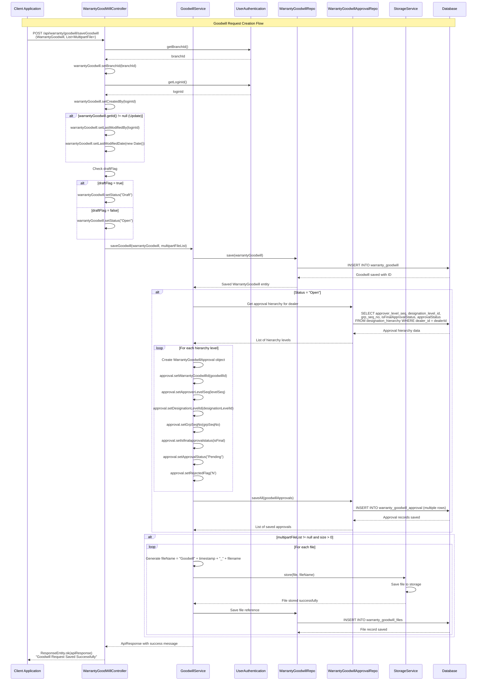

---

## 6. Logsheet Creation Flow

This flow shows how **Warranty Logsheets** are created with failure part information and attachments.

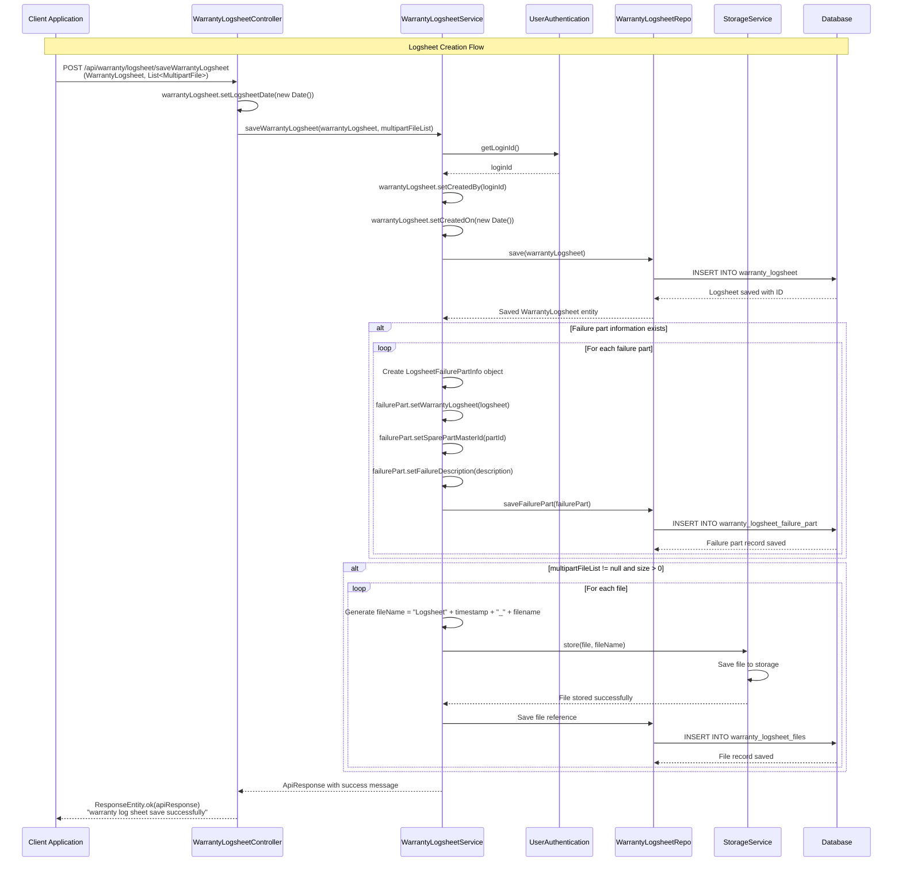

---

## 7. Delivery Challan Creation Flow

This flow shows how **Warranty Delivery Challans** are created for WCR claims.

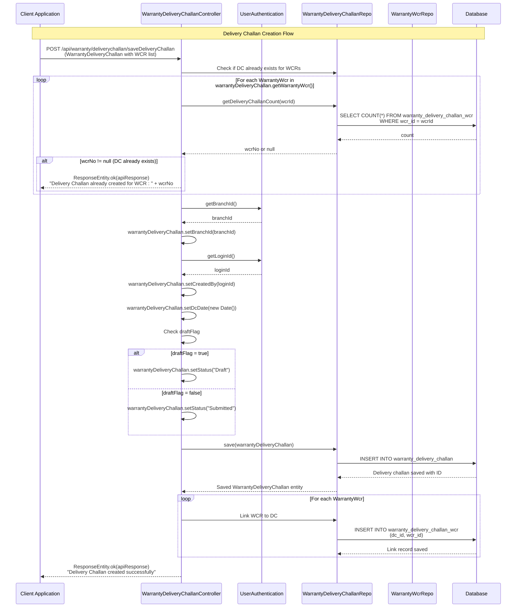

---

## 8. Hotline Report Submission Flow

This flow shows how **Warranty Hotline Reports** are submitted with attachments.

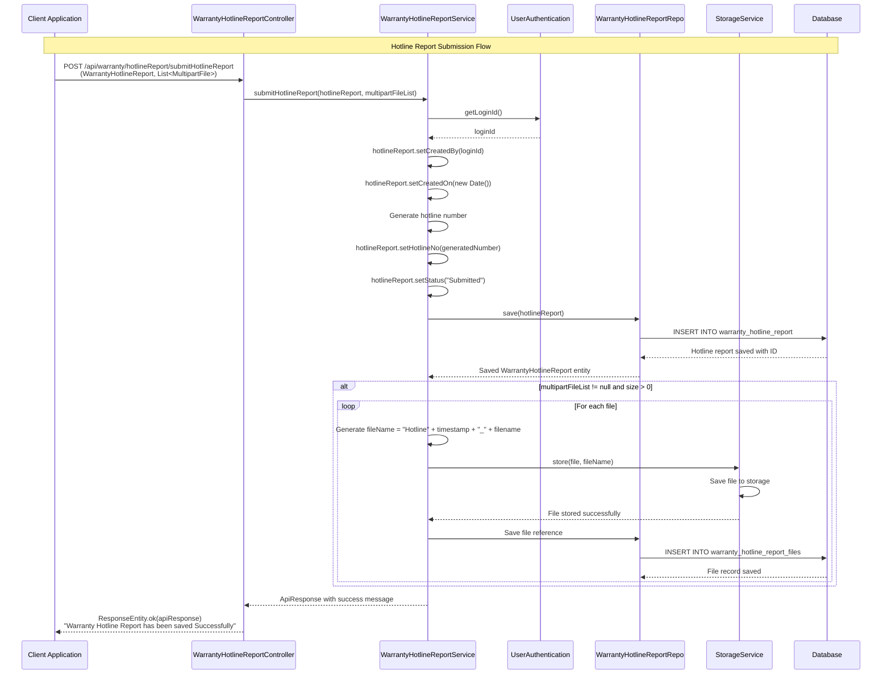

---

## 9. KAI Inspection Sheet Creation Flow

This flow shows how **KAI Inspection Sheets** are created for WCR and DC inspection.

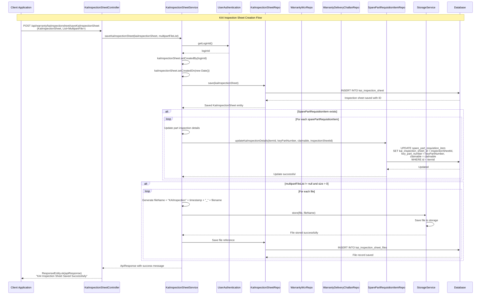

---

## 10. Retrofitment Campaign Creation Flow

This flow shows how **Retrofitment Campaigns** are created with Excel upload for chassis details.

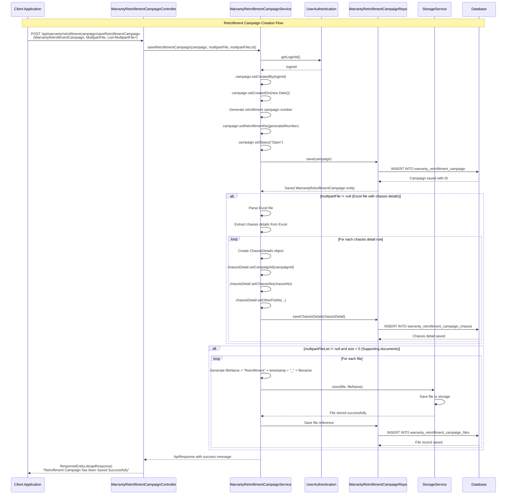

---

## 11. WCR Invoice Upload and Verification Flow

This flow shows how **WCR invoices** are uploaded and verified.

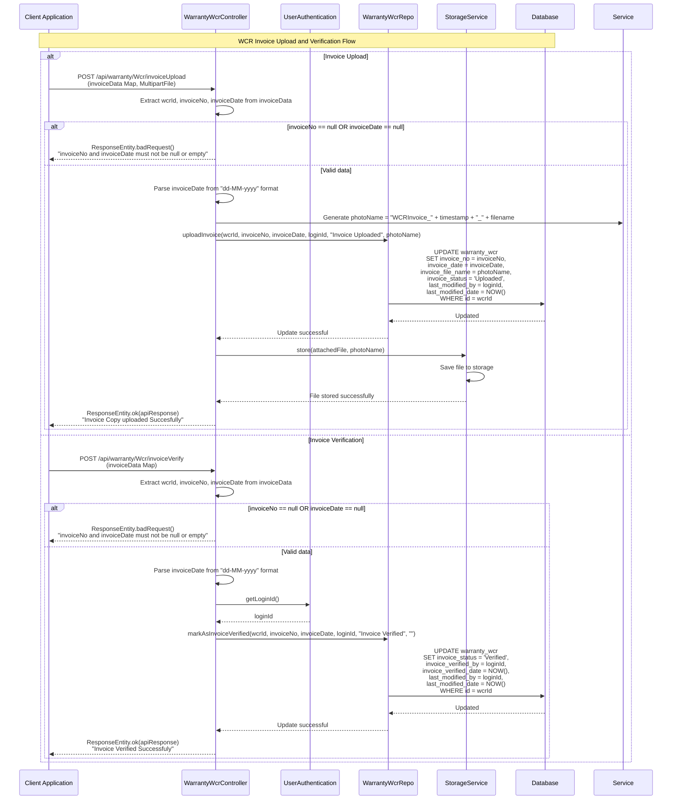

---

## Summary

The Warranty module provides comprehensive warranty management functionality including:

1. **PCR Management**: Product Concern Report creation, approval workflow, and tracking
2. **WCR Management**: Warranty Claim Request creation from PCR/Goodwill with approval hierarchy
3. **Goodwill Management**: Goodwill request creation and approval workflow
4. **Logsheet Management**: Warranty logsheet creation with failure part tracking
5. **Delivery Challan**: Warranty parts delivery challan creation and management
6. **Hotline Reports**: Hotline report submission with attachments
7. **KAI Inspection**: KAI inspection sheet creation for warranty parts inspection
8. **Retrofitment Campaigns**: Retrofitment campaign management with Excel upload
9. **Invoice Management**: WCR invoice upload and verification
10. **Reports**: Various warranty reports generation (PCR, WCR, Goodwill, Logsheet, etc.)

All flows include proper authentication, authorization, approval hierarchies, file storage, and database persistence.

