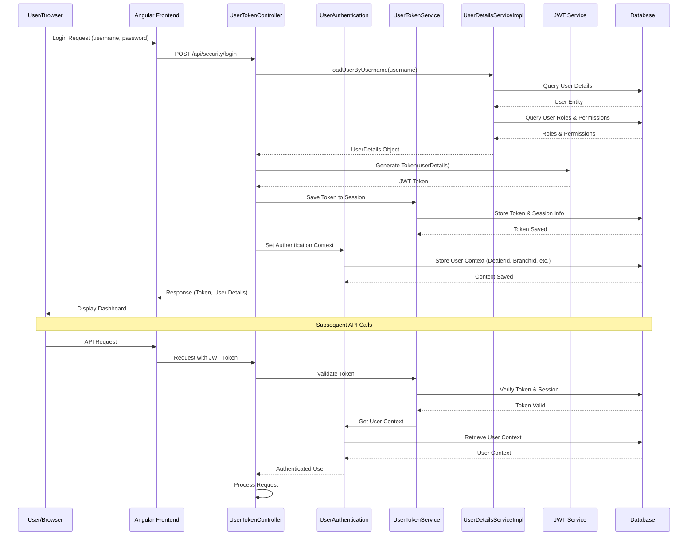
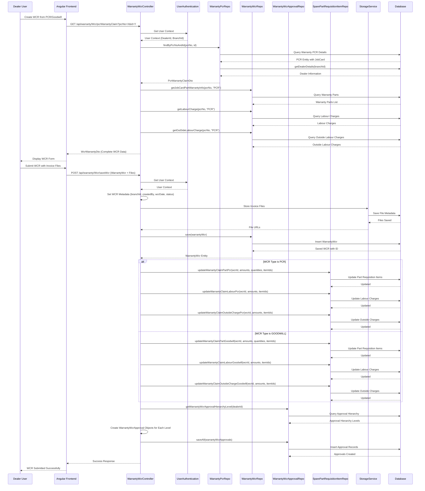
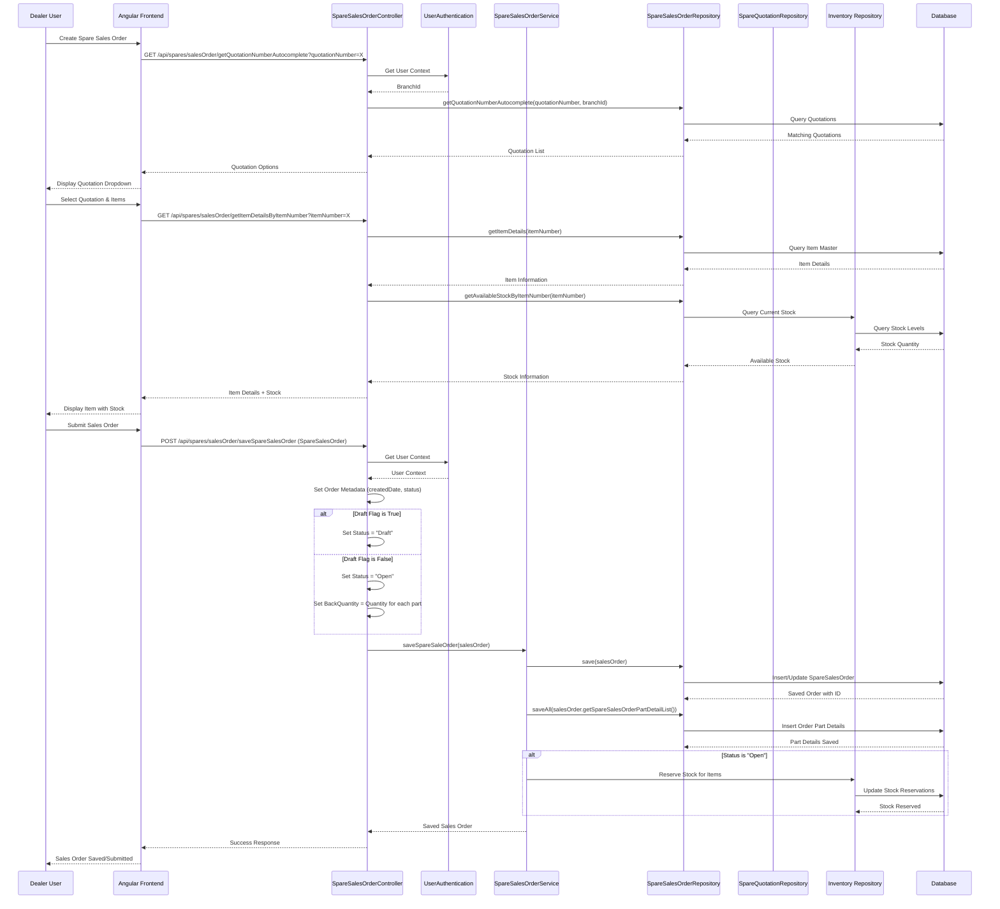
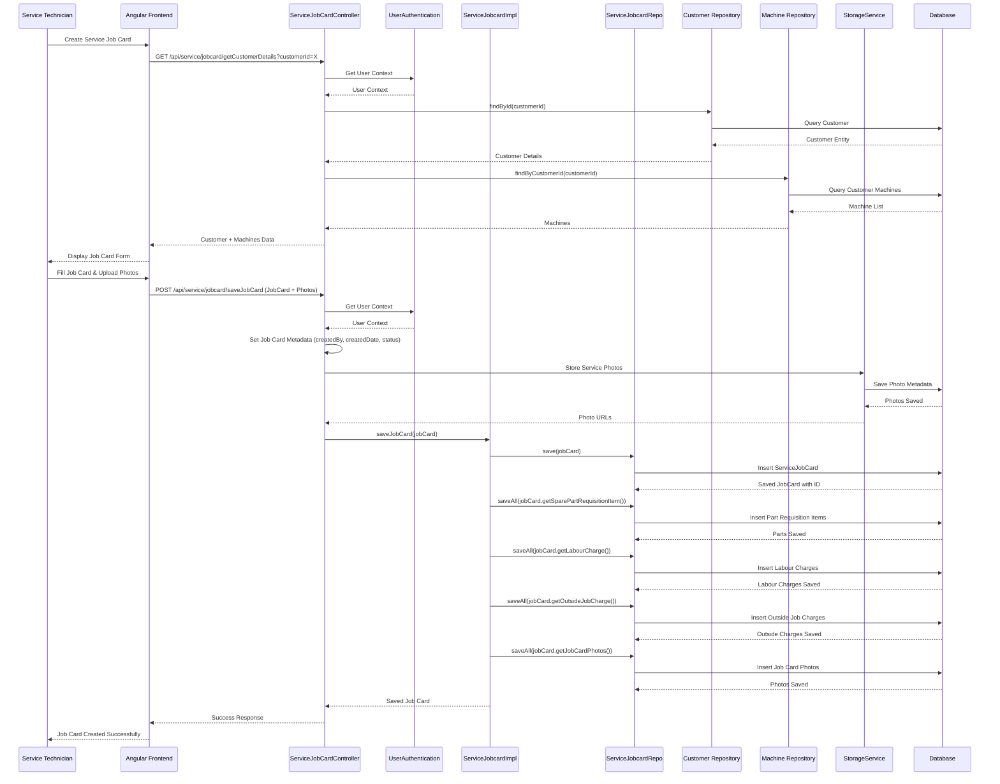
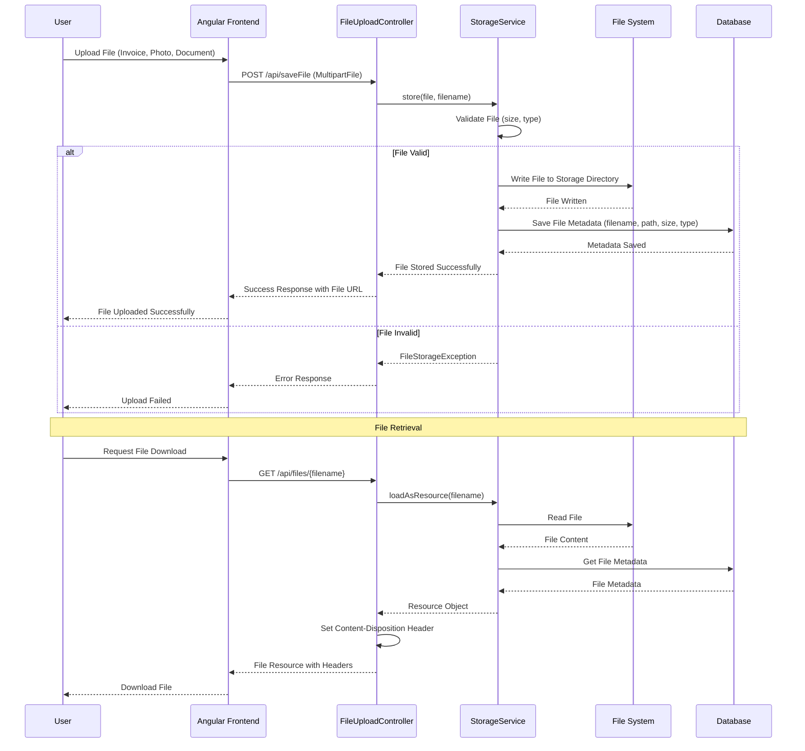
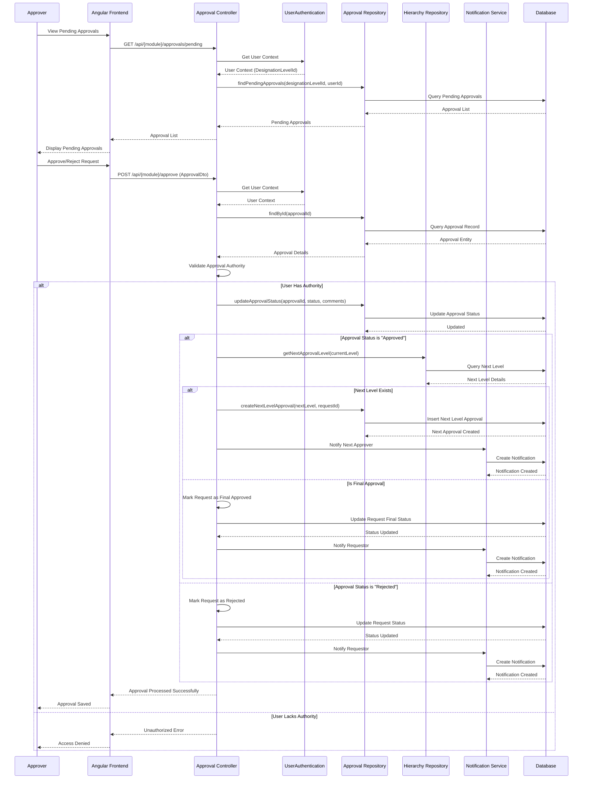
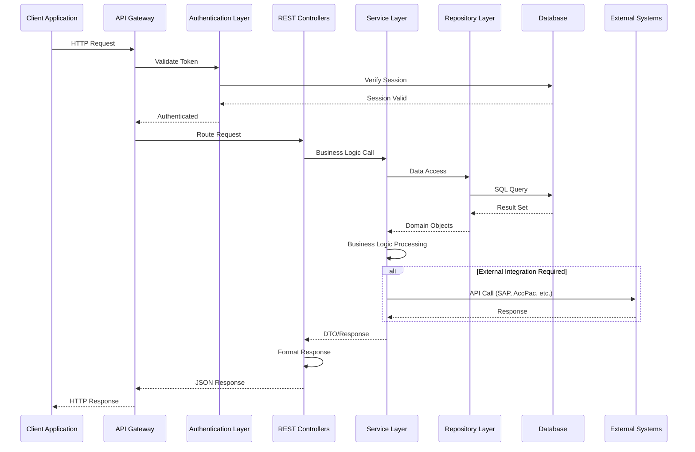

# KUBOTA DMS - Detailed Sequence Diagrams

This document contains comprehensive sequence diagrams for the KUBOTA Dealer Management System (DMS), illustrating the main business flows and system interactions.

## Table of Contents
1. [User Authentication & Authorization Flow](#1-user-authentication--authorization-flow)
2. [Warranty Claim Request (WCR) Flow](#2-warranty-claim-request-wcr-flow)
3. [Spare Parts Sales Order Flow](#3-spare-parts-sales-order-flow)
4. [Service Job Card Creation Flow](#4-service-job-card-creation-flow)
5. [File Upload & Storage Flow](#5-file-upload--storage-flow)
6. [Approval Workflow Flow](#6-approval-workflow-flow)

---

## 1. User Authentication & Authorization Flow

---

## 2. Warranty Claim Request (WCR) Flow

---

## 3. Spare Parts Sales Order Flow

---

## 4. Service Job Card Creation Flow

---

## 5. File Upload & Storage Flow

---

## 6. Approval Workflow Flow

---

## System Architecture Overview

---

## Notes

### Key Components:
- **Controllers**: Handle HTTP requests/responses, input validation
- **Services**: Business logic, orchestration, transaction management
- **Repositories**: Data access layer, database operations
- **Authentication**: JWT-based authentication, user context management
- **Storage Service**: File upload/download management
- **Approval System**: Multi-level approval workflow

### Common Patterns:
1. All requests go through authentication/authorization
2. User context (DealerId, BranchId) is injected via UserAuthentication
3. File uploads are handled by StorageService
4. Approvals follow hierarchical workflow
5. Database operations use JPA/Hibernate repositories

### Error Handling:
- Global exception handler catches all exceptions
- ApiResponse wrapper for consistent response format
- Validation errors returned with appropriate HTTP status codes

---

*Last Updated: December 2025*
